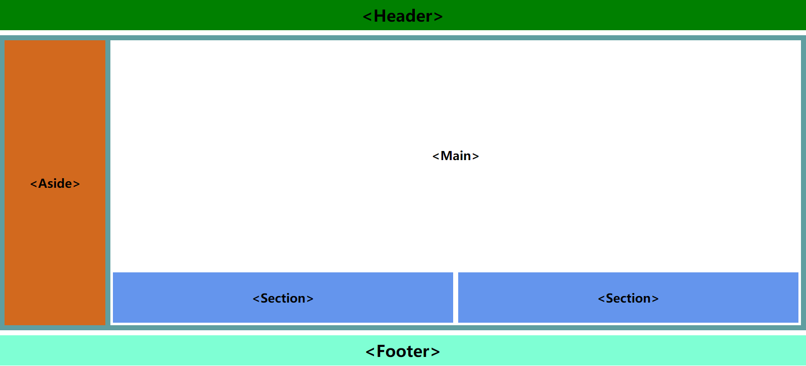

<!--
 * @Descripttion: 
 * @version: 
 * @Author: woxiaoyao
 * @Date: 2020-09-29 13:36:51
 * @LastEditTime: 2020-09-29 14:16:13
-->
# VSCode前端常用插件推荐和结构化语义元素

## 一、VSCode前端常用插件推荐

### 基本插件

| 序号 | 插件名称                | 描述                                   |
| :-: | -----------------------| ---------------------------------------|
| 1   | Chinese Language...    | 中文简体语言包                           |
| 2   | Simple icons           | 小巧实用的文件图标集合                    |
| 3   | One Dark Pro           | 个人非常喜欢的一款主题                    |
| 4   | Local History          | 操作历史记录，可恢复指定时间点              |
| 5   | Better Align           | 对齐插件，建议配合Source Code Pro等宽字体  |
| 6   | TODO Tree              | TODO插件，可以标记需要修改完善的代码处      |
| 7   | Project Manager        | 收录成常用工程，工程间切换利器             |
| 8   | Settings Sync          | 同步利器，需要微软帐号或GitHub帐号         |

### 前端插件

| 序号 | 插件名称          | 描述           |
| :-: | ----------------- | -------------- |
| 1    | Auto Rename Tag   | 标签自动更名   |
| 2    | HTML CSS Support  | 自动补全样式表 |
| 3    | HTML Snippets     | html 代码片断  |
| 4    | Prettier-Code Formatter | 几乎支持所有前端代码的格式化 |
| 5    | JavaScript(ES6) Code snippets | js/es6 代码片断 |
| 6    | Markdown Rreview Enhanced | mardown 文件预览    |
| 7    | Live Server            | 内置 web 服务器            |
| 8    | Code Runner            | 支持常见的编程语言运行调试 |
| 9    | Bracket pair colorizer | 不同颜色表示不同层级括号   |
>- Auto Close Tag和Auto Complete Tag插件，感觉VSCode中不需要，其功能都已经含有
>- Markdownlint检查Markdown语法插件，实际使用过程中遇到VSCode闪屏，估计是它处理内容时一些Bug，卸载后就正常了。其实Markdown语法已经很简单了，不需要它检查。
当然，欢迎来我的博客作客，我根据朱老师讲课总结了[《Markdown语法使用》](https://www.php.cn/blog/detail/24205.html)

## 二、Html结构化语义元素

在听这课之前，我认为网页结构仍然是采用div来分割的，后来也百度了下为什么增加结构化语义元素，个人感觉应该是为了便于搜索引擎收录，搜索引擎根据语义化元素标签更能理解某个页面所有表述内容，不用它再计算匹配了，当然更乐意收录这些页面。

### 常用标签

| 序号 | 标签        | 名称 | 描述                                            |
| ---- | ----------- | ---- | ----------------------------------------------- |
| 1    | `<h1>-<h6>` | 标题 | 通常用来划分或标注内容中的文本段落              |
| 2    | `<header>`  | 页眉 | 一般是由导航, logo 等元素组成                   |
| 3    | `<footer>`  | 页脚 | 一般是由友情链接,联系方式,备案号,版权等信息组成 |
| 4    | `<nav>`     | 导航 | 导航通常是由一个或多个链接标签`<a>`标签组成     |
| 5    | `<main>`    | 主体 | 展示页面主体内容,建议一个页面,只出现一次        |
| 6    | `<article>` | 文档 | 本义是文档, 实际上可以充当其它内容的容器        |
| 7    | `<aside>`   | 边栏 | 与主体无关的信息(广告位, 相关推荐, 阅读排行等)  |
| 8    | `<section>` | 区块 | 文档或主体中的通用小组件                        |
| 9    | `<div>`     | 容器 | 本身无任何语义,通过它的属性来描述用途           |

### 我的源代码

```html
<!DOCTYPE html>
<html>
  <head>
    <title>Html语义化结构元素</title>
    <style>
      * {
        margin: 0;
        padding: 0;
        box-sizing: border-box;
      }
      body {
        width: 100vw;
        height: 100vh;
        display: grid;
        grid-template-rows: 60px 1fr 60px;
        gap: 10px;
      }
      header {
        line-height: 60px;
        background-color: green;
      }
      footer {
        line-height: 60px;
        background-color: aquamarine;
      }
      h1 {
        text-align: center;
      }
      .container {
        background-color: cadetblue;
        display: grid;
        grid-template-columns: 200px 1fr;
        gap: 10px;
        padding: 10px;   
      }
      aside {
        background-color: chocolate;
        display: grid;
        align-items: center;
      }
      main {
        background-color: white;
        display: grid;
        grid-template-rows: 1fr 100px;
        gap: 10px;
        padding: 5px;
      }
      article {
        display: grid;
        align-items: center;
      }
      .section {
        display: grid;
        grid-template-columns: 1fr 1fr;
        gap: 10px;
      }
      section {
        background-color: cornflowerblue;
        display: grid;
        align-items: center;
      }
    </style>
  </head>
  <body>
    <!-- 头部 -->
    <header>
      <h1>&lt;Header&gt;</h1>
    </header>
    <!-- 主体 -->
    <div class="container">
      <aside>
        <h1>&lt;Aside&gt;</h1>
      </aside>
      <main>
        <article><h1>&lt;Main&gt;</h1></article>
        <div class="section">
          <section>
            <h1>&lt;Section&gt;</h1>
          </section>
          <section>
            <h1>&lt;Section&gt;</h1>
          </section>
        </div>
      </main>
    </div>
    <!-- 底部 -->
    <footer>
      <h1>&lt;Footer&gt;</h1>
    </footer>
  </body>
</html>
```

### 效果图



>为了学习课程我开通了Github，作为初学者，欢迎大家来指导GitHub<https://github.com/woxiaoyao81>