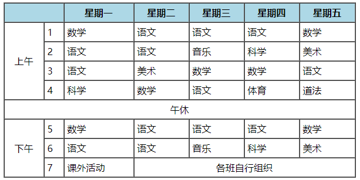

<!--
 * @Descripttion:
 * @version:
 * @Author: woxiaoyao
 * @Date: 2020-09-30 10:51:24
 * @LastEditTime: 2020-09-30 13:22:44
-->

## 一、Html5 语义化元素

> 推荐学习 Html5 网址<https://www.runoob.com/html/html5-intro.html>

&nbsp;&nbsp;&nbsp;&nbsp;&nbsp;&nbsp;&nbsp;&nbsp;这两天听朱老师讲 Html 知识，让我听到新词最多的就是 **语义化** ,百度下，从上面我推荐网址更能全面了解所谓的语义化，其实就是为了 **能够清楚表达内容给浏览器和开发者** ，对于经常快排的来说，它可以让搜索引擎更好理解网页表达内容，更快速收集，可以说是 SEO 优化的一部分。
&nbsp;&nbsp;&nbsp;&nbsp;&nbsp;&nbsp;&nbsp;&nbsp;Html5 新增了 8 个语义化元素，主要是结构元素，包括 header、nav、aside、article、section 和 footer 等。现在绝大部分浏览器都已经支持，若是不支持，可在设置下它们的 display 属性为 block。IE8 及更早 IE 版本无法在这些元素中渲染 CSS 效果，以至于你不能使用 header、section、footer、aside、nav、article 等，或者其他的 HTML5 elements。
&nbsp;&nbsp;&nbsp;&nbsp;&nbsp;&nbsp;&nbsp;&nbsp;**解决办法:** 你可以使用 HTML5 Shiv Javascript 脚本来解决 IE 的兼容问题。HTML5 Shiv 下载地址<https://cdn.static.runoob.com/libs/html5shiv/3.7/html5shiv.min.js>,下载后，将以下代码放入到网页中：

```html
<!--[if lt IE 9]>
  <script src="html5shiv.js"></script>
<![endif]-->
```

以上代码在浏览器小于 IE9 版本时会加载 html5shiv.js 文件. 你必须将其放置于`<head>`元素中，因为 IE 浏览器需要在头部加载后渲染这些 HTML5 的新元素。

## 二、语义化元素常用演示

### 1. 文本元素

&nbsp;&nbsp;&nbsp;&nbsp;&nbsp;&nbsp;&nbsp;&nbsp;常用元素有：abbr 缩写，sub 下标、sup 上标、address 地址、strong 加粗、em 斜体、del 删除线、progress 进度条和 mark 高亮标记等，其中旧式 b 加粗、i 斜体和 s 删除线不推荐使用，它们没语义。还有引用建议使用 q，blockquote 我测试无效，除非你自己定义 CSS。

#### 代码

```html
<p>
  <abbr title="HyperText Markup Language">html</abbr
  >文档,是采用超文本标记编写的文档
</p>
<p>2 <sup>4</sup> = 16</p>
<footer>
  <strong>联系地址:</strong>
  <address>合肥市政务新区99号</address>
</footer>
<p><em>猪肉原价</em>: <del> 38.88</del>, <mark>现价</mark>: 28.88</p>
<p><progress max="100" value="50">已完成50%</progress></p>
```

#### 效果

> <p><abbr title="HyperText Markup Language">html</abbr>文档,是采用超文本标记编写的文档</p>
> <p>2 <sup>4</sup> = 16</p>
> <footer>
>    <strong>联系地址:</strong>
>    <address>合肥市政务新区99号</address>
> </footer>
> <p><em>猪肉原价</em>: <del> 38.88</del>, <mark>现价</mark>: 28.88</p>
> <p><progress max="100" value="50">已完成50%</progress></p>

### 2. 链接元素

&nbsp;&nbsp;&nbsp;&nbsp;&nbsp;&nbsp;&nbsp;&nbsp;链接元素应该是重点之一了，重点就是**网页间跳转**和**网页内跳转**，前者主要就是 href 和 target 属性，href 是 url,target 可取\_self(默认)、\_blank、\_parent、\_top 和 name(配合 iframe 使用，常用于后台管理界面)；后者则是**锚点**，利用 href 属性跳转到页内指定的 ID 位置，如常见的回到顶部、跳转到指定章节等。还有就是 href 值中特殊前缀代表特殊功能，如 mailto 表示邮箱,tel 表示打电话。最后要提下 download 属性，一般网站都做了防盗链，download 作为属性了解就可以，实际使用很少。

#### 代码

```html
<a href="https://www.php.cn/" target="_blank">php中文网</a>
<a href="tel:1896644****">咨询电话</a>
<a href="mailto:123456@qq.com">发邮件</a>
通过锚点, 可以实现在当前页面内部跳转，这里就不显示效果了
<a href="#anchor">当前页面跳转</a>
<h1 id="anchor" style="margin-top: 1000px">跳到这里了</h1>
```

#### 效果

> <a href="https://www.php.cn/" target="_blank">php 中文网</a> 
> <a href="tel:1896644****">咨询电话</a> 
> <a href="mailto:123456@qq.com">发邮件</a>

### 3. 列表元素

> - 无序列表常用于导航、购物车。记得要 CSS 取消列表点号 list-style: none;
> - 有序列表常用于工作计划等有序事务。主要属性有 start、type 和 reversed(反序)
>     - start取值只能是数值，不管type是什么，不过按类型计算序列。如start="2"，type="A"，则从B开始计算序列
>     - type只能取1、A、a、I和i。
> - 自定义列表常用于联系方式

#### 无序列表实现导航

```html
<style>
  .nav {
    list-style: none;
    height: 50px;
    display: flex;
    line-height: 50px;
    background-color: #444;
  }
  .nav li {
    align-self: stretch;
    padding: 0 15px;
  }
  .nav li:last-of-type {
    margin-left: auto;
  }
  .nav li:hover {
    background-color: seagreen;
    cursor: pointer;
  }
  .nav a {
    color: #ccc;
    text-decoration: none;
  }
  .nav a:hover {
    color: white;
  }
</style>
<ul class="nav">
  <li><a href="">首页</a></li>
  <li><a href="">基础知识</a></li>
  <li><a href="">实战练习</a></li>
  <li><a href="">课后总结</a></li>
</ul>
```


#### 有序列表实现工作计划

```html
<ol start="2" class="plan" type="A">
  <li>给客户打回访电话</li>
  <li>整理新客户资料</li>
  <li>准备晚上的约会</li>
</ol>
```

<ol start="2" class="plan" type="A">
    <li>给客户打回访电话</li>
    <li>整理新客户资料</li>
    <li>准备晚上的约会</li>
</ol>

### 3. 图像元素

&nbsp;&nbsp;&nbsp;&nbsp;&nbsp;&nbsp;&nbsp;&nbsp;图像元素就比较简单了，我们要把握一个原则，**尽量小提高网页加载速度**，以提供更好的体验，具体就是

> - 能使用 css 字体图标,就不要使用图像图标
> - 简单的动图,或者颜色要求较少的,可使用`gif`格式
> - 推荐使用可压缩的`jpg`格式, 小图片,或需要背景透明的,推荐使用`png`格式

### 4. 表格元素

> - 表格是最重要的数据格式化展示重要工具, 使用频率非常高
> - 表格的数据,存储在由行与列组成的一系列单元格
> - 数据必须存储在单元格元素中
> - 与列表类似, 表格也是由一系列标签来描述

#### 常用标签

| 序号 | 标签         | 描述                                | 备注 |
| ---- | ------------ | ----------------------------------- | ---- |
| 1    | `<table>`    | 定义表格,                           | 必选 |
| 2    | `<tbody>`    | 定义表格主体, 允许定义多次          | 必选 |
| 3    | `<tr>`       | 定义表格中的行,                     | 必选 |  |
| 4    | `<th>`       | 定义表格头部中的单元格,默认加粗居中 | 必选 |
| 5    | `<td>`       | 定义表格主体与底部的的单元格        | 必选 |
| 6    | `<caption>`  | 定义表格标题,                       | 可选 |
| 7    | `<thead>`    | 定义表格头格, 只需定义一次          | 可选 |
| 8    | `<tfoot>`    | 定义表格底, 只需定义一次            | 可选 |
| 9    | `<col>`      | 为一个/多个列设置属性,仅限          | 可选 |
| 10   | `<colgroup>` | 将多个`<col>`元素分组管理           | 可选 |

#### 常用属性

| 序号 | 属性          | 适用元素    | 描述                   |
| ---- | ------------- | ----------- | ---------------------- |
| 1    | `border`      | `<table>`   | 添加表格框             |
| 2    | `cellpadding` | `<table>`   | 设置单元格内边距       |
| 3    | `cellspacing` | `<table>`   | 设置单元格边框间隙     |
| 4    | `align`       | 不限        | 设置单元格内容水平居中 |
| 5    | `bgcolor`     | 不限        | 设置背景色             |
| 6    | `width`       | 不限        | 设置宽度               |
| 7    | `height`      | 不限        | 设置高度               |
| 8    | `colspan`     | `<td>/<th>` | 规定单元格可横跨的列数 |
| 9    | `rowspan`     | `<td>/<th>` | 设置单元格可横跨的行数 |

#### 表格源码

```html
<table width="800px" border="1" cellspacing="0" cellpadding="5" align="center">
  <thead>
    <tr bgcolor="lightblue">
      <th colspan="2"></th>
      <th>星期一</th>
      <th>星期二</th>
      <th>星期三</th>
      <th>星期四</th>
      <th>星期五</th>
    </tr>
  </thead>
  <tbody>
    <tr>
      <td rowspan="4" align="center">上午</td>
      <td>1</td>
      <td>数学</td>
      <td>语文</td>
      <td>语文</td>
      <td>语文</td>
      <td>数学</td>
    </tr>
    <tr>
      <!-- <td>上午</td> -->
      <td>2</td>
      <td>语文</td>
      <td>语文</td>
      <td>音乐</td>
      <td>科学</td>
      <td>美术</td>
    </tr>
    <tr>
      <!-- <td>上午</td> -->
      <td>3</td>
      <td>语文</td>
      <td>美术</td>
      <td>数学</td>
      <td>数学</td>
      <td>语文</td>
    </tr>
    <tr>
      <!-- <td>上午</td> -->
      <td>4</td>
      <td>科学</td>
      <td>数学</td>
      <td>语文</td>
      <td>体育</td>
      <td>道法</td>
    </tr>
    <tr>
      <td colspan="7" align="center">午休</td>
    </tr>
    <tr>
      <td rowspan="3" align="center">下午</td>
      <td>5</td>
      <td>数学</td>
      <td>语文</td>
      <td>语文</td>
      <td>语文</td>
      <td>数学</td>
    </tr>
    <tr>
      <!-- <td>下午</td> -->
      <td>6</td>
      <td>语文</td>
      <td>语文</td>
      <td>音乐</td>
      <td>科学</td>
      <td>美术</td>
    </tr>
    <tr>
      <!-- <td>下午</td> -->
      <td>7</td>
      <td>课外活动</td>
      <td colspan="4" align="center">各班自行组织</td>
    </tr>
  </tbody>
</table>
```

#### 表格演示效果

