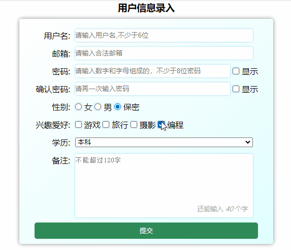
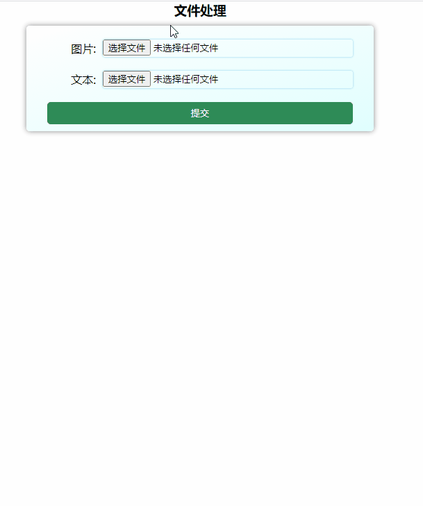
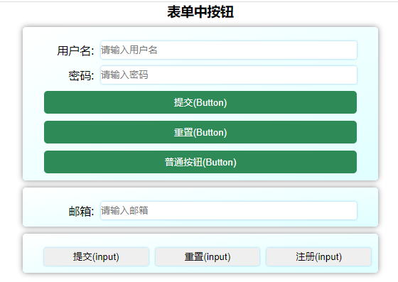
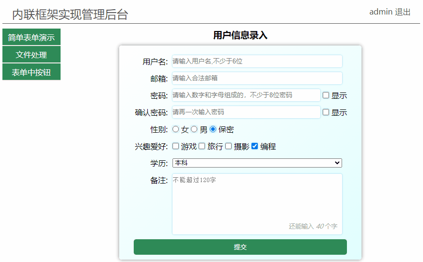

<!--
 * @Descripttion:
 * @version:
 * @Author: woxiaoyao
 * @Date: 2020-10-07 10:07:47
 * @LastEditTime: 2020-10-08 11:24:27
-->

## 一、Html5 表单的几点新认识

虽然现在自己也在做前端，但听了老师的表单讲课后又有了新的认识，不断有新的东西充实自己更能激起学习兴趣。以后学习期间的博客文章结构基本是学习新认识、知识分析、注意事项与演示和学习总结。

> **1. input 控件元素。** Html5 为 inpu 控件元素增加很多类型，基本满足了表单各项需求。参考<https://developer.mozilla.org/zh-CN/docs/Web/HTML/Element/input>，其主要属性有 type 是表示类型,name 与 value 是服务器进行交互的,id 可和标签绑定，可为 js 定位获取值。
> **2. 两个绑定。** 一是标签元素 label 的 for 属性绑定控件元素的 ID，实现标签与控件联动。二是控件元素的 form 属性绑定表单元素的 ID(不是 name 属性)，实现控件与表单联动。
> **3. 控件元素重置表单属性。** 目前主要是控件元素 Input 和 Button 增加了 formaction、formmethod、formenctype 等属性，可以在一个表单中实现多种请求，如 Get 类型的登录和 Post 类型的注册。
> **4. a 元素和 iframe 元素实现后台管理界面。** 链接元素 a 的 target 属性指向 iframe 的 name 可实现快速切换后台管理界面。iframe 的 name 属性同样可用于 from 的 target 属性，input 和 Button 的 formtarget 属性。

## 二、 Html5 表单的应用和演示

### 1. 简单输入的表单演示

> - 输入主要是指控件元素 input 的 type 为 text、password、email 等文本输入，radio 单选、checkbox 复选；select 下拉框和 textarea 文本域
> - input 主要属性除了 type，还有 name,value,id 和 placeholder。
> - 控件元素的 id 和 label 标签元素的 for 属性绑定。从而实现联动
> - select 可以通过 multiple 属性指定多选；size 属性指定控件中同时可见的行数，一般配合 multiple 使用;若 option 指定 label 属性则会覆盖 option 包含的文本。
> - 不要往 textarea 文本域标签中写入内容,提示信息使用 placeholder 属性

#### html 部分源码

```html
<h3>用户信息录入</h3>
<form action="test.php" class="register" name="register">
  <label for="username">用户名:</label>
  <div>
    <input type="text" name="username" value="" id="username" placeholder="请输入用户名,不少于6位" onblur="isEmpty(this)" autofocus required />
  </div>

  <label for="email">邮箱:</label>
  <div>
    <input type="email" name="email" value="" id="email" placeholder="请输入合法邮箱" onblur="isEmail(this)" required />
  </div>

  <label for="pwd1">密码:</label>
  <div>
    <input type="password" name="pwd1" value="" id="pwd1" placeholder="请输入数字和字母组成的，不少于8位密码" required />
    <input type="checkbox" name="chkshow1" id="chkshow1" />
    <label for="chkshow1">显示</label>
  </div>

  <label for="pwd2">确认密码:</label>
  <div>
    <input type="password" name="pwd2" value="" id="pwd2" placeholder="请再一次输入密码" onblur="isEqual(this)" required />
    <input type="checkbox" name="chkshow2" id="chkshow2" />
    <label for="chkshow2">显示</label>
  </div>

  <label for="secret">性别:</label>
  <div>
    <div>
      <input type="radio" name="gender" value="0" id="female" />
      <label for="female">女</label>
      <input type="radio" name="gender" value="1" id="male" />
      <label for="male">男</label>
      <input type="radio" name="gender" value="2" id="secret" checked />
      <label for="secret">保密</label>
    </div>
  </div>

  <label for="#">兴趣爱好:</label>
  <div>
    <div>
      <input type="checkbox" name="hobby[]" value="0" id="game" />
      <label for="game">游戏</label>
      <input type="checkbox" name="hobby[]" value="1" id="travel" />
      <label for="travel">旅行</label>
      <input type="checkbox" name="hobby[]" value="2" id="shoot" />
      <label for="shoot">摄影</label>
      <input type="checkbox" name="hobby[]" value="3" id="program" checked />
      <label for="program">编程</label>
    </div>
  </div>

  <label for="edu">学历:</label>
  <div>
    <select name="edu" id="edu">
      <option value="0">大专</option>
      <option value="1" selected>本科</option>
      <option value="2" label="硕士">研究生</option>
      <option value="3">博士</option>
      <option value="4">导师</option>
    </select>
  </div>

  <label for="comment">备注:</label>
  <div style="position: relative">
    <textarea name="comment" id="comment" cols="30" rows="5" maxlength="120" placeholder="不能超过120字" onselect="this.style.color='red'" oninput="show(this)"></textarea>
    <span class="tips">
      还能输入
      <em>40</em>
      个字
    </span>
  </div>

  <button>提交</button>
</form>
```

#### 效果图



### 2. 文件处理

> - input 的 type 为 file 时表示让用户可以选择一个或多个以提交表单的方式上传到服务器上，或者通过 Javascript 的 File API 对文件进行操作，使用 accept 属性规定控件能选择的文件类型。可查阅<https://developer.mozilla.org/zh-CN/docs/Web/HTML/Element/input/file>
> - 这里演示了选择后图片浏览和文本显示
> - 文本读取默认是 utf8 编码，编码还有 ANSI。若是 ANSI 编码的文本中有汉字则要转换为 utf8 才可正常读取，赋值编码 ANSI 读取时仍然是乱码。

#### html 部分源码

```html
<h3>文件处理</h3>
<form action="file.php" class="register" name="register">
  <label for="image">图片:</label>
  <input type="file" name="image" value="" id="image" accept=".jpg,.png" />
  <div class="image" style="grid-column: 2"></div>

  <label for="txt">文本:</label>
  <input type="file" name="txt" id="txt" accept=".txt,.html" />
  <div class="txt" style="grid-column: 2"></div>
  <button>提交</button>
</form>
```

#### 效果图



### 3. 按钮

> - 表单中按钮控件元素实现有两个:**input 和 Button**，类型主要有普通按钮、提交按钮和重置按钮，Button 默认类型是提交按钮。
> - input 和 button 都可以实现按钮功能，type=submit 时都会被提交，type="button" 是就是单纯的按钮，不会提交数据！只不过 button 是一个**容器空间**，可以容纳其他标签，input 则不可以。
> - 可通过**重置表单属性**改变按钮的提交行为。如表单中实现 Get 的登录和 Post 的注册
> - 控件元素的 form 可绑定指定 ID 的表单元素，当然 form 属性不仅 Button 和 input 有，其它**大部分控件元素**都有，使用前可查看文档。目前 MDN 中只介绍绑定一个表单 ID，而菜鸟教程和 W3School 介绍可以绑定多个，使用空格隔开，经测试无效。

#### html 部分源码

```html
<h3>表单中按钮</h3>
<form action="button.php" class="register" name="login" id="login">
  <label for="username">用户名:</label>
  <input type="text" name="username" value="" id="username" placeholder="请输入用户名" />

  <label for="pwd">密码:</label>
  <input type="password" name="pwd" value="" id="pwd" placeholder="请输入密码" />

  <button formaction="login.php">提交(Button)</button>
  <button type="reset">重置(Button)</button>
  <button type="button" formmethod="POST" formenctype="multipart/form-data">普通按钮(Button)</button>
</form>
<form action="reg.php" class="register" name="reg" id="reg">
  <label for="email">邮箱:</label>
  <input type="email" name="email" value="" id="email" placeholder="请输入邮箱" />
</form>
<div class="register inputbotton">
  <input type="submit" form="login" value="提交(input)" />
  <input type="reset" form="reg" value="重置(input)" onclick="test(this)" />
  <input type="button" form="reg" formmethod="POST" value="注册(input)" />
</div>
```

#### 效果图



### 4. 内联框架 iframe

> - **HTML 框架和 HTML 内联框架**。HTML 框架使用标签 frameset，不可和 body 同时使用，不支持的浏览器要使用 noframes 说明；而内联框架使用标签**iframe**，可和 boby 同时使用，最常见应用就是**管理后台**。
> - iframe 的属性使用前建议查看<https://developer.mozilla.org/zh-CN/docs/Web/HTML/Element/iframe>，其中有老师提到的 frameborder,文档中就说明了 Html5 已经废弃。常用属性有**src**指向要打开网页，**name**配合 a 或 form 的 target(其它用途可文档说明)和**srcdoc**将 HTML 代码被渲染到 iframe 中(Html5 新增的属性)
> - 下面实现的管理后台就是**iframe 的 name 属性和 a 的 target 属性**配合完成的。

#### html 部分源码

```html
<header>
  <h1>内联框架实现管理后台</h1>
  <div>
    <a href="#">admin</a>
    <a href="#">退出</a>
  </div>
</header>
<aside>
  <a href="form1.html" class="button" target="content">简单表单演示</a>
  <a href="form2.html" class="button" target="content">文件处理</a>
  <a href="form3.html" class="button" target="content">表单中按钮</a>
</aside>
<main>
  <iframe src="" name="content" srcdoc="<em style='color:#666;'>点击左侧按钮开始</em>"></iframe>
</main>
```
#### 效果图



### 5. 常用事件属性
| 序号 | 事件属性    | 描述                           |
| ---- | ----------- | ------------------------------ |
| 1    | `onfocus`   | 获取焦点时触发                 |
| 2    | `onblur`    | 失去焦点时触发                 |
| 3    | `onchange`  | 失去焦点,且值发生变化时触发    |
| 4    | `oninput`   | 值发生变化(不等失去焦点)时触发 |
| 5    | `onkeydown` | 按下键盘时触发                 |
| 6    | `onkeyup`   | 抬起键盘时触发                 |
| 7    | `onclick`   | 鼠标单击时触发                 |
| 8    | `onselect`  | 选择内容文本时触发             |

## 三、 课程总结
>1. 学习文档推荐**MDN**<https://developer.mozilla.org/zh-CN/>，其次是W3CSchool<https://www.w3cschool.cn>和菜鸟教程<https://www.runoob.com>，尤其是MDN非常详细，比如属性版本支持说明、案例演示。
>2. **input控件元素** 是要重点掌握的，尤其是Html5增加许多类型后，表单大部分任务都由它完成。甚至可简单替代部分元素如Button、img等，当然它只能作为单元素，若要作为容器包含其它元素则仍然要使用原元素。
>3. **绑定** 是新的认识，本文开头已经提到了**label元素的for属性绑定控件元素ID**，**控件元素的form属性绑定表单元素ID**。其实最后的内联框架实现的管理后台也可看成绑定，它是**a元素的target属性绑定iframe元素的name**，可绑定iframe的name还有form元素的target和控件元素的formtarget。
>4. **重要属性** 如input的type，placeholder，控件元素的ID、name和value等。还有新增加的重置表单属性formaction、formmethod、formenctype等。
>5. **name属性作用** 最主要是作为变量，向服务器进行提交。另一个就是js中访问表单元素，如const fomr=document.forms.register；const username=form.username;
>6. **js脚本引入位置**  本文主要是学习Html5，但在编写Html5案例中引入js开始常报未定义错误，尤其是使用name访问表单元素时，所以这里提下，更多js在后面js课程学习中再说明。js中有关**DOM操作**的要在**Body后**引入，其它如**自定义函数**和**BOM操作**可在**Body前或后**引入均可