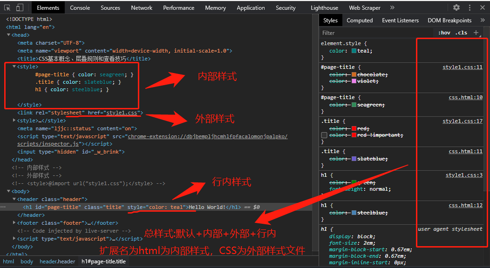

## 一、CSS 学习的几点新认识

昨晚老师开始讲 CSS 入门了，虽然是入门，但是打牢基础才能更好理解 CSS，从而应用 CSS，我从中学到的几点新认识:

> 1.  **chrome 的开发者工具查看 CSS 技巧。** 以前我也会用 chrome 开发者工具查看样式，但经过老师演示后，更加理解每项的含义了，而且在老师基础上更深入学习了 Elements 面板下 Styles 和 Computed，算是比较彻底理解这两项作用了，后面有更详细介绍。
> 2.  **选择器的优先级规则。** 上课前对优先级认识还是停留在**权重计算方式**上，我看到博客有同学发表的 CSS 就是这种计算方式<https://www.php.cn/blog/detail/24384.html>，即 tag 权重为 1,class 为 10，id 为 100，行内为 1000，！important 为最高，通过老师授课和我实践得出更加明确的优先级规则。
> 3.  **继承相关的 2 个关键字。** inherit(继承)和 initial(初值)，以前知道也在实际应用中继承，但没深入理解。通过老师授课才知道，如 color、font-size 等文本可以继承，而盒模型、表格等则不行。

## 二、CSS 的基本概念和层叠规则

> - **声明：** 由属性和值组成，中间用冒号 **:** 隔开，用分号 **;** 结尾。如 color:red;
> - **声明块:** 由一个或多个声明组成，包裹在大括号 **{}** 中。
> - **选择器:** 写在声明块前面的一个标识符(有时也称选择符)，用来选择页面中一个或多个元素。如#page-title,.title 或 h1
> - **规则集:** 选择器和声明块组成
> - **CSS 本质:** **样式复用**，我理解有两层意思，一是针对当前网页来说，就是可以通过 CSS 给不同元素通过类复用统一样式。二就是可以复用优秀的 CSS 美化网页，从而弥补自己不足，正如老师所说，都用 CSS 十来年了，仍然感觉 CSS 定义界面不够漂亮，何况是我们这些小新。

### 2.1 样式表来源

样式表来源主要分为**默认**和**自定义**两大类，前者是浏览器**默认定义**的，每个浏览器定义可能不相同，后者包括**行内样式**、**内部样式**和**外部样式**三种，是我们**可以自定义**的。行内样式是指元素的**style 属性**定义的样式，内部样式指网页中**style 元素**包裹的样式，而外部样式指由**link 元素引入或@import 导入**的 css 文件。

```html
<!-- 外部样式 -->
<link rel="stylesheet" href="style1.css" />
<!-- <style>@import url("style1.css");</style> -->
<!-- 内部样式 -->
<style>
  #page-title { color: seagreen; }
  .title { color: slateblue; }
  h1 { color: steelblue; }
</style>
<body>
  <header class="header">
    <h1 id="page-title" class="title" style="color:teal;">Hello World!</h1>
  </header>
  <footer class="footer">
    <a class="page-a" href="#">&copy;www.php.cn</a>
  </footer>
</body>
```


### 2.2 样式冲突及处理规则
从样式来源不难看出对于一个元素的样式，首先浏览器对其进行了默认定义，然后就是我们用户自定义的，一旦重复定义了样式就是所谓的**冲突**，这时必须有个处理规则决定哪个生效。
>- 规则处理的两种结果：**叠加**或**覆盖**，即元素的相同声明进行覆盖，不同声明进行叠加。
>- 处理的两个规则：**源码顺序**和**选择器优先级**，对**整个网页**来说是按**源码顺序**组成的总样式(虚拟的)，对**某个元素**来说要按**优先级**来确定最终样式。
>- 我自己以前错误的认识：外部样式 < 内部样式 < 行内样式，从上面源代码中可以看出，外部样式和内部样式区别只是定义形式不同，没有优先级之分。而行内样式相对外部样式或内部样式则有优先原则。

**下面是chrome开发者工具中Elements面板的Styles的对应图**。


从上面 **`Elements面板的Styles的对应图的右侧部分`** 可以看到**源码顺序**，就是**默认源码+外部或内部(按先后顺序)+行内样式**拼接成了**总样式表**，这点上课时老师没提到。然后就是老师主要讲的左侧部分**选择器优先级**。并给出优先级计算方法(我感觉比常见的权重计算更好)。

| 案例                         | id  | class | tag | 标识      |
| ---------------------------- | --- | ----- | --- | --------- |
| `html body header h1`        | 0   | 0     | 4   | `0, 0, 4` |
| `body header.page-header h1` | 0   | 1     | 3   | `0, 1, 3` |
| `.page-header .title`        | 0   | 2     | 0   | `0, 2, 0` |
| `#page-title`                | 1   | 0     | 0   | `1, 0, 0` |
```html
  <style>
    /* 0, 0, 4 */
    html body header h1 { color: red; }

    /* 0, 0, 3 */
    /* body header h1 { */
    /* 0, 1, 3 */
    body header.page-header h1 { color: green; }

    /* 0, 1, 2 */
    /* header.page-header h1 { */
    /* 0, 2, 2 */
    /* header.page-header h1.title { */
    /* 0, 2, 0  > 0, 1,3*/
    .page-header .title { color: blue; }

    /* 1, 0,0 */
    #page-title { color: cyan; }
  </style>
```

将选择器的权重分为**三级**：id、class和tag。优先级**先依据级别**，**再依据权重**(或称为个数)。而常见的权重计算方法则是以数值来决定，如11一定小于12，虽然绝大部分时候没有问题，但若考虑tag后代较多时就会出0,0,12>0,1,0的情况，这个依据上面就是不正确的。

>**总结**:先要按**源码顺序拼接总样式表**，然后再按**选择器优先级**来决定最**终效果**。

### 2.3 注意事项
>- 尽可能不要用`!important`
>- 为什么要不用或少用id选择器?
>    - 原因是级别太高, 丧失了灵活性
>    - id常用于绑定或锚点
>- 为什么尽可能不用或少用tag选择器?
>    - 因为 css 的本质是为了"样式复用"，采用tag选择器不能使用到其它元素
>    - tag选择器常用于清除默认样式，如a清除下划线，导航中的li清除前面圆点。
>- 尽可能在可用的情况下,使用 class 来完成

### 2.4 继承
- 有的属性可以被继承,如颜色,字体等文本, 有的则不行, 如盒模型
- 二个关键字
  - `inherit`: 继承
  - `initail`: 初值

## 三、Chrome浏览器查看CSS的详细介绍

### 3.1 源码顺序对总样式的影响
其实就外部样式和内部样式引入顺序影响源码顺序，至于默认样式和行内样式拼接顺序不变，默认样式永远在最前面，行内样式永远在报后面，那当然若有！important则它在行内样式后。




### 3.2 叠加和覆盖
上小节已经介绍过了，**`叠加是指同元素的不同声明拼成更大的声明块，而叠加是指同元素的相同声明的替换。`**，在chrome查看时就是有删除线的声明就是覆盖,没有删除线就是叠加。


### 3.3 最终样式
>- 最终样式可以通过上面讲的选择器优先级计算得到
>- 也可以通过 **`Elements面板的Styles`** 中删除线来得到叠加的声明和覆盖的声明
>- 最简单方式是通过 **`Elements面板的Computed`** 直接得到


### 3.4 默认样式
为什么还要讲默认样式，因为我还没自定义CSS时，发现h1元素字体默认颜色是黑色，就通过chrome的Elements的Styles查默认样式，没发现color声明，在Elements的Computed也没有看到，好像老师也在找这个定义。后来我勾选了**Computed的右侧的Show All复选框**终于找到了。


> 至于Computed中样式分**高亮部分**和**不高亮部分**,我推测原因是不高亮部分是标准的统一样式，而高亮则是各浏览器自行定义的，依据是a元素在chrome浏览器的颜色是蓝色，查看Computed中其color定义时，发现如下图部分浏览器标识

## 四、学习后总结
>- CSS本质是样式复用，使用自定义或优秀的CSS可快速美化网页界面
>- CSS冲突时处理原则是源码顺序和选择器优先级，具体分析见上面
>- 善于利用Chrome浏览器的Elements面板的Styles和Computed两个工具，可提高我们分析其它优秀CSS和查找自己CSS问题的效率。

推荐前端在线练习神器CodePen<https://codepen.io/>,里面有大神写的前端源码可以学习，自己的优秀源码也在其分享。可以看下2016年10个最佳的CodePen作品<https://zhuanlan.zhihu.com/p/24969846>，看完后，我惊讶前端还可以这样。

欢迎访问的博客<https://www.php.cn/blog/freegroup.html>
         Gitee<https://gitee.com/freegroup81/>
