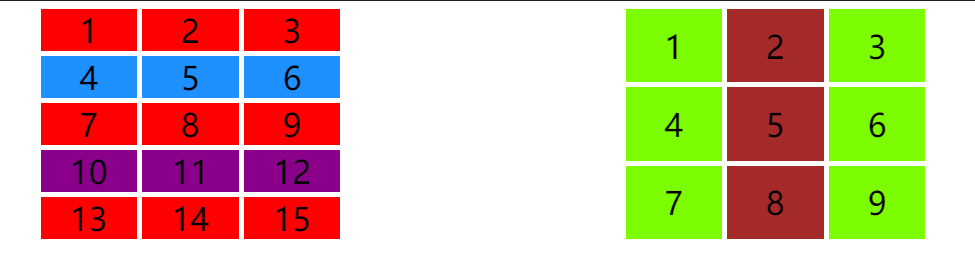
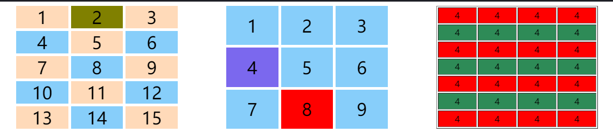

### 一、学习的新知识

今天主要学习了CSS选择器中**结构伪类**，老师讲得非常仔细，以前我主要用:hover、:active等比较多，也只停留伪类就是那些的误区，今天认识了结构伪类，发现真是好用，尤其是在选择元素时。后来又学习了群共享的css教程，发现更多的伪类，其对伪类本质解释非常到位了，我在这里引用下：

>* **伪**: 本意是假的,不存在的意思, 这里是特指, 不需要在元素上添加额外的属性来获取元素
>* **类**: 暗指伪类的级别, 仍然是属于**class级别**, 级别高于元素选择器  
>它弥补了上下文选择器的短板(例如选择同一个父级下的第二个子元素,就没那么简单), 所以伪类,大多数是基于文档中元素结构的。

|序号|选择器                 |描述                          |举例                       |
|---|----------------------|------------------------------|---------------------------|
|1  |`:first-child`         |匹配第一个子元素                 |`div :first-child`        |
|2  |`:last-child`         |匹配最后一个子元素               |`div :last-child`          |
|5  |`:only-child`         |选择元素的唯一子元素             |`div :only-child`          |
|3  |`:nth-child(n)`       |匹配任意位置的子元素             |`div :nth-child(n)`        |
|4  |`:nth-last-child(n)`  |匹配倒数任意位置的子元素          |`div :nth-last-child(n)`  |
|5  |`:first-of-type`       |匹配按类型分组后的第一个子元素     |`div :first-of-type`     |
|6  |`:last-of-type`       |匹配按类型分组后的最后一个子元素   |`div :last-of-type`       |
|5  |`:only-of-type`       |匹配按类型分组后的唯一子元素      |`div :only-of-type`       |
|7  |`:nth-of-type()`      |匹配按类型分组后的任意位置的子元素  |`div :nth-of-type(n)`     |
|8  |`:nth-last-of-type()` |匹配按类型分组后倒数任意位置的子元素|`div :nth-last-of-type(n)`|


在群共享的CSS教程中除了熟悉的:root，又发现了新的伪类:empty、:not()等,与是百度下，发现不少的介绍伪类好文章<https://blog.csdn.net/ixygj197875/article/details/79038041>、<https://www.cnblogs.com/bfgis/p/11928807.html>，加深了我对伪类的认识。虽然老师已经讲的很仔细了，但有些本质讲少了，如老师主讲的x-child和x-of-type讲了如何应用，我听后知道子元素无分组时用第一个，有分组时用第二个，但同时不禁产生疑问：

>- 为什么分组时不用第一个？用第一个和第二个到底有什么区别？
>- nth-child可选择以第一行开始或最后一行结束的一行或连续多行，若我想选择第二行、不是第一行开始或最后一行的连续行、奇数行和偶数行又要怎么选？

### 二、结构伪类的效果演示

下面主要演示nth-child用法，在老师演示的基础上加了一些高级用法，如选第二行，选第二列，除某一行外所有行或某一列外所有列等。

```html
 /* 没有父元素限定时，则它从根元素开始递归所有子元素。建议使用结构伪类要加上父元素 */
    /* :first-child{ background-color: cyan; } */

    /* 遍历所有类名为container的子元素中第一个或最后一个元素 */
    .container :first-child{ background-color: cyan; }
    .container :last-child{ background-color: cyan; }

    /* 选择偶数或奇数的子元素 */
    .container :nth-child(2n){background-color: green; }
    .container :nth-child(even){background-color: green; }/* 偶数关键字，同上效果 */
    .container :nth-child(2n+1){background-color:indianred; }
    .container :nth-child(odd){background-color: indianred; }/* 奇数关键字，同上效果 */

    /* 选择以第一行开始或最后一行结束的连续一行或多行。其中n从0开始，()计算值小于等于0或大于子元素个数时结束匹配 */
    .test1 :nth-child(-n+3){ background-color: darkgoldenrod; }
    /* .test1 :nth-last-child(-n+3){ background-color: darkgoldenrod; } */
    .test1 :nth-child(n+4){background-color: darkmagenta; }
    /* .test1 :nth-last-child(n+4){background-color: darkmagenta; } */
    
    /* 选择不是第一行开始或最后一行结束的一行或连续多行，多次使用nth-child实现交集效果 */
    .test1 :nth-child(n+4):nth-child(-n+6){background-color: dodgerblue;}
    /* 选择奇数行或偶数行等不连续行，目前百度也没找到方法，只能多选择器了，意义不大 */
    /* .test1 :nth-child(6n+1),.test1 :nth-child(6n+2),.test1 :nth-child(6n+3){background-color: red;}
    .test1 :nth-child(6n+4),.test1 :nth-child(6n+5),.test1 :nth-child(6n+6){background-color:aqua;}     */
    /* 选择除第二行外所有行 */
    .test1 :not(:nth-child(n+4)),.test1 :not(:nth-child(-n+6)){background-color: cadetblue;}
    
    /* 选择第二列 */
    .test2 :nth-child(3n+2){background-color: red;}
    /* 选择连续多列 */
    .test2 :nth-child(3n+1),.test2 :nth-child(3n+2){background-color: brown; }
    /* 选择除第2列外所有列 */
    .test2 :not(:nth-child(3n+2)){background-color:lawngreen;}
```

#### 效果 <https://codepen.io/woxiaoyao81/pen/vYKNyzY>


#### 从上面源码中，我得出如下总结:

>- **结构伪类x-child语法格式** 这点好像都没讲，我也只是使用中感觉这个存在，不是很科学解析。格式是 **[[父级选择器P] [自己选择器M]:x-child]** 
>    - **建议指明父级选择器**。 父级选择器若不写，此时父级则**从根开始递归**所有。这样明显不符合结构伪类的初衷。
>    - **自己选择器根据情况定义**。 自己选择器若不写，则代表任何子元素，在**nth-child伪类不建议写**，而**nth-of-type要写**，它就是根据类型来分组的。其实若nth-of-type前不写自己选择器则等同于nth-child,即 **:nth-of-type(n)等于:nth-child(n)** ,这点在下小节演示。

>- **nth-child(n)** 中n可以是**数值**、**表达式**或**关键字**：
>     - **数值** 可以是任何大于0的正整数，代表子元素的位置。
>     - **表达式**  最主要形式，**格式为(an+b)**。a是任何整数(可正可负)；n是变量，从0开始的整数；b是不小于0的整数。**匹配过程中一旦表达式值为0、小于0或超过子元素总数则结束匹配**。另外要注意**n和+位置顺序不可改变**。如3-n、5n-1这样表达式都错误的。
>     - **关键字** 目前只有 **odd** 和 **even** 两个关键字。odd表示选取序号为奇数的元素，效果等同于:nth-child(2n+1)；even表示选取序号为偶数的元素，效果等同于 :nth-child(2n)。

>- **伪类的"交集"** 如only-child等同于:first-child:last-child，例子中第二行:ntd-child(n+4):ntd-child(-n+6)，每个伪类结果都是相当于数学中一个集体，级联伪类达到效果就是"交集"效果，如第二行获取就是这样实现的。

>- **连续和不连续** 本来想实现开头提出不连续任意多行，结果百度，自己想都没简便解决办法，只能通过最笨的群组选择器方法，下面是一些结论：
>   - **行的连续和不连续** 
>      - 第一行开始或最后一行结束的连续一行或多行只需要**一个伪类**就可以实现；如例子中:ntd-child(n+4)表示从第二行到最后一行。
>      - 中间部分的连续一行或多行需要**两个伪类**来实现。如ntd-child(n+4):ntd-child(-n+12)表示第二行到第四行。
>      - **奇数行或偶数行**，通过**伪类的群组**来实现，如:ntd-chid(6n+1),:ntd-child(6n+2),:ntd-child(6n+3)实现本例的奇数行，偶数行类似写法，具体见案
例。
>      - 其它不连续的多行，也是通过伪类群组来实现，便感觉没有什么价值，可以忽略。
>   - **列的连续和不连续**
> 列比较特殊，**定位单列比较简单**，一个伪类就可以。多列大部分要用**伪类的群组**来实现，当然排除除某一列外所有列这种情况，它使用:not(:nth-child(3n+1))。

### 三、x-child和x-of-type伪类的区别

>无论是x-child还是x-of-type结构伪类，语法格式都是[[P] [M]:x-child],用法也相同，二者主要区别就是解析子元素逻辑不同。
>- **x-child：** 首先根据父选择器解析**所有子元素**，并按1开始排序,此时自身选择器无效；第二步就是根据位置如first、last或表达式匹配子元素；最后再匹配自己选择器是否符合。
>- **x-of-type:** 首先在父选择器中解析**所有匹配自己选择器的子元素**，并按1开始排序，一般来说它的个数要小于上面的个数(除非你不指定自己选择器,如:first-of-type)；第二步同上。它相对x-child来说，没有第三步。


>从上面x-child和x-of-type的区别来看，可以有下面几个认识
>- **x-child推荐的格式**是 **P :x-child**，就是指定父选择器和伪类,不指明自己。
>- **x-of-type推荐的格式**是 **P M:x-of-type**，就是指明所有要素。
>- x-of-type若**不指明自己选择器**，实现等同于x-child。即**P :x-fo-type** = **P :x-child**。也可以说**x-of-type是x-child增加版**。
>- only-of-type是选取子元素中只有一个类型的，而only-child则是指该父选择器只有一个子元素。它们不符合上面的结论。

```html
/* 无论是x-child还是x-of-type，没有指明父元素就从根元素递归，一般推荐加上父元素 */
/* :first-of-type{background-color: lightyellow;} */

/* x-of-type不仅能处理子元素都是一样的(也称无分组)，也可以处理子元素分组的,可以说x-of-type是x-child增强版，x-child可以忘掉了 */
.test1 div:first-of-type{background-color: mediumorchid;}
.test2 span:first-of-type{background-color: mediumslateblue;}

/* nth-of-type和nth-child用法一样 */
.test1 div:nth-of-type(-n+3){background-color: olive;}/* 第一行 */
.test1 div:nth-of-type(2n+1){background-color: peachpuff;} /* 奇数位置 */

/* only-child和only-of-type是唯一不能替换的 */
.test2 :only-of-type{background-color: red;}
.test2 a:only-child{background-color: peru;}/* 目前无效，它要求只有一个子元素 */

/* 表格隔行选择 */
table{ width: 300px; height: 100%; text-align: center; }
table tr:nth-of-type(odd) { background-color: red; }
table tr:nth-of-type(even){ background-color: seagreen; }
```

#### 效果 <https://codepen.io/woxiaoyao81/pen/VwjvPje>


### 四、学习的结论
>- 伪类是指不增加属性情况下快捷选择元素，也使得html更简洁
>- 结构伪类x-of-type和x-child都可以选择子元素，要注意它们区别就在**解析逻辑**
>- **x-of-type可以看成x-child增强版**，不要在意分组不分组，其实不分组只是一个分组而已，大部分时候可以忽略x-child，除非是only-child
>- 连续或不连续的多行或多列，可以采用群组选择器('并'集)或复合选择器('交'集)来实现
>- 除某列或行的所有则采用伪类:not来实现。
>- 上面提到奇数行和偶数行，最大用处就是设置表格的隔行效果，.container tr:nth-of-type(odd)就很简单实现了。
>- 上面主要讲了结构伪类，至于表单伪类和其它伪类则没有介绍，以后有时间再继续写他们的用法

我的PHP博客:<https://www.php.cn/blog/freegroup.html>
Gitee: <https://gitee.com/freegroup81>
