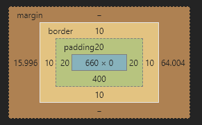

### 一、盒模型属性探讨

**盒模型** 对于盒模型应该是耳熟能详了，但是通过朱老师讲课，更能体会到盒模型更深入的知识，我在老师基础上结合我平时的疑问进行了测试，得到相对比较全面的总结。

>盒模型组成:**外边距margin** 、**边框border**、**内边距padding**和**内容content**四个部分组成 



```html
/* 下面探讨都是针对下面而言 */
<body style="height: 800px">
  <div class="header"><div class="box"></div></div>
</body>
```

#### 1、 宽度width、高度height和box-sizing
>- 盒模型的宽度和高度计算依据是**box-sizing** ，默认是**content-box** ，即等于内容宽度和高度。
>- 而在布局时border和padding撑开盒模型空间导致布局不稳定，建议设置为**border-box** ，即宽度和高度包括border和padding。
>- 盒模型宽度和高度是不包括margin。

```html
.box { box-sizing: border-box; width: 500px; height: 500px; background-color: seagreen; }
```

#### 2、 边框border和内边距padding

> 边框border可设置：宽度、样式和颜色。而内边距padding是透明的，只能设置宽度

```html
.box { border: 10px solid violet; padding: 20px; }
```

#### 3、 外边距margin

单独探讨margin是因为它的右边距和下边距**延伸**特性。

>- margin的左或上边距始终生效，相对于父元素的左上角。右或下边距在右侧或下方有其它元素时有效，若右侧或下方没有其它元素则延伸，对元素布局不影响。
>- margin可以设置绝对值、百发比和auto。绝对值和百分比是按第一条规则布局的，但是百分比要注意横向和竖向百分比的计算规则，可见下面详解
>- 取值auto时，竖向为0，横向是一个元素时则平均分容器宽度减去元素宽度得到的值，若是多个元素时则为0。

```html
.box { margin: auto auto; }
.header { width: 800px; height: 500px; position: relative; background-color: darkcyan; }
```

#### 4、 背景裁剪backgroud-clip

> 默认值是border-box，背景色或背景图延伸到边框；为padding-box延伸到内边距；为content-box延伸到内容

```html
.box {
  border-style: dashed;/* 设置边框样式为虚线，可以看到padding-box和border-box的区别 */
  background-clip: content-box;
  /* background-clip: padding-box; */
  /* background-clip: border-box; */
}
```

#### 5、 百分比的依据

为什么要单独探讨下百分比，这是我开发中遇到想按背景图比例设置元素尺寸时引发的。我设置尺寸时，除了绝对值px和相对单位em、rem、vw与vh外，还常用用到百分比,盒模型好多属性也可以设置成百分比。但是经常遇到百分比后的值不是自己想象的，尤其是height百分比，这个也是本节要解决的，相信大家以前也没深入探讨过，当然我主要测试了几个常用的。

>- width、margin、padding中百分比都是依据**父元素的width**。可以利用这个特性，设置width和padding来适应背景图的长宽比。
>- height的百分比是依据**父元素的height**。它的计算非常特殊，详细见下面
>- background-position的百分比是依据元素减去图片的剩余值，即元素300px，图元素100px，则此时百分比20%就是0.2*(300-100)=40px。
>- 定位position中left、right依据**父元素宽度**，top和bottom依据父**元素的高度**。

**百分比的计算**
> **宽度百分比：** **父元素指明宽度**时，百分比就是父元素宽度百分比；若父元素**未指明**时，切记不是父元素被撑开的宽度百分比，而是**向上寻找**，直到有指明宽度为止，body宽度默认为屏幕宽度。
> **高度百分比：** **父元素指明高度**时，百分比就是父元素高度百分比；若父元素**未指明**时，则它视为0，不会向上寻找，也不考虑撑开的高度。

```html
.box {
 /* 因为背景图比例是1.8:1，所以width是padding-bottom(相当于height)的1.8倍 */
  width: 90%;
  padding-bottom: 50%;
  margin-left: 2%;
  border-width: 5%;  
  /* background-position: 20% 20%; */
  /* position: absolute;
  left: 10%;
  top: 10%; */
  background-image: url(https://img.php.cn/upload/course/000/000/001/5f59db624c2e2735.png);
  background-repeat: no-repeat;
  background-size: cover;
}
```

### 效果 <https://codepen.io/woxiaoyao81/pen/pobEBor>

### 二、em实现按钮组件展示的应用

在我的作业<https://www.php.cn/blog/detail/24434.html>中已经比较详细分析了em和rem的本质，这里就不再解析了，这里主要演示layui文档中不同尺寸的按钮和重点展示效果。

```html
<style>
/* 基本样式 */
.btn {
outline: none;
border: none;
padding: 0.5em 1em;
margin: 0 0.8em;
color: white;
background-color: darkgreen;
border-radius: 0.5em;
}
.btn:hover {
opacity: 0.8;
transition: 0.3s;
cursor: pointer;
box-shadow: 0 0 0.2em red;
}
/* 不同尺寸效果 */
.big { font-size: 20px; }
.medium { font-size: 16px; }
.small { font-size: 12px; }
/* 重点展示效果 */
div { margin: 20px auto; }
span：link { font-size: 16px; }
span:hover { font-size: 22px; transition: 0.3s; }
</style>
<body>
<div>
    <h1>按钮不同尺寸</h1>
    <button class="btn big">相对单位</button>
    <button class="btn medium">相对单位</button>
    <button class="btn small">相对单位</button>
</div>
<div>
    <h1>重点突出显示</h1>
    <span class="btn">重点展示</span>
</div>
</body>
```

#### 效果 <https://codepen.io/woxiaoyao81/pen/BazLEBK>