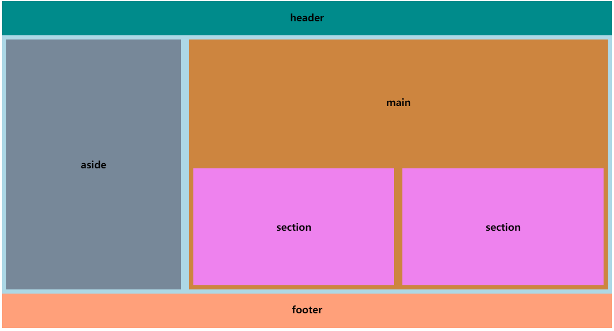

### 一、学习的新知识

现在多端需要响应式设计，页面能适应手机、平板、电脑和大屏设备进行自适应。在我的作业<https://www.php.cn/blog/detail/24434.html>已经详细分析了em和rem联系与区别，在作业<https://www.php.cn/blog/detail/24548.html>演示了em和rem的应用。今天又接触了新的知识。
>- 相对单位**vw、vh、vmin和vmax** 它们都是相对于**视口view**(浏览器窗口中用来显示文档的可视区域, 不包括地址栏,菜单,工具条,状态栏,控制台)相对单位。决定了响应式设计中**整体布局**。
>- **媒体查询@media** 通过它识别不同尺寸设备，从而调整尺寸适应。
>- **自定义变量** 以2个短横线为前缀即'--',如--textcolor:red;

### 二、字号的相对单位

与字号相关的单位有绝对值px，也有相对单位em和rem。rem(root em的缩写)是根元素的字号大小，而em是元素的字号大小(其中若是用于font-size时则继承父元素)。一般应用建议是：

> 1. rem: 用在font-size,设置字号,尽可能不要用在:root 
> 2. em: 用在依赖字号的属性的上,padding,margin,width, height,border-radius,line-height,text-indent....。应该说者都可以用，不过建议需要响应式的地方使用em更好。
> 3. px: border，边框一般不随屏幕而变化宽度。
> 4. em应用在设置font-size时要注意多层子元素的递归问题，所以不要随意使用em设置font-size，要少用或不用，除非你是可以预测的，如组件中还是建议使用em，使用rem则导致不灵活，这点以后会再说明。

```html
.panel {
  border: 1px solid lightgray;
  padding: 0.5em 1em;
  background-color: lightgray;
  border-radius: 0.5em;
}
.panel > h3 {
  font-size: 1.3rem;
  margin: 0.2em auto;
}
.panel > p {
  font-size: 1.1rem;
  line-height: 2em; /* 行高 */
  text-indent: 2em; /* 缩进2个字符 */
}
/* 小屏，宽度大于400px */
@media screen and (min-width: 400px) {
  :root {
    font-size: 0.75em;
  }
}
/* 平板，宽度大于800px */
@media screen and (min-width: 800px) {
  :root {
    font-size: 0.875em;
  }
}
/* PC，宽度大于1200px */
@media screen and (min-width: 1200px) {
  :root {
    font-size: 1em;
  }
}
```

### 效果 <https://codepen.io/woxiaoyao81/pen/QWEGgOb>

### 三、视口的相对单位

>- **视口:** 浏览器窗口中用来显示文档的可视区域, 不包括地址栏,菜单,工具条,状态栏,控制台 
>- **vw:** 视口"初始包含块"宽度的 1 / 100
>- **vh:** 视口"初始包含块"高度的 1 / 100
>- **vw:** 选择视口宽或高中较小的一个值，如80vmin就是80vw和80vh中最小值。
>- **vw:** 选择视口宽或高中较大的一个值，如80vmax就是80vw和80vh中最大值。

```html
<style>
    .box{ width: 100vw; height: 30vh; margin: 5px auto; }
    .red{ background-color: red; }
    .green{ background-color: green; }
    .blue{ background-color: blue; }
</style>
<div class="container">
    <div class="box red"></div>
    <div class="box green"></div>
    <div class="box blue"></div>
</div>
```

### 效果 <https://codepen.io/woxiaoyao81/pen/eYzBRKW>

### 四、响应式设计中相对单位使用小结

通过这几天相对单位的学习，可以说是让我又重新认识了响应式布局，解决了uniapp的UI框架只适应竖屏，对于横屏则显示很不友好。无论是uni-ui还是uview-ui首先都适配了竖屏，对于横屏考虑很少，再一个就是字号相对单位和视口相对单位选择不是很正确，导致组件在具体环境中适应性差。

> **常见的相对单位和建议应用场景:**
>1. 字号的相对单位**em和rem：** **rem用于页面内字号** ，**em用于组件内字号**，这样组件就能根据容器自适应调整，正是根据这个我对uniapp的UI组件进行了修改，较好适应了横屏和竖屏。
>2. 视口的相对单位**vw、vh、vmin和vmax：** 多用于**整体布局**，划分几行几列。**不建议**用于**组件内或局部布局**。
>3. 小程序端的相对单位**rpx：**我觉得rpx是视口宽度单位更进一步细化，vw分为100份，而rpx则将视口分为750份，更精细了。不过rpx只能用于移动端，而且只是针对横向。经测试在PC端直接使用无效。
>4. **百分比%:** 相比于vw和vh等，它更适合**组件内或局部布局**，不建议它进行整体布局。对于横向百分比和竖向百分比的计算规则可见我的作业<https://www.php.cn/blog/detail/24548.html>的第一节第5小点的分析，由于是个人测试总结，对于百分比认识难免有失误，还望老师和同学们批评

**下面源码通过相对单位综合使用实现了类似于Grid布局**
```html
<style>
* { box-sizing: border-box; text-align: center; }
body { display: flex; flex-direction: column; justify-content: space-between; }

/* 整体布局:建议使用vw和vh */
.page-head { height: 10vh; background-color: darkcyan; }
.container { height: 75vh; background-color: lightblue; display: flex; }
.page-foot { height: 10vh; background-color: lightsalmon; }

/* 局部布局:建议使用百分比,盒模型相关属性使用em */
.aside {
/* 局部使用vw效果不好 */
/* width: 30vw; */
width: 30%;
height: 100%;
background-color: lightslategray;
background-clip: content-box;
padding: 0.5em;
display: flex;
justify-content: center;
align-items: center;
}
.main {     
/* 局部使用vw效果不好 */ 
/* width: 68vw; */
width: 70%;
height: 100%;
background-color: peru;
background-clip: content-box;
padding: 0.5em;
display: flex;
flex-direction: column;
justify-content: space-between;
}
.content {
height: 50%;
display: flex;
justify-content: center;
align-items: center;
}
.section-box {
display: flex;
height: 50%;
}
.section {
width: 50%;
height: 100%;
background-color: violet;
background-clip: content-box;
padding: 0.5em;
display: flex;
justify-content: center;
align-items: center;
}
</style>
<body>
<header class="page-head"><h3>header</h3></header>
<div class="container">
<aside class="aside"><h3>aside</h3></aside>
<main class="main">
<div class="content"><h3>main</h3></div>
<div class="section-box">
    <section class="section"><h3>section</h3></section>
    <section class="section"><h3>section</h3></section>
</div>
</main>
</div>
<footer class="page-foot"><h3>footer</h3></footer>
</body>
```



### 源码 <https://codepen.io/woxiaoyao81/pen/XWKNaqy>

### 五、学习后总结

到这里，相对单位基本学习完了，通过老师讲解演示和自己测试，终于较为系统的认识了相对单位应用场景。可以归纳如下：

>- 字号相对单位多用于盒模型，em用于组件内，rem用于页面或组件外，根据尺寸使用px或rpx来调整，em和rem定义的属性自动相应调整。
>- 视口相对单位vw和vh等，主要用于整体布局。
>- 百分比用于组件内或局部布局，组件或局部灵活适应开发者的布局。
