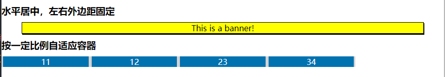

### 一、学习的新知识

今天主要学习了盒模型的box-sizing对宽度影响，以及**列间隙**和用表格模式实现**等高列**。可以说又认识了几个新知识点：

>- **calc()** 此CSS函数允许在声明CSS属性值时执行一些计算，可用运算符是+、-、\*、/。要注意是**操作符前后要有空格** ，否则无效。
>- **display:table** 表格布局，这个实在是让我又重新认识display，后来查了mdn发现布局中display还真是少不了，有N多值，如常见的flex和grid。

### 二、CSS中函数

为什么单独来说，因为后面用的越来越多，尤其是自适应流式布局中经常要用到。这里主要学习CSS中两个重要的CSS函数。

#### 1. var()

var()函数可以代替元素中任何属性中的值的任何部分。var()函数不能作为属性名、选择器或者其他除了属性值之外的值。

> **语法**  var(\<自定义属性名\> , \<后备值\>? )
>- **自定义属性名** 以两个**破折号**开始的任何有效标识符，自定义属性仅供作者和用户使用。
>- **后备值** 在自定义属性值**无效的情况下**保证函数有值,可以是多个，此时从左到右，检测到有效值时停止继续查找。

```html
/* 基本使用 */
:root {--main-bg-color: pink;}
body { background-color: var(--main-bg-color); }
```

```html
/* 后备值 */
/* 在父元素样式中 */
.component { --text-color: #080; /* header-color 并没有被设定 */ }
/* 在 component 的样式中： */
.component .header { color: var(--header-color, blue); /* 此处 color 被回退到 blue */ }
.component .text { color: var(--text-color, black); }
```

#### 2. calc()

calc() 此CSS函数允许在**声明CSS属性值时执行一些计算** 。它可以用在如下场合：长度length、百分比percentage、数值number、角度angle、时间time和重复frequency。

> **语法** calc(表达式expression)
>- **运算符** 只能是：加法+、减法-、乘法\*和除法/四种， **运算符前后必须有空格** ，否则无效。
>- **运算对象** 可以使用任意length值。可以在一个表达式中混用这类值的 **不同单位** 。在需要时，你还可以使用 **小括号来建立计算顺序** 。
>- **嵌套** calc()函数支持嵌套，但支持的方式是:把被嵌套的calc()函数全当成 **普通的括号** 。

**应用一:左右外边距固定，内容居中**

以前margin实现居中就是auto，让浏览器来计算左右外边距。现在有了calc(),我们也可以实现居中,并且更灵活，如实现 **左右外边距固定，内容居中显示** 。

```html
<div class="banner">This is a banner!</div>
<style>
.banner {
  box-sizing: border-box;
  margin:auto 40px;
  width: calc(100% - 80px);
  border: 1px solid;
  box-shadow: 1px 2px;
  background-color: yellow;
  text-align: center;
}
</style>
```

**应用二:自适应容器**

容器中子元素可以按一定比例适应容器的变化

```html
.container {
width: 80%;
background-color: lightgray;
font-size: 0;/* 解决inline-block水平间隙,此时子元素要重新设置字号 */
}
.item {
display: inline-block;
color: white;
font-size: 1rem;
background-color: #0072b0;
width: calc(100% / 4 - 6px);
margin:auto 3px;
text-align: center;
}
<div class="container">
    <div class="item"><p>11</p></div>
    <div class="item"><p>12</p></div>
    <div class="item"><p>23</p></div>
    <div class="item"><p>34</p></div>
</div>
```



#### 3. calc()和var()结合使用

CSS中经常要calc()和var()配合使用，此时var()看成一个普通运算对象。

```html
.foo {
  --widthA: 100px;
  --widthB: calc(var(--widthA) / 2);
  --widthC: calc(var(--widthB) / 2);
  width: var(--widthC);
}
```

>在所有的变量都被展开后，widthC 的值就会变成 calc( calc( 100px / 2) / 2)，然后，当它被赋值给 .foo 的 width 属性时，所有内部的这些 calc()（无论嵌套的有多深）都将会直接被扁平化为一个括号，所以这个 width 属性的值就直接相当于 calc( ( 100px / 2) / 2) 了，或者说就变成 25px 了。 简而言之：一个 calc() 里面的 calc() 就仅仅相当于是一个括号。

### 三、display初探讨

学布局就离不开display的学习，老师在讲块元素和行内元素时就已经和display有关了，我也是查mdn后才发现的.

> **普通文档流:** 是网页元素默认的布局/排列方式,元素按它们在html文档中的书写顺序进行排列

> display属性可以设置元素的**内部**和**外部**显示类型
>- **外部显示类型Outside:** 决定该元素在**流式布局中的表现** 。主要就是块级元素block和行内元素inline。
>   - **块级元素:** 总是完整占据一个整行,元素前后会自动添加"换行符" br
>   - **行内元素:** 总是随文字方向从左到右排列,并在到达了容器的边缘时自动换行显示
>   - **行内块元素:** 按行内元素规则排列，又可以按块级元素设置宽度和高度。
>- **内部显示类型Inside:** 控制其**子元素的布局** ，如table、flex和grid等。
>   - **表格table:** 按表格布局，这个有点意思，老师说表格布局，我还以为table标签呢。可以快速解决**等高列**问题
>   - **弹性flex:** 弹性布局，不用说了，小程序和APP端推荐布局。
>   - **网络grid:** 相比flex更强大的布局方式，flex可以看成一维，而grid是二维，从一定角度上讲，可以看成table布局和flex布局的整合。
>- **特定显示类型:** 有些布局模型(如table和ruby)有着复杂的内部结构，因此它们的子元素可能扮演着不同的角色。这一类关键字就是用来定义这些“内部”显示类型，并且只有在这些特定的布局模型中才有意义。
>   - **table-x:** 表格布局相关的内部类型，如本文下面用到的table-cell。
>   - **ruby-x:** ruby相关的内部类型，目前没有接触，可以暂时忽略。
>- **none:** 将元素从文档流中中移除，这会导致该元素及其所有子代元素不再被屏幕访问。

这里主要列举了常用的，怎么使用和注意事项，在使用时会再说明。display更详细的可上mdn查询，

### 四、布局中box-sizing的注意事项和列间隙演示

W3C的盒模型宽度和高度默认是指内容content区，而在布局中我们则经常需要清除边框border和内边距padding将盒子撑开的影响，后来根据IE盒模型，W3C增加了box-sizing属性，开发者可以选择宽度和高度是否包括border和padding。一般建议清除样式中要包括box-sizing:border-box。即

```html
<!-- 建议盒模型清除的样式 -->
*{
    margin:0;
    padding:0;
    border:none;
    outline:none;
    box-sizing:border-box;
}
```

> **display行内块元素的间隙问题:** 老师讲课时使用浮动float来解决了块元素的横向布局，不过我对浮动不兴趣，于是想到display的行内块元素解决，不过发现行内块(目前测试了inline-block或inline-flex)水平方向总是存在间隙，导致不是我想要的布局。
>- **水平间隙清除：**  在父级加上font-size:0;此时在元素要重新设置font-size，否则继承父级字号就不对。
>- **垂直间隙清除：**  一种是通过在元素上加vertical-align:bottom;另一种是元素中有文字时不会生成垂直间隙。

目前列间隙解决方案有两种：一种是将间隙按百分比计算，另一种就是通过calc()+百分比+em灵活控制间隙。后者相比于前者更灵活。

```html
<style>
* {
  margin: 0;
  padding: 0;
  border: none;
  outline: none;
  box-sizing: border-box;
}
header {
  background-color: #0072b0;
  color: white;
  padding: 0.5em 1em;
  border-radius: 0.5em;
  margin-bottom: 1em;
}
.container { font-size: 0;/* 解决行内块水平间隙问题 */ }
.main,
.sidebar,
.widget {
  display: inline-block;
  font-size: 1rem;/* 解决行内块水平间隙问题 */
  vertical-align: top;/* 解决行内块不是顶端对齐，默认是底部对齐 */
  background-color: lightcyan;
  padding: 1.5em;
}
/* 一、百分比实现列间隙 */
/* .main{width: 70%;}
.sidebar{width:29%;margin-left: 1%;} */
/* 二、百分比+em实现列间隙 */
.main { width: calc(70% - 0.5em); margin-right: 0.5em; }
.sidebar { width: calc(30% - 0.5em); margin-left: 0.5em; }
</style>
<header>
  <h1>
    列间隙
    <small>display行内块和box-sizing</small>
  </h1>
</header>
<div class="container">
  <main class="main">
    <h2>欢迎加入战队</h2>
    <p>
      据
      <a href="https://w3techs.com/">w3techs</a>
      统计,目前全球Web开发领域,php仍以78.8%占有率,傲视所有对手, 那些天天唱衰PHP的家伙们被啪啪打脸
    </p>
  </main>
  <aside class="sidebar">
    <div class="widget"></div>
    <div class="widget"></div>
  </aside>
</div>
```


### 五、等高列的解决方案一:table布局

上例中左边和右边是不等高，这就涉及到**元素高度的溢出问题** 。在实际开发过程中,程序员通常不会直接去定义元素的一个高度，在普通文档流中，根据阅读的习惯,屏幕的宽度是受限，而高度不受限 。所以，容器高度一般由内容决定，而不是由用户来决定。对于元素高度的溢出问题处理的属性就是overflow。

> **元素高度溢出处理overflow**
>- **默认值visible:** 就是溢出显示超过元素高度的内容。
>- **hidden:** 溢出内容裁切，不显示溢出的内容。
>- **scroll:** 对溢出内容不改变宽度或高度情况下，通过设置overflow-x:scroll、overflow-y:scroll和overflow:scroll，实现滚动查看溢出内容。
>- **auto:** 当内容溢出时,显示滚动条,否则就不显示

```html
<style>
    * { margin: 0; padding: 0; border: none; outline: none; box-sizing: border-box; }
    .main,
    .sidebar,
    .widget {
    background-color: #0072b0;
    color: white;
    padding: 0.5em 1em;
    vertical-align: top;
    }
    /* table布局实现等高列 */
    .container {
    display: table;
    /* 表格宽高默认由内容决定，并不会像块元素那样充满父级容器的全部空间 */
    width: 100%;
    /* 表格中不支持margin; 列间隙/单元格间隙*/
    border-spacing: 1em;
    }
    .main,
    .sidebar {
    /* 转为单元格之后就默认等高了,于是等高列就实现了 */
    display: table-cell;
    }
    /* 给这个table类似的容器外面套一个壳,利用负的外边距消除列间隙对最外侧左右的影响 */
    .wrapper{ margin-left: -1em; margin-right: -1em; }
</style>
<div class="wrapper">
    <div class="container">
    <main class="main">
        <h2>欢迎加入战队</h2>
        <p>据<a href="https://w3techs.com/">w3techs</a>统计,目前全球Web开发领域,php仍以78.8%占有率,傲视所有对手, 那些天天唱衰PHP的家伙们被啪啪打脸 </p>
    </main>
    <aside class="sidebar">
        <div class="widget"></div>
        <div class="widget"></div>
    </aside>
    </div>
</div>
```


### 学习后总结

>- display要深入探讨下，尤其是在布局中应用。如本文所说的table布局。
>- 自适应是适应多端的根本本要求，它们离不开相对单位、百分比和calc()和布局。
>- 无论行内块元素inline-block(或inline-flex)还是table布局，都存在**间隙问题** 。前者是默认存在，需要清除。后者是间隙设置默认是左右，需要通过外边距取负值来调整。