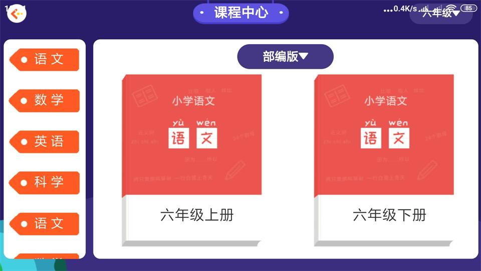
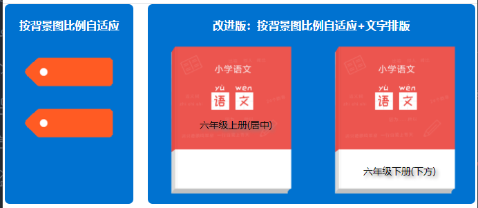

### 一、问题的由来

在实际开发中为了美观，可以采用**背景使用图片，文字居中排版**。这个对于固定尺寸的没问题，但现在是多端，需要自适应，我们无法提前预知尺寸，只能限制在布局中，这个问题我开始使用定位来解决，发现并不完美，尤其是在**多端切换时**不能达到要求。如下图中**左侧选择学科**和**右侧课本上下册**都是背景图,前者文中水平垂直居中，后者文字水平居中，垂直位于下文。



### 二、按背景图比例自适应容器的解决方案

其实元素按背景图比例自适应容器，我在百度上找到了解决方案并进行测试，测试结课是可行的。目前没发现什么问题。

>- **自适应布局:** 使用vw、vh、em和百分比实现自适应布局
>- **元素按背景图比例自适应容器:** 利用盒模型的**margin、padding和border的百分比是依据父级宽度**的特性实现了。假设背景图比例是2:1，根据网上说法就是width:80%;padding-bottom:40%;这样元素宽高比较就是2:1。再通过background-size:cover就实现了元素按背景图比例自适应容器。

```html
.banner {
  width: 80%;
  padding-bottom: 40%;
  background-image: url(mark_back_choose.png);
  background-position: center;
  background-size: cover;
}
```

### 三、改进版：按背景图比例自适应+文字排版

在上面直接添加文字时，发现宽度和高度变化了，产生的结果：一方面元素**不再按背景图比例适应容器**了，另一个**文字只能水平居中垂直方向不能调整**。

#### 1. 不再按背景图比例适应容器的解决方案

从上面源码中，我们只设置了宽度和padding-bottom，其它未设置。一般我们初始盒模型时将border和padding设置为0，没内容故content的宽度和高度也为0，所以此时元素宽度就是设定的，而高度其实就是padding-bottom。添加内容后，高度变成了padding-bottom+content的height,而背景图就按新的宽高进行填充，很明显宽高比例被破坏了。此时我们设置高度时要考虑content的宽和高。

```html
.item {
  /* box-sizing一般都设置成border-box，而这种方法需要必为默认 */
  box-sizing: initial;
  width: 40%;
  /* 目前是一行，多行时height根据需要调整 */
  height: 1em;
  /* 文字居中排版*/
  padding-top: calc(24% - 0.7em);
  padding-bottom: calc(24% - 0.3em);
  background-image: url(book_xiaoxueyuwen_bg.png);
  background-position: center;
  background-size: cover;
  text-align: center;
}
```

> **需要注意:**
>- **box-sizing要设置成content-box** 因为要设置content的高度，一般我们在初始化样式时将它修改为border-box。设置成content-box或initial均可以。

#### 2. 文字排版的解决方案

**水平方向排版**比较简单，text-align就成了。**垂直方向排版**需要**padding-top**和**padding-bottom**来实现，不要修改后面0.7em和0.3em，我测试修改它们导致元素按比例，便不按我们设定的百分比适应容器。上面已经实现了文字水平和垂直居中，下面演示下水平居中，垂直根据背景图调整到下方。

``` html
/* 文字下方排版，要注意0.7em和0.3em不要动，只要修改照百分比就可以调整了 */
.item-box :nth-child(2) {
padding-top: calc(38% - 0.7em);
padding-bottom: calc(10% - 0.3em);
}
```



### 源码 <https://codepen.io/woxiaoyao81/pen/oNLBgYm>

### 四、总结

>- 盒模型的box-sizing决定宽度和高度是否包括border和padding，一般建议是包括即设置为border-box。但是不要以为W3C当时将宽度和高度指定为内容区content-box就没意义，也许他们之初就是考虑本文提出的需求。
>- 盒模型的背景色或背景图填充可分为三类：content-box、padding-box和border-box(默认值)，一般我们不改变，除非了为演示盒模型时修改为content-box。
>- 相对单位百分比，我的博文<https://www.php.cn/blog/detail/24548.html>中第一节第5小点有过探讨，在布局中一般用于组件内或局部，可以看下我的博文<https://www.php.cn/blog/detail/24551.html>中关于响应式设计中相对单位的总结。
>- 自适应是相对单位em、vw、vh、百分比、calc()和媒体查询@media共同作用结果。 