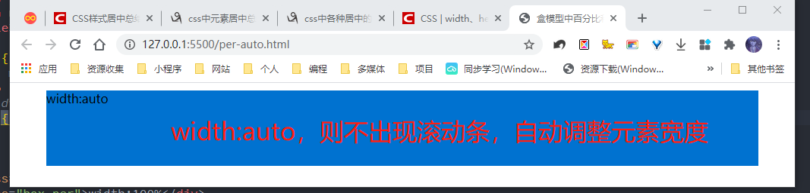
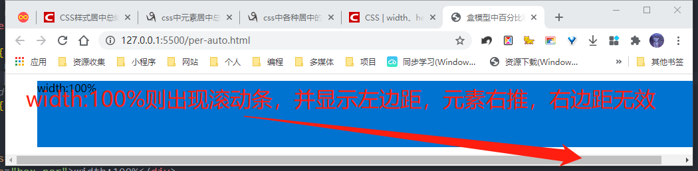
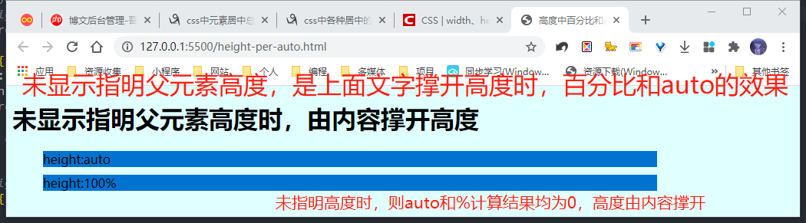
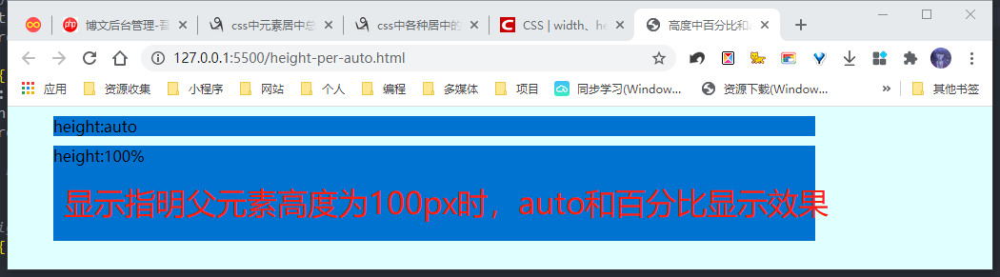
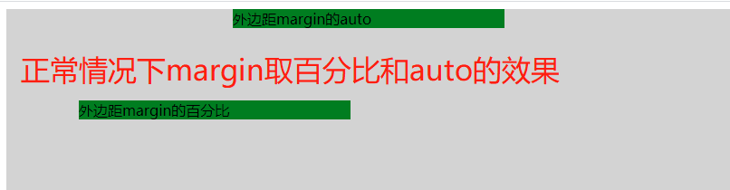
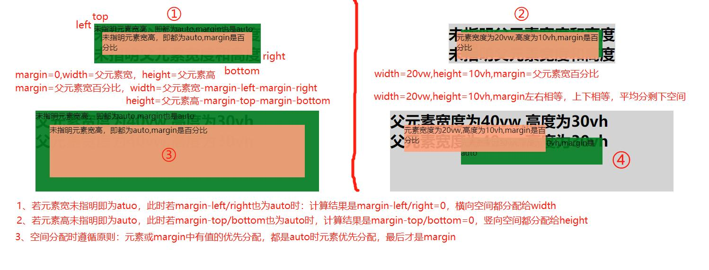

## 一、盒模型中百分比和auto

盒模型中属性值可以是数值、关键字、函数、百分比和auto等，本文重点探讨下常用的、非常相似的、都需要浏览器计算的的**百分比和auto** 。二者最大区别据某博文中总结是：**auto与子元素有关，100%与父元素有关。** 总体来说是正确的，但要修正一点就是**margin的auto是与父元素有关** 。下面是盒模型(只考虑 **块级元素** )中各属性对百分比和auto处理情况。

> **几点重要说明：**
>- **所有margin、padding默认清除** 即*{margin:0;padding:0}
>- 块级元素的**指明高度** 就是CSS中用height指明的，可以是固定值、相对值或根据父父元素的百分比计算到。记 **height-d** (d表示定义或设置之意)。
>- 块级元素的**内容高度** 顾名思义就是内容撑开的高度，记 **height-c**(c表示内容之意)
>- 块级元素的**真实高度** 就是在chrome开发者工具中盒模型的高度或用户在浏览器中所看到的高度。记 **height** 。
>- **height、height-d和height-c的关系:** 
>   - 不指定height时，height-d=0,而height-c是随内容增加而增加的,此时height=height-c。
>   - 指定了height时，height-d=指定高度，而height-c仍然是随内容增加而增加的，此时height=height-d。
>
> 下面在使用**高度概念**时要区分**这三个标记**，一定要看清上面的说明。


|盒模型相关属性|百分比(chrome测试过结论)|auto(chrome测试过结论)|
|:---------:|:---------------------|:--------------------|
|width|父元素宽度的百分比|width+margin+border+padding等于父元素宽度|
|height| 父元素指明高度height-d的百分比|计算结果为0，元素高度由内容撑开|
|margin|父元素宽度的百分比| **左右时** 是父元素宽度减去元素的宽度后左侧或最侧最大化分配。 **上下时** 则为0。|
|padding|父元素宽度的百分比|不支持|
|border|不支持|不支持|
|left|父元素宽度的百分比|left=0|
|right|父元素宽度的百分比|right=父元素宽-元素宽|
|top|父元素真实高度height的百分比|top=父元素内容高度height-c |
|bottom|父元素真实高度height的百分比|bottom=父元素真实高度height-元素真实高度height-top|

从上面可以看出只有盒模型中width、height和margin完全支持百分比和auto,所以本文主要探讨宽度、高度和外边距。


## 二、宽度和高度中百分比和auto

用户阅读习惯决定了CSS对待宽度和高度不同处理方式，即**宽度受限有最大宽度**，而**高度是可以滚动的没有最大高度**。一般来说最大宽度不大于设备横向最大尺寸。

> 宽度和高度的**默认值:** 都是auto,具体表现见上面表中说明的。 

### 1、宽度width中的百分比和auto

> #### 经典对比
> 1. width:auto，此时div的高度为100px,左右margin为40px,上下margin为10px;
> 2. width:100%，此时div的高度和左右margin同上

```html
<style>
    .box { height: 100px; margin: 10px 40px; background-color: #0072d0; }
    /* 1. width:auto */
    .auto { width: auto; }
    /* width:100% */
    .per { width: 100%; }
</style>
<body>
   <div class="box auto">width:auto</div>
   <div class="box per">width:100%</div>
</body>
```

### 两个效果




> #### 结论：
>- width为**auto**时，**width+左右两边的margi**n**为其**父元素的width** ，与其内容无关,会**占据一整行但是不会出现滚动条**。
>- width为 **100%** 时，**width的值**为其**父元素的width**，与margin无关，margin-left显示，margin-right没有显示。**100%时使用margin，出现滚动条**。

### 2、高度height中的百分比和auto

> #### 结论：
> 1. **高度为auto** 高度计算为0，内容撑开元素高度，与其父元素高度无关。
> 2. **高度为百分比%** 可根据本文开头测试过数据表中得出：**指明高度时有效，结果为指明高度height-d的百分比；而内容高度时无效，此时为0**。。

```html
<style>
    body { 
    /*指明高度  */
    /* height: 100px; */
    background-color: lightcyan;
    }
    .box {
    width: 800px;
    margin: 10px 40px;
    background-color: #0072d0;
    }
    /* 1. height:auto */
    .auto { height: auto;
    }
    /* height:100% */
    .per { height: 100%; }
</style>
<body>
<h1>未显示指明父元素高度时，由内容撑开高度</h1>
<div class="box auto">height:auto</div>
<div class="box per">height:100%</div>
</body>
```

### 两个效果





## 三、外边距margin中百分比和auto

> 正如本文开头所说，**外边距margin的百分比和auto是和父元素密切相关的** ，也是布局中常用的技巧，如常见的**水平居中和垂直居中**均可以借助margin来实现。

### 1、 正常情况下外边距的百分比和auto。

>- **1、左右外边距**
>   - 取值百分比时，是按**父元素宽度**计算。
>   - 取值auto时，若margin-left:auto则**父宽度减去元素宽度**全部分配给左边距，若margin-right为auto则同样全部分配给右边距，若左右为auto则平均分即水平居中。 
>- **2、上下外边距**
>   - 取值百分比时，仍然是按**父元素宽度**计算。
>   - 取值auto时，不论父元素是否指明高度，计算结果均为0。

```html
<style>
    .container {
    width: 800px;
    height: 600px;
    background-color: lightgray;
    }
    .box {
    width: 300px;
    background-color: #007d20;        
    }
    .auto{ margin:auto; }
    .per{ margin:10%; }
</style>
<div class="container">
    <div class="box auto">外边距margin的auto</div>
    <div class="box per">外边距margin的百分比</div>
</div>
```



### 2、 定位情况下外边距的百分比和auto

> 经典定位方案是：**父元素或容器相对定位，元素是绝对定位**。它们总是满足如下规律：
>- **父宽度=left+margin-left+元素宽度+margin-right+right**
>- **父真实高度height=top+margin-top+元素真实高度height+margin-bottom+bottom**
>
> 需要说明的是:
>- left、right、top和bottom取值百分比或auto时，计算结果见本文开头的表说明。
>- 在日常使用中left/right/top/bottom一般不用auto，可百分比、固定值或相对单位值。

``` html
* {
  margin: 0;
  padding: 0;
}
.wrapper {
  display: flex;
  justify-content: space-around;
  margin-top: 50px;
  margin-bottom: 100px;
}
/* 一、父元素未指定高度 */
.container {
  background-color: lightgray;
  position: relative;
}
/* 二、父元素指定高度 */
.con-fixed{
  width:40vw;
  height: 30vh;
}
/* 1.元素未指明宽和高，即都是width:auto；height:auto; */
.box {
  position: absolute;
  left: 0;
  top: 0;
  right: 0;
  bottom: 0;
}
/* 2.元素指明宽度 */
.box-fixed {
  width:20vw;
  height: 10vh;
}
/* margin百分比和auto */
.auto {
  background-color: #007d20;
  opacity: 0.9;
  margin: auto;
}
.per {
  background-color: lightsalmon;
  opacity: 0.9;
  margin: 5%;
}
</style>

<div class="wrapper">
  <div class="container">
    <h1>未指明父元素宽度和高度</h1>
    <h1>未指明父元素宽度和高度</h1>
    <div class="box auto">未指明元素宽高，即都为auto,margin也是auto</div>
    <div class="box per">未指明元素宽高，即都为auto,margin是百分比</div>
  </div>
  <div class="container">
    <h1>未指明父元素宽度和高度</h1>
    <h1>未指明父元素宽度和高度</h1>
    <div class="box box-fixed auto">元素宽度为20vw,高度为10vh,margin是auto</div>
    <div class="box box-fixed per">元素宽度为20vw,高度为10vh,margin是百分比</div>
  </div>
</div>
<div class="wrapper">
  <div class="container con-fixed">
    <h1>父元素宽度为40vw,高度为30vh</h1>
    <h1>父元素宽度为40vw,高度为30vh</h1>
    <div class="box auto">未指明元素宽高，即都为auto,margin也是auto</div>
    <div class="box per">未指明元素宽高，即都为auto,margin是百分比</div>
  </div>
  <div class="container con-fixed">
    <h1>父元素宽度为40vw,高度为30vh</h1>
    <h1>父元素宽度为40vw,高度为30vh</h1>
    <div class="box box-fixed auto">元素宽度为20vw,高度为10vh,margin是auto</div>
    <div class="box box-fixed per">元素宽度为20vw,高度为10vh,margin是百分比</div>
  </div>
</div>
```



> **空间分配原则:** 元素或margin中**有值的优先**分配给定值的空间，然后值都是auto时，**元素优先**分配空间，此时对应的横向或竖向的margin为0。若**只有margin是auto**时，则平均分配父元素减去元素的空间，就产生居中效果。

## 四、百分比和auto在块级元素的水平居中和垂直居中应用

### 1、 父元素或容器指明宽高

>- 元素也指明宽高时，left=right,top=bottom,margin=auto即可实现水平和垂直居中
>- 元素未指明宽高时，left=right,top=bottom,margin=auto或百分比都可实现水平和垂直居中，此时内容区域自适应。

### 2、 父元素或容器未指明宽高

>- 元素也指明宽高时，left=right,top=bottom,margin=auto即可实现水平和垂直居中
>- 元素未指明宽高时，left=right,top=bottom,margin=auto或百分比都可实现水平和垂直居中，此时内容区域自适应。

更多的居中技巧演示见参考文章中。


>参考文章
> 1. CSS | width、height中auto与100%与固定值有什么不同 <https://blog.csdn.net/R_banyan0820/article/details/80956848>
> 3. css中元素居中总结 <https://www.cnblogs.com/libin-1/p/5918477.html>