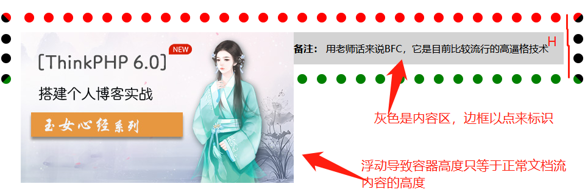
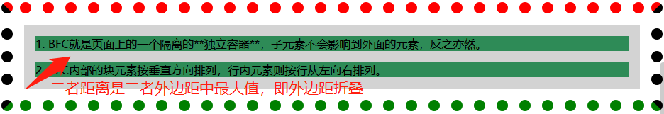
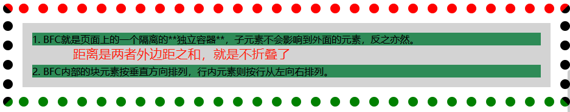
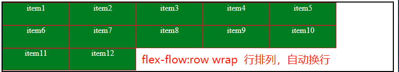
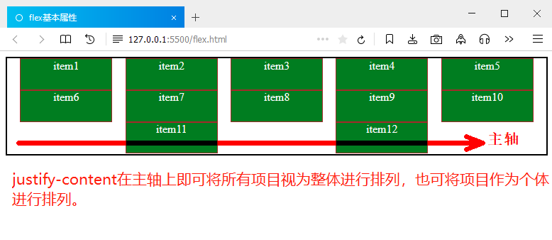
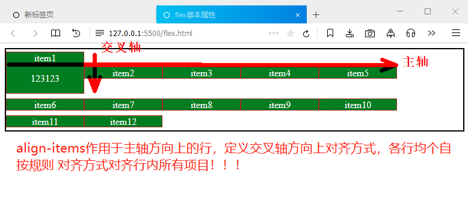
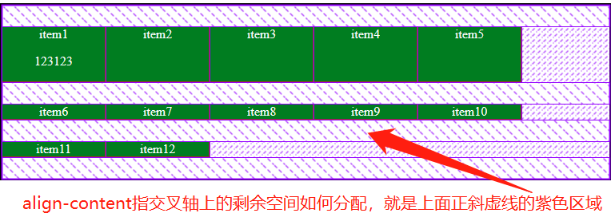
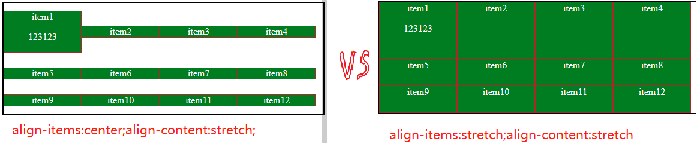
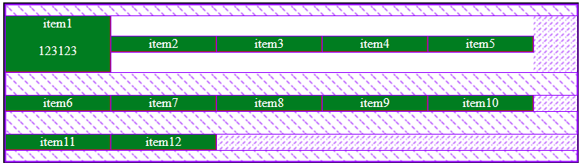
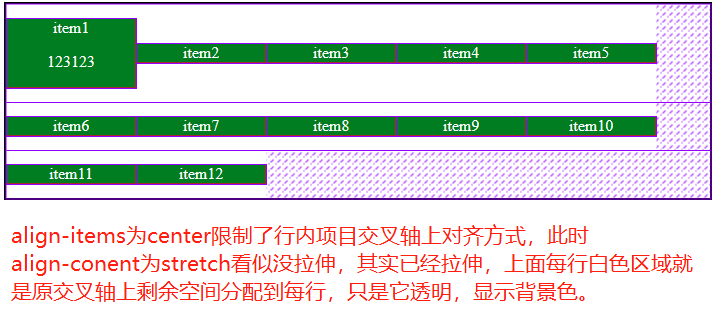

## 一、学习的新知识

今天朱老师讲了浮动float、由float的清除浮动引出了BFC，最后讲了flex布局基础知识，其中BFC对于我来说是新知识。

>- **BFC块格式化上下文(Block Formatting Context)** MDN或其它文章均有晦涩难懂的概念描述，朱老师描述是一个html页面中的一个**独立王国** , 有权接管内部的全部元素, 包括了"浮动元素"。

## 二、BFC探讨和三个用途演示

### 1、BFC特性

>1. BFC就是页面上的一个隔离的**独立容器**，子元素不会影响到外面的元素，反之亦然。
>2. BFC内部中块元素按垂直方向排列，行内元素则按行从左向右排列。
>3. BFC内部中最外层的**浮动盒子border的外边沿**和**BFC的padding内边沿**接触。。
>4. 计算**BFC高度**时，浮动元素也参与计算。 **解决了因浮动导致高度塌陷问题** 。
>5. 在**垂直方向上**，BFC中最外层**子元素的margin的外边沿**和**BFC的border的内边沿**接触。
>6. BFC与浮动元素不叠加，可解决浮动元素对布局的影响。

### 2、 创建BFC

>1. overflow: hidden / auto /scroll, 不能是visible;( **最常用的创建方式** )
>2. display:flex; display:grid;
>3. position:absolute / fixed;
>4. float:left / right , 不能 none;  */

### 3、用途一:解决子元素浮动导致高度塌陷问题

> 所谓**高度塌陷问题** 是指容器中某子元素由于浮动脱离了正常文档流，容器计算高度时不再包含浮动元素高度，若容器中其它内容组成的高度小于浮动元素高度就形成了高度塌陷。根据上面BFC特性4，给父容器指明BFC可解决容器内因子元素浮动导致高度塌陷问题。如下图所示塌陷



```html
<style>
.bfc {
  /* 创建BFC */
  overflow: hidden;
}
.container {
  border: 1em dotted;
  border-top-color: red;
  border-bottom-color: green;
  background-color: lightgray;
  background-clip: content-box;
  padding: 1em;
}
.box {
  float: left;
}
</style>
<div class="container bfc">
  <div class="box">
    
  </div>
  <p>
    <strong>备注：</strong>
    <span>用老师话来说BFC，它是目前比较流行的高逼格技术</span>
  </p>
</div>
```


### 4、用途二:解决外边距折叠问题

>- **会折叠的情况:**
>   - 相邻的盒子(包括同一个BFC内相邻盒子)
>   - 相邻的BFC或BFC与相邻的盒子
>   - 非BFC的父容器折叠最上边子元素的上边距，折叠最下边子元素的下边距(经过测试得来)
>- **不会折叠的情况:**
>   - BFC的父容器不折叠最上边子元素的上边距和最下边子元素的下边距
>   - 相邻BFC内各自最外边相邻的子元素，通俗讲就是A容器和B容器是BFC，A容器内最外边子元素a-box与B容器内最外边子元素b-box相邻，它们不折叠
>   - BFC内最外边的子元素与相邻的盒子外边距不折叠

```html
<style>
.bfc {
  /* 创建BFC */
  overflow: hidden;
}
.container {
  border: 1em dotted;
  border-top-color: red;
  border-bottom-color: green;
  background-color: lightgray;
  background-clip: content-box;
  padding: 1em;
}
.box1 > p {
  margin: 1em;
  background-color: seagreen;
}
</style>
<div class="container">
  <div class="box1 bfc"><p>1. BFC就是页面上的一个隔离的**独立容器**，子元素不会影响到外面的元素，反之亦然。</p>
  </div>
  <div class="box1 bfc"><p>2. BFC内部的块元素按垂直方向排列，行内元素则按行从左向右排列。</p></div>
</div>
```


### 5、用途三:解决浮动对布局的影响

在一个BFC中，如果存在一个float元素，和一个div，浮动元素会遮盖住div，此时，如果给这个div构建一个新的BFC，由于BFC特性，内外不相互影响，此时div会被float元素挤开。如图文混排就是典型的例子

```html
<style>
.bfc {
  /* 创建BFC */
  overflow: hidden;
}
.container {
  border: 1em dotted;
  border-top-color: red;
  border-bottom-color: green;
  background-color: lightgray;
  background-clip: content-box;
  padding: 1em;
}
.box { float: left; }
</style>
<div class="container bfc">
  <div class="box">
    
  </div>
  <div class="bfc">
    <p>
      本章课程是使用Thinkphp6.0框架去搭建个人博客，使用tp6的多应用模式搭建博客的前台后台，博客前台页面包括：博客首页，首页轮播，首页个人博客的无限极分类，用户登录与注册，博客详情页，博客评论，评论回复，评论的删除与隐藏等功能。数据表的设计包括博客文章分类表，博客评论表，后台RBAC权限控制表等。
      本章课程是使用Thinkphp6.0框架去搭建个人博客，使用tp6的多应用模式搭建博客的前台后台，博客前台页面包括：博客首页，首页轮播，首页个人博客的无限极分类，用户登录与注册，博客详情页，博客评论，评论回复，评论的删除与隐藏等功能。数据表的设计包括博客文章分类表，博客评论表，后台RBAC权限控制表等。
      本章课程是使用Thinkphp6.0框架去搭建个人博客，使用tp6的多应用模式搭建博客的前台后台，博客前台页面包括：博客首页，首页轮播，首页个人博客的无限极分类，用户登录与注册，博客详情页，博客评论，评论回复，评论的删除与隐藏等功能。数据表的设计包括博客文章分类表，博客评论表，后台RBAC权限控制表等。
    </p>
  </div>
</div>
```


### 6、 理解总结

>- 创建BFC是针对**父容器**，它划定独立王国的边界，如2个div相邻，外边距折叠了，此时在任何一个div上创建BFC，外边距仍然是折叠的。要给其中一个div套个父容器，指明其父容器为BFC才可以防止这2个div外边距折叠。
>- BFC内所有子孙元素(包括 **浮动元素** )都被限定在**内容区content**(为了显示 这个，上面案例中对背景进行裁切，灰色表示内容区，灰色与边距之间就是padding，它是透明的)，可以清除浮动给**布局和容器高度**的影响。而**定位元素**则不受BFC影响。
>- **垂直方向上的外边距折叠**一定要牢记：
>   - **相邻BFC父容器中子元素是不折叠的** 。
>   - **BFC父容器中最上边子元素或最下边子元素与外面盒子是不折叠的**。
>   - **BFC父容器与它内部的最上边子元素或最下边子元素是不折叠的** 。
>   - 相邻盒子或同一个MFC中相邻盒子外边距会折叠。
>   - 相邻的BFC或BFC与相邻的盒子外边距会折叠。
>   - 非BFC的父容器折叠最上边盒子的上边距，折叠最下边盒子的下边距

## 三、flex布局基本概念和基本属性

### 1、基本概念(术语)

>1. 容器: 具有`display:flex`属性元素，也称为弹性容器，就是包含弹性项目的父容器的简称。
>2. 项目: flex容器的"子元素"，也称弹性项目，首先是子元素，其次是它能会随父容器尺寸缩放。
>3. 主轴: 项目排列的轴线，主要有行row和列column两个方向。
>4. 交叉轴: 与主轴垂直的轴线，决定项目在主轴上排列不完时换行的方向。

### 2、基本属性

 **容器属性**

| 序号 | 属性              | 描述                       |
| ---- | ----------------- | -------------------------- |
| 1    | `flex-flow`       | 主轴方向与换行方式         |
| 2    | `justify-content` | 项目在主轴上的对齐方式     |
| 3    | `align-items`     | 项目在交叉轴上的对齐方式   |
| 4    | `align-content`   | 项目在多行容器中的对齐方式 |

---

 **项目属性**

| 序号 | 属性         | 描述                         |
| ---- | ------------ | ---------------------------- |
| 1    | `flex`       | 项目的缩放比例与基准宽度     |
| 3    | `align-self` | 单个项目在交叉轴上的对齐方式 |
| 4    | `order`      | 项目在主轴上排列顺序         |

### 3、 容器属性一:主轴方向和换行方式flex-flow

flex-flow简写是包括flex-direction和flex-wrap两个，在实际应用中我一般都是分开来写。主轴方向可取:row、column，row-reverse、column-reverse。而换行则分为换行wrap和不换行nowrap。

```html
/* 属性一:主轴方向和换行方式flex-flow
默认是水平方向row，不换行nowrap
*/
.container {
/* flex-flow: row wrap; */

/* flex-flow:column; */
/* flex-flow:column wrap; */

/* flex-flow:row-reverse wrap; */
flex-flow: column-reverse wrap;
}
```



### 4、 容器属性二:项目在主轴上的对齐方式justify-content

这里要说下以前我经常犯的错误就是认为justify-content是水平方向对齐方式，后来才明白，它是主轴对齐方式，是沿flex主轴方向上各项目对齐方式。它的本质是**将主轴的剩余空间在项目中进行分配** 。

> 分配两种模式:
>- **主轴方向上一行的所有项目为一个整体**,行内的所有项目相互挨着，将主轴的剩余空间分配到整体的两侧，若是多行则各行均按规则排列
>   - flex-start 紧贴起始线，默认值
>   - center 紧贴中间线
>   - flex-end 紧贴终止线
>- **主轴方向上一行的所有项目为个体** ,将主轴上的剩余空间分配给个体，若是多行则各行按规则排列。
>   - space-between 两端对齐: 剩余空间在"除了首尾项目之外"的每个项目之间进行平均分配
>   - space-around 分散对齐: 剩余空间在每个项目"两侧"进行平均分配
>   - space-evenly 两端对齐: 平均对齐: 剩余空间在每个项目"之间"进行平均分配
>
>> **总结:** 它定义了主轴方向上一行的所有项目的对齐方式，作用对象是**行内**。

```html
.container {
/* 1. 主轴方向上一行所有项目为一个整体 */
/* justify-content: flex-start; */
/* justify-content: flex-end; */
/* justify-content: center; */

/* 2. 主轴方向上一行的所有项目为个体 */
/* 两端对齐: 剩余空间在"除了首尾项目之外"的每个项目之间进行平均分配 */
/* justify-content: space-between; */
/* 分散对齐: 剩余空间在每个项目"二侧"进行平均分配 */
/* justify-content: space-around; */
/* 平均对齐: 剩余空间在每个项目"之间"进行平均分配 */
justify-content: space-evenly;
}
```



### 4、 容器属性三:项目在交叉轴上的对齐方式align-items

在交叉轴上，项目对齐方式默认值为stretch，会充满主轴方向上的一行容器的高度，即等高列。

> 取值说明：
>- stretch 主轴方向上一行的所有项目等高；若有多行则各行内的所有项目等高，各行之间的项目不一定等高。
>- flex-start 项目高度由项目内容决定，各行的项目顶部对齐
>- center     项目高度由项目内容决定，各行的项目中部对齐
>- flex-end   项目高度由项目内容决定，各行的项目底部对齐
>
> **总结:** 它定义了主轴方向上一行的所有项目在交叉轴方向上对齐方式，作用对象是**行内**。

```html
.container {
  /* align-items: baseline; */
  /* align-items: stretch; */
  /* align-items: flex-start; */
  /* align-items: flex-end; */
  align-items:center;
}
```



### 4、 容器属性四:项目在多行容器中的对齐方式align-content

align-content是定义主轴方向上各行在交叉轴上如何分配剩余空间，如果只有主轴上只有一行则无效

> 分配两种模式:
>- **交叉轴上所有行视为一个整体**,将交叉轴上的剩余空间分配到整体的两侧。
>   - stretch 默认值，轴线占满整个交叉轴，即缩放行高占满整个交叉轴
>   - flex-start 紧贴起始线
>   - center 紧贴中间线
>   - flex-end 紧贴终止线
>- **交叉轴上一行视为一个整体，各行视为个体** ,将交叉轴上的剩余空间分配给个体
>   - space-between 两端对齐: 剩余空间在"除了首尾项目之外"的每个项目之间进行平均分配
>   - space-around 分散对齐: 剩余空间在每个项目"两侧"进行平均分配
>   - space-evenly 两端对齐: 平均对齐: 剩余空间在每个项目"之间"进行平均分配
> **总结:** 它定义了交叉轴方向上各行分配剩余空间方式，作用对象是**各行**。

```html
.container{
  /* align-content: flex-start; */
  /* align-content: center; */
  /* align-content: flex-end; */
  /* align-content: stretch; */

  /* align-content: space-between; */
  /* align-content: space-around; */
  align-content:space-evenly;
}
```



### 5、stretch属性值探讨

stretch是align-items和align-content两者的默认值，本意是拉伸，前者是**将主轴上行内项目拉伸填满行**的剩余空间，而后者是**将交叉轴上各行拉伸填满交叉轴**上的剩余空间。但是若二者者设置时，尤其是align-items不是默认值进会出现如下图情况：



前者align-items设置为中间对齐，表面上看align-content设置为stretch拉伸没起作用，而后者则是我们想到的结果，拉伸填满交叉轴空间。如果我说前者其实也拉伸了行并且填满交叉轴空间，你相信吗，请先看firefox浏览器独有的的flex模式截图。



> **图中颜色区域意义:**
>- **项目:** **绿色有文字**，我设的项目背景色就是绿色
>- **项目主轴方向上剩余空间:** **紫色正斜虚线**标识的区域就是主轴方向上剩余空间
>- **项目交叉轴上剩余空间:**  **紫色反斜虚线**标识的区域就是交叉方向上剩余空间
>- **项目空间:** 项目空间包括两部分，一个是项目，它是看得见的，另一个是透明空间(在上图中就是在主为轴方向上一行中对齐项目的上部白色区域和下部白色区域)。主轴上一行**项目空间永远是等高**的。align-items=stretch时项目等于项目空间，其它时都小于或等于项目空间。

从上面stretch属性值探讨，更加深刻认识了align-items和align-content，此时再看下"align-items=center;align-content=stretch;"的flex模式图就好理解了。如下:



### 6、容器属性的归纳总结

> **justify-content和align-content:**
>- **相同点:**
>   - 都是**剩余空间的分配**。
>   - 都分成**两种分配方式** : **所有为一个整体**进行分配和**每个为个体**进行分配
>   - 相同属性值:flex-start、center和flex-end/space-between、space-around和space-evenly。
>- **不同点:**
>   - 前者是**主轴**方向,即 **"行内"**，后者是**交叉轴**方向,即 **"行间"** 。
>   - 前者是对**项目**分配空间，后者是**交叉轴上的行**分配空间
>   - 后者有个特殊属性值stretch拉伸。
>
> **align-items和align-content:**
>- **相同点:**
>   - 都是相对于交叉轴方向。
>- **不同点:**
>   - 前者是主轴方向上的**行内所有项目**在交叉轴上**对齐方式**，它作用于 **"行内"** ,后者是**交叉轴上各行项目空间分配剩余空间的方式**,它作用于 **各行**。
>   - 二者属性值**不为stretch**时，前者**项目高度小于等于项目空间高度**，按规则对齐各项目；后者**不拉伸项目空间**，只是**分配交叉轴上的剩余空间** 。
>   - 二者属性值**为stretch**时，前者**拉伸项目填满自己的项目空间**，后者则**拉伸行空间高度，填满交叉轴上剩余空间**。
>
> **简单记忆方式:** x-content是分配剩余空间，有整体和个体两种分配方式，有6个以上属性值；align-x是交叉轴上属性，align-items中items取item英文翻译项目，它是交叉轴上项目的对齐方式，而align-content则是行的分配方式。

## 四、学习后总结

>- **浮动float** ，老师讲了浮动float，它不再占据普通文档流空间, 但仍处于父级容器中，浮动元素会影响**父容器**中**它后面所有元素**的布局。元素浮动后自动转为块级元素。目前**清除浮动**影响方法一般有两种：一种就是在后面**增加空div或::after伪元素上添加样式clear:both**清除浮动，另一种就是**BFC闭合浮动**，将浮动限制在它内部,这样就不影响BFC外元素的布局。
>- **BFC** ，用老师话来讲，是非常高逼格的前端进阶技术，它的概念比较难懂，我们需要记得它的特性：**独立空间、父容器BFC、子元素都限制在padding内、子元素外边距都限制在border内**，能解决浮动元素带来的高度塌陷和布局的影响，能防止外边距折叠。
>- **flex弹性布局** ，flex也是BFC的一种，今天主要学习基本概念和基本属性，理解弹性就是它根据容器大小缩放项目尺寸适应变化。重点探讨了justify-content、align-items和align-content相同点和不同点，并通过firefox浏览器如何查看flex的各部分，更深入理解了flex的容器属性的意义。