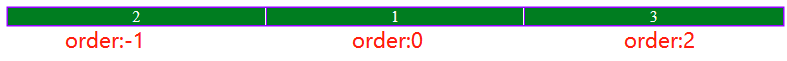

## 一、Flex项目属性

Flex属性分为容器属性和项目属性两大类，容器属性探讨见<https://www.php.cn/blog/detail/24616.html>，

### 1、项目属性一:flex(项目最重要的属性)

>- 只能用在**项目**中, 不能用在容器中
>- 语法格式: **放大因子 收缩因子 基准宽度** ,对应的英文flex-grow flex-shrink flex-basis。
>- **默认**项目**不放大,可收缩,宽度以width为准**,即**flex:0 1 auto**或**flex:initial**
>- **flex-grow放大因子:** 取值范围是大于或等于0的正数，**0表示不放大**，**其它正数则表示分配剩余空间时它占的比例** 。即所有项目放大之和为总的份数，它对应整个剩余空间，该项目的放大因子就是自己所占的份，除以总份数则乘以剩余空间就是它分配的大小。
>- **flex-shrink缩小因子:** 取值范围同放大，0也表示不缩小，其它正数则表示缩小的比例。和放大不同的是分配的整体缩小空间的比例。
>- **flex-basis基准宽度:** 取值可以是绝对值、相对值、百分比和auto，**auto时宽度为项目的宽度**。若**有值则覆盖项目的width** 。
>- **min-width和max-width** min-width限制了缩小的尺寸，而max-width则限制了放大的尺寸。

> **语法分类:**
> **1.三值语法**  就是语法中三个值都有，第一个放大比例，第二个缩小比例，第三个基准宽度。
> 如:flex:1 1 100px;
> **2.二值语法** 第一个值永远是放大因子, 区别在于第二个值:第二个值是一个没有单位的,表示"收缩因子"flex-shrink，若是百分比或有单位,则表示"基准宽度" */
> 如:flex: 1 3;  表示放大占1份，缩小放占3份
> 如:flex: 0 30%; 表示不放大，基准宽度为30%
> **3、单值语法** 最常用的,必须掌握
>   - **无单位，表示放大因子** 如flex:1，flex：3
>   - **有效的宽度，表示基准宽度,此时放大因子和缩小因子默认为1**  如flex:100px,flex:30%
>   - **关键字，表示三值语法的简称** 如flex:initial等于flex:0 1 auto，flex；auto则等于flex:1 1 auto。

```html
<style>
    .box{
        /* flex:0 1 auto; */
        /* flex:initial */
        /* flex:1 1 auto； */
        /* flex:auto; */
        /* flex:1 100px; */
        flex:1;
    }
    
</style>
<div class="container">
    <div class="box">1</div>
    <div class="box">2</div>
    <div class="box">3</div>
</div>
```
### 2、项目属性二:order(项目排序)

项目排序在flex的容器属性中flex-direction中只定义两种： **正序和逆序** 。而项目的order则可以指定项目的**任意排序** 。

> **排序注意事项:**
>- **order取值是整数** ,正整数和负整数均可以,默认值为0。
>- order值**越小越靠近起始线** ， **越大越靠近终止线** 。
>- **order相等**时则按项目**源码顺序排序** 。
>- 起始线和终止线是随着flex-direction变化的。具体见下表

|flex方向|起始线|终止线|
|:------:|:---:|:---:|
|row|左|右|
|row-reverse|右|左|
|column|上|下|
|column-reverse|下|上|

```html
.container .box:first-child{ order:0; }
.container .box:nth-child(2){ order:-1; }
.container .box:last-child{ order:2; }
```



### 3、项目属性三:align-self

align-self设置某个项目在交叉轴上的对齐方式,而align-items则设置主轴方向上一行所有项目在交叉轴的对齐方式。取值和意思同align-items。比较简单就不再细说了。

## 二、flex实现PC端的响应式页面

> **实现目标:**
> 1. flex布局，适应PC、平板和手机
> 2. 导航栏根据尺寸调整两种状态

```html
<style>
/* 清除样式 */
* {
margin: 0;
padding: 0;
border: none;
outline: none;
box-sizing: border-box;
}
a {
text-decoration: none;
color: #666;
}
li {
list-style: none;
}

/* 定义基本样式 */
.container {
width: 100vw;
height: 100vh;
color: #666;
}
#header {
position: fixed;
width: 100%;
height: 80px;
line-height: 80px;
color: white;
background-color: rgba(0, 202, 175, 0.75);
transition: height 0.3s ease-in;

display: flex;
justify-content: space-around;
align-items: center;
}

.nav {
min-width: 60vw;
height: 100%;
display: flex;
justify-content: space-evenly;
text-align: center;

font-size: 1.1em;
}

.nav li a {
color: white;
}

.topRight {
height: 100%;
display: flex;
justify-content: space-around;
align-items: center;
}
.topMenu {
visibility: hidden;
width: 36px;
height: 36px;
border-radius: 5px;
background-color: white;
margin-left: 0.5em;

display: flex;
flex-flow: column;
justify-content: space-evenly;
align-items: center;
}

.topMenu span {
width: 80%;
height: 3px;
background-color: rgb(0, 202, 175);
}

.closeMenu {
display: none;
}

.closeMenu span:first-child {
margin-top: 3px;
transform: rotate(45deg);
}
.closeMenu span:last-child {
margin-top: -18px;
transform: rotate(-45deg);
}

/* 主体区 */
/* 图片使用vmax效果非常好 */
.banner > img {
width: 100%;
height: 30vmax;
}
.content{
    display: flex;
    flex-flow: column nowrap;
    align-items: center;
}
.content h2{
    font-size: 2em;
}
.content h2::before{
    content:'-----     ';
}
.content h2::after{
    content:'   -------';
}
.content .goods{
    margin-top: 2em;
    width: 100%;
    display: flex; 
    flex-flow: row wrap;
    justify-content: space-evenly;         
}
.goods a{
    flex:0 1 20vw;
    text-align: center;
    padding: 1em 2em;
    background-color: #eee;
    box-shadow: 1px 1px 3px black;
    margin-bottom: 1em;
}

/* 页脚 */
footer {
display: flex;
flex-flow: column nowrap;
text-align: center;
background-color:#333;

}

/* 媒人查询实现响应式 */
@media screen and (min-width: 800px) {
.nav li {
    flex: 1 1 auto;
    height: 100%;
    border-bottom: 1px solid transparent;
}
.nav li a {
    padding: 0.5em 1em;
    border-radius: 0.5em;
}
.nav li:hover a {
    background-color: whitesmoke;
    color: #007d20;
}
.nav li:hover {
    border-bottom-color: red;
}
}

@media screen and (max-width: 800px) {
#header {
    justify-content: space-between;
    height: 58px;
    line-height: 58px;
    padding: 0 1em;
}
.nav {
    display: none;
    position: fixed;
    left: 0;
    top: 58px;
    bottom: 0;
    min-width: 30vw;
    background-color: rgba(0, 202, 175, 0.75);
    transition: width 0.3s ease-in;

    flex-flow: column nowrap;
    justify-content: initial;
}
.nav li {
    flex: initial;
}
.nav li a {
    padding: initial;
}
.topMenu {
    visibility: visible;
}
.nav li:hover a {
    color: #007d20;
}
.nav li:hover {
    background-color: white;
}
}

/* target核心代码 */
#header:target .nav {
display: flex;
}

#header:target .openMenu {
display: none;
}

#header:target .closeMenu {
display: inline-flex;
}
</style>
<div class="container">
    <!-- 顶部 -->
    <header id="header">
    <h2>PC响应式页面</h2>
    <ul class="nav">
        <li><a href="">首页</a></li>
        <li><a href="">关于我们</a></li>
        <li><a href="">最新要闻</a></li>
        <li><a href="">加入我们</a></li>
    </ul>
    <div class="topRight">
        <a class="topMenu openMenu" href="#header">
        <span></span>
        <span></span>
        <span></span>
        </a>
        <a class="topMenu closeMenu" href="#">
        <span></span>
        <span></span>
        </a>
    </div>
    </header>

    <!-- 主体区 -->
    <div class="main">
    <div class="banner">
        
    </div>
    <div class="content">
        <h2>热销商品</h2>
        <div class="goods">
        <a href=""></a>
        <a href=""></a>
        <a href=""></a>
        </div>
    </div>
    </div>

    <!-- 底部 -->
    <footer>
    <p>
        php中文网&copy;版权所有(2015-2022) | 备案号:
        <a href="">皖ICP-150********</a>
    </p>
    <p>中国.合肥政务新区置地广场 | 电话: 0551-888999**</p>
    </footer>
</div>
```


### Codepen演示 <https://codepen.io/woxiaoyao81/pen/eYzVLOG>

## 三、学习的总结

>- flex盒子其实将所有 **"子元素"** 转换成BFC式行内块进行排版布局。它属于一维布局。非常适合一行或一列的排版。后面要学的grid则相当于flex和table二者结合，在二维空间进行布局。
>- 布局中为了渐变效果要使用transition，以后我准备总结，其实入门比较简单
>- 上面PC端布局中使用伪类:target和:not实现菜单点击弹出侧边栏效果，是CSS3新增加的特性，本想使用JS实现，但没学，结果在CSS3中找到方法，它同样适用于tab标签、显示隐藏圣诞框等，具体可见我的博文<https://www.php.cn/blog/detail/24645.html>
>- 另个布局中页面元素经常要居中，我对它进行了梳理总结，可以看我的博文<https://www.php.cn/blog/detail/24646.html>
