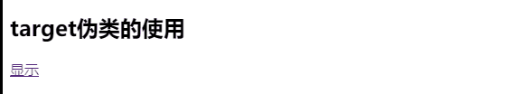
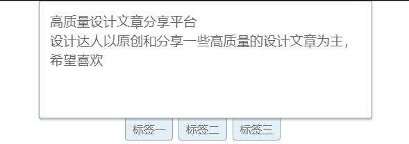
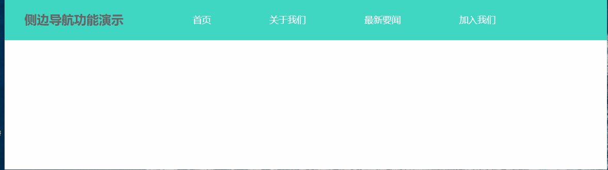
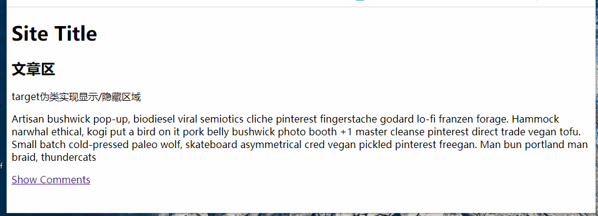
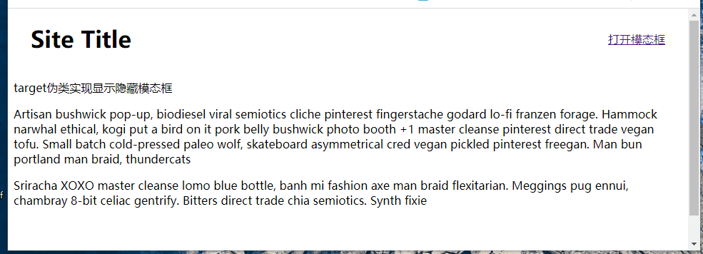

## 一、关于伪类

伪类英文是pseudo-class。通常选择器不能表现HTML元素的状态或特征，我们可以在CSS选择器上添加伪类表示元素的**状态、特征** 。伪类名写在选择器的:冒号后面，必要时可以添加(),例如：#comments:not(:target)。CSS3为了区分伪类和伪元素规定，:冒号是伪类，::双冒号是伪元素，为了兼容CSS2有时伪元素也用:冒号。

结构性伪类x-child和x-of-type是表示子元素位置特征，详细探讨见我的博文<https://www.php.cn/blog/detail/24455.html>,而状态性伪类如悬停hover、激活active和访问过visited则表示元素状态，它们在CSS定义时要注意源码顺序，因为元素状态是有先后的。

今天在学习Flex布局后想实现响应式布局时，遇到了想单击菜单弹出侧边导航栏的问题，本想用js解决，但看到网上有CSS解决方案，就学习了，发现CSS3还真是强大。当然这是CSS3才有的功能。CSS3增加了:target伪类，结合排除伪类:not()就可以实现非常强大功能。


## 二、排除伪类:not()

伪类:not()，即排除或否定伪类。它在大量子元素中选择除了某元素外所有非常有效，如导航栏中选择除Logo元素以外所有元素就很方便。

>- **括号()中是选择器** ，可以是**标签、类或ID，当然包括伪类**。如:not(:first-child){}。
>- 伪类可以**级联**形成**交集** ，目前我接触的结构伪类、状态伪类和排除伪类都可以级联的，如.box a:hover:not(first-child){}。
>- **排除伪类不增加优先级** ，这点和其它伪类不一样，如#foo:not(#bar)和#foo二者优先级相同。

例子:.content :not(.notice) em 
解释：匹配了.content 中所有的 em 元素，但是排除了 .content .notice 中 em 元素

## 三、目标伪类:target

:target伪类用来指定那些包含片段标识符的URL的目标元素样式。前面是MDN解释，相信看了还是很难懂，下面是我对它的理解：

> **常见构成:** 分成三部分
> 1.有**ID的容器** ,最终是要定义这个ID容器的CSS样式。如ID为rightMenu。
> 2.有一个**a链接元素** ，其 **href值为"#ID"** 形式。它对应#ID:target选择器。
> 3.还有一个**a链接元素** ，其 **href值为"#"** 形式。它对应#ID:not(:target)选择器。
>
> **特别说明:** 后两个链接元素和ID容器的位置关系是任意的，即**2个链接元素都可在ID容器内，也可以不在容器内** 。

```html
<style>
  /* 第一个链接元素被点击时，定义ID容器中子元素样式 */
  #container:target h2 {
    color:seagreen
  }
  #container:target .show {
    display: none;
  }
  #container:target .hide {
    display: inline-block;
  }
  /* 第二个链接元素被点击时，定义ID容器中子元素样式 */
  #container:not(:target) h2 {
    color:initial;
  }
  #container:not(:target) .show {
    display: inline-block;
  }
  #container:not(:target) .hide {
    display: none;
  }
</style>
<div class="container" id="container">
  <h2>target伪类的使用</h2>
  <a class="show" href="#container">显示</a>
  <a class="hide" href="#">隐藏</a>
</div>
```



### Codepen演示 <https://codepen.io/woxiaoyao81/pen/yLJvvBR>

从上不难看出，它其实就是HTML中**锚点** ，锚点功能是在**同一个页面内位置跳转**。不过加了CSS3的:target伪类后，在CSS中则可以**定义其它选择器的样式** ，这个以前是JS的专利，现在CSS3也可以实现了。它常见应用是Tab标签、显示/隐藏屏幕侧边导航栏、显示/隐藏区域和显示/隐藏模态框,这些常用而简单功能，在以前不得不用JS，现在CSS3就可以实现了。下面将实例说明。

## 四、伪类:target实现tab标签

:target伪类最常用的应用就是tab标签了，所有链接元素都放在ID容器外，并且只需要使用常规的#ID:target选择即可。

```html
<style>
  /* 位置关系：target伪类实现tab标签时，a链接元素一般在ID容器外 */
  /* Tab标签一般只用到:target伪类即可，不需要:not(:target)配合 */

  /* 清除样式 */
  * {
    margin: 0;
    padding: 0;
    border: none;
    outline: none;
    box-sizing: border-box;
  }
  a {
    text-decoration: none;
    color: #666;
  }
  li{
    list-style: none;
  }

  /* 定义基本样式 */
  .container {
    position: relative;
    width: 30em;
    margin:auto;
    height: 200px;
    color:#666;
  }
  .tabmenu {
    width: 100%;
    position: absolute;
    top: 175px;
    display: flex;
    justify-content: center;
  }
  .tabmenu li a {
    padding:0.3em 0.6em;
    margin-right:0.5em;
    border: 1px solid #91a7b4;
    border-radius: 0 0 0.3em 0.3em;
    background: #e3f1f8;
  }
  .tabmenu li a:hover{
    color:white;
    background-color: #007d20;
  }
  .tabmenu li a:active{
    color:white;
    background-color: #007d20;
  }
  .tab_content {
    position: absolute;
    width: 100%;
    height: 170px;
    padding: 15px;
    border: 1px solid #91a7b4;
    border-radius: 3px;
    box-shadow: 0 2px 3px rgba(0, 0, 0, 0.1);
    font-size: 1.2em;
    line-height: 1.5em;
    background: #fff;
  }


  /* target伪类定义的样式 */
  #tab1:target,
  #tab2:target,
  #tab3:target {
    z-index: 1;
  }
</style>
<div class="container">
  <ul class="tabmenu">
    <li><a href="#tab1">标签一</a></li>
    <li><a href="#tab2">标签二</a></li>
    <li><a href="#tab3">标签三</a></li>
  </ul>
  <div id="tab1" class="tab_content">
    <p>欢迎加设计达人</p>        
    设计达人以原创和分享一些高质量的设计文章为主，希望喜欢！
    <!-- end tab1 content -->
  </div>
  <div id="tab2" class="tab_content">
    <p>本Tab切换效果纯CSS3制作，无任何JavaScript</p>
    爱设计，爱分享——设计达人
    <!-- end tab2 content-->
  </div>
  <div id="tab3" class="tab_content">
    <p>高质量设计文章分享平台</p>
      设计达人以原创和分享一些高质量的设计文章为主，希望喜欢
    <!-- end tab3 content-->
  </div>
</div>
```



### Codepen演示  <https://codepen.io/woxiaoyao81/pen/OJXQQmQ>

## 五、伪类:target实现显示/隐藏屏幕侧边导航栏

target伪类实现显示/隐藏屏幕侧边导航栏算是比较复杂的了，掌握了就基本掌握target伪类的用法了。它和tab标签不同的是**a链接元素都在ID容器内** ，通过ID来定义子元素样式，从而实现**一个元素状态另一个元素样式的效果**,并且需要**:target伪类和:not(:target)配合** 。

```html
<style>
/* 清除样式 */
* {
margin: 0;
padding: 0;
border: none;
outline: none;
box-sizing: border-box;
}
a {
text-decoration: none;
color: #666;
}
li {
list-style: none;
}

/* 定义基本样式 */
.container {
width: 100vw;
height: 100vh;
overflow: hidden;
color: #666;
}
#header {
width: 100%;
height: 80px;
line-height: 80px;
background-color: rgba(0, 202, 175, 0.75);
transition: height 0.3s ease-in;

display: flex;
justify-content: space-around;
align-items: center;
}

.nav {
min-width: 60vw;
height: 100%;
display: flex;
justify-content: space-evenly;
text-align: center;

font-size: 1.1em;
}

.nav li a {
color: white;
}

.topRight {
height: 100%;
display: flex;
justify-content: space-around;
align-items: center;
}
.topMenu {
visibility: hidden;
width: 36px;
height: 36px;
border-radius: 5px;
background-color: white;
margin-left: 0.5em;

display: flex;
flex-flow: column;
justify-content: space-evenly;
align-items: center;
}

.topMenu span {
width: 80%;
height: 3px;
background-color: rgb(0, 202, 175);
}

.closeMenu {
display: none;
}

.closeMenu span:first-child {
margin-top: 3px;
transform: rotate(45deg);
}
.closeMenu span:last-child {
margin-top: -18px;
transform: rotate(-45deg);
}

@media screen and (min-width: 800px) {
.nav li {
    flex: 1 1 auto;
    height: 100%;
    border-bottom: 1px solid transparent;
}
.nav li a {
    padding: 0.5em 1em;
    border-radius: 0.5em;
}
.nav li:hover a {
    background-color: whitesmoke;
    color: #007d20;
}
.nav li:hover {
    border-bottom-color: red;
}
}

@media screen and (max-width: 800px) {
#header {
    justify-content: space-between;
    height: 58px;
    line-height: 58px;
    padding: 0 1em;
}
.nav {
    display: none;
    position: fixed;
    left: 0;
    top: 58px;
    bottom: 0;
    min-width: 30vw;
    background-color: rgba(0, 202, 175, 0.75);
    transition: width 0.3s ease-in;

    flex-flow: column nowrap;
    justify-content: initial;
}
.nav li {
    flex: initial;
}
.nav li a {
    padding: initial;
}
.topMenu {
    visibility: visible;
}
.nav li:hover a {
    color: #007d20;
}
.nav li:hover {
    background-color: white;
}
}

/* target核心代码 */
#header:target .nav {
display: flex;
}

#header:target .openMenu {
display: none;
}

#header:target .closeMenu {
display: inline-flex;
}
</style>
<div class="container">
    <header id="header">
    <h2>侧边导航功能演示</h2>
    <ul class="nav">
        <li><a href="">首页</a></li>
        <li><a href="">关于我们</a></li>
        <li><a href="">最新要闻</a></li>
        <li><a href="">加入我们</a></li>
    </ul>
    <div class="topRight">
        <a class="topMenu openMenu" href="#header">
        <span></span>
        <span></span>
        <span></span>
        </a>
        <a class="topMenu closeMenu" href="#">
        <span></span>
        <span></span>
        </a>
    </div>
    </header>
</div>
```



### Codpen演示 <https://codepen.io/woxiaoyao81/pen/JjKpLYJ>

## 六、伪类:target实现显示/隐藏区域

学习了target显示/隐藏屏幕侧边导航栏后，后两个就好实现了，主要就是利用:target伪类和:not(:target)达到不同样式效果。与上面最大不同就是**a链接元素一个在ID容器外，另一个外在ID容器内** 。由于比较简单就不演示了，自己可以复制源码测试。

```html
<style>
    #comments {
    padding-top: 2em;
    }
    #comments:not(:target) {
    display: none;
    }
    #comments:target {
    display: block;
    }
</style>
<header>
    <div class="wrapper">
    <h1>Site Title</h1>
    </div>
</header>

<div class="wrapper body-wrapper">
    <h2>文章区</h2>      
    <p>文章区文章区文章区</p>
    <p>文章区文章区文章区文章区文章区文章区</p>
    <a href="#comments">Show Comments</a>
    <section id="comments">
        <hr>
    <h3>评论区</h3>
    <p>target伪类实现显示/隐藏区域</p>
    <br />
    <p>target伪类实现显示/隐藏区域</p>
    <br />
    <p>target伪类实现显示/隐藏区域</p>
    <br />
    <p>target伪类实现显示/隐藏区域</p>
    <br />
    <a href="#">Hide Comments</a>
    </section>
</div>
```


## 七、伪类:target实现显示/隐藏模态框

同上，比较简单就不演示了，自己可以复制源码测试。

```html
header {
background: #fff;
margin-bottom: 30px;
position: fixed;
top: 0;
left: 0;
width: 100%;
}
header .wrapper {
display: flex;
justify-content: space-between;
align-items: center;
padding:0 2em;
}
.body-wrapper {
margin-top: 100px;
margin-bottom: 100px;
}
#modal-container {
position: fixed;
top: 0;
left: 0;
width: 100%;
height: 100%;
background: rgba(0, 0, 0, 0.8);
justify-content: center;
align-items: center;
display: flex;
}
.modal {
width: 70%;
background: #fff;
padding: 20px;
text-align: center;
}
#modal-container:not(:target) {
opacity: 0;
visibility: hidden;
transition: opacity 1s, visibility 1s;
}
#modal-container:target {
opacity: 1;
visibility: visible;
transition: opacity 1s, visibility 1s;
}
<header>
    <div class="wrapper">
    <h1>Site Title</h1>
    <a href="#modal-container" aria-label="Open Navigation">打开模态框</a>
    </div>
</header>

<div class="wrapper body-wrapper"> 
    <p>
   target伪类实现显示隐藏模态框
    </p>
    <p>
   target伪类实现显示隐藏模态框
    </p>
    <p>
    target伪类实现显示隐藏模态框
    </p>
</div>

<div id="modal-container">
    <div class="modal">
    <h2>Modal Title</h2>
    <p>
        Sriracha XOXO master cleanse lomo blue bottle, banh mi fashion axe man braid flexitarian. Meggings pug ennui, chambray 8-bit celiac gentrify. Bitters direct trade chia semiotics. Synth fixie
        mixtape, health goth four dollar toast vinyl 3 wolf moon VHS schlitz. Drinking vinegar letterpress VHS poutine, venmo cronut distillery artisan. Everyday carry craft beer butcher DIY.
        Normcore affogato chillwave, thundercats banh mi fingerstache keytar pop-up four loko four dollar toast.
    </p>
    <a href="#" aria-label="Open Navigation">关闭模态框</a>
    </div>
</div>
```



## 八、总结

>- a链接元素 **"锚点"** 是页面内跳转常用功能，常用于目录跳转页面。
>- 锚点结合CSS3的**target伪类** ，再加上 **伪类:not()** 配合可以实现简单JS交互效果。可以实现tab标签、屏幕侧边栏、弹出对话框等。
>- target伪类通过父容器ID可以操纵其子元素的样式，从而实现了**一个元素状态影响另一个元素的样式**的效果。