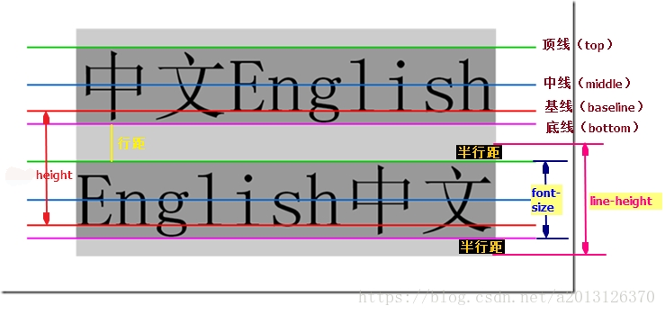
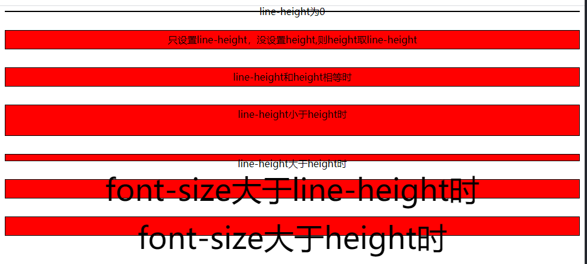

## 一、页面元素居中的基础认识

相信页面元素居中是大家常用的需要，那么你有研究过怎么居中吗，首先我们要知道页面页面居中几个基础概念。

>- **容器:** 其实它是Html中元素，不过只有**块级元素**和**行内块元素**才可当容器。
>- **元素:** 就是要居中的对象，可以是**行内元素、行内块元素和块级元素**。
>- **元素类型** W3C定义了常用元素的类型，我们也可以通过**display重新定义它的类型** ，如a链接元素默认是行内元素，可以定义它为行内块元素或块级元素。目前浮动float、定位position、table盒子(是display:table，而不是table元素)、flex盒子和grid盒子都默认将**子元素转化为行内块元素** ，不论它之前是行内元素还是块级元素。
>- **img元素** 为什么单独提它，是因为百度时有人说它是**行内块元素** ，因为它可以设置宽度和高度，有人说它是**行内元素** ，因为在样式中显示inline(通过chrome开发者工具的Styles)，那么到底它是什么类型？**通过我实际测试，它呈现出来的是行内块元素特性** 。虽然chrome开发者工具Styles显示它是inline行内元素，开始居中时就受它的误导。正如盒模型box-sizing:content-box一样，W3C开始定义的不被设计所接受，反而微软IE盒子(box-sizing:border-box)被大众所接受一样，它可能还要重新定义。

## 二、height和line-height二者的探讨

在说居中之前，我们必须弄清height和line-height二者区别，才有更好理解行内元素和行内块元素剧中的实现。



**行高是指文本行基线间的垂直距离** , **基线**(base line)并不是汉字文字的下端沿，而是**英文字母“x”的下端沿**。上图中**两条红线之间的距离就是行高Height** ，上行的底线和下一行顶线之间的距离就是**行距**，而同一行**顶线和底线之间的距离是font-size的大小** ，行距的一半是半行距。下面演示了font-size、height和line-height的关系

```html
<style>
    .test {
    margin-bottom: 30px;
    text-align: center;
    border: 1px solid black;
    background: red;
    }
    .test1 {
    line-height: 0;
    }
    .test2 {
    line-height: 30px;
    }
    .test3 {
    height: 30px;
    line-height: 30px;
    }
    .test4 {
    height: 50px;
    line-height: 30px;
    }
    .test5 {
    height: 10px;
    line-height: 30px;
    }
    .test6{
        font-size: 50px;
        line-height: 30px;
    }
    .test7{
        font-size: 50px;
        height: 30px;
    }
</style>
<div class="test test1">line-height为0</div>
<div class="test test2">只设置line-height，没设置height,则height取line-height</div>
<div class="test test3">line-height和height相等时</div>
<div class="test test4">line-height小于height时</div>
<div class="test test5">line-height大于height时</div>
<div class="test test6">font-size大于line-height时</div>
<div class="test test7">font-size大于height时</div>
```



> **高度和行高总结:**
>- **line-height是透明的** ，它决定内容垂直对齐方式，默认是baseline。
>- **height是受背景色影响的** 
>- **垂直居中** 其实vertical-align等于middle就居中了，而我们平常所说的垂直居中是**视觉居中** 。就是height和line-height相等时，它们区域重叠，此时垂直居中就在视觉上也居中了。

> **特别说明:** line-height是**继承属性**，就时说它会**继承父元素的line-height** 。

## 三、行内元素和行内块元素居中探讨

有了上面基础认识后，再说行内元素和行内块元素居中就好理解多了。行内元素和行内块元素居中涉及三个属性:text-align、line-height和vertical-align。下面是我总结的

>- **水平居中:** 无论是行内元素或行内块元素，水平居中只要 **容器(父元素)** 的text-align:center就可以了。
>- **垂直居中:** 分为行内元素和行内块元素
>   - 行内元素垂直居中:容器(父元素)的**line-height等于其的高度height**就实现垂直居中。
>   - 行内块元素垂直居中:①同行内元素垂直居中，将容器line-height等于其height②行内块元素设置vertical-align:middle就实现了垂直居中。

```html
<style>
  * {
    margin: 0;
    padding: 0;
    border: none;
    outline: none;
    box-sizing: border-box;
  }
  .container {
    width: 100vw;
    height: 100vh;
    color: #333;
  }
  .box {
    margin-bottom: 2em;
  }
  /* 行内元素水平居中和垂直居中 */
  .box p {
    background-color: cadetblue;
    height: 10em;
    text-align: center;
    line-height: 10em;
  }
  .box .in-block {
    width: 50vw;
  }
  /* 图片垂直居中 */
  img {
    vertical-align: middle;
  }
</style>
<div class="container">
  <div class="box">
    <p class=""><span>页面元素居中方法探讨</span></p>
  </div>
  <div class="box">
    <p class="in-block"><span>页面元素居中方法探讨</span></p>
  </div>
  <div class="box">
    <p class="">
      
    </p>
  </div>
  <div class="box">
    <p class="in-block">
      
    </p>
  </div>
</div>
```


## 四、块级元素居中探讨

块级元素水平居中一般是margin:auto闵可以了，垂直居中先介绍下定位实现的垂直居中,详细分析见我的博文<https://www.php.cn/blog/detail/24594.html>

```html
* {
  margin: 0;
  padding: 0;
}
.wrapper {
  display: flex;
  justify-content: space-around;
  margin-top: 50px;
  margin-bottom: 100px;
}
/* 一、父元素未指定高度 */
.container {
  background-color: lightgray;
  position: relative;
}
/* 二、父元素指定高度 */
.con-fixed{
  width:40vw;
  height: 30vh;
}
/* 1.元素未指明宽和高，即都是width:auto；height:auto; */
.box {
  position: absolute;
  left: 0;
  top: 0;
  right: 0;
  bottom: 0;
}
/* 2.元素指明宽度 */
.box-fixed {
  width:20vw;
  height: 10vh;
}
/* margin百分比和auto */
.auto {
  background-color: #007d20;
  opacity: 0.9;
  margin: auto;
}
.per {
  background-color: lightsalmon;
  opacity: 0.9;
  margin: 5%;
}
</style>
<div class="wrapper">
  <div class="container">
    <h1>未指明父元素宽度和高度</h1>
    <h1>未指明父元素宽度和高度</h1>
    <div class="box auto">未指明元素宽高，即都为auto,margin也是auto</div>
    <div class="box per">未指明元素宽高，即都为auto,margin是百分比</div>
  </div>
  <div class="container">
    <h1>未指明父元素宽度和高度</h1>
    <h1>未指明父元素宽度和高度</h1>
    <div class="box box-fixed auto">元素宽度为20vw,高度为10vh,margin是auto</div>
    <div class="box box-fixed per">元素宽度为20vw,高度为10vh,margin是百分比</div>
  </div>
</div>
<div class="wrapper">
  <div class="container con-fixed">
    <h1>父元素宽度为40vw,高度为30vh</h1>
    <h1>父元素宽度为40vw,高度为30vh</h1>
    <div class="box auto">未指明元素宽高，即都为auto,margin也是auto</div>
    <div class="box per">未指明元素宽高，即都为auto,margin是百分比</div>
  </div>
  <div class="container con-fixed">
    <h1>父元素宽度为40vw,高度为30vh</h1>
    <h1>父元素宽度为40vw,高度为30vh</h1>
    <div class="box box-fixed auto">元素宽度为20vw,高度为10vh,margin是auto</div>
    <div class="box box-fixed per">元素宽度为20vw,高度为10vh,margin是百分比</div>
  </div>
</div>
```


## 五、table盒子、flex盒子和grid盒子实现居中

正如开始所说table盒子、flex盒子和grid盒子将子元素转化为行内块元素，但它们的居中了除了table盒子外建议不要使用vertical-align，我也没测试，因为它们本身居中属性。

flex居中看我的博文<https://www.php.cn/blog/detail/24616.html>
grid居中目前还没写，可以关注我的博客
再推荐一篇我写的博文《盒模型中的百分比和auto探讨及居中的应用》<https://www.php.cn/blog/detail/24594.html> ，其中探讨了单位，也探讨了部分居中问题。

## 六、居中总结

写了这么多方法，相信你和我一样有点模糊，什么时候用那个要怎么介定，其实这个问题是在我去饭堂路上的想到的，这里说下我的总结：

>- **居中方式:** 分为**普通文档流居中**和**非普通文档流居中**
>   - **普通文档流居中:** 使用普通文档流中**对齐属性** ，常见如text-align、line-height、vertical-align和margin。
>   - **非普通文档流居中:** 当元素脱离普通文档流后，再**单独使用上面对齐属性就达不到居中效果**了，此时需要**结合转变成非普通文档流的方式的相应属性**，如定位中left、top等、flex和grid的对齐属性。
>
>- **几个特例:**
>   - **块级元素** 块级元素是普通文档流中元素，水平居中可以使用普通文档流方式margin，而垂直居中可以普通文档流的对齐属性如margin和padding,但这种方法只适用比较固定情况下，而动态时实现计算比较困难。此时我们一般将它**转换为非普通文档流进行居中** 。
>   - **img元素** 它是比较特殊的元素，虽然上面我讲尽管W3C定义它为行内元素，但它要按**行内块元素方式居中** 。
>   - **行内块元素和BFC** 至于BFC(块格式化上下文)的探讨见<https://www.php.cn/blog/detail/24616.html>，记得我文章开头说行内块元素可以使用普通文档流对齐属性，而**flex、grid、float、position都是将普通元素转换成BFC** ，但它 **不是普通文档流中行内块元素** ，它是 **"独立王国"的行内块元素** ，它不属于普通文档流，所以要使用它们自己的属性来居中。

到这里页面元素居中探讨就基本结束了，加上我的博文《盒模型中的百分比和auto探讨及居中的应用》<https://www.php.cn/blog/detail/24594.html> 应该可以解决大多数居中问题，其它居中实现可以参考上面思路实现。
