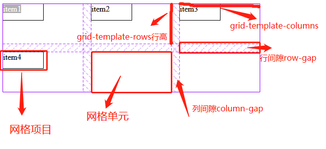
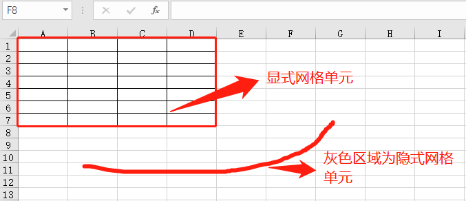

## 一、Grid布局的初认识

以前开发PC端页面最常用的框架就Bootstrap，它最经典就是网络布局，后来学习小程序开发才接触Flex布局，目前APP和小程序端，尤其是原生APP还是支持Flex全面点，但不可否认Grid布局是未来的趋势，用老师的话就是Grid是集大成者，即有Flex布局的灵活，又能像Table一样将网页划分不同区域，灵活的合并拆分，从而实现更强的布局模式。相信随着技术不断进步，Grid将是网页、APP和小程序的主流布局模式。

## 二、Grid基本概念

如上所说，它集成了Flex和table等布局的优点，所以说学习它可以参考这二者来理解，反而更容易明白Grid的本质。

### 1、网格容器和网格项目(看得见的元素)

正如Flex布局一样，Grid最基本的概念就是网格容器和网格项目，**网格容器**就是**父元素** ，而**网格项目**是**子元素** 。

> 属性:display:grid或display:inline-grid

```html
<style>
.container{ display: grid; }
</style>
<div class="container">
    <div class="item">item1</div>
    <div class="item">item2</div>
    <div class="item">item3</div>
    <div class="item">item4</div>
</div>
```

如上源代码中，网格容器就是类名为container的div,而网格项目就是类名为item的div，它们是我们能看见的。

### 2、网格模板(轨道)、网格单元和网格区域(看不见的网格)

正如标题所说，这三个**只有浏览器能看见的** ，但它是Grid布局的根本。非常类似Excel中表格。听课时听明白了，但我是这样理解它们三个：

> 1. Grid将网页布局转换成表格模式，也就是我们所说的**网格模板grid-template** ，表格建立当然要**行和列**，也就是grid-template-rows和grid-template-columns。
> 2. grid-template-columns和grid-template-rows作用有二个。可参考Excel建表格来理解：**①确定行或列的数量** ； **②确定行高或列宽** ，若未指明就是默认的，网页中就是内容的宽和高。其实它还有一个非常类似的Excel的就是，当表格超过行或列时，Excel中是灰色区域，而网格布局则称为隐式网格单元。
> 3. **网格单元** 网格单元包括单元格和网格区域，**单元格就是最小的网格单元** ，单元格就如Excel一个单元格，它里面放网格项目，它是**网格项目的家** 。
> 4. **网格区域** 就是多个单元格合并成的 **"矩形"区域** ，也是网格单元。3个单元格不是网格区域。

> 属性: **grid-template-columns:** 10em 10em 10em 1fr;   网格有4列

> 属性: **grid-template-rows:** 5em 5em;                 网格有2行

> 属性: **gap:** 1em 2em;     网格间隙，前是行间隙，后是列间隙


```html
<style>
    .container {
    display: grid;
    grid-template-columns: 10em 10em 10em;
    grid-template-rows: 5em 5em;
    gap: 1em;
    }
    .container > .item{
        width: 5em;
        height: 2em;
        border: 1px solid;
    }
</style>
<div class="container">
    <div class="item">item1</div>
    <div class="item">item2</div>
    <div class="item">item3</div>
    <div class="item">item4</div>
</div>
```



## 三、网格的隐式排列(隐式网格单元)

上面grid-template-columns和grid-template-rows所画的网格单元是**显式网格单元** ，当内容超过网格时它将放到**隐式网格单元** ,它是通过**grid-auto-columns**和**grid-auto-rows**来设定列宽和行高。

>- **grid-auto-flow** 是不是很类似flex-flow，它就是定义grid布局**项目排列方向**，是先行后列，还是先列后行。取值有row和column
>- **grid-auto-columns:** 设置隐式网格单元列宽
>- **grid-auto-rows:** 设置隐式网格单元行高


```html
/* 项目排列方向。默认值是行优先 */
/* grid-auto-flow: row; */
grid-auto-flow: column;

/* 隐式网格单元 */
grid-auto-rows: auto;
grid-auto-rows: min-content;
grid-auto-rows: 5em;
/* minmax是限定值的范围 */
grid-auto-rows: minmax(5em, auto);
```

> **注意事项:** 在设置隐式网格单元的列宽和行高要注意项目排列方向。如行优先时即row，此时设置grid-auot-rows有效，grid-auto-columns无效；而列优先时即column，则与前面相反。简单记忆就是: **row时,grid-auot-rows** 有效; **column时,grid-auto-columns** 有效。

## 四、学习后总结

看下Excel表格图



用朱老师经常说的话，现在CSS设计越来越人性化，从人的角度来理解CSS就简单多了，grid就是借鉴了flex、table和excel等优先的理念来定义布局的，它是集大成者，不要想得太复杂，按正常思维理解它，反而更好掌握。

> 题外的记录Emmet快捷输入技巧
>- .container>.item{item$}*4      {}表示元素内容,$表示变量
>- .container>.item{item$@5}*4      {}中@5表示变量从5开始。
