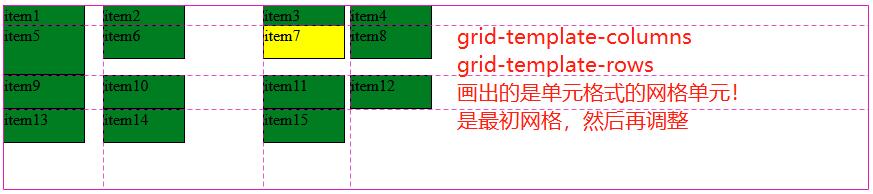
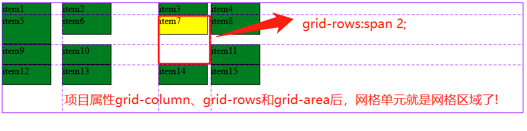
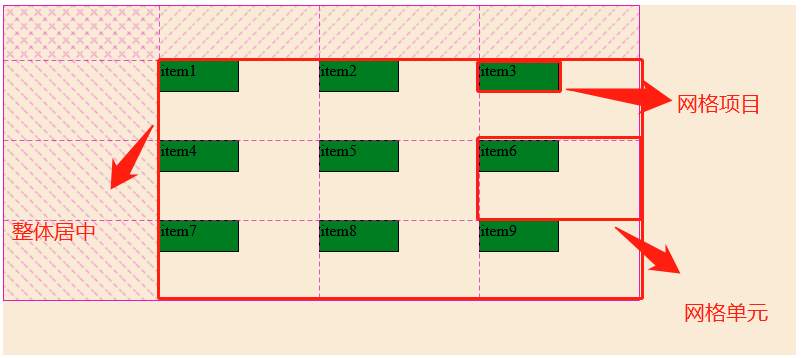
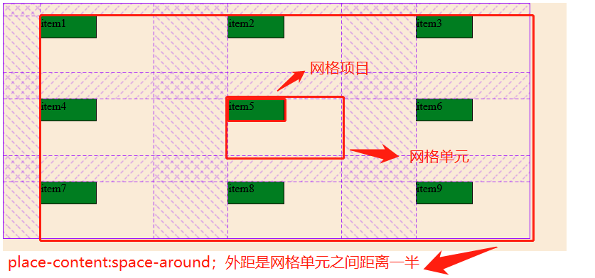
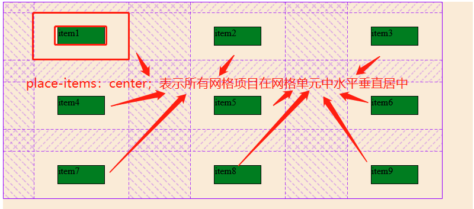
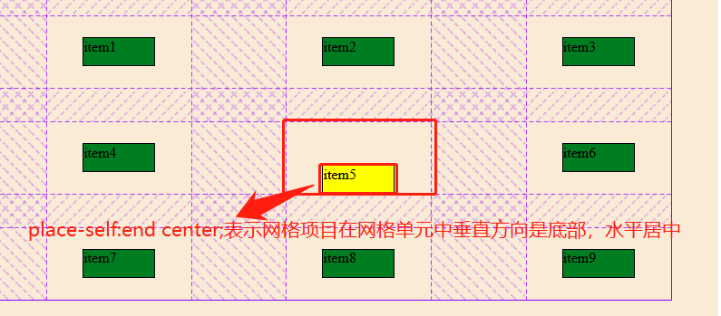

## 一、开始之前想说的

本文是我对Flex和Grid布局理解的全面总结，所以文章有点长，希望有耐心看下去，我相信你会有所收获。还有是最好有Flex布局和Grid布局属性的了解，不然看起来可能有点吃力。这里可以看下我的博文

> 《BFC和flex布局探讨和演示》<https://www.php.cn/blog/detail/24616.html>
> 《Flex项目属性和PC端响应式页面》 <https://www.php.cn/blog/detail/24648.html>
> 《Grid布局基本概念和隐式排列》 <https://www.php.cn/blog/detail/24657.html>
>
> 其实最后一篇可以看下隐式排列，前面内容我在本文中进行更便于理解的总结。

昨晚朱老师已经讲完了Grid布局和一些实战案例，可以说CSS布局告以段了。说实在话报班前，我最愁的就是布局，虽然以前看过阮一峰老师的Flex布局和Grid布局教程，也会简单使用，但不能算上理解，主要是老师没讲Flex和Grid关联和区别，一般都是一句，前者是一维，后者是二维。直到老师讲完grid全部属性后，晚上回想时豁然开朗，原来**Flex布局优势在一维，而Grid布局优势在二维** ，为什么这样说，后面会有具体分析。再者面对Grid诸多属性，什么时候使用那个相信一般都会比较迷茫,我对**Grid布局进行了整体解说**，相信你也会和我一样对它了如指掌。

## 二、换种方式来理解和掌握Grid布局的容器属性和项目属性

这里我不按平常的顺序来探讨grid容器属性和项目属性，因为我觉得它们非常不便于记忆和理解。这里我将Grid布局分为两大部分： **"画和调整"网格单元**和**调整网格单元与网格项目对齐方式**。其实grid布局**借鉴了**excel表格的**建表思维**和**Flex布局的方向与对齐方式**,再加上table的间隙理念而来。
>- **Excel的建表思维:** 就是说grid布局**首先要画出网格，然后调整网格，最后调整网格单元和网格项目进行对齐方式**，你可以仔细想想，无论是**显示网格单元**还是**隐式网格单元**，它是不是我们日常操作Excel表格的建表思维。
>- **Flex的方向和对齐方式:** 毕竟是网络，对齐方式不可能再和Excel一样，而Flex对齐方式是比较优秀解决方案，不过Grid将它扩展到二维。
>- **table的间隙:** Excel表格没间隙一说，而网页需要间隙，难道要和Flex一样使用外边距，明显比较low，它采用了table的间隙。
>
> 如果你理解了我上面说的，你也就理解了为什么老师经常说grid是集大成者，目前巅峰布局技术，一切布局在它面前都是毛毛雨。

### 1、画和调整网格单元

网格单元分为**单元格**和**网格区域**两种，那么在第一部分是如何体现呢？我认为在grid建立之初使用**容器属性grid-template-columns和grid-template-row**画的网格单元就是**单元格** ，再使用**项目属性grid-column、grid-row和grid-area**调整网格单元后，此时网格单元应该称为**网格区域**，即使它是一个单元格。

#### （1）画出单元格式的网格单元

> **涉及属性:** **容器属性**grid-template-columns列宽和grid-template-rows行高
> **主要作用:** 画出网格是几行几列，**此时网格单元就是单元格** 。
> **取值:**
>- **绝对值和相对值** 就是px、em、vw、vh、vmax和vmin等。此时**网格项目**设置的**width和height**无效。
>- **百分比:** 它是依据网格容器的width和height，若未 **显示指明** (即未使用width和height，内容撑开宽度和高度不算)时，**列宽**是**向上寻找**，若都没有指明，则是视图区的宽度；而**行高**只要网格容器**没有显示指明高度** ，则为0，此时行高是该行所有项目高度最大值(若设置项目高度，则忽略内容撑开的高度)。
>- **关键字auto:** **列宽**是**分配最大剩余空间**，而**行高**在网格容器**显示指明高度**时同列宽一样**分配最大剩余空间** ，若**未指明高度则是0**，此时行高计算同百分比。
>- **fr:** MDN解释是**弹性系数**，可以理解为它是**占剩余空间的比例**。就是将剩余空间分成N等份，各网格项目根据1fr占1份,2fr占2份...分配剩余空间。非常类似Flex的放大因子flex-grow和缩小因子flex-shrink。
>- **minmax(min,value):** 当**value大于min**时它**等于value** ，若**value < min**时它**等于min** ，它是取二者取大值。要**注意min不能取fr**。
>- **不常用关键字:** 如max-content、min-content和fit-content()，在测试发现三者没多大区别，也比较晦涩难以懂，**也许max-content有用点，就是列宽或行高由内容来决定** 。
>
> **重复：** 在设置列宽和行高时经常有大量重复的值，此时可以使用repeat来指定重复。
>- **repeat格式:** 第一个参数**重复次数**，第二个参数可以是**长度或fr**。
>- **常规使用:** 如repeat(3,10em)、repeat(3,10%)等
>- **重复关键字auto-fill:** 这个参数有时非常有用，它表示**一行最大的分配网格单元，分配不完则换行**，这个概念就非常像flex布局。grid-template-coloumn:repeat(auto-fill,max-content)就相当于flex-flow:row wrap了。

```html
grid-template-columns: 100px 10em 10% auto;
grid-template-rows: 20px 10% auto 5em;
grid-template-columns: 1fr 2fr minmax(2em, 1fr) minmax(20px, 20%); 
grid-template-rows:repeat(3,5em);
grid-template-columns:repeat(auto-fill,10em);
grid-template-columns:max-content min-content fit-content(50px);
```



#### （2）合并单元格成网格区域式的网格单元

正如Excel建表一样，上面只是已经将网格分成几行几列，下面就要根据项目(内容)大小来要合并单元格，组成网格区域放它们。

> **涉及属性:** **项目属性**grid-column、grid-row和grid-area。
> **主要作用:** 合并单元格为网格区域，**此时网格单元就是网格区域** 。
> **格式:** 
>- 网格区域列合并grid-column:列起始线 / 列结束线
>- 网格区域行合并grid-row:行起始线 / 行结束线
>- 网格区域grid-area:行起始线 / 列起始线 / 行结束线 / 列结束线
>
> **常见形式:**
>- **网格线号：** 如grid-column: 1 / 3第一列到第三列，grid-area:1 / 1 / 2 / 3 第一行到第二行，第一列到第三列
>- **跨行或列关键字span：** 如grid-row: 1 / span 3；表示行起始线为1，跨3行，其它类似。
>- **span时忽略起始值:** 若是从目前自身位置开始行或列，使用span时则可以忽略不写起始线值 。如grid-column:span 3;或grid-area:span 2 /span 3;
>- **只有一个span:** 只有一个span时，要注意它仅表示跨行，不跨列。
>- **-1特殊值:** 在grid的网格线号系统中，有起始线开始的1、2...，也有从结束线向起始线的-1、-2...。grid中-1表示最后一列或行的网格线号，grid-column: 2 / -1；就是表示从网格列2号线跨列到最后。

```html
.container .item:nth-child(7) {
  background-color: yellow;
  /* grid-column: 3 / 5; */
  /* grid-row: 1 / span 2; */
  grid-row: span 2;
  /* grid-area: 1 / 3 / span 2 / span 2; */
  /* grid-area:span 2 / span 2; */
  /* grid-area: span 2; */
}
```



#### （3）补充说明两点

> **隐式网格单元:** 也类似Excel表格外灰色区域，使用容器属性grid-auto-columns和grid-auto-rows设置列宽和行高，它们取值可参考grid-template-columns和grid-template-rows。

> **区域模板调整网格单元:** 容器属性grid-template-area可在容器就调整表格，但它依据项目属性grid-area，所以它仍然可看成项目属性调整，因为要设置网格区域名称再调整，比较赞同老师的说法，有点鸡肋。了解可以百度下，我不推荐这种做法。

### 2、调整网格单元与网格项目对齐方式

上面已经把网格画好，也调整成网格区域式的风格单元，放入网格项目了，此时我们就可以调整它们对齐方式了，但要分成两部分调整：即**网格单元在网格容器中对齐方式**和**网格项目在网格单元中对齐方式** 。经我测试，老师说的网格项目在网络窗口中对齐方式并不合适，因为网格项目是在网格单元中，尤其是网格项目不占满网格单元时更明显。对齐方式是参考了Flex布局中对齐方式，在我的博文中有分析，常见分为**两种处理方式**：**所有项目为一个整体**和**每个项目为个体** 。这里也是这样，而且比flex更好记，都是place为前缀的属性，place-content、place-items和place-self，最后一个一看就是自己的，如flex中align-self。对齐方式与flex不同就是拓展到二维。每个属性由两个值构成。

#### （1）网格单元在网格容器中对齐方式

> **涉及属性:** **容器属性**place-content。
> **主要作用:** 网格单元在网格容器中对齐方式 。
> **格式:** 垂直方向align-content 水平方向justify-content
> **两种处理方式:** 
>- 所有网格单元为一个**整体** : 可取值有start(默认值)、center、end和stretch。如place-content:start center；垂直方向贴起始线，水平方向居中。
>- 网格单元作为**个体** ：可取值space-between,space-around,space-evenly，含义和flex对齐方式中一样，有疑问可看那篇博文。
>
> 若是垂直方向和水平方向值一样，可简写成一个值，如place-content:center。

```html
.container{
    /* place-content: start; */
    /* place-content:center; */
    /* place-content:end; */

    /* place-content: space-between; */
    place-content: space-around;
    /* place-content: space-evenly; */
}
```






#### （2）所有网格项目在各自网格单元中对齐方式

> **涉及属性:** **容器属性**place-items。
> **主要作用:** 网格单元在网格容器中对齐方式 。
> **格式:** 垂直方向align-items 水平方向justify-items
> **取值:** 就四个值；start、center、end和stretch。若二者相等可只写一个来表示。

```html
.container {
place-items: center;
}
```



#### （3）某个网格项目在网格单元中对齐方式

> **涉及属性:** **项目属性**place-self。
> **主要作用:** 网格单元在网格容器中对齐方式 。
> **格式:** 垂直方向align-self 水平方向justify-self
> **取值:** 就四个值；start、center、end和stretch。若二者相等可只写一个来表示。

```html
.container .item:nth-child(5){
    background-color: yellow;
    place-self:end center;
}
```




### 3、网格单元的排列方向和间隙

上面基本完成了网格的大部分了，正如Flex布局有换行方向flex-flow，grid对应有排列方向**容器属性grid-flow**,网格单元的间隙，在Flex布局中一般是通过margin来实现，便table的间隙方案比较优秀，grid的间隙采用它的方式，对应的属性为**容器属性gap**。比较简单，取值可百度下。

上面就是换种方式理解掌握grid的容器属性和项目属性，不知你掌握没。下面是老师发的各属性表格。

**术语**

| 序号 | 术语     | 描述                                                |
| ---- | -------- | --------------------------------------------------- |
| 1    | 网格容器 | `dispaly:grid`属性定义的元素                        |
| 2    | 网格项目 | 网格容器的直接*子元素*                              |
| 3    | 网格单元 | 放置*网格项目*的空间,有*单元格*和*网格区域*二种类型 |
| 4    | 单元格   | 放置网格项目的最小单元                              |
| 5    | 网格区域 | 由一个或多个单元格组成的矩形区域                    |

---

**常用属性**

| 序号 | 属性                    | 描述                                       |
| ---- | ----------------------- | ------------------------------------------ |
| 1    | `grid-template-columns` | 定义网格轨道中的列宽                       |
| 2    | `grid-template-rows`    | 定义网格轨道中的行高                       |
| 3    | `gap`                   | 网格轨道间距                               |
| 4    | `grid-auto-flow`        | 项目在容器中的排列方向                     |
| 5    | `grid-auto-rows`        | 隐式网格单元的行高                         |
| 6    | `grid-auto-columns`     | 隐式网格单元的列宽                         |
| 7    | `grid-row-start`        | 行起始线                                   |
| 8    | `grid-row-end`          | 行结束线                                   |
| 9    | `grid-column-start`     | 列起始线                                   |
| 10   | `grid-column-end`       | 列结束线                                   |
| 11   | `grid-row`              | 定义行起始与结束线                         |
| 12   | `grid-column`           | 定义列起始与线束线                         |
| 13   | `grid-area`             | 定义网格区域                               |
| 14   | `place-items`           | 所有项目在网络单元中的对齐方式             |
| 15   | `place-self`            | 某个项目在网络单元(含网格区域)中的对齐方式 |
| 16   | `place-content`         | 项目在网格容器中的对齐方式                 |


## 三、我所理解的Flex布局和Grid布局。

从上面很明显感觉到Grid布局中对齐方式借鉴了Flex中对齐方式，下面是我找的对应图

|对齐方式|flex|grid|属性类别|
|:----:|:---:|:--:|:----:|
|基本概念|弹性容器、弹性项目|网格容器、网格项目|
|单元|弹性单元？？？|网格单元||
|方向|flex-flow|grid-auto-flow|容器属性|
|单元在容器中对齐|justify-content、align-content|place-content|容器属性|
|所有项目在单元中对齐|align-items|place-items|容器属性|
|项目在单元中对齐|align-self|place-self|项目属性|

### 1、对齐方式和排列方向

从上面我不难看出，Flex和Grid二者对齐方式和排列方向，无论是属性名还是取值都非常相似，最大区别是grid是二个值，表示**垂直方向和水平方向**。处理方式也是两种：**所有单元(项目)为一个整体**或**每个为个体**来设置对齐方式。整体时取值有flex-start/start、center、flex-end/end和stretch，个体时有space-between,space-around,space-evenly。、

### 2、弹性单元

上面表格中单元一行，我在Flex项中是问号！！！的确，无论是MDN或是W3C中，flex都没单元的概念，而为什么我写**弹性单元**呢，一个是我博文《BFC和flex布局探讨和演示》中在探讨align-items和align-content为不为stretch时提出了**项目空间**的概念，如下图，我得称为弹性单元更合适。


Flex布局最初是用一维角度来解决问题，但它为了适应变化 ，增加了二维属性，尽管不完美。再用Grid目光来看Flex，Flex就是一行网格或一列网格，它也存在单元的影响，最明显就是align-items为center时，它们是不等高。其实它们**弹性单元是等高** 。Grid也一样，它等高实质是单元格等高，而不是网格项目等高。

### 3、Flex对齐方式中不足

Flex布局中对齐方式在二维上是有明显不足的，如一行容纳不下时进行换行，此时对齐方式就是问题，如下图，我想的是换行，第二行应该从起始线开始，但Flex没有网格单元的约束，它就会跑到中间。


### 4、Flex和Grid布局如何选择

如APP和小程序这样只是一列或一行，推荐先Flex整体布局，再用Grid控制局部布局。而网页端是推荐全部使用Grid布局，如果你想用Flex也可以，它们是可以相互嵌套的。

## 四、Grid实现栅格化封装

前端想必都熟悉Bootstrap，我当时也是从Bootstrap接触网格概念的。那么用Grid实现一个简单的栅格化系统应该是对Grid最好的总结。至于圣杯三列布局我先给出源码，比较简单就不介绍了

```html
/* 圣杯三列布局: 二边固定，中间自适应 */
<style>
.container {
  min-width: 90vw;
  min-height: 97vh;
  display: grid;
  grid-template-columns: 15em 1fr 15em;
  grid-template-rows: 3em 1fr 3em;
  place-content: center;
  gap: 0.5em;
}
header,
footer {
  grid-column: span 3;
  background-color: lightcyan;
}
</style>
<div class="container">
  <header>header</header>
  <aside class="left">left</aside>
  <main>main</main>
  <aside class="right">right</aside>
  <footer>footer</footer>
</div>
```

```html
/* grid实现12列栅格系统 */
.container {
  display: grid;
  min-width: 90vw;
  gap: 0.5em;
}
.container > .row {
  display: grid;
  grid-template-columns: repeat(12, 1fr);
  gap: 0.5em;
}
.container > .row > .item {
  padding: 1em;
  text-align: center;
}

.col-12 { grid-column: span 12; }
.col-11 { grid-column: span 11; }
.col-10 { grid-column: span 10; }
.col-9 { grid-column: span 9; }
.col-8 { grid-column: span 8; }
.col-7 { grid-column: span 7; }
.col-6 { grid-column: span 6; }
.col-5 { grid-column: span 5; }
.col-4 { grid-column: span 4; }
.col-3 { grid-column: span 3; }
.col-2 { grid-column: span 2; }
.col-1 { grid-column: span 1; }
```

上面代码修改于老师的代码，后期我会加上我的实现页面，主要是将Flex布局中写的PC端响应式页面转换为Grid。

## 五、学习后总结

>- 理解Grid布局可以从Excel建表思维来理解画出的网格单元和隐匿网格单元、参考Flex对齐方式理解三种对齐，再结合Flex的方向和table的间隙来理解grid的排列方向和gap间隙。这种方式不知你是否接受，我感觉从上面比较理解了Grid布局
>- Flex可以是看成1.0版的Grid，二者都在相互学习，不过Flex由于一维先天的限制，它无法达到Grid集大成者的水平。但应付目前APP和小程序整体布局还是可以的，尤其是uniapp开发原生APP时是不支持Flex以外布局的。
>- 用老师经常说的话，技术越高级就越接近人的理解思维。从日常的发现来理解复杂的东西，也许不失一种好方法。