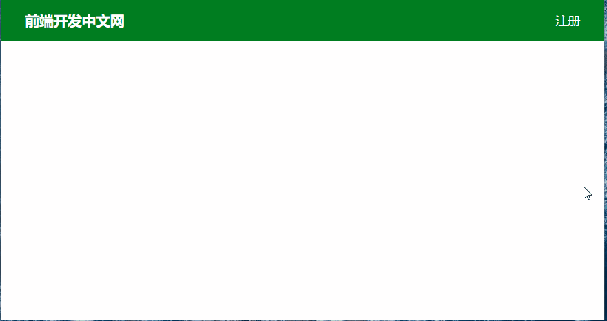

## 一、学习的新认识

今天，老师主要讲了定位及实际应用，重点是三种定位的特征、Position和Flex或Grid结合时注意事项和登录模态对话框案例。从中学习的新认识有以下几个：

 > 1. **三种定位的特征:** ①定位同浮动一样**只影响后面布局** ,因为DOM树是从前往后渲染的，当渲染到定位元素时，前面已经渲染完了，所以只能影响后面的;②定位后,left/top/right/bottom默认值是auto，不是0；③固定定位fixed、相对定位relative和绝对定位absolute和Flex或Grid可相互嵌套使用，但注意它对Flex和Grid的影响，一般设置宽度就解决了。三者的比较在后面再介绍。
 > 2. **猫头鹰选择器:** **形如:\* + \*** 类似猫头鹰选择器，它**可设置除第一个子元素外所有子元素的样式** 。后来老师又写了a + a的猫头鹰选择器，我就奇怪它们究竟是如何实现的。在选择器中+表示当前元素后面第一个兄弟元素，所有兄弟元素要用~。而猫头鹰选择器工作原理就是**递归** ，因为要是后面相邻的第一个兄弟元素，而第二个元素是第一个元素相邻第一个兄弟，第三个是第二个的....，最后就能找到除第一个子元素所有元素。

 ## 二、布局中Grid实际使用技巧

 自从我总结了Flex和Grid后<https://www.php.cn/blog/detail/24670.html>，自我感觉对Flex和Grid算是有比较本质的认识了，但在那个博文中还没实际使用Grid写页面，完全引用老师的，不过我在文中总结的：Flex优势在一维，Grid优势在二维的观点，现在需要更改下了，**在支持Grid情况下，还是全部使用Grid，Flex所有功能它都能实现** 。

 ### 1. Grid实现Flex的一行布局、自动换行和对齐方式

 这里只列举Grid实现Flex的一行布局和自动换行，至于Flex的一列布局则和行类似，可以类比实现。

 ```html
 /* Flex */
 display:flex;
 flex-flow:row wrap;
 justify-content:space-evenly;

 /* Grid */
 display:grid;
 grid-template-columns:repeat(auto-fit,minmax(10em,1fr));
 place-content:space-evenly;
 ```

 > **二者比较中Grid的优势:**
 >- **grid对网格单元尺寸控制灵活** ，可限制网格项目的大小，也可放权给网格项目决定尺寸(不明白的可以自己测试或看我的前篇博文)，而Flex则完成由弹性项目决定尺寸。
 >- **grid对齐方式可在垂直列和水平行两个方向上全面实现**，而Flex主要是主轴方向上支持较好，交叉轴的对齐方式还是不足。就如上面源码中当一行显示不完时，若只有一个项目换行到第二行，**Flex中是居中，并不对齐第一行中项目**，而**Grid仍然按space-enevly将它放在第二行第一列** 。就是说**Flex要求各行项目要相等才能对齐**，而**Grid则没这个要求**。
>- **grid在二维上更强大:** 一维上无论是项目尺寸控制还是对齐方式,Flex都不如Grid按常规的思维来处理项目，它有点放任自流感觉，而grid好像法律或规则，规定了整体布局和对齐方式，你在许可范围内可以调整尺寸和对齐方式。我们前端开发不也是要按W3C约定来实现。

### 2、Grid实现顶部导航栏

老师在"模态对话框”案例中头部还是使用Flex实现的，我尝试用Grid实现，发现无论是尺寸和对齐方式都可以随意调整，现在写网页终于有点完全控制感觉了，让它去哪它就在哪了。

```html
header {
  background-color: lightskyblue;
  height: 5em;
  padding: 0 2em;
  /* display: flex;
  justify-content: space-between;
  align-items: center;*/
  display: grid;
  grid-template-columns: max-content max-content;
  place-content: center space-between;
}
```


> **源码分析：** 实现效果是左右两头，上下居中
>- **第1行-第3行:** 设置背景色、头部高度和内边距，公共部分，内边距主要是让项目不要靠边，略微向内一些，比较美观。
>- **第4行-第6行:** 老师的flex实现部分。一行布局，主轴是两头，交叉轴是中心对齐
>- **第7行-第9行:** 我用grid实现老师同样效果，第8行max-content意思是网格单元宽度由网格项目决定，第9行是垂直居中、水平两头。
>
> 这是一维情况下，grid无论是代码量还是功能都可以实现flex所实现的效果，而且个人认为从语义化角度来看，grid的各属性值语义更明确。

### 3、grid实现水平垂直居中

我还记得自己专门总结了页面元素居中方法<https://www.php.cn/blog/detail/24646.html>,当时还没学习grid，所以在文章最后说了grid实现居中方法再写。今天终于补上那篇文章的所欠缺的。通过grid居中发现它更简单更强大。老师居中元素只用两行，就是display:grid;place-items: center;它支持容器中所有行内元素、行内块元素和块级元素，统统一次搞定。它的原理是

>- 将所有子元素分配到一列多行的网格容器
>- 网格单元的列宽为max-content，即由网格项目决定宽度
>- 网格单元的行高为max-content，即由网格项目决定高度
>- place-items:center将所有网格项目在网格单元中水平垂直居中。


> 以上是我目前遇到并使用grid解决的，更多在我遇到时就会补充。这里要提醒一点，尤其是grid新入门的，一定要**理清网格容器、网格单元和网格项目** ，必要时可借助FireFox浏览器grid模式查看，只有搞清它们，才能**快速找出合并网格单元和对齐方式达不到想要的问题** ，这点在我实际使用中深有体会。我在博文中<https://www.php.cn/blog/detail/24670.html>对Flex和Grid有比较深入探讨，可以参考，应该有所帮助。

##  三、三种定位的探讨

三种定位在文章开头已经阐述了几个特征，下面从实际应用角度来介绍下三种定位。

### 1、固定定位fixed

它应该是比较常见的定位类型，如固定顶部导航栏、固定底部工具栏、固定侧边导航栏。它最直观的感觉是"全屏定位"，它其实是相对于"视口"来定位，是相对当前设备可视区域来定位。

### 2、相对定位relative和绝对定位absolute

**相对定位**是相对于自身在文档流中的位置进行偏移，它仍然**占用移动前分配的空间** 。而**绝对定位**则脱离普通文档流，**释放之前占用空间将** ，其它元素将占用它的空间。一般情况下**二者都是成对出现** ，**相对定位为绝对定位的父级**。下面案例中对话框中关闭功能就是对话框相对定位，关闭元素绝对定位。

上面已经说了绝对定位一般都有相对定位的父级。但若父级不是相对定位则继续向上级寻找，若遇到相对定位则以相对它定位，若一直没有则和fixed一样，以视口为单位定位。还有上面已经说的定位**默认值是auto** ，这里我测试了下，绝对定位时没设置left/top/right/bottom，它则**定位到父级的左上角** 。

### 3、定位对Flex和Grid的影响

经测试在Flex容器或Grid容器中使用Position时，它的宽度将改变，为了消除这种影响，需要**手动设置Flex容器或Grid容器宽度** 。同时也建议在**Flex容器或Grid容器不要直接使用Position** ，而是在它外面**套一层父容器**，它外层**父容器使用定位** 。

## 四、Grid和Position结合实现的登录模态对话框

老师在上课时已经实现了登录模态对话框，其使用技术可分为以下几部分：

> 1. 头部header使用了flex布局，将标题和登录两头，水平居中
> 2. 对登录对话框使用Grid布局，并使用固定定位
> 3. 在对话框和背景之间固定定位蒙板，突出登录对话框的显示
> 4. 通过相对定位和绝对定位将关闭放置在右上角
> 5. 通过JS实现了弹出/关闭登录对话框

由于前面我写过CSS3的新增target伪元素代替简单JS交互操作<https://www.php.cn/blog/detail/24645.html>，而且为了熟悉Grid，我将flex部分全部转换为Grid实现了。我的实现主要特点：

> 1. 页面布局全部使用Grid实现，相信你熟悉后也喜欢它的强大
> 2. target伪类实现了模态对话框的显示和关闭,就是没使用任何js就实现了对话框弹出和关闭。
> 3. 固定定位蒙板和模态对话框
> 4. 通过相对定位和绝对定位将关闭放置在右上角

```html
<style>
* {
  margin: 0;
  padding: 0;
  border: none;
  outline: none;
  box-sizing: border-box;
}
a {
  text-decoration: none;
  color: #666;
}

.container {
  width: 100vw;
  height: 100vh;
  overflow: auto;
  display: grid;
}
.container header {
  background-color: #007d20;
  height: 60px;
  line-height: 60px;
  font-size: 1.1rem;
  color: white;
  padding: 0 2em;

  display: grid;
  grid-template-columns: 1fr 1fr;
}
.container header a {
  color: white;
  place-self: end;
}

.modal {
  visibility: hidden;
  font-size: 1.1rem;
}
/* 背景 */
.modal .modal-background {
  position: fixed;
  left: 0;
  top: 0;
  right: 0;
  bottom: 0;
  z-index: 1;
  background-color: rgba(0, 0, 0, 0.5);
}

.modal .modal-body {
  min-width: 20em;
  width: 30vw;
  min-height: 15em;
  padding: 0 1em 1em;
  margin: auto;
  color: white;
  background-color: lightseagreen;
  box-shadow: 1px 1px 3px gray;
  position: relative;
  z-index: 2;

  display: grid;
  grid-template-columns: 1fr 3em;
  grid-template-rows: 3em 1fr;
  gap: 0.5em;
  text-align: center;
  line-height: 3em;
}
.modal-body a {
  color: white;
  position: absolute;
  right: 0.5em;
  top: -0.5em;
}
.modal-body h3 {
  grid-column: span 2;
}
.modal-body form {
  grid-column: span 2;

  display: grid;
  grid-template-columns: 5em 1fr;
  grid-template-rows: 1fr 1fr 1fr;
  gap: 0.5em;
  place-items: center;
}

.modal-body form input {
  width: 90%;
  height: 3em;
  padding: 0 1em;
  background-color: transparent;
  border-bottom: 1px solid white;
}
.modal-body form input:hover {
  box-shadow: 0px 0px 3px 2px white;
  transition: all 0.1s;
}
.modal-body form button {
  grid-column: span 2;

  width: 60%;
  height: 3em;
  border-radius: 0.5em;
  color: white;
  background-color: seagreen;
}
.modal-body form button:hover {
  opacity: 0.6;
  transition: opacity 1s;
}

/* 弹出和关闭CSS */
#modal:target {
  visibility: visible;
}
#modal:not(:target){
  visibility: hidden;
}
</style>
<div class="container">
  <header>
    <h3>前端开发中文网</h3>
    <a href="#modal">注册</a>
  </header>
  <div class="modal" id="modal">
    <div class="modal-background"></div>
    <div class="modal-body">
      <h3>用户注册</h3>
      <a href="#">关闭</a>
      <form action="">
        <label for="username">用&nbsp;&nbsp;户&nbsp;&nbsp;名:</label>
        <input type="text" id="username" name="username" value="" placeholder="请输入用户名" />
        <label for="userpwd">密&nbsp;&nbsp;&nbsp;&nbsp;&nbsp;&nbsp;&nbsp;&nbsp;码:</label>
        <input type="password" id="userpwd" name="userpwd" value="" placeholder="请输入密码" />
        <label for="userpwd">确认密码:</label>
        <input type="password" id="userpwd" name="userpwd" value="" placeholder="请输入密码" />
        <button>注册</button>
      </form>
    </div>
  </div>
</div>
```



### Codepen演示 <https://codepen.io/woxiaoyao81/pen/GRqdjBR>

## 五、学习后的总结

>- Grid越使用就越喜欢，它简单强大，难怪老师说它是目前布局巅峰技术，建议在项目许可情况下，尽量使用grid，更何况目前页面框架Bootstrap、layui都基于grid布局。尽管原生APP对Grid支持不全面(引之uniapp，自己没测试)，但部分情况下也开始使用grid了。
>- 媒介查询@media可以是目前响应式布局的关键，个人测试虽然grid可以解决如尺寸改变调整布局功能，但若要替代媒介查询则言之过早，因为媒介查询的精髓是不同情况下不同样式功能，就如uniapp或vue中条件编译一样，调整布局只是它一项附加功能而已。
>- Grid是Flex的进阶技术，它汲取了Excel建表思维、Flex对齐方式与方向和table间隙的精华升级而来，在使用时一定要理清网格容器、网格单元和网格项目，这是使用它的前提，否则你就掌握不了Grid。在目前小程序和app还主要使用Flex的情况下，也可将它按Grid思维来理解，即弹性容器、弹性单元和弹性项目，一方面可以熟悉Grid,另一方面有助于理解Flex。