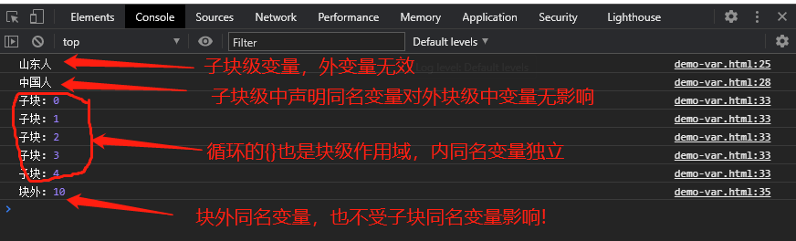
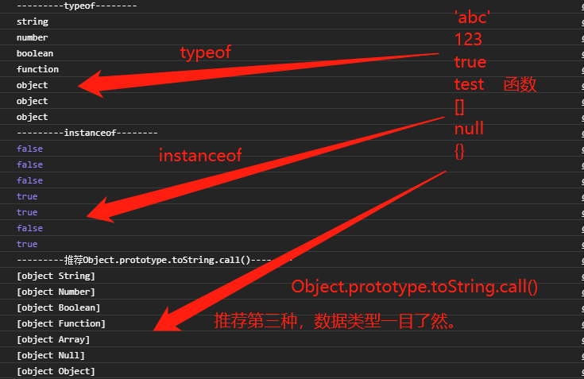
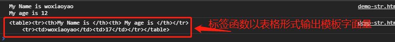
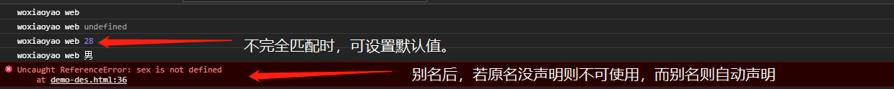
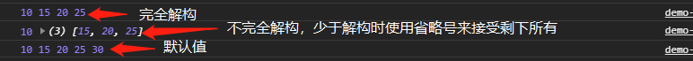
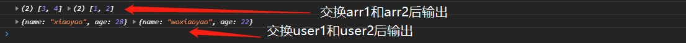

## 一、学习的新认识

终于开始学 JavaScript，以前我是学习 C、C++出来的，说实在话，在我印象中 JavaScript 是比较松散的语法结构，想不到从 ES6(它并不是只指 ES2015，而是包括以后出的标准，如 ES2016、ES2017...ES2020 等)开始，它也逐渐向 C++、Java 类语言靠近,有了类的概念、语法也越来越严谨。今天听了老师的课后，梳理了老师讲的与我印象中不同的几点：

> 1. **let 和 const 声明变量和常量:** 以前 JavaScrip 中变量可以直接使用，也可使用 var 变量声明，其实二者效果一样，包括我报课前看了阮一峰的《ECMAScript 6 入门》后在项目开发中也在一直混用 var、let 两个变量声明,误以为 var 是全局变量，let 是局部变量。现在测试了结果是 let 和 var 作用域是一样的，都是**块作用域** ,即在 **{}中定义的变量在其块及其内块中都有效，对当前定义的块以外无效** 。为了看齐高级语法的严谨风格，即变量只有声明后才可使用，并且不重复。建议使用 let 和 const 声明变量和常量。
> 2. **Symbol 数据类型:** 为了防止属性名冲突，ES6 开始引入新的**原始数据类型** Symbol，表示独一无二的值。它是 JavaScript 语言的第六种数据类型，前五种是：undefined、布尔值（Boolean）、字符串（String）、数值（Number）、对象（Object）。
> 3. **模板字面量和标签函数:** 其实模板字面量已经在阮一峰老师的课程中接触过了，他的叫法是模板字符串。标签函数是个新概念，感觉它是对模板字面量应用的升级，更加附和人的思维来处理模板。

## 二、变量和常量

首先再次强调下，以后**建议使用 let 声明变量、const 声明常量** 。请 **放弃** var 声明变量和直接赋值定义变量的方法，虽然不出错，但可能和以后新的标准冲突。

### 1、 标识符

> - 仅限于 **"字母,数字,下划线, \$"** ,并且**不允许用数字开头** 。
> - 严格**区分大小写** 。
> - 标识符大多采用的是 **"小驼峰式"** 命名:除第一个单词之外,每个单词的**首字母大写** 。如 userName、goodsPrice、unitPrice。
> - 常量推荐**全部大写** ,多个**单词之间使用下划线**连接。如 APP_NAME。

### 2、 变量和常量

> - **变量:** 申请空间来存储**可更新**的值，为了数据复用。为什么 let 声明了变量**不重复** ，是因为空间申请后就锁定了，非常类似 C++。
> - **常量:** 相对变量最大区别就**不可更新** , **声明常量时一定要初始化** (也就是第一次赋值)。它也**不重复** 。

### 3、两个特殊的变量undefined和null

undefined和null是两个特殊变量，我认为应该要单独说明。

先说简单的null，它表示空对象，**值是null,数据类型是Object** 。一般用于某个对象再次引用时，防止前面定义的影响，先将它赋值为null比较保险。再一个就是获取服务器端数据时，若没有数据则为null。

undefined，它**值和数据类型都是undefined** ，出现情况有：一种是**变量定义未初始化**时，另一种是**函数未定义返回值** 时，其它如果有再补充。


### 4、变量作用域

这点上课时老师没讲，在以前 JavaScript 使用 var 或直接赋值时代，讲变量作用域没什么意义。不过从 ES6 开始,JavaScript 已经越来越严谨了，就必须要理解作用域了，否则在实际开发中就会变量作用域出错。在 C++中变量作用域是比较重要概念，在阮一峰老师《ECMAScript 6 入门》中讲解 let 时就提到了块级作用域、全局作用域和函数作用域。其实可统一为**块级作用域** 即大括号{}限定区域，函数有{}，全局是`<script></script>`中所有{}外定义的，其实它有个虚拟的{}限定了作用域。

> **块级作用域特点：**
>
> - 块级{}中声明的变量对其**自身和子块级作用域都有效** ，而**对块外无效** 。
> - 块级作用域包括：**全局作用域(虚拟{})、函数的{}、条件或循环控制的{}** 。
> - 子块级中再用**let 声明同名变量是可以的，不算重复** ，所谓不重复是**同级块级作用域()不可用 let 声明同名变量**。此时**子块同名变量视为另一个变量，它和外面变量相互隔离** 。
> - 子块级中若**直接使用块外变量** ，则它就是块外变量,此时**切记不可在使用后再用 let 声明同名变量** ，否则将它视为子块级中变量未定义。即 console.log(username)和 let username='山东人'二者顺序调换就会报错。

```javascript
<script>
// 函数体中{}是块级作用域
let username = '中国人';
function test() {
let username = '山东人';
console.log(username);
}
test();
console.log(username);

// 条件、循环控制中{}是块级作用域
let j = 10;
for (let j = 0; j < 5; j++) {
console.log('子块:', j);
}
console.log('块外:', j);
</script>
```



### 5、console.log()和 console.dir()

console是浏览器内置的js执行引擎,console.log()和console.dir()是我们常用的输出信息方法。

- console.log() 方法用于在 console 窗口中输入信息。在调试时，可以替代 alert() 或 document.write() 输入需要输出的内容。
- console.dir() 方法用来对一个对象进行检查(inspect)，并以易于阅读和打印的格式显示。该方法对于输入 DOM 对象非常有用，因为 **dir方法会显示DOM对象的所有属性** 。

> **log 和 dir 方法 区别对比：**
>- console.log:输出的是HTML结构信息，可传多个参数，以逗号,隔开。
>- console.dir:输出的是类似于JSON结构信息，只能是一个参数。

## 三、数据类型

### 1、原始类型

这里要同时纠正下朱老师和阮一峰老师关于原始数据类型的说法，就是 null 是否是原始数据类型，阮一峰老师将 null 和 Object 视为两种数据类型，而朱老师将 null 视为空对象，Object 划分到引用类型了。我整合了二者共同部分就是原始数据类型目前有六种: **undefined、布尔值（Boolean）、字符串（String）、数值（Number）、对象（Object）和 Symbol** ，null 是 Object 类型。**原始数据类型判断都是使用 typeof** ,比较**特殊的是函数 Function** ，它原始类型是 Object 类型，但 typeof 则可以显示出它的真实类型 Function。

### 2、引用类型(也可称复合类型)

引用类型一般都是由原始类型组成的。这里主要说下对象、数组和函数

> **对象:** 是一组属性的**无序集合** ，以大括号{}包裹。
>- 属性名一般情况下都要符合js标识符规范，对于**不符合规范的要用双引号""来包裹** 。
>- 对象中方法可以看成块级属性，由{}包裹。
>- 对于方法的访问**一定要有()**,圆括号是"调用运算符"，它指明了方法是块级属性。
>- 对于属性的访问可以 **使用"."语法或使用['键名']** ,区别是前者只支持合法的属性名，而后者还支持非法的属性名。
>- 简写，**推荐是方法简写**，就是可省略:冒号和关键字function。如下面中getName:function(){}可简写成getName()。对于属性的简写不推荐,易出现混乱。

```javascript
let user = {
// 属性:对象中的变量
name: 'woxiaoyao',
// 对象中属性名可以是合法标识符，但一般老
'my email': '14588xxx@qq.com',
// 方法: 对象中的函数,本质仍是属性,只不过它的值是一个函数表达式
getName: function () {
    let name = 'xxx';
    //   不应该用对象名,应该用对象的引用: this
    console.log('My name is : ', this.name);
    return true;
},
};
console.log(user, typeof user);
//   访问对象成员(属性+方法),使用"."语法
console.log(user.name);
// 函数名后的圆括号是一种"调用运算符"
console.log(user.getName());
//   对于非法的属性名和合法属性名,均可使用['键名']
console.log(user['name']);
console.log(user['my email']);
```

> **数组:** 一组属性的**有序集合** ，以中括号[]包裹。对象成员的索引,从0开始递增。
>- 访问数组成员**可使用索引也可用键名** ，如下面数组中course[1]和course["1"]都可以。
>- 数组也是对象，因此可以给它增加方法。通过console.dir可输出数组的全部属性，增加方法若调用内部属性要使用this.属性名。

```javascript
let course = [1, 'js', 88];
console.log(course, typeof course);
console.log(course instanceof Array);
console.log(course instanceof Object);
//   instanceof 专用于自定义对象的类型判断
console.log(Array.isArray(course));
console.log(course[1]);
console.log(course['1']);
console.dir('数组本质: ');
console.dir(course);
// 给数组增加方法
course.getLength = function () {
console.log(this.length);
return '数组中函数';
};
console.log(course.getLength());
```

> **函数:** 完成特定功能的代码块，关键字是function，包括()包裹的参数和{}包裹的代码块。
>- 调用方法可以在函数定义前，也可在定义后
>- 函数也是对象，正如数组增加方法一样，先用console.dir得到函数的全部属性，调用内部属性要使用this.属性名。默认函数内部属性name就是函数名。
>- 内置call方法：老师列举了它调用其它对象的同名方法，好像PHP中call也有类似功能，值得以后探讨。

```javascript
function hello(name) {
  // 函数体
  console.log("Welcome ", name);
}
// 调用,按名调用
console.log(hello("朱老师"));
console.log(typeof hello);
console.log(hello instanceof Object);
console.log(hello instanceof Function);
console.log(hello.name);
//   既然是对象就可以添加属性或方法
hello.getName = function () {
  console.log("functionName: ", this.name);
};
console.log(hello.getName());
//   调用内置的call方法来调用其它对象的同名方法
console.log(hello.getName.call(user));
```

### 3、数据类型判断

介绍原始类型时已经说过了**typeof** ，但它对null、Object和Array数据类型都返回Object，此时需要老师推荐了两种**instanceof和Array.isArray()**来判断数组，instanceof老师说了是专用于自定义对象的类型判断(估计大家都没听懂，查了下它是判断变量是否某类的方法，javascript内置了Array、String等类)。其实有人说过，**JavaScript 中一切都是对象** ，现在我也有所体会，看看往下看。使用 **Object.prototype.toString.call()** 就可以准确判断数据类型。请看下面是对三者测试的结构

```javascript
// 数据类型
      console.log('---------typeof--------');
      console.log(typeof 'abc'); //string
      console.log(typeof 123); //number
      console.log(typeof true); //boolean
      console.log(typeof test); //function
      console.log(typeof []); //object
      console.log(typeof null); //object
      console.log(typeof {}); //object
      console.log('---------instanceof--------');
      console.log('abc' instanceof String); //String
      console.log(123 instanceof Number); //Number
      console.log(true instanceof Boolean); //Boolean
      console.log(test instanceof Function); //Function
      console.log([] instanceof Array); //Array
      console.log(null instanceof Object); //Object
      console.log({} instanceof Object); //Object
      console.log('---------推荐Object.prototype.toString.call()--------');
      console.log(Object.prototype.toString.call('abc'));
      console.log(Object.prototype.toString.call(123));
      console.log(Object.prototype.toString.call(true));
      console.log(Object.prototype.toString.call(test));
      console.log(Object.prototype.toString.call([]));
      console.log(Object.prototype.toString.call(null));
      console.log(Object.prototype.toString.call({}));
```



## 四、模板字面量和标签函数

### 1、模板字面量

模板字面量也可翻译成模板字符串(阮一峰老师教程中说法)，主要是解决了大量字符串和变量拼接时使用过多的引号和加号的问题，更加符合人的思维角度来，以 **反引号``(ESC键下方的按键)包裹** ，变量使用$开头，{}包裹，视为字符串，字符串则正常书写即可。

>- 可保留书写的多行格式，相当于HTML中pre功能。
>- 可省略大量的加号和引号，减少书写量，同时理解也更直观。
>- 模板字面量中,变量或表达式叫"插值", 变量和表达式必须返回一个值。

```javascript
let name="woxiaoyao";
let age=12;
let str=`My Name is ${name}
My age is ${age}`;
console.log(str);
```


### 2、标签函数

老师讲课时说标签函数是用来自定义模板字面量中的插值的行为,说实在话，刚听我也是一头雾水。只到老师举例子才明白。我的理解是:

>- 标签函数就是**将模板字面量中字符串和变量解析出来，然后可以以自定义格式输出它们** 。如列表形式输出，也可表格形式输出。就好比C++的printf一样。
>- 语法格式:function myPut(strings,firstArg,secondArg,...);
>- 标签函数第一个参数strings是模板字面量中以 **${}分隔** 的 **字符串数组** 。
>- 第二个参数firstArg表示模板字面量中第一个${}的值，第三个参数secondArg表示第二个${}值，以此类推。
>- 当模板字面量中变量有前面的变量计算得到的，如第三个是变量是firstArg*secondArg时，可以省略这个对应的参数，用前面参数来表示，也可以定义对应的参数。

```javascript
//   标签函数
function myPut(strings, firstArg, secondArg) {
secondArg=secondArg+5;
let putStr = `<table><tr><th>${strings[0]}</th><th>${strings[1]}</th></tr>
    <tr><td>${firstArg}</td><td>${secondArg}</td></tr></table>`;
return putStr;
}
let result = myPut`My Name is ${name} My age is ${age}`;
console.log(result);
```



> **书写标签函数注意事项:**
>- 标签函数**最终输出的是模板字面量** ，**切记要return返回字符串** ，我开始学习时就忘记返回字符串从而达不到效果。它是按自己定义的格式重新组合输入的模板字面量。
>- 标签函数中可以对输入模板字面量解析出来的字符串数组和变量进行更新/修改。
>- 标签函数的实质是将输入模板字面量字符串以另一种格式输出。

## 五、解构赋值

在阮一峰老师入门教程中对解构赋值有深入的探讨，老师主要讲了如何解构赋值。看了老师例子后，我注意到解构赋值的几个注意点，不知道你发现没

> 1. 解构**来源**是**对象或数组**。
> 2. 目的是**一般给原始类型**的变量赋值。
> 3. 若是不完全解构赋值时，目的数据类型可能是引用类型数据。
>
> 阮一峰老师教程中描述是:ES6允许按照一定模式，从数组和对象中提取值，对变量进行赋值，这被称为解构（Destructuring）。

### 1、对象的解构赋值

>- 对象的解构赋值要使用**大括号{}包裹** 变量，若是**声明时赋值则直接赋值**即可，若是**声明后再赋值则要用圆括号()包裹赋值表达式** 。
>- 不完全解构时可设置默认值
>- 解构时可以设置别名，要注意此时等于引用两个变量，别名是自动定义的，而原名要使用则要声明。

```javascript
// 对象解构
let user = {
nick: 'woxiaoyao',
skill: 'web',
};
let nick, skill;
//   完全解构:有两种形式，直接定义时赋值使用大括号{}，声明后再赋值要用圆括号()和大括号()
//   let { nick, skill } = user;
({ nick, skill } = user);
console.log(nick, skill);
//   不完全解构
let age;
({ nick, skill, age } = user);
console.log(nick, skill, age);
//   默认值
({ nick, skill, age=28 } = user);
console.log(nick, skill, age);
//   别名，要注意此时等于引用两个变量，别名是自动定义的，而原名要使用则要声明。
({ nick, skill, sex:gender='男' } = user);      
console.log(nick, skill, gender);
console.log(nick, skill, sex);  /* 报错 */
```



### 2、数组的解构赋值

>- 数组的解构赋值要使用 **中括号[]包裹** 变量，再将数组赋值给它。
>- **完全解构时** 要求赋值等号**两边模式**相同。如let [a,[b],c]=[1,[2],3]中第二个都是数组形式。
>- **不完全解构时** 若接受变量少于数组变量时，可使用...(省略号)来接收剩下的所有值，省略号后面变量要放在最后一个，否则报错。
>- 数组解构时也可设置默认值。

```javascript
//   数组解构
let price = [10, 15, 20, 25];
//   完全解构
let [first, second, three, four] = price;
console.log(first, second, three, four);
//   不完全解构，要使用...省略号接受剩下所有，并且要最后一个
let [fir, ...sec] = price;
console.log(fir, sec);
//   设置默认值
let [fi, se, th, fo, five = 30] = price;
console.log(fi, se, th, fo, five);
```



### 3、 解构的常见用途

> **1、交换变量的值** 目前测试了原始类型、数组和对象，均成功。不过要注意格式是 **[x,y]=[y,x]**
>- 交换两个变量的**类型和模式要匹配** ，数组时二者数量要相等，对象时二者属性名和方法名要相同。这也是交换的意义。
>- **一定要注意格式** 尤其是数组或对象时**val1和val2表示数组名或对象名** ，对象交换时不要加大括号{}和圆括号()。
>- **优点：** 上面代码交换变量x和y的值，这样的写法不仅简洁，而且易读，语义非常清晰。

```javascript
//   第一种：交换变量的值
let arr1 = [1, 2];
let arr2 = [3, 4];
let user1 = { name: 'woxiaoyao', age: 22 };
let user2 = { name: 'xiaoyao', age: 28 };
[arr1, arr2] = [arr2, arr1];
console.log(arr1, arr2);
[user1, user2] = [user2, user1];
console.log(user1, user2);
```



> **2、从函数返回多个值** 函数只能返回一个值，如果要**返回多个值** ，只能将它们放在数组或对象里返回。有了解构赋值，取出这些值就非常方便。

```javascript
//   第二种:从函数返回多个值
function test1() {
return [1, 2, 3];
}
let [a, b, c] = test1();
console.log(a, b, c);
// 返回一个对象
function test2() {
return {
    foo: 1,
    bar: 2,
};
}
let { foo, bar } = test2();
console.log(foo, bar);
```

> **3、函数参数的定义** 解构赋值可以方便地将**一组参数**与**变量名对应**起来。

```javascript
//   第三种：函数参数的定义
// 参数是一组有次序的值
function f([x, y, z]) {}
f([1, 2, 3]);
// 参数是一组无次序的值
function f({ x, y, z }) {}
f({ z: 3, y: 2, x: 1 });
```

> **4、提取JSON数据** 解构赋值对**提取JSON对象中的数据** ，尤其有用。

```javascript
// 第四种:提取JSON数据
let jsonData = {
id: 42,
status: 'OK',
data: [867, 5309],
};
let { id, status, data: number } = jsonData;
console.log(id, status, number);
```

## 六、ES2020的新特性

ES2020新特性有不少，这里我只列举我以前项目中遇到问题现在新特性解决方案。

### 1、空值合并运算符

> const a = b || 123;
> 这个在项目函数中判断参数是否有效时经常用到，本意是当b为0、null和undefined时，123为默认值，若b存在值则忽略123，直接将b赋值给a。
> **它的不足**是：所有类似于 0，false 或空字符串之类的值都将被我们不想要的默认值覆盖。

为了解决这个问题，创建了 **“nullish”合并运算符，用 ?? 表示**。有了它，我们仅在第一项为 null 或 undefined 时设置默认值。以上表达式将改进为：

> const a = b ?? 123;

### 2、可选链运算符

如果要访问对象的深层嵌套属性，则必须通过很长的布尔表达式去检查每个嵌套级别中的属性。必须检查每个级别中定义的每个属性，直到所需的深度嵌套的属性为止，如下代码所示：

> let name = user && user.info && user.info.name;
> let age = user && user.info && user.info.getAge && user.info.getAge();

如果在任何级别的对象中都有undefined或null的嵌套对象，如果**不进行检查，那么的程序将会崩溃** 。这意味着我们必须检查每个级别，以确保当它遇到undefined或null对象时不会崩溃。

使用**可选链运算符，只需要使用?.来访问嵌套对象**。而且如果碰到的是undefined或 null属性，那么它只会返回undefined。通过可选链，可以把上面的代码改进为：

> let name = user?.info?.name;
> let age = user?.info?.getAge?.();

> 不得不说，Javascript越来越考虑人的感受了，以前为了层层判断都快吐了，现在简单多了。

### 3、其它新特性

其它新特性，我目前还用不到，大家感兴趣可以百度下，包括:

>- 通过 # 给 class 添加私有变量
>- BigInt可以表示不在Number类型的-(2^53-1)至 2^53-1 范围的值
>- 静态import和动态import()
>- 全局对象globalThis。

## 七、学习后的总结

>- 从ES6以后的JavaScript的语法越来越严谨，严格区分大小写、不可重复声明变量、突出对象和类的概念，可以说越来越像C++语言了。功能更强大了，当然规范也更多了，要注意基本概念和基本语法。
>- 要掌握数据类型与判断方法、标签函数和解构赋值。虽是基本，但也是最常用的。
>- 目前入门阶段我遇到常见错误有3个：
>   - 错误提示:nick is not defined。就是说变量未定义
>   - 错误提示:Identifier 'nick' has already been declared。变量定义已经存在。
>   - 错误提示:test is not a function or its return value is not iterable。它出现原因是**定义了同名函数** ，在调用时它分不清是那个，提示它可能不是函数或返回值不可迭代。