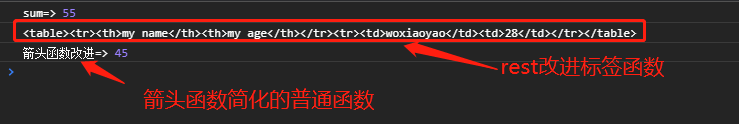
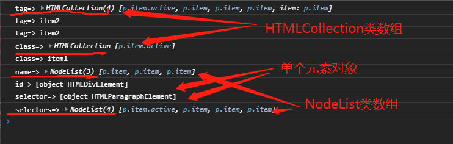
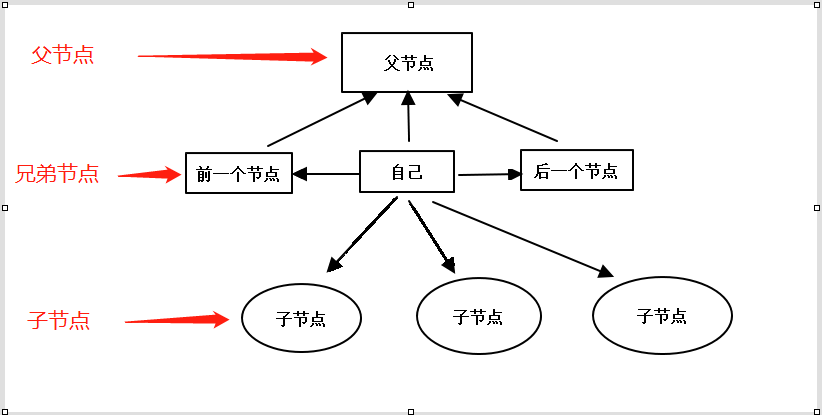
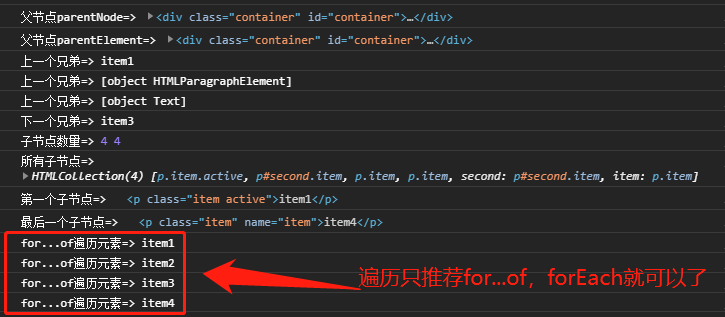
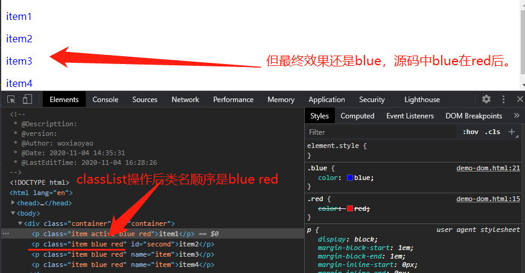
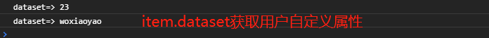

## 一、学习的新认识

今天同样是夯实 JS 基础的课程，学习了实际使用中常遇到的条件控制、循环控制、函数、箭头函数、DOM 操作、classList 和 dataset 对象。新认识主要有以下几个：

> 1. **三元运算符** 虽然老师只讲了使用三元运算符简化双分支控制，但是我想到了压缩 JS 中它是常用的一种技巧，对它进行了测试并总结了如何使用。
> 2. **for...of** ES6 新增的遍历操作，大有一统遍历界的意思，与之相近的有 forEach 只适合数组、for...in 一般用于 JSON 格式的对象。下文有具体介绍。
> 3. **剩余运算符 rest 和展开运算符 spread** 虽然二者运算符都是...(省略号)，但在不同位置则表示不同含义。
> 4. **querySelector** ，通过**选择器**查询 dom 元素，尤其是当朱老师用 querySelectorAll()实现 jquery 的\$()功能时，我感觉 JS 一下子就活了，原来 jquery 也是在 js 的基础上封装了常用操作，方便了开发者使用。正如上学时 C++老师用 C 语言实现 ping 程序，它不再只是打个九九乘法表的演示工具而已。

## 二、条件控制(也称分支控制)

JavaScript 中条件控制语句主要关键字同 C++语言一样，就是 if、if...else、if...else if...else if...else 或 switch...case。

### 1、单分支和双分支

最简单的两种分支，就是**if 表示的单分支**和**if...else 表示的双分支** 。对于双分支的简化就是三元运算符。

```javascript
// 单分支
let score = 70;
if (score >= 60) {
  console.log('合格');
}

// 双分支
score = 50;
if (score >= 60) {
  console.log('合格');
} else {
  // 默认分支
  console.log('补考');
}
```

> 这里要单独说下三元运算符，它也是现在**JS 压缩中一种常用技巧** 。但是要注意以下两点：
>
> - 若分支中是**一条语句**时，直接写在返回值即可,冒号前的语句分号要去除，否则报错。
> - 若分支中是**多条语句**时，要使用**圆括号()包裹所有语句** ，语句之间使用**逗号，隔开** ，切记**不要有 let 定义变量** ，变量要在运算符外定义。当然分号不要去除。
>
> 在常规使用三元运算符中，它一般将结果赋值给一个变量，就是如:
> let result= scorce >=60 ? '合格' : '补考';

```javascrpt
// 简化
//   若只有一行执行语句时，可直接写上
score >= 60 ? console.log('合格') : console.log('补考');
//   若是双分支中是多行语句时，要用圆括号()包裹，每个句子用逗号，隔开，不可有变量定义let，也不可有分号。
//  这种写法也是压缩js的中最常用的写法。
let name = 'woxiaoyao';
score >= 60 ? ((name = 'xiaoyao'), console.log(name + '合格')) : ((name = 'peter zhu'), console.log(name + '补考'));
```

### 2、多分支

多分支最基本就是从单分支和双分支拓展而来的 if...else if...else if...else，也有另一种简化语法:switch...case。不过要注意的是:switch...case 一般用于 **单值判断** ，若是**区间判断** 则要将条件**设置为 true** ,这个是以前我苦恼的，老师一讲就明白了。还有 switch...case 使用要**注意 break** 。

```javascript
//   switch简化多分支
score = 70;
switch (true) {
  //   区间判断：一定返回布尔值【重要】
  case score >= 60 && score < 80:
    console.log('合格');
    break;
  case score >= 80 && score <= 100:
    console.log('优秀');
    break;
  case score > 100 || score < 0:
    console.log('非法分数');
    break;
  default:
    // 默认分支
    console.log('补考');
}

//   switch最常用还单值判断
let status = 'fail';
status = 'abc';
status = 'Success';
switch (status.toLowerCase()) {
  case 'success':
    console.log('成功');
    break;
  case 'fail':
    console.log('失败');
    break;
  default:
    console.log('未知错误');
}
```

## 三、循环控制(也称遍历)

循环控制是最常见的操作，尤其是遍历对象和数组时。循环的核心一般是 **循环变量初始值、循环条件、更新循环变量** 。

### 1、while(入口型循环)和 do...while(出口型循环)

最基本的循环，实际使用很少，只要知道就可以了。二者区别是前者是在循环开始就判断条件是否满足，不满足则不循环。而后者则先执行一次再判断，很明显这种循环有点鸡肋，在实在使用中很少使用。

```javascript
let arr = [10, 20, 30, 40, 50];
// 循环变量初始值
let i = 0;
// 循环条件
while (i < arr.length) {
  console.log(arr[i]);
  // 循环更新
  i++;
}
i = 0;
do {
  console.log(arr[i]);
  i++;
} while (i < arr.length);
```

### 2、for(各种语言都支持的经典循环)

> 语法格式:for(循环变量初始化;循环结束条件;循环变量更新){}。
> for 循环可以使用两个关键字: **break 和 continue** ，前者是从 break 位置**跳出并结束循环** ，后者是从 continue 位置**跳出提前进入下一轮**循环判断。

```javascript
//   for循环
for (let i = 0; i < arr.length; i++) {
  console.log(arr[i]);
}
```

### 3、 forEach、for...in 和 for...of

forEach 和 for...in 是 ES6 之前就支持的，而 for...of 是 ES6 新增的循环遍历方法。这三者中 for...in 其实存在不少问题，完全可以使用更好的 for...of 来替代。我的原则是优先使用 for...of，其实是 forEach。

> **forEach:** 对**数组**的每一个元素执行一次提供的**函数**(不能使用 return、break 等中断循环)，**不改变原数组**， **无返回值**。老师说遍历对象，我测试遍历对象报错。目前它**只适合数组** 。
>
> - 语法: **arr.forEach(function(item[,key,arr]){});** 其中 item 是数组中每个值，key 是索引，arr 是原数组。除第一个参数必须外，后两个参数可以不要。

```javascirpt
//   forEach:只能是对数组遍历，对象则报错。
let user={name:'woxiaoyao',age:28};
arr.forEach(function(item,key){console.log('forEach=>',item);});
user.forEach(function(item){console.log('forEach=>',item)});
```

> **for...in** 设计之初，是给普通以 **字符串的值为 key** 的对象(如 JSON 格式的对象)使用的，而非数组。它的几个特点：
> for(let index in objArr){console.log(objArr[index])}
>
> 1. **index 是字符串 String 类型** , 数组索引、普通对象属性名都将转换为字符串，此时访问值就是**objArr[index]**，对于数组和对象都可以。关于数组的索引或键名(默认是索引的字符串)访问都是合法的，详细见<https://www.php.cn/blog/detail/24718.html>。使用它进行**运算时一定要切记它是字符串** ，尤其在数组中进行偏移时要注意。
> 2. 作用于数组的 for-in 循环体除了遍历数组元素外，还会遍历自定义属性。举个例子，如果你的数组中有一个可枚举属性 myArray.name，循环将额外执行一次，遍历到名为“name”的索引。就连数组原型链上的属性都能被访问到。(没明白，以后再探讨)
> 3. 最让人震惊的是，在某些情况下，这段代码可能按照随机顺序遍历数组元素。(都这么说，我没遇到过)
>
> 简而言之，for-in 是为**字符串的值为 key**的对象设计的，你可以遍历得到字符串类型的键，因此不适用于数组遍历。

```javascript
// for...in
for (let item in user) {
  console.log('for...in=>', user[item]);
}
```

> **for...of** ES6 后推荐的遍历对象和数组的方式，用来循环获取一对键值对中的值。课中老师测试了 for...of 默认是不支持 Object，后面会探讨解决方案。它具有几下优点:
>
> 1. 最简洁、最直接的遍历数组元素的语法,对数组默认遍历值。对键名或键-值遍历要使用 ES6 为数组新增的 keys()和 entries()方法。
> 2. 避开了 for...in 循环的所有缺陷
> 3. 不同于 forEach()，可以使用 break,continue 和 return。 _(我还以为 break 和 continue 只是 for 的专利呢，它有点集大成者的趋势)_
> 4. 支持数组、类数组(如 HTMLCollection 和 NodeList,后面遍历 dom 元素时要用到)、字符串、Map 和 Set 等具有 Symbol.iterator 属性的数据对象。
> 5. 它**默认不支持对象**的访问，可使用 ES6 对 Object 新增的方法 Object.keys()、Object.values()或 Object.entries()将对象的键、值或键-值转变成可遍历的。如:
>    for (let key of Object.keys(obj)){}。
>    for (let value of Object.values(obj)){}。
>    for (let [key,value] of Object.entries(obj)){}。要注意是**解构赋值**写法和顺序。
> 6. 对数组也提供了和对象同样的方法，不同的是**数组不是参数而是它们是数组的方法** 。如下所示:
>    for (let key of arr.keys()){}
>    for (let value of arr.values()){}
>    for (let [key,value] of arr.entries()){}
>
> 目前 Jquery 遍历方法是 each、foreach 和 for...in，正因为 for...of 使 ES6 在遍历方面目前比 jquery 更加先进。即有**for 的 break、continue 和 return 控制**，又有**forEach 和 for...in 所有功能** ，强烈**推荐 for...of 的使用** 。

```javascript
//   for...of
// for...of默认访问数组的值
for (let item of arr) {
  console.log('for...of=>', item);
}
// for...of访问数组的健、值或健-值对则可使用ES6给数组新增的keys()、values()和entries方法。
for (let key of arr.keys()) {
  console.log('for...of=>key=>', key);
}
// for...of默认不支持对象，但可用Object.keys(obj)、Object.values(obj)和Object.entries(obj)将对象的对应部分转为可遍历
for (let value of Object.values(user)) {
  console.log('for...of=>object=>', value);
}
```

## 四、ES6 对函数的扩展

在阮一峰老师教程中有详细介绍，这里主要学习了剩余运算符 rest 和展开运算符 spread，顺便介绍下函数表达式和箭头函数。

### 1、剩余运算符 rest 和展开运算符 spread

> - 二者都是以 **...(省略号)** 开头,操作对象一般是 **数组** 。
> - 在**函数定义**时圆括号中是**剩余运算符 rest** ，在**函数调用**时圆括号中是**展开运算符 spread** 。在 C++语言中，**前者是接受参数,将所有参数打包到一个数组** ，**后者是传入参数，将数组解构赋值给相同模式的接受参数**。二者主要面对 **未知长度** 的数组，已知长度的数组当然也支持。
> - 它们是现代函数优秀特性，可以处理未知多个变量。

```javascript
// 剩余运算符rest和展开运算符spread
//   剩余运算符接受未知个数参数
function sum(...args) {
  let ret = 0;
  for (let val of args) {
    ret += val;
  }
  return ret;
}
let arr = [1, 2, 3, 4, 5, 6, 7, 8, 9, 10];
//   展开运算符展开未知个数的数组，传递给函数处理
console.log('sum=>', sum(...arr));
```

对于标签函数利用 ES6 的 rest 和 spread 可以改进

```javascript
//   对标签函数的改进
function myTag(strings, ...args) {
  let thtext = '',
    tdtext = '';
  for (let val of strings.values()) {
    if (val) thtext += `<th>${val}</th>`;
  }
  for (let val of args) {
    tdtext += `<td>${val}</td>`;
  }
  let ret = `<table><tr>${thtext}</tr><tr>${tdtext}</tr></table>`;
  return ret;
}
let name = 'woxiaoyao';
let age = '28';
console.log(myTag`my name${name}my age${age}`);
```

### 2、函数表达式和箭头函数

如let demo=function(){}形式的，后面就是**函数表达式** ，也称**匿名函数** ，没有名字,通过把**它赋值给一个变量,来引用它** ，常用于**回调方法** 。在ES6中简化就是**箭头函数**，删除关键字function, 在参数列表与大括号之间**添加一个"=>"(胖箭头)** ，它就是箭头函数名字的由来。

> **不需要使用this**情况下，推荐使用箭头函数。它有几点注意:
>- 如果没有参数,也必须加上一对"()"
>- 如果函数体只有一行代码,可以省略掉{},有多行代码,函数体的大括号不能省略。
>- 箭头函数中**没有自己的this** ,这点尤其要注意。

```javascript
  // 箭头函数
  let sumArrow = (...args) => {
    let ret = 0;
    for (let val of args) {
      ret += val;
    }
    return ret;
  };
  console.log('箭头函数改进=>',sumArrow(1, 2, 3, 4, 5, 6, 7, 8, 9));
</script>
```



## 五、dom常用操作

DOM即document object model,文档对象模型。**dom元素都是对象** ，这个概念一定要牢记，正因为是对象，可以有属性和方法。

### 1、获取dom元素

>- 根据标签Tag: **document.getElementsByTagName()**，如document.getElementsByTagName("li");
>- 根据ID: **document.getElementById()**，如document.getElementById("list");
>- 根据类class: **document.getElementsByClassName()**，如document.getElementsByClassName("item active");
>- 根据name: **document.getElementsByName()**，如document.getElementsByName("first");
>- **根据选择器:** **document.querySelector和document.querySelectorAll()**，这时推荐方式，简单灵活。juqery的$()也是这个思路。

```html
<div class="container" id="container">
    <p class="item active">item1</p>
    <p class="item" name="item">item2</p>
    <p class="item" name="item">item3</p>
    <p class="item" name="item">item4</p>
</div>
<script>
    // 一、获取dom元素
    const tag = document.getElementsByTagName('p');
    console.log('tag=>', tag);
    console.log('tag=>', tag[1].innerHTML);
    console.log('tag=>', tag.item(1).innerHTML);
    const classdom = document.getElementsByClassName('item active');
    console.log('class=>', classdom);
    console.log('class=>', classdom[0].innerHTML);
    const name = document.getElementsByName('item');
    console.log('name=>', name);
    // id获取的不是类数组，不要用索引或item访问，它相当于元素对象HTMLDivElement(可看下面打印的信息)
    const id = document.getElementById('container');
    console.log('id=>', Object.prototype.toString.call(id));
    const selector = document.querySelector(".item");
    console.log('selector=>', Object.prototype.toString.call(selector));
    const selectors = document.querySelectorAll(".item");
    console.log('selectors=>', selectors);      
</script>
```



> **获取到dom元素分析:** 只有知道获取什么，操作才会得心应手。
>- **HTMLCollection类数组** 指**Tag、class**两种获取，可通过**索引或item()**方法来访问。如tag[0].innerHTML和tag.item(0).innerHTML。
>- **NodeList类数组** 指**name和querySelectorAll&&两种获取，**访问方式同上**。
>- **单个元素对象** 指**id和querySelector**两种获取，都是HTMLXxxElement形式的对象，其中Xxx是元素的英文，首字母大写。访问方式是**直接属性或访问**即可，其实上两种类数组通过**索引或item()得到就是单个元素对象**。id.innerHTML，若使用索引或item()将报错，因为它不是数组。

> **老师经典一例:** 单独列出，是因为它让我眼前一亮，原生JS并不弱，尤其是ES6以后
> // 模拟jQuery的$()来获取元素
>      const $ = (selector) => document.querySelectorAll(selector);
>      console.log($(".item:last-of-type"));

### 2、遍历元素节点

所谓遍历元素节点最常见就是遍历父节点、兄弟节点和子节点，如下图



> **parent父节点:parentElement或parentNode**
> **sibling兄弟节点:** 上一个兄弟**previousElementSibling**，下一个兄弟**nextElementSibling**。获取所有兄弟原生JS没有直接方法，可通过父节点遍历所有子元素得到。
> **child子节点:children** 它是类数组，可以通过索引或item()方向。对于特殊位置子元素也有直接方法，如第一个子元素firstElementChild，最后一个子元素lastElementChild。子元素数量可通过children的length，也可是节点的直接属性childElementCount获取。

```javascript
// 父节点
console.log('父节点parentNode=>', selector.parentNode);
console.log('父节点parentElement=>', selector.parentElement);
// 兄弟节点
const second = document.querySelector('#second');
console.log('上一个兄弟=>',second.previousElementSibling.innerHTML);
console.log('上一个兄弟=>',Object.prototype.toString.call(second.previousElementSibling));
console.log('上一个兄弟=>',Object.prototype.toString.call(second.previousSibling));
console.log('下一个兄弟=>',second.nextElementSibling.innerHTML);
// 子节点
// 子节点数量
console.log('子节点数量=>',id.children.length,id.childElementCount);
// 所有子节点
console.log('所有子节点=>',id.children);
// 第一个或最后一个子节点
console.log('第一个子节点=>',id.firstElementChild);
console.log('最后一个子节点=>',id.lastElementChild);
// 数组遍历，推荐for...of
for(let val of id.children){
  console.log('for...of遍历元素=>',val.innerHTML);
// forEach作为了解就可以了
Array.from(id.children).forEach((item)=>item.style.color="red");
```



> **遍历元素总结：**
>- 元素需要遍历节点分为 **父节点、兄弟节点和子节点** ，都是 **Element元素对象** ，**属性中体现了类型**，如children、firstElementChild表示子节点，parentElement或parentNode表示父节点，previousElementSibling和nextElementSiblings是兄弟节点。非常好记忆。
>- 以上获取的节点中，children是类数组，其它获取节点都是单个元素对象，要注意访问方式。
>- 对数组的**遍历推荐for...of** 。尤其本文在循环中已经对for...of进行了详细介绍，无论是遍历数组还是遍历对象，都不再话下，是ES6新增的，也是推荐的。至于老师说的forEach了解就可以，还有就是类数组转数组Array.from
>- 元素对象Element可**直接对内置属性进行访问** ，如**item.style.color**就是访问元素的样式中color。

### 3、classList对象操作

classList其实就是元素Element对象的内置属性class，只不过在js中class是关键字，所有取别名className代表。正如CSS中一样，我们控制元素样式最多的就是类，所以classList是JS中操作对象样式变化的重要手段。

> **classList常见操作:** 
>- **添加add():** 为元素增加类,如item.classList.add('red');
>- **移除remove():** 移除元素中类,如item.classList.remove('red');
>- **替换replace():** 替换元素指定的类,如item.classList.replace('red','blue');
>- **自动切换toggle():** 当元素有指定类时则移除remove,若没有则添加add。如item.classList.toggle('red')

```javascript
//classList对象操作
for(let val of id.children){
  val.classList.add('red');
  val.classList.remove('red');
  val.classList.replace('red','blue');
  val.classList.toggle('red');
}
```



> **测试中遇到的问题:**
>- replace替换时，若找不到第一个参数表示的类时，直接返回false。
>- classList**仅仅是对元素的类名**进行操作，**最终效果还是由类的优先级和源码中顺序决定** 。

### 4、dataset对象

dataset是用户自定义数据属性对象，这是HTML5新增的特性，支持用户给元素添加自定义属性，就如微信小程序中data-。它的特点是以**data-为前缀** ,访问是通过元素的dataset属性来访问，获取时请省略掉"data-"。

```html
// dataset访问用户自定义属性
const user=document.querySelector('#user');
console.log('dataset=>',user.dataset.id);
// 将使用连接线命名的多个单词的属性名,转换"驼峰命名法"来获取
console.log('dataset=>',user.dataset.userName);
```



## 六、学习后的总结

>- 三元运算符和switch...case可简化分支控制，尤其是三元运算符在占用空间小的优良特性，被众多JS压缩所采用，要注意多行语句的书写。
>- for...of循环或遍历是ES6新增的，它是原生JS优秀于jquery一个点，无论是数组和对象，它都可以简便访问，尤其是配合新增数组的keys()、values()和entries()以及对象的keys()、values和entries()，没有什么不能遍历的。可以放弃forEach和for...in，原因在文中已经说明了
>- 剩余运算符rest和展开运算符spread使得JS越来越走近合格编程语言，前面let和const，现在的rest和spread，我们看到不断成熟的JavaScript编程语言。
>- dom操作对元素获取我推荐querySelectorAll()，一个就搞定了，对于元素遍历，按文中我提到方法记父节点、兄弟节点和子节点属性就可以，对于内置属性(包括classList)和自定义数据属性dataset要掌握。
>- 最后想说的话，本课中我影响最深的就是老师用querySelectorAll来模拟Jquery的$()时，我有种感觉原生JS正变得越来越成熟，结合我上篇博文<https://www.php.cn/blog/detail/24718.html>中就感觉更明显。