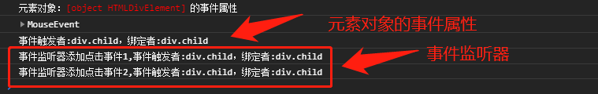
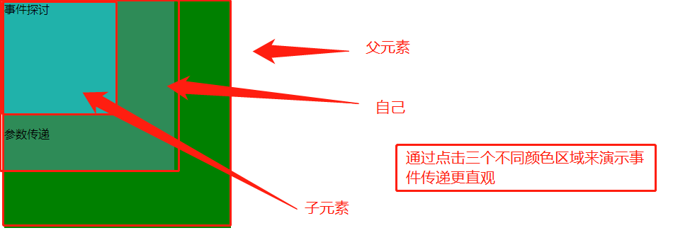
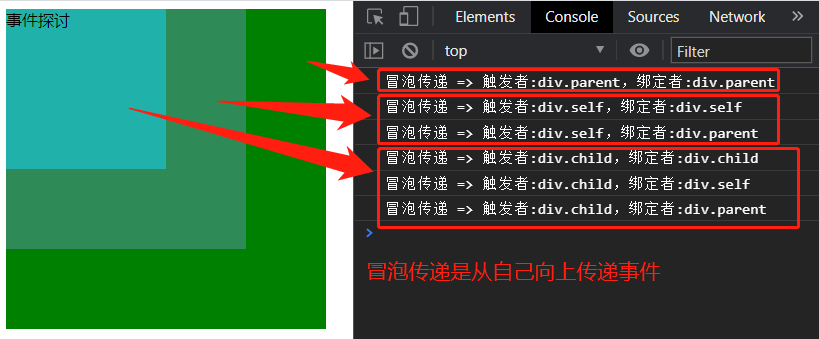
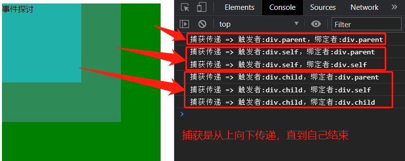
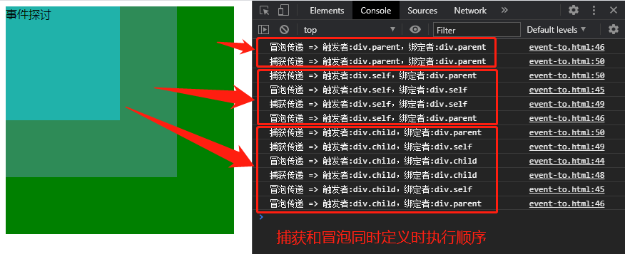
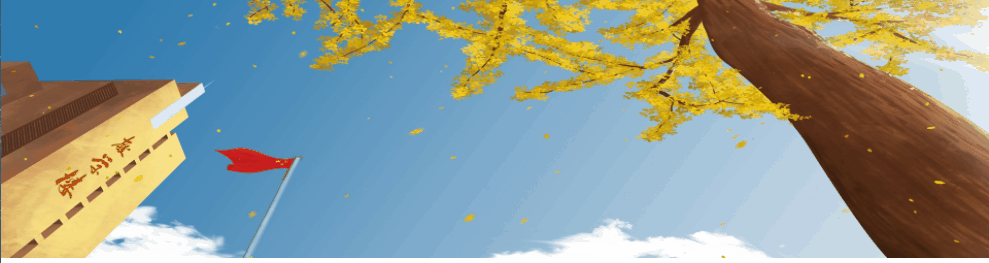

## 一、学习的新认识

事件是一个编程语言响应用户行为的关键要素，今天重点学习了事件的添加、传递和委托代理，都是日常遇到的。这里有几个认识分享下:

> 1. **元素对象的事件属性和事件监听器添加事件区别** 上课是老师提到了前者只能是一个，推荐使用后者，当时我以为前者只能添加一个事件，其它事件添加不了。经过测试，我终于对它们俩有比较清楚的认识。
> 2. **事件派发器实现自动触发事件** 编程最大乐趣就是自动处理，以前我就奇怪JS实现自动任务的原理，今天终于学到了，给老师点个赞先。
> 3. **事件传递** 老师讲了捕获和冒泡，但我感觉演示并不直观，我下面对演示进行了改进。另外事件传递另一个要理解的重点就是如何阻止默认的行为和冒泡没讲，因为微信小程序和vuejs中经常要处理是否冒泡，就是子元素事件可以让父元素代理处理，也可以只有自己处理，不能事事都依赖父元素，想想日常生活不也是一样吗。
> 4. **事件委托代理** 正是由于事件传递特性，所有某些情况下父元素处理更恰当，如日常生活中分家产，每个孩子处理岂不乱套。老师列举了轮播图处理常用事件委托给父节点来统一处理。

## 二、事件添加

### 1、元素的事件属性和元素对象的事件属性

二者放在一起，是因为在测试中我发现它们俩非常相似，都是与元素对象的事件属性有关。

> **元素的事件属性：** 在元素中使用 **"on+事件名称"** 属性添加事件时，这个属性称为事件属性(题外话，上篇中还介绍了数据属性)。它的注意点：
>- 属性名是"on+事件名称"，事件名称都是 **小写** ，事件名称可以通过console.dir(元素对象)来获取。
>- 事件函数的 **圆括号千万不能少** ，即使不传递参数，否则无效。 
>- 事件函数中**参数**传递 **元素对象** 。这里传元素对象是经常使用的方法，如**this代表自己** ，**this.parentNode代表父元素对象** ，至于兄弟元素对象和孩子元素对象如何传递，可参考我上篇博文中写的遍历元素的部分，那里已经介绍清楚了。链接地址：<https://www.php.cn/blog/detail/24740.html>
>- 事件函数中**参数**传递**当前事件对象** 经测试想传递事件对象，参数名只能是**ev或event** ，其它都不代表事件对象，如eve、even、event1等都报错。至于原因在下面有解释。
>- 事件函数中**参数**传递**常量** 通常使用**data-的自定义数据属性**，然后在JS中通过**dataset获取**，**不建议在参数中传递常量**。
>- **意外发现:** 在测试事件函数可传递什么参数时，我意外发现了一个有趣的现象，这里先不说了，在本节总结时再细说，可往下看。

```html
<div class="parent">
    <div class="self">
    <div class="child" onclick="divClick()">事件探讨</div>     
    <p class="" onclick="pClick(event)">参数传递</p>   
    </div>      
</div>
<script>
    function divClick() {
    console.log('通过元素的事件属性添加事件');
    }
    //   事件对象作为参数
    function pClick(ev) {
    console.log(ev);
    }
</script>
```

> **元素对象的事件属性：** 在JS中我们都是操作元素对象的，此时可通过元素对象的事件属性添加事件。要注意几点：
>- **前提是能获取元素对象** 这里朱老师曾经讲过**script标签位置**就提到过，script元素可放在html中任何位置，但若涉及元素对象操作时，必须要放在**body中所有元素之后**，否则会因为元素未被渲染而导致获取不到元素对象。
>- **传递参数** 我们知道元素的事件属性添加事件函数可传递元素对象和事件对象，而元素对象的事件属性添加事件一般**只用一个默认参数** ，传递的是**Event对象**，如MouseEvent等。常用的属性target表示元素对象.

```javascript
// 通过html的元素对象HTMLXxxElement的事件属性添加事件
const child=document.querySelector('.child');
console.log('元素对象：%c%s%c 的事件属性','color:red',Object.prototype.toString.call(child),'color:initail');
console.dir(child);
 // 事件的参数就是事件对象，它的target指向元素对象。
child.onclick=(ev)=>{console.dir(ev);console.log('事件触发者:%s，绑定者:%s',ev.target,ev.currentTarget);};
// child.onmouseover=(ev)=>{console.dir(ev);};
```

> **二者关系：** 二者都与元素对象的事件属性相关，有两点要注意(下面第二点要重点了解，可以深入理解事件属性):
>- 若**同时给同一个元素定义了同一个事件** ，则**元素对象的事件函数有效** ，因为元素对象获取在所有元素之后，按渲染顺序它将覆盖元素事件属性定义的事件。
>- 二者**最大不同就是参数传递** 还记得上面是我的意外发现吗？现在告诉答案。元素的事件属性定义的事件函数，它的参数除了**可使用this为根的对象**外，还可以是以**document对象为根的对象** ，但不要有 **"document."** ，如(documentElement)表示html元素对象,(body)表示Body元素对象。就是说它**处理参数原顺序**时：
>   - 以**自己就是this为根** ，**查找**是否存在**这个对象属性**，若存在则结束。this可以省略，如this.parentNode简写为parentNode。
>   - 不存在this为根时，再以**document为根**查找是否存在这个对象属性，若存在则结束。此时直接写对象属性即可。
>   - 若都不存在则报错。
>
>  现在可以解释元素的事件函数事件参数为什么只能是ev和event了，因为它们俩都是document的对象属性。

### 2、事件监听器addEventListener

> 默认语法:元素对象.addEventListener(事件名称, 回调方法, 传递机制/捕获/冒泡)

```javascript
// 通过事件监听器addEventListener来添加事件
child.addEventListener( 'click', ev => { console.log('事件监听器添加点击事件1,事件触发者:%s，绑定者:%s', ev.target, ev.currentTarget); }, false );
child.addEventListener( 'click', ev => { console.log('事件监听器添加点击事件2,事件触发者:%s，绑定者:%s', ev.target, ev.currentTarget); }, false );
```



> 关于事件监听器和事件属性二者区别，上课时朱老师说了一句，前者只能有一个。相信大家和我一样没理解，我开始以为事件属性只能添加一个事件，课下测试才明白原来是这样：
>- 元素的事件属性或元素对象的事件属性添加的事件，对于**同一个事件只能有一个有效**，按源码顺序决定，后者生效。
>- **事件监听器则都有效** 上图中我对同一个元素定义了两次点击事件，点击时这两个事件都发生了。就是说事件监听器添加事件是叠加的，按源码顺序发生。

### 3、事件派发器dispatchEvent

为什么要讲它，是因为自动操作是JS非常常用操作，通过事件派发器自动执行事件显得很有效和高逼格。它主要分两步：

> 1. 创建事件对象并以事件名称初始化。 如const ev=new Event('click');
> 2. 事件派发。如clild.dispatchEvent(ev);

```javascript
// 通过事件派发器dispatchEvent自动操触发事件
// 创建事件派发器
const ev = new Event('click');
// 自动触发元素对象的事件
setInterval(()=>child.dispatchEvent(ev),1000);
```

## 三、事件传递

因为以前接触过编程，对于事件传递有两个重要问题要解决，就如自己的事情有时候需要父亲帮忙解决如买房，有的事情只希望自己解决如家庭的私事，这也是我认为JS事件传递要解决的问题。

> 事件 **传递前提** ：就是从上到下，存在**同名的事件** ,这个很好理解，就不解释了

在上文中介绍事件监听器时，不知大家是否注意它的第三个参数传递机制，下面就重点探讨下它，它默认值是false。老师在演示事件传递的捕获和冒泡时，使用案例可能大家都没明白，至少不直观。我的改进是将三个层级以不同颜色区分开来。

```html
<style>
    .parent { width: 20em; height: 20em; background-color: green; }
    .self { width: 15em; height: 15em; background-color: seagreen; }
    .child { width: 10em; height: 10em; background-color: lightseagreen; }
</style>
<div class="parent">
    <div class="self">
    <div class="child" onclick="divClick()">事件探讨</div>
    <p class="" onclick="pClick(parentNode)">参数传递</p>
    </div>
</div>
```



### 1、捕获和冒泡

实际测试后，发现捕获和冒泡其实是**同一个事件处理方式**，就是都**传递给上级元素处理同名事件**，只是**方向不同** ，捕获是从上到下，冒泡是从下到上。（形象点说法：捕获像石头沉入海底，冒泡则像气泡冒出水面）。事件监听器默认是冒泡传递，前面所说的事件属性也是冒泡传递，并不可更改。从其它编程语言事件传递机制来说，冒泡是普遍采用的机制。它比较符合正常人的思维和日常规律。

```javascrpt
<script>
  // 二、事件传递
  const child = document.querySelector('.child');
  const parent = document.querySelector('.parent');
  const self = document.querySelector('.self');
  // 冒泡传递
  // child.addEventListener( 'click', ev => { console.log('冒泡传递 => 触发者:%s，绑定者:%s', ev.target, ev.currentTarget); }, false );
  // self.addEventListener( 'click', ev => { console.log('冒泡传递 => 触发者:%s，绑定者:%s', ev.target, ev.currentTarget); }, false );
  // parent.addEventListener( 'click', ev => { console.log('冒泡传递 => 触发者:%s，绑定者:%s', ev.target, ev.currentTarget); }, false );
  // 捕获传递
  child.addEventListener( 'click', ev => { console.log('捕获传递 => 触发者:%s，绑定者:%s', ev.target, ev.currentTarget); }, true );
  self.addEventListener( 'click', ev => { console.log('捕获传递 => 触发者:%s，绑定者:%s', ev.target, ev.currentTarget); }, true );
  parent.addEventListener( 'click', ev => { console.log('捕获传递 => 触发者:%s，绑定者:%s', ev.target, ev.currentTarget); }, true );
</script>
```

下面是结果图





> 若同时定义了事件的冒泡传递和捕获传递，此时表现是怎样(可以了解下，一般不会同时使用)
>- 没有上级元素的先冒泡再捕获
>- 有上级元素时，上级元素依次捕获->自己冒泡->自己捕获->上级元素依次冒泡，其中捕获和冒泡都是按各自规则，二者重合在自己事件处理上，将自己的冒泡和捕获互换就可以了。如下图：



### 2、如何阻止事件传递和默认行为

> **默认行为:** 就是元素默认的行为，如链接元素的跳转等
> **事件传递:** 就是上面讨论的事件冒泡传递或捕获传递。
> **为什么要阻止:** 如我介绍事件传递时的举例，再者如微信小程序、vuejs都有这样处理，即可允许传递，也可阻止传递，这样才能按人的思维处理问题。
> **目前网上解决方案:** 有三个，分别是**事件对象的stopPropagation()与preventDefault()**,还有就是reture false。网上说stopPropagation是阻止事件传递，preventDefault是阻止默认行为，而return false即阻止事件传递又阻止默认行为。真正如何呢？下面是测试代码，结果是**return false无效，第一个和第二个有效，阻止了事件传递和默认行为**。

```html
<div class="parent">
  <div class="self">
    <a href="http://www.php.cn" target="_blank" class="child">事件探讨</a>
  </div>
</div>
<script>
    child.addEventListener(
    'click',
    ev => {
        // 阻止事件传递，有效
        ev.stopPropagation();
        // 阻止默认行为，有效
        ev.preventDefault();
        console.log('冒泡传递 => 触发者:%s，绑定者:%s', ev.target, ev.currentTarget);
        // 阻止事件传递和默认行为，都无效
        // return false;
    },
    false
    );
    self.addEventListener( 'click', ev => { console.log('冒泡传递 => 触发者:%s，绑定者:%s', ev.target, ev.currentTarget); }, false );
    parent.addEventListener( 'click', ev => { console.log('冒泡传递 => 触发者:%s，绑定者:%s', ev.target, ev.currentTarget); }, false );
</script>
```

## 四、事件委托/代理

根据冒泡原理,子元素的同名事件会向上冒泡到父级元素的同名事件上,所以直接将这个事件干脆添加给它的父元素就可以，将应该在子元素的触发的事件,委托给父元素去触发了, 可以极大的简化代码和业务逻辑。老师说最典型就是轮播图。下面是轮播图主要代码，只是实现JS切换，至于切换效果没加，自己可以修改。

```html
<style>
  * {
  margin: 0;
  padding: 0;
  border: none;
  outline: none;
  box-sizing: border-box;
}

.container {
  width: 100vw;
  height: 100vh;
  overflow: auto;
}

.banner {
  width: 100%;
  position: relative;
}
.banner img {
  width: 100%;
  position: absolute;
  left: 0;
  top:0;
}
</style>
<div class="container">
    <div class="banner">
    
    
    
    </div>
</div>
<script>
    const banner = document.querySelector('.banner');
    //   console.dir(banner.children);
//   当前图片索引，外部变量，若是内部变量则自动执行时达不到我想的结果
    let j = 0;
//   事件监听器，通过父元素的事件委托，统一处理图片轮播
    banner.addEventListener(
    'click',
    ev => {
    //   console.log(ev.target);
    //   console.log(ev.currentTarget.children[0]);
        const imgObj = ev.target;
        const imgObjs = ev.currentTarget.children;
        
    //   找到当前图片索引
        for (let i = 0; i < imgObjs.length; i++) {
        if (imgObjs[i] == imgObj) {
            j = i;
            break;
        }
        }
        //   处理最后一张图片
        console.log('当前图片索引:',j);
        j = j == imgObjs.length - 1 ? 0 : j + 1;
        console.log('下一张图片索引',j);
        //    显示下一张
        for (let i = 0; i < imgObjs.length; i++) {
        i == j ? (imgObjs[i].style.visibility = 'visible') : (imgObjs[i].style.visibility = 'hidden');
        }
    },
    false
    );
//   事件派发器
const ev=new Event('click');
setInterval(()=>banner.dispatchEvent(ev),1000);
```



## 五、学习后的总结

事件是编程语言开发的程序与用户交互的接口，本篇介绍了事件添加、传递和委托代理，主要要掌握几下几点

>- 元素的事件属性添加事件函数可以传递的参数，上面已经说到了元素对象、事件对象，并且介绍了它处理参数的原则，先是this匹配，后document匹配，没有则报错。
>- 元素的数据建议通过数据属性传递给JS函数，JS通过元素对象的dataset对象就可以获取data-传递的用户自定义数据
>- 理解事件属性和事件监听器的区别，前者只有一个生效，后者事件都生效。
>- 了解冒泡事件传递机制，掌握基于冒泡原理实现的事件委托代理，通过父元素事件统一处理子元素的事件，极大简化代码和业务逻辑
>- 掌握阻止事件传递和默认行为的方法，就是事件对象的stopPropagation()与preventDefault()两个方法，前者阻止事件传递，后者阻止默认行为。

> 题外话:
> 1. 在截演示结果图时，经常是chrome控制台输出字体太小或间隔太小，此时可以将光标移到控制台输入区，按Ctrl和+来调大字体(同调大页面字体方法一样)
> 2. style元素和script元素的位置问题。
>    - 编写代码时，二者可以书写在html文档中任何位置，不过script特殊点，就是有dom操作的部分必须写在元素之后，否则因元素未渲染就获取它导致报错。
>    - html文档源码最终顺序是:**style在head中最后，script在body中最后**。为了规范，没特殊要求时，建议按上面规则来书写。
