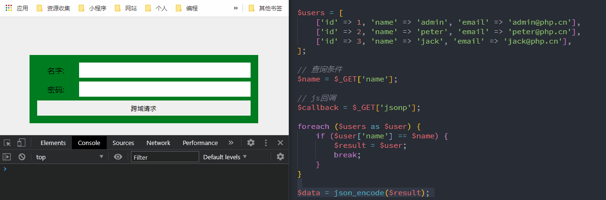

## 一、学习的新认识

今天学习了前端中与后端交互的重要环节ajax异步请求，同时也学习了最流行的跨域方式JSONP。自己新的认识有以下几点:

>- **json和js对象联系和区别** json是js提出的轻量级跨平台的数据交换/传输/存储格式，它解决了xml格式中标签过多导致网络传输量过大的问题，是目前最欢迎，支持最广的。不仅Javascript，其它如C、C++、C#、Java、PHP和Python都提供了编程接口对它的支持。
>- **ajax的post请求三种方式** 跟着老师理解了前端和后端交互的三种方式：是默认键值对方式、JSON方式和最简单的FormData对象方式，尤其是FormData方式是推荐方式，相比于普通ajax方式，它序列化数据直接被ajax识别传输，不用再要转为字符串，在后端也直接自动识别。
>- **JSONP跨域请求** 基于"同源策略"浏览器禁止使用JS脚本(Ajax)发起跨域请求，通过JSONP可以实现跨域请求数据，即使后端不支持跨域情况下。老师讲了JSONP的原理，但没讲怎么使用，我一直疑惑JSONP的回调函数的关键名从哪里来，直到在网上看了百度JSONP接口才明白。文中对后端跨域和JSONP跨域进行了区别，并实例演示了真实案例。

## 二、JSON

### 1、JSON是什么

>- JSON: JavaScript Object Notation(JS 对象表示法)
>- 跨平台跨语言的 **轻量级数据交换/传输/存储格式** ，相比于XML，没有多余的标签，减少了数据体积，提高了效率。
>- JSON 独立于任何编程语言, 几乎所有编程语言都提供了访问JSON数据的API接口，如JS的JSON.parse和JSON.stringify，PHP的json_decode和json_encode。
>- 尽管 JSON 与 JS 并无直接关系,但 JSON 在 JS 代码中应用最广泛

其实json就是字符串，不过它是符合**json格式的字符串** ，有时我们称json为json字符串 。

> **JSON格式:**
>- **大括号或中括号** 包裹。大括号 **{}存储对象字面量** ，中括号 **[]存储数组字面量** 。
>- **键-值对** json中都是键值对表示数据，**键和值以:冒号分隔** ，**键值对以,逗号分隔** ，并且**最后一个键值对后不能有逗号** 。
>- **键名必须用英文双引号** 包裹。 不管键名是否合法的js标识符都要用双引号包裹键名，单引号和没有引号都不是json格式，这点要与js对象区别开来。
>- **值可以是数值、字符串、布尔、null、对象和数组** 注意没有undefined。
>- **值是字符串时要用英文双引号** 包裹。 js对象中可用单引号或双引号，在json中若值是字符串则必须要用双引号。
>- **不能有注释** 不能在json之间注释，因为它本身就是字符串，注释后就不符合json格式了。

### 2、js对象和json字符串

如下是典型的js对象定义:

```javascript
const user = {
    name:'woxiaoyao',
    age:28,
    "first job":'worker',
    isJob:true,
    comment:null,
}
```

转化为json字符串时，要除掉const user=,给所有键名加上双引号，值中有单引号改为双引号，最后一个逗号除掉。于是就是下面形式

```javascript
{
    "name":"woxiaoyao",
    "age":28,
    "first job":"worker",
    "isJob":true,
    "commen":null
}
```

在javascript中专门提供了两个方法实现了json字符串和js格式对象互转。

>- **JSON.parse(jsonStr) 将json字符串转换为js对象** 
>- **JSON.stringify(jsObj) 将js对象转换为json字符串** 
>
> 两者怎么记忆呢？我之前有时分不清，如果你像我一样，可这样记忆，因为string是字符串的意思，所有stringify最终结果是字符串，所有可以区分parse和stringify二个作用了。

## 三、ajax异步请求

Ajax 即“Asynchronous Javascript And XML”（异步 JavaScript 和 XML），是指一种创建交互式、快速动态网页应用的网页开发技术，无需重新加载整个网页的情况下，能够更新部分网页的技术。通过在后台与服务器进行少量数据交换，Ajax 可以使网页实现异步更新。这意味着可以在不重新加载整个网页的情况下，对网页的某部分进行更新。

它依赖**XMLHttpRequest对象** ,`XMLHttpRequest`是浏览器提供的,处理异步请求的宿主对象,而非 JS 内置对象

### 1、ajax的GET请求

> **ajax的GET请求流程:**
> 1. 创建请求对象: `new XMLHttpRequest()`
> 2. 监听请求回调: `onreadystatechange`
> 3. 初始化请求参数: `open(请求类型,请求地址,是否异步)`
> 4. 发送请求: `send()`
>- 前后端数据传输: **json字符串** ，不同语言都支持json字符串
>- 前后端数据处理: 接受到数据后先通过自己的JSON编程接口转为自己语言的对象，再进行处理。如javascript的JSON.parse()和PHP的json_decode()。


```javascript
<script>   
  const form = document.querySelector('form');
  const btn = document.querySelector('button');
  btn.addEventListener('click', ajaxGet, false);

  // ajax的Get请求流程分四步：
  // 1. 创建请求对象: `new XMLHttpRequest()`
  const xhr = new XMLHttpRequest();
  // 2. 监听请求回调: `onreadystatechange`
  xhr.addEventListener('readystatechange', show, false);
  function ajaxGet(ev) {
    if (form.children[1].value) { 
      let url = 'data/index.php';            
      url = url.concat('?', 'name=',form.children[1].value);
        // 3. 初始化请求参数: `open(请求类型,请求地址,是否异步)` true表示异步
      xhr.open('GET', url, true);
      // 4. 发送请求: `send()`
      xhr.send();
    }
  }

  function show(ev) {
    if (xhr.readyState == 4) {
      // 返回的数据在xhr.responseText
      console.log(xhr.responseText);
    }
  }
</script>
```


### 2、ajax的POST请求

> **ajax的POST请求流程:**
> 1. 创建请求对象: `new XMLHttpRequest()`
> 2. 监听请求回调: `onreadystatechange`
> 3. 初始化请求参数: `open(请求类型,请求地址,是否异步)`
> 4. 设置请求头: `setRequestHeader()`
> 5. 发送请求: `send()`
>- post 与 get 相比, 多了一步: 设置请求头
>- 前后端数据传输: **json字符串** ，不同语言都支持json字符串,调用接口转为JSON字符串再传输。如JSON.stringify和PHP的json_encode()。
>- 前后端数据处理: 接受到数据后先通过自己的JSON编程接口转为自己语言的对象，再进行处理。如javascript的JSON.parse()和PHP的json_decode()。
>- 请求方式:
>   - json 数据以**表单数据类型**发送, **前端请求头**是`application/x-www-form-urlencoded`, **后端用`$_POST` 接收**。
>   - json 数组就是以**JSON**发送, **前端请求头**是`application/json;charset=utf-8`(json只支持utf-8编码), **后端用`php://input` 流文件方式接收**

```javascript
<script>
  const form = document.querySelector('form');
  const btn = document.querySelector('button');
  btn.addEventListener('click', ajaxPost, false);

  // ajax的Post请求流程分五步：
  // 1. 创建请求对象: `new XMLHttpRequest()`
  const xhr = new XMLHttpRequest();
  // 2. 监听请求回调: `onreadystatechange`
  xhr.addEventListener('readystatechange', show, false);
  function ajaxPost(ev) {
    let url = 'data/index2.php';
    // 3. 初始化请求参数: `open(请求类型,请求地址,是否异步)` true表示异步
    xhr.open('POST', url, true);
    // 4. 设置请求头: `setRequestHeader()`

    // 第一种：以表单键值对的方式发送数据
    // xhr.setRequestHeader('content-type', 'application/x-www-form-urlencoded');
    // 第二种:以json方式发送
    xhr.setRequestHeader('content-type', 'application/json;charset=utf-8');

    let $user = {
      name: 'admin',
      password: '123456',
    };
    // 转换为json字符串
    let data = JSON.stringify($user);

    // 5. 发送请求: `send()`
    xhr.send(data);
  }

  function show(ev) {
    if (xhr.readyState == 4) {
      // 返回的数据在xhr.responseText
      console.log(xhr.responseText);
    }
  }
</script>
```


### 3、FormData对象

前端ajax的post请求时能不能不写请求头, 服务器端php还能用$_POST来接收呢?答案是可以的，就是使用FormData对象直接序列化表单数据，将表单数据进行封装后统一提交，可直接被 Ajax 识别,所以可以不设置请求头。除了表单数据外,也可用于普通数据。

```javascript
// 第三种：formData对象方式，不用设置请求头，由浏览器自行判定，上面代码中请求可不用设置，数据直接通过FormData提交。
<script>
  const form = document.querySelector('form');
  const btn = document.querySelector('button');
  btn.addEventListener('click', ajaxPost, false);

  // ajax的Post请求流程分五步：
  // 1. 创建请求对象: `new XMLHttpRequest()`
  const xhr = new XMLHttpRequest();
  // 2. 监听请求回调: `onreadystatechange`
  xhr.addEventListener('readystatechange', show, false);
  function ajaxPost(ev) {
    let url = 'data/index2.php';
    // 3. 初始化请求参数: `open(请求类型,请求地址,是否异步)` true表示异步
    xhr.open('POST', url, true);
    // 4. 发送请求: `send()`
     // 第三种：formData对象方式，不用设置请求头，由浏览器自行判定，
    xhr.send(new FormData(form));
  }

  function show(ev) {
    if (xhr.readyState == 4) {
      // 返回的数据在xhr.responseText
      console.log(xhr.responseText);
    }
  }
</script>
```

FormData是XMLHttpRequest 2级定义的，它是为序列化表以及创建与表单格式相同的数据提供便利。

> 1. 利用一些键值对来模拟一系列表单控件：即将form中的所有表单元素的name和value组装成一个queryString；
> 2. 异步上传二进制文件。
>- 与普通Ajax相比，使用FormData的最大优点：可以异步上传二进制文件。

下面对FormData对象进行拓展介绍

> **创建FormData对象方式:**
> 1. **let formdata = new FormData();**  创建一个空的FormData对象，可以使用formdata.append(key,value)来添加数据。
> 2. **let formdata = new FormData(form);**  使用已有的表单来初始化一个FormData对象。

> **操作方法:**
> 1. **获取数据formdata.get(key)**
> formdata.get("username");  //获取key为username的第一个值
> formdata.getAll("username"); //获取key为username的所有值，返回一个数组
>
> 2. **添加数据formdata.append(key,value)**
> formdata.append("k1","v1");
> formdata.append("k1","v2");
> formdata.append("k2","v2");
> formdata.getAll("k1");  //["v1","v2"]
> formdata.get("k2");  //"v2"
>
> 3. **设置/修改数据formdata.set(key,value)** 如果key不存在则新增一条数据，如果存在，则会修改对应的value值。
> formdata.append("k1","v1");
> formdata.set("k1","v2");
> formdata.get("k1");  //"v2"
>
> 4. **判断是否存在某条数据formdata.has(key)** ,存在返回true，不存在返回false。
> formdata.append("k1","v1");
> formdata.has("k1");  //true
> formdata.has("k2");  //false
>
> 5. **删除数据formdata.delete(key)**
> formdata.append("k1","v1");
> formdata.delete("k1");
> formdata.get("k1");  //null
>
> 6. **遍历** 通过entries()或values()来获取一个遍历器
> formdata.append("k1","v1");
> formdata.append("k2","v2");
> for(let [key,value] of formdata.entries()){
  console.log(key +":"+ value)
}

```html
<!-- 发送数据（上传文件不刷新页面） -->
<input type="file" id="upload"/>
<input type="button" id="upload-btn" value="上传"/>
const btn = document.querySelector("#upload-btn");
btn.onclick = function(){
    let file = document.querySelector("#upload");
    let formdata = new FormData();
    formdata.append("file",file.files[0]);
    fetch("https://www.baidu.com",{ 
       method:'POST', 
       body:formdata 
    }).then(d=>{ 
       console.log("result is" + d); 
       alert("上传成功"); 
    }) 
}
```

## 四、JSONP实现跨域请求

> **跨域请求:**
>- 为了安全, 通过脚本发起的请求必须基于"同源策略"
>- 浏览器禁止使用 JS 脚本(Ajax)发起跨域请求(跨域资源共享)
>- 但是通过html中带有**src属性的标签跨域请求不能禁止**的,毕竟这是互联网发明初衷。

> **同源策略:** **协议, 域名, 端口** 三者完全相同, 则认为他们遵循了"同源策略"，否则如下面则认为不同源。
>- 协议不同(http和https)
> https://www.php.cn:443 /course/812.html
> http:// www.php.cn:443 /course/812.html
>- 端口不同
> http://www.php.cn:80 /wenda/165068.html
> http://www.php.cn:8080 /wenda/165068.html
>- 域名不同
> http://www.php.net:80 /wenda/165068.html
> http://www.php.cn:80 /wenda/165068.html

### 1、JSONP原理演示

> **JSONP:(JSON with Padding)**
>- `script`标签允许跨域请求脚本: `<script src="...."></script>`
>- 动态生成`<script>`元素,并将需要跨域访问的 URL,赋值给 script 元素的 src 属性
>- 在跨域访问的服务器脚本中(如 php),将数据转为 json 格式,直接返回给前端处理就可以了

```html
<!-- 前端 -->
<div class="container">
  <form action="" onsubmit="return false;">
    <label for="name">名字:</label>
    <input type="text" name="name" value="" id="name" required />
    <label for="email">密码:</label>
    <input type="email" name="email" value="" id="email" />
    <button>跨域请求</button>
  </form>      
</div>
<script>
  const form = document.querySelector('form');
  const btn = document.querySelector('button');
  btn.addEventListener('click', createScript, false);

  function createScript() {
    const script = document.createElement('script');
    let name = form.children[1].value;
    if (name.length < 1) return false;
    script.src = `http://blog.io/index.php?name=${name}&jsonp=show`;
    document.head.appendChild(script);
  }

  function show(data) {
    console.log(data);
    form.children[3].value = data.email;
  }
</script>
```

```php
// 后端 
<?php
$users = [
    ['id' => 1, 'name' => 'admin', 'email' => 'admin@php.cn'],
    ['id' => 2, 'name' => 'peter', 'email' => 'peter@php.cn'],
    ['id' => 3, 'name' => 'jack', 'email' => 'jack@php.cn'],
];

// 查询条件
$name = $_GET['name'];

// js回调
$callback = $_GET['jsonp'];

foreach ($users as $user) {
    if ($user['name'] == $name) {
        $result = $user;
        break;
    }
}

$data = json_encode($result);

// 创建一条js函数的调用语句返回
// echo "函数名(参数)";
echo "{$callback}({$data})";
```



### 2、 JSONP的应用场景

写这篇文章之前这个问题深深困扰着我，老师只介绍了JSONP的原理，对其应用只是一句话带过，说可以查询天气。因为我是做后端的，知道RestfulAPI一般都会设置支持跨域，其实PHP支持跨域很简单，就是在PHP源码中加上下面代码就可以了，也就是CORS。

```php
// 跨域请求
header('Content-Type: text/html;charset=utf-8');
// 代表允许任何网址请求
header('Access-Control-Allow-Origin:*');
// 允许请求的类型
header('Access-Control-Allow-Methods:POST,GET,OPTIONS,DELETE');
// 设置是否允许发送 cookies
header('Access-Control-Allow-Credentials: true');
// 设置允许自定义请求头的字段
header('Access-Control-Allow-Headers: Content-Type,Content-Length,Accept-Encoding,X-Requested-with, Origin');
```

对于后端支持跨域请求的，就没必要在前端再跨域请求了，那么后端不支持跨域请求的，如天气网站的数据，我们JSONP的回调函数的键名如何得到，是后端公开吗？明显不可能，还有就是API的格式。最后我在一篇介绍各搜索引擎的JSONP时才发现，JSONP能工作要有以下几点：

>- 首先要**抓取提供JSONP服务的api**，包括关键字和回调键名，这样我们可以提供查询数据和声明回调函数。
>- 通过上面JSONP的script的创建，**模拟后端合法的用户** ，后端在执行echo时会调用我们的声明函数，从而得到数据。
>- 对于不提供JSONP服务的，如主流的RestfulAPI的，JSONP就没办法了。

下面实战演示搜索时调用百度的搜索词联想功能

```html
<style>
  * {
    margin: 0px;
    padding: 0px;
  }
  li {
    list-style: none;
  }
  #wrap {
    width: 600px;
    height: 40px;
    margin: 100px auto;
  }
  #text {
    width: 500px;
    height: 34px;
    margin: 0 auto;
    line-height: 34px;
  }
  #list {
    width: 500px;
    border: 1px solid #ccc;
  }
  #list > li {
    width: 500px;
    height: 30px;
    line-height: 30px;
  }
  #list > li > a {
    text-decoration: none;
  }
</style>
<div id="wrap">
  <input type="text" id="text" placeholder="请输入搜索关键字" />
  <ul id="list"></ul>
</div>
<script type="text/javascript">
  //wd  查询关键字
  //cd 返回函数 回调函数
  let oInput = document.querySelector('#text'),
    oList = document.querySelector('#list');
  oInput.onblur = function () {
    let val = this.value; //获取当前input框里的内容
    console.log('input=>', val);
    if (val) {
      let oS = document.createElement('script'); //创造script标签
      oS.src = `https://sp0.baidu.com/5a1Fazu8AA54nxGko9WTAnF6hhy/su?wd=${val}&cb=getDate`;
      document.body.appendChild(oS);
      oS.onload = function () {
        //在script标签加载完后删除标签
        document.body.removeChild(oS);
      };
    }
  };
  function getDate(data) {
    //data是后台发送过来的函数调用里的参数
    console.log(data);
    let arr = data.s, //获取联想词
      str = '',
      len = arr.length;
    for (let i = 0; i < len; i++) {
      str += `<li><a href="">${arr[i]}</a></li>`;
    }
    oList.innerHTML = str;
  }
</script>
```


> **目前的问题：** 就是**JSONP的api的接口的抓取** ，这个**第三方是不提供** 的 ，早上在群里讨论是有的同学把它误认为RestfulAPI了，对于公开的RestfulAPI我们可以直接使用，当然付费也是公开的api，只不过在后端会验证你的token令牌是否合法而已。而JSONP要做的事是第三方不允许的，所有需要自己获取api。网上那篇文章只是说了通过chrome开发者的Network面板，没具体演示，我自己测试了下，还不是很会就不说了，以后明白了再补充，当然欢迎会的同学来指教。
> **补充:** 网上查询JSONP时，说可以访问RestfulApi，我自己测试了下，还是出现跨域禁止。他们可能是加上其它中转环节，也许我不知道，我也想它能访问普通API，有会的望不吝赐教。

### 3、JSONP的不足

JSONP通过script请求返回JSON实际上是脚本注入。它虽然解决了跨域问题，但它不是万能的。这里我只是简单借用下网上说的。

>- 不能接受HTTP状态码
>- 不能使用POST提交（**默认GET**）
>- 不能发送和接受HTTP头
>- 不能设置同步调用（默认异步）
>- 其最严重的就是不能提供错误处理，如果请求的代码正常执行那么会得到正确的结果。如果请求失败，如404,500之类，那么可能什么都不会发生。

## 五、学习后的总结

>- 重新认识了json，也明白了前后端交互的实质。传输中是json字符串，前后端接受数据后再转换为自己的对象处理，完后再转为json对象进行交互。解决了我以前在处理ajax请求数据时老是报错找不到时原因的问题。
>- 原生js实现了get和post请求，熟悉了请求流程，以后再用框架找问题就不再话下了
>- jsonp跨域访问，不得不说，它原理演示很简单，就是远程调用了我们声明的函数。但实际应用理解却非常困难
>   - 首先是JSONP是非法获取，它模仿第三方合法用户来获取数据，这就涉及不公开的api怎么获取?，通过chrome或其它类似的抓取，自己测试了下，目前会简单抓取天气网站的，而且是无意中看到，其它网站看不出来。
>   - JSONP对RestfulAPI的跨域访问，我看网站上是jquery封装的跨域访问RestfulAPI，而我在本地是用原生JS的JSONP测试是无效的，有待以后再补充吧。
>   - JSONP上面列举了不少缺点，但我测试后发现有个**优点** ：就是**后端不CORS情况下，对部分API可以通过JSONP的方式提供给其它用户调用**，毕竟在CORS情况下好像不能控制哪些API支持跨域。当然这个观点有待验证，先提出吧，等其它人验证。
>
> 留点疑问:postman访问没跨域限制，chrome跨域插件能将直接实际跨域如何实现？？

> **题外话:** 关于PHP端的json_encode和json_decode使用
> 我原本以为接受到数据后就json_decode，处理完数据返回给客户端前json_encode转为json字符串就可以。但在实际过程中却发现有时这样反而错误。
>- 解决方案:可后端使用print_r或var_dump打印数据，若是字符串，返回给客户端就不要再json_encode了，对于接受的数据也可以按这个方法，若是json字符串就转，不是就不用转
