<!--
 * @Descripttion: 
 * @version: 
 * @Author: woxiaoyao
 * @Date: 2020-11-07 07:25:41
 * @LastEditTime: 2020-11-07 15:20:02
-->
## 一、实战前准备知识

### 1、DOM元素常用操作

在<https://www.php.cn/blog/detail/24740.html>已经介绍了DOM元素的获取和遍历，不清楚可以去熟悉下，这里介绍DOM元素常用操作，包括创建元素、添加元素、插入元素、替换元素、删除元素以及大量添加元素时优化方案**文档片断DocumentFragment。这里增加了一些拓展测试，值得一看

> 1. **创建元素createElement** 语法:document.createElement('tag'), **根是document** ，**参数是标签名称，用单引号或双引号包裹** ,创建元素对象并**不在页面中** ,而在 **内存中** ,没有添加到页面,需要挂载到页面才显示。这里要注意标签名称一般是HTML规范的名称，经测试也可以是自定义的。

```javascript
// 1.创建元素对象，此时在内存中，需要挂载才可显示
const ul = document.createElement('ul');
ul.id = 'ul1';
// 创建元素时，标签名称也可以是自定义的
const score = document.createElement('score');
score.innerHTML = '大家好';
```

> 2. **添加元素appendChild** 也称 **挂载** ,语法:父元素对象.appendChild(新元素对象), **根是父元素对象** ,添加元素前提要有一个父元素，否则无法定位位置, **参数是元素对象，不要引号** 元素对象可以是createElement创建的元素对象，也可以是获取的或遍历的得到的元素对象。在测试时发现了它的一个 **有趣现象** ，就是**测试同一个父元素反复添加和添加到不同父元素的结果**。
>    - **父元素对象** 可以是**在内存中的元素对象(createElement或createDocumentFragment)**，也可以页面中元素对象。常见的页面元素对象有document.head,document.body和document.documetElement(Html对象)
>    - **参数中元素对象** 同父元素对象，但要注意不能是页面中唯一的对象，如body对象、head对象等。经测试document.appendChild时会报唯一对象冲突错误。
>    - **总是在尾部添加** append英文翻译是追加，就是**在最后添加元素**的意思。
>    - **同一个父元素反复添加** 先说测试结果，**反复添加最终是只算一个** ，估计是元素对象在页面文档流中都有唯一标号，不可以重复出现。
>    - **添加到不同父元素** 这个更有趣，它会 **删除以前所在位置** ，**出现在最后添加的位置** 。这个结果就非常有用了，**经典应用场景** 就是应用场景就是用户在备用选项中选择，如选择了某项爱好后，它就在提供的备用选项中移动到选择中。

```html
<style>
ul { width: 10em; height: 5em; }
#ul1 { background-color: aquamarine; }
#ul2 { background-color: seagreen; }
</style>
<script>
    const ul = document.createElement('ul');
    ul.id = 'ul1';
    //   2.页面加载元素，父元素一般是页面中元素对象
    document.body.appendChild(ul);
    const li = document.createElement('li');
    li.innerHTML = '123';
    // appendChild父元素可以是内存中元素对象
    ul.appendChild(li);
    const ul2 = document.createElement('ul');
    ul2.id = 'ul2';
    document.body.appendChild(ul2);
    // 当同一个元素添加到不同父元素时，出现有趣移动效果，这个应用场景就是用户在备用选项中选择
    ul.onclick = function (ev) {
    ul2.appendChild(li);
    };
    ul2.onclick = function (ev) {
    ul.appendChild(li);
    };
</script>
```


> 3. **插入元素insertBefore** 相比于appendChild只能在最后添加元素对象的限制外，insertBefore可以在指定元素对象前插入元素对象。语法：父元素对象.insertBefore(新元素对象,参考元素对象)。
>   - **父元素对象和参考元素对象** 二者是**父子关系** 即二者所在空间是一致的，即同为内存中元素对象或页面中元素对象。
>   - **新元素对象** 同appendChild中一样
>   - **不在insertAfter** JS默认没提供insertAfter，可以根据insertBefore写一个。

```javascript
const li2 = document.createElement('li');
li2.innerHTML = 'hello';
li2.style.color = 'red';
ul.insertBefore(li2,ul.firstChild);
```

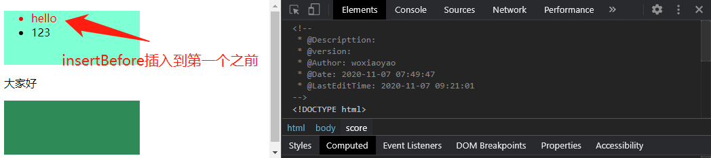

> 4. **替换元素replaceChild** 语法:父元素对象.replaceChild(新元素对象,参考元素对象)。比较简单，参考插入，不再演示

> 5. **删除元素removeChild** 语法: 父元素对象.removeChild(存在元素对象),其实删除并不是真正的删除，它在内存中仍然存在，可再次挂载。

```javascript
// 删除并不是真正的删除，它在内存中仍然存在，可再次挂载
score.onclick = function (ev) {
  document.body.removeChild(score);
  document.body.appendChild(score);
};
```

### 2、大量dom元素操作时优化方案

在说优化方案之前，我简单说下网页的二个重要部分：**DOM树和内存**，前者就是页面中已经存在的元素，后者应该是页面缓存(我也不清楚对不对,有的文档称为内存)。DOM树是已经渲染完成后的结果，每一次更新操作都会导致页面再渲染，所以大量dom操作则会导致页面一直忙于渲染，这种 **"页面回流"** 用户体验就非常不好。目前老师解决方案是文档片断，来优化或提升dom操作的效率。不过在前面我在偶然发现在内存中也可以组装，于是就有了两种优化方案。比较如下：

```javascript
// 大量元素时优化方案
ul = document.createElement('ul');
// 第一种优化方案:内存组装，一次加载
for (let i = 0; i < 1000; i++) {
  let li = document.createElement('li');
  li.innerHTML = 'item' + i;
  ul.appendChild(li);
}
//   第二种优化方案:文档片断组装，一次加载
//   const frag = document.createDocumentFragment();
//   for (let i = 0; i < 1000; i++) {
//     let li = document.createElement('li');
//     li.innerHTML = 'item' + i;
//     frag.appendChild(li);
//   }
//   ul.appendChild(frag);
document.body.appendChild(ul);
```

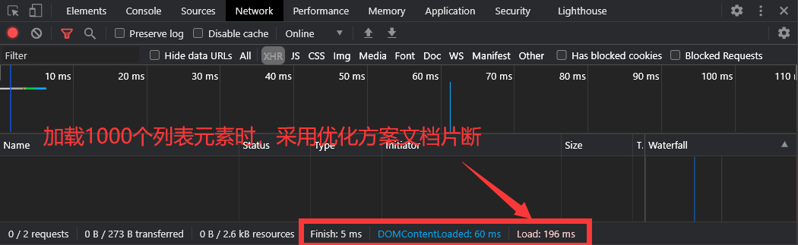
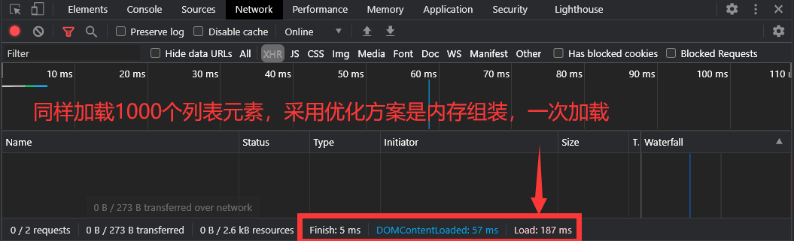

> **测试结果和结论:** 二者加载1000个列表元素 **时间相近** ，实质都是在 **内存中组装** 。关于二者区别，后来咨询了老师，老师说文档片断是通用容器,可临时存储任何类型对象，不过前者在内存中好像也是可以存储任何类型，目前我没发现什么区别。

### 3、事件对象

事件是js操作中经常要打交道的，我们重点关注和用户交互的事件，就是鼠标事件和键盘事件。不过之前还是要看下事件常用的两个属性target和currentTarget。

> **事件的两个重要属性:** 触发者**target**和绑定者**currentTarget** 以前错误想法是target是当前元素，而currentTarget是上级对象，经测试才明白它们的区别
>- **currentTarget** 绑定者就是 **绑定这个事件的元素对象** ，即是在JS中定义事件时的对象。
>- **target** 触发者是 **触发事件行为的元素对象** ，估计这个不好理解。那就实际测试理解，测试结果是 **触发者一定是绑定者或绑定者的子孙元素** 。如只定义了元素的事件，那么该元素的子孙元素若没有定义事件时，则自动继承该事件。
>
> 上面对target的测试的结论，是 **事件委托代理的工作原理** ，就是 **事件也有继承性** 。本文中实战案例大量应用事件委托代理，其实在日常JS编程中事件委托代理是经常使用的技巧，可简化逻辑和代码。

```html
<style>
    .parent {
    width: 20em;
    height: 20em;
    background-color: red;
    }
    .self {
    width: 15em;
    height: 15em;
    background-color: green;
    }
    .child {
    width: 10em;
    height: 10em;
    color: white;
    background-color: blue;
    }
</style>
<div class="parent">
    <div class="self">
    <div class="child">大家好，学习事件</div>
    </div>
</div>
<script>
    const parent1 = document.querySelector('.parent');
    const self1 = document.querySelector('.self');
    const child = document.querySelector('.child');
    // 1.target和currentTarget
    parent1.onclick = function (ev) {
    console.log('类名:%s => 触发者:%s , 绑定者:%s', this.className, ev.target, ev.currentTarget);
    };
</script>
```

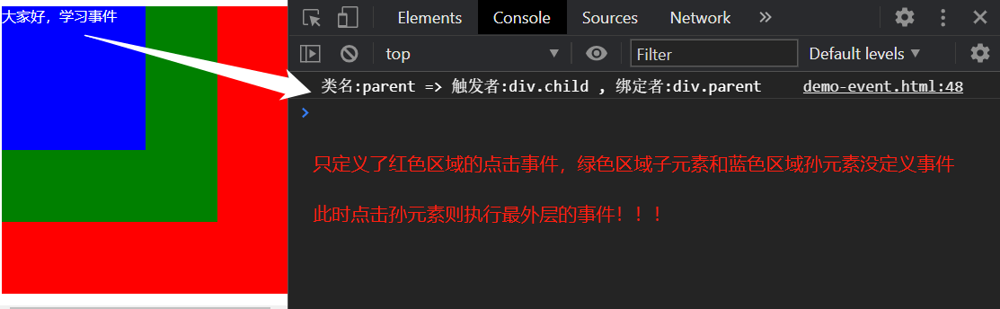

> **鼠标事件MouseEvent:** 感觉常用的就是点击类型type、各种位置坐标x与y，具体可以console.dir打印

> **键盘事件KeyboardEvent** 感觉常用的就是键盘事件类型type、key和keyCode等，一般键盘事件添加到window或input。

```javascript
window.onkeyup=function(ev){
    console.log(ev.key);
    console.dir(ev);
}
```

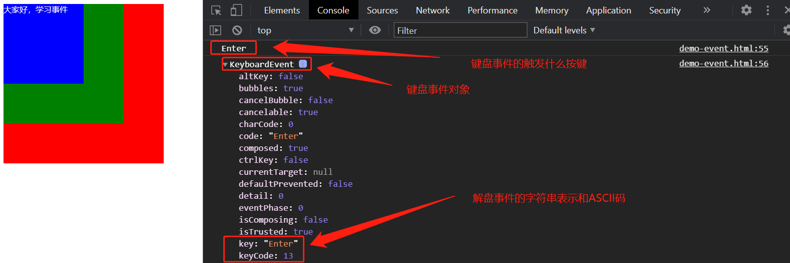

### 4、 视口高度clientHeight、滚动高度scrollTop和元素偏移高度offsetTop

>- **视口高度clientHeight** 通俗地讲就是 **可视区域高度** ，它总是小于设备屏幕尺寸。通过 **document.documentElement.clientHeight** 获取，要注意不是viewHeight，我案例中开始以为它，它是代表看过的高度。
>- **滚动高度scrollTop** 就是滚动条上边距可视区域顶部的高度。它加上视口高度所包括的内容就是用户可以浏览的内容。通过 **document.documentElement.scrollTop** 获取。
>- **元素偏移高度offsetTop** 元素在文档流中，到文档顶部的高度。通过 **元素的offsetTop** 属性获取。

**三者关系见下图：**

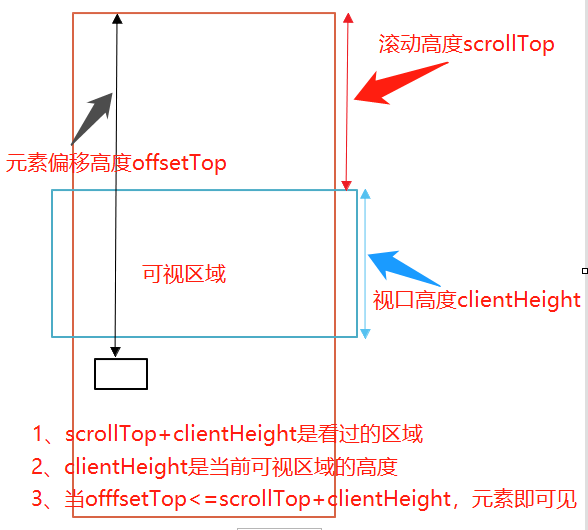


### 5、其它的

>- **this** 事件函数中this表示触发者，若是事函数使用箭头函数时，此时this不是事件触发者。
>- **innerHTML和innerText** 前者功能比后者强大，可以解析html标签元素。
>- **dataset自定义数据属性** 在元素中，用户可以通过data-为前缀添加自定义的数据属性，尤其是多个元素中**同步切换**子元素时非常有用，如tab选项卡中tab和选项区两个同步。

## 二、实战案例1:留言本

> **实现功能：**
> 1. 用户输入留言后，若不是空格或空，回车后则添加留言区
> 2. 最新的留言总是在最上面
> 3. 留言条可以删除

```html
<div class="container">
  <label for="content">输入留言:</label>
  <input type="text" id="content" name="content" value="" placeholder="输入留言后回车确认" />
  <ul id="lists"></ul>
</div>
<script>
  const content = document.querySelector('#content');
  const lists = document.querySelector('#lists');

  content.onkeyup = function (ev) {
    //   console.log(ev.key);
    // 判断回车时，添加内容到列表中
    if (ev.key == 'Enter') {
      // trim除去空格，空内容不添加
      if (content.value.trim().length > 0) {
        let li = document.createElement('li');
        li.innerHTML = content.value + "<button onclick='del(this)'>删除</button>";
        // 若列表有内容则添加到最前，没有则追加
        lists.childElementCount == 0 ? lists.appendChild(li) : lists.insertBefore(li, lists.firstElementChild);
        // 添加内容后，清空输入框
        content.value = null;
      } else {
        // 无效添加后，输入框获取焦点
        content.focus();
      }
    }
  };

  function del(el) {
    // confirm确认返回true，取消返回false
    if (confirm('确认删除')) lists.removeChild(el.parentElement);
  }
</script>
```

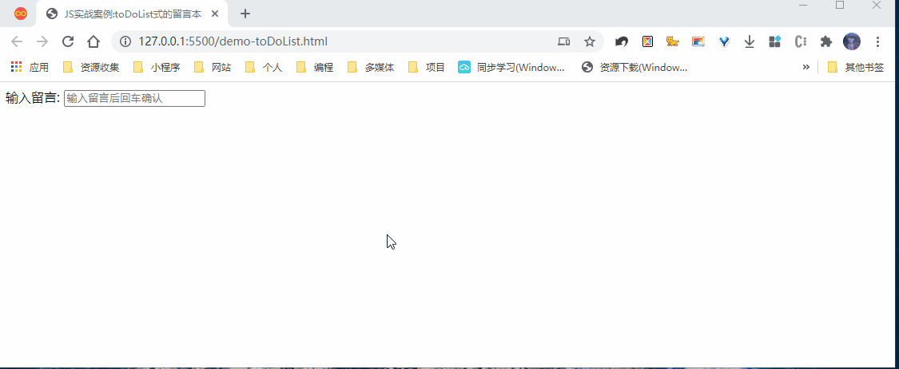

## Codepen演示 <https://codepen.io/woxiaoyao81/pen/ExyeEad>

## 三、实战案例2:tab选项卡

tab选项卡功能就不说了，这里我是通过dataset自定义属性同步tab和内容区，另一个我是通过切换order来实现内容区切换的

```html
<script>
  const divs = document.querySelectorAll('.container div:nth-child(n)');
  const ul = document.querySelector('ul');
  //   console.log(divs);

  ul.addEventListener('click', tab, false);

  function tab(ev) {
    //   tab菜单切换：先清除所有，再设置当前选择的
    for (let el of ul.children) {
      el.classList.remove('active');
    }
    ev.target.classList.toggle('active');
    //   tab区切换：先清除激活样式和order，然后设置和tab相同数据属性的区
    for (let el of divs) {
      if (el.dataset.index == ev.target.dataset.index) {
        el.classList.add('active');
        el.style.order = 0;
      } else {
        el.classList.remove('active');
        el.style.order = 1;
      }
    }
  }
</script>
```

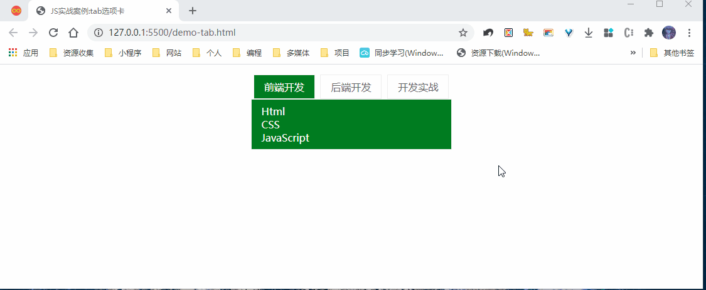

## 四、实战案例3:页面换背景

太简单了，就是设置body的background-image

```html
<div class="container">
  
  
  
</div>
<script>
  const container = document.querySelector('.container');
  container.onclick = ev => (document.body.style.backgroundImage = 'url(' + ev.target.src + ')');
</script>
```

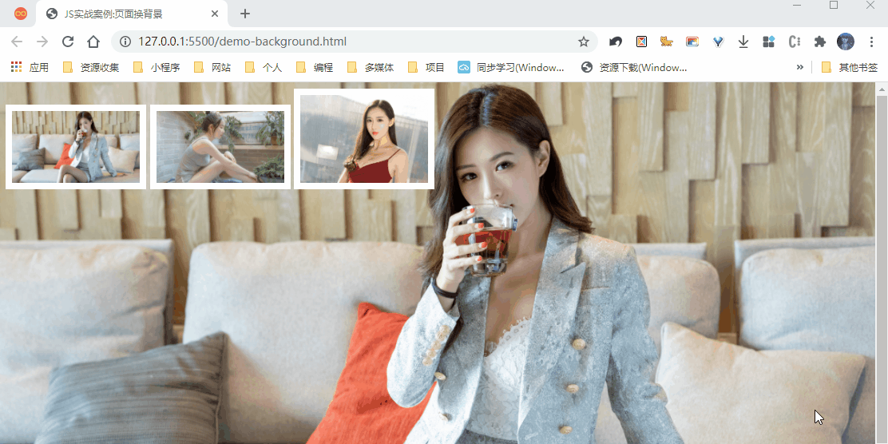

## 五、实战案例4:图片懒加载

这里关键是：一个是图片占位的概念，另一个就是通过真正的图片路径已经包括在元素data-src自定义属性中。当元素的偏移高度小于视口高度和滚动高度之和就加载图片。

```html
<script>
  const imgs = document.querySelectorAll('.container img');
  // 视口高度，即可视区域高度
  const clientHeight = document.documentElement.clientHeight;

  window.addEventListener('scroll', lazy, false);
  window.addEventListener('load', lazy, false);

  function lazy(ev) {
    // 滚动高度，可视区域滚动过的距离
    let scrollTop = document.documentElement.scrollTop;
    for (let img of imgs) {
      // 元素在文档中偏移高度,也可称为真实高度
      let offsetTop = img.offsetTop;
      // 当元素偏移高度小于（视口高度+滚动高度）时，元素就出现在可视区域了
      if (offsetTop <= scrollTop + clientHeight) {
        setTimeout(() => (img.src = img.dataset.src), 500);
      }
    }
  }
</script>
```

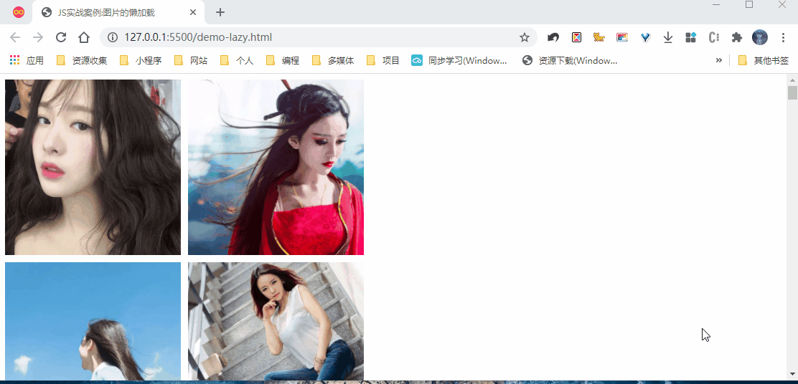

## 六、实战案例5:用户选择爱好

> **功能描述:** 从提供的爱好中选择自己的爱好，此时备选区的爱好就移动到自己爱好区。
> **关键技术:** 还记得本文前面介绍appendChild有趣的现象了吗？不知道可以向上看看。

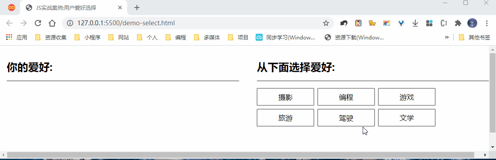

```html
<div class="container">
  <div class="box">
    <h2>你的爱好:</h2>
    <ul id="selected" class="item"></ul>
  </div>
  <div class="box">
    <h2>从下面选择爱好:</h2>
    <ul id="unselected" class="item">
      <li>摄影</li>
      <li>编程</li>
      <li>游戏</li>
      <li>旅游</li>
      <li>驾驶</li>
      <li>文学</li>
    </ul>
  </div>
</div>
<script>
  // 移动关键是利用appendchild一个特性：不同父元素添加同一个元素时，以前的位置会删除，最终出现在最后的位置
  const ulSelect = document.querySelector('#selected');
  const ul = document.querySelector('#unselected');

  ul.addEventListener('click', ulAdd, false);
  function ulAdd(ev) {
    //   判断是否有子元素，防止一次多选择
    if (ev.target.childElementCount == 0) ulSelect.appendChild(ev.target);
  }

  ulSelect.addEventListener('click', ulDel, false);
  function ulDel(ev) {
    if (ev.target.childElementCount == 0) ul.appendChild(ev.target);
  }
</script>
```

## Codepen演示代码 <https://codepen.io/woxiaoyao81/pen/mdEGxyJ>

## 七、学习后的总结

今天是原生JS实战课，非常感谢朱老师这段时间的耐心的讲解，同时也很庆幸自己每节课都认真梳理、测试和总结，在实战环节没什么压力，视频看了一遍就自己完成代码，只参考了老师核心的思想，具体实现有自己的改进。上面只贴了关键代码，源文件欢迎访问我的GitHub或Gitee

>- JS基本知识的核心要理解透，如条件、循环控制、函数和dom操作
>- 熟悉json、ajax的原理和流程，最好能动手写出代码。
>- 熟悉事件的添加、传递和委托代理，尤其是本文中测试的target和currentTaget的总结。

到这里原生JS已经学完，学习关键是多写代码，多思为什么，对自己疑问要测试，不要轻易相信网上搜的文章，要经过验证才能变成自己的。