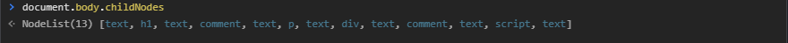
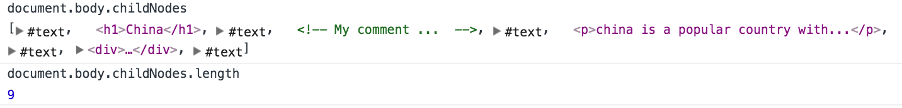
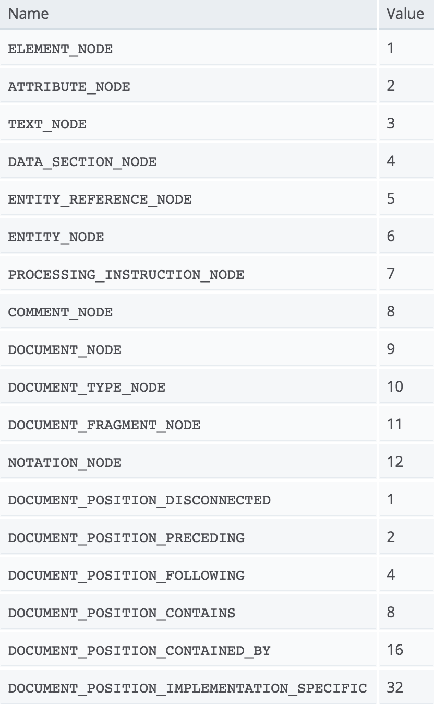
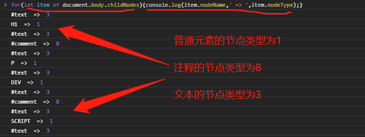

## 一、写在前面

>我们经常使用document.getElementById去获取DOM中的元素，也会使用childNodes来获取子节点。那么Element和Node的区别是什么？而什么又是HTMLCollection,HTMLElement,和NodeList呢？

### 一个简单的页面：

```html
<html>
  <body>
    <h1>China</h1>
    <!-- My comment ...  -->
    <p>China is a popular country with...</p>
    <div>
      <button>See details</button>
    </div>
  </body>
</html>
```

body里的直系子元素一共有三个：h,p,div。我们可以用document.body.childNodes查看, 结果如下:




> **问题来了：**
> 1. 这么会有这么多的#text？
> 2. 注释也算节点？

在回答上面两个问题之前，就有必要理解下什么是Node了。

## 二、Node vs Element

以下摘自MDN:

> A Node is an interface from which a number of DOM types inherit, and allows these various types to be treated (or tested) similarly.
>The following interfaces all inherit from Node its methods and properties: Document, Element, CharacterData (which Text, Comment, and CDATASection inherit), ProcessingInstruction, DocumentFragment, DocumentType, Notation, Entity, EntityReference.

简单的说就是 **Node是一个基类** ，DOM中的**Element，Text和Comment**都继承于它。
换句话说，**Element，Text和Comment是三种特殊的Node** ，它们分别叫做 **ELEMENT_NODE,
TEXT_NODE和COMMENT_NODE** 。
所以我们平时使用的**html上的元素** ，即Element，是类型为**ELEMENT_NODE的Node** 。

利用nodeType可以查看所有类型，如下图：




到这里，我想我们就可以解释上面两个问题了。

实际上Node表示的是DOM树的结构，在html中，节点与节点之间是可以插入文本的，这个插入的空隙就是TEXT_NODE，它的nodeType是3，元素节点是ElEMENT_NODE，值是1，而注释则是COMMENT_NODE，它的值是8。

## 三、NodeList vs HTMLCollection

我们用 **childNodes找到了NodeList**，但我们操作DOM时往往不想操作Node(我只想操作元素Element)，那么如何获取ElementList呢？

其实我们经常使用的getElementsByXXX返回的就是一个**ElementList，只不过它的真实名字是ElementCollection**。

就像 **NodeList是Node的集合** 一样，**ElementCollection也是Element的集合** 。但需要特别注意的是：

**NodeList和ElementCollcetion都不是真正的数组** ，如果document.getElementsByTagName('a') instanceof Array，那么必然是false。它们是类数组，可以 **使用Array.from()来转换成普通数组** 。

## 四、写在最后

DOM(Document Object Model)简称文档对象模型，它是html和xml是文档编程的接口，它将文档解析为树结构，这个树的根部就是document,而document的第一个子节点(childeNodes[0])就是html，这才有了后面的一系列html元素。

最后附一张DOM图，此刻再看这张图是不是觉得回味无穷咧。


