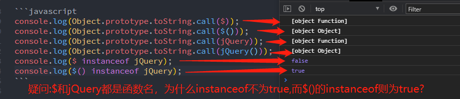
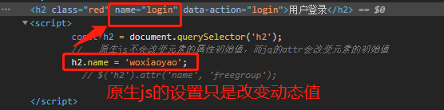
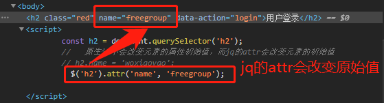

## 一、jQuery 简介

- jQuery 是一个非常流行的 JavaScript **函数库**
- jQuery 经常用于**DOM 查询数据、数据操作、动画(CSS3 已经替代)和 Ajax**等常用操作
- jQuery 宗旨: **写得更少,而做得更多**

### 1、$和\$()区别

在使用 jquery 中最常见开始的字符就是 **\$或\$()** 。至于二者区别，网上也有各种解释，不过看完之后感觉还是一片迷茫，直到朱老师提到了 jQuery 对象和函数概念，我的 Jquery 学习算入门了。下面是测试代码，重点测试了 **\$、\$()、jQuery 和 jQuery()** 。

```javascript
console.log(Object.prototype.toString.call($));
console.log(Object.prototype.toString.call($()));
console.log(Object.prototype.toString.call(jQuery));
console.log(Object.prototype.toString.call(jQuery()));
console.log($ instanceof jQuery);
console.log($() instanceof jQuery);
console.log($ instanceof Function);
```



> **结论：**
> 相信你也看到了我在图片中写的疑问了，这是我一开始的疑惑，你也可以思考下，后来我想明白了，总结结论如下。相信你也会对它们 4 个有了比较清楚的认识了。
>
> 1. jquery 库定义了 **jQuery 对象** ，也定义了 **jQuery 函数** 。注意 **j 小写，Q 大写** ，其它写法则会报错，它符合小驼峰命名法。
> 2. jquery 库同时为 **jQuery 函数名** 取 **别名\$** 。上面代码 instanceof jQuery 中 jQuery 其实是 jQuery 对象，instanceof 后面都是对象名，返回值当然是 false。函数名只能通过 instanceof Function 来验证，我在最后又加上了一行代码，从些可以判定\$就是函数名，也就是 jQuery 别名。
> 3. jQuery()函数 **返回值** 是 **jQuery 对象** 。而 **\$是 jQuery 函数名的别名**，所以 **\$()返回值也是 jQuery 对象**。
> 4. **\$或 jQuery 函数名** 主要用途：调用绑定在函数名上的静态方法，如\$.each 进行 **数据操作** 、\$.ajax 进行 **ajax 操作** 。
> 5. **\$()或 jQuery()函数** 主要用途：通过选择器或 html 元素进行 **dom 操作** ;也 **支持上面的静态方法** 进行 jQuery 类数组操作；也可以进行 **动画操作** 。
>
> 特别要提醒的：**\$是函数名，\$()是函数，jQuery 要注意大小写** ，它即可以表示函数名，也可以表示对象。

```javascript
//   函数名主要用于调用静态方法(如$.each数据操作,$.ajax操作)
let arr = [1, 2, 3, 4, 5, 6];
$.each(arr, (index, item) => console.log(item));
jQuery.each(arr, (index, item) => console.log(item));
//   函数主要用于dom操作和动画操作
$('.first').css('color', 'red');
```

### 2、\$()

- \$()是函数,但不是构造函数, **new \$()是禁止的** ，可称之 **"工厂函数"** ,也是**全局函数** ,它是 jQuery 的别名(应该说\$是 jQuery 函数名的别名).
- 它的返回值是 jQuery 对象。

> **语法 1: $\$(选择器,上下文)$ 获取 dom 元素** 。这里要说的 **上下文就是选择器的父级** ，在实际编程上中很少使用，完成可以通过选择器来实际。
>
> - 它的 **返回值是 jQuery 对象** ，可以 **调用 jQuery 对象的方法和函数** ，如 css 方法
> - jQuery 对象是 **类数组** ，它的方法都 **自带迭代功能(自带循环)** ，如下面代码设置颜色时就不需要再用 forEach 等遍历。

```javascript
// 原生js实现
const ul2 = document.querySelector('.second');
Array.from(ul2.children).forEach(element => {
  element.style.color = 'blue';
});
// jquery实现
$('.second li').css('color', '#007d20');
```

> **语法 2: $\$(js对象)$ 包装器**,将原生的 **js 对象转为 jQ 对象** ,这样就可以使用 jQuery 中的方法和属性了。
>
> - **支持所有类型的 js 对象转 jQ 对象** 老师只是列举了将 dom 元素的 js 对象转换为 JQ 对象，我测试了数组也是可以的。
> - 要 **注意的书写的区别** 如原生 dom 的 js 对象修改样式中背景是 backgroundColor,而 jquery 库则是原 css 样式 background-color。还有数组的访问的回调函数参数顺序是相反的，数组的 foreach 值在第一个参数，而 jQ 对象 each 的值在第二个参数。
> - **jQ 对象还原成原生的 js 对象** 使用 **get(n)或索引[n]** 即可，\$(this).get(0)与\$(this)[0]等价。get 参数表示第几个，从 0 开始。

```javascript
// 原生js实现
document.body.style.backgroundColor = 'lightgray';
arr.forEach((item, index) => console.log(item));
// jquery实现
$(document.body).css('background-color', 'lightgreen');
$(arr).each((index, item) => console.log(item * 2));
```

> **语法 3:$\$(html文本)$ 生成元素**。类似 document.createElement 和赋值操作，不过它是一步就完成了，而且使用 **标准的 Html 语法** ，不像原生 js 还要操作太多属性，效率提高很多。

```javascript
// 原生JS实现
const h3 = document.createElement('h3');
h3.innerHTML = 'Hello World!';
document.body.appendChild(h3);
// jquery实现
$('body').append($('<h3>Hello World!</h2>'));
```

> **语法 4:$\$(callback)$ 页面 dom 创建完成后自动调用** 如 dom 元素的获取在 body 之前是不允许的，因为渲染是按源码顺序的。若是放在\$(callback)回调函数中则没问题。

```html
<script>
  $(() => $('h2').css('color', 'red'));
</script>
<body>
  <h2>Hello World!</h2>
</body>
```

### 3、\$.each 和\$(js 对象).each

上面已经详细介绍了$与\$()区别以前\$()常用的四个语法。那么在老师讲课代码中发现\$.each和\$().each 又有什么区别？老师并没有说明，经过我测试发现它们区别

> - 二者 **都是遍历操作** ，回调函数第一个参数是索引，第二个是值。
> - **\$.each 第一个参数是要遍历数组** ，而\$().each 没有第一个参数，它要 **遍历的是\$()返回的 jQuery 对象**(类数组)。

```javascript
$.each($('li'), (key, item) => (item.style.color = 'green'));
$('li').each((key, item) => (item.style.color = 'red'));
```

### 4、\$(this)到底是谁

很明显\$(this)仍然 jQuery 对象，但是熟悉使用 ES6 的箭头函数的我们要注意了，**箭头函数是没有 this** ，所有**想在回调函数中使用\$(this)代表自己时，一定要使用 function(){}** 而不能使用()=>{}。在箭头函数中\$(this)是 window 对象。

## 二、jQuery 的 getter 和 setter 方法

所谓 jQuery 的 getter 和 setter 方法是指方法具有 **获取和设置** 功能，依据参数个数的两不同可以进行获取和设置操作。下面增加了自己的多项测试，也许更能吃透这些方法。

> - **attr():获取初始值或设置属性值** ，这里要区别 css()和 val()，它可以完成 css()和 val()功能，但 **仅限于初始值** (初始值概念等会举例子说明)。
> - **css():获取计算样式或设置行内样式** 专门针对 CSS 样式而提供 getter 和 setter 方法
> - **val():表单获取或设置 value** 专门针对表单提供的 getter 或 setter 方法
> - **html():获取或设置 innerHTML** 这个简化原生 js 工作量，同样支持 html 原生元素解析
> - **text():获取或设置 innerText** 这个简化原生 js 工作量，同样也只是获取文本

### 1、attr()获取或设置属性

> **属性初始值:** 不理解它就无法理解原生 js 设置属性值和 jquery 设置属性值区别，这个老师是没讲的，估计大部分网上文章也没有这概念，这个也是我自己根据理解命名的，如果不合适可以指正。 所谓 **初始值** 就是 **开发者工具中看到的属性值** 。**js 原生对象设置的值**不体现到初始值上，而是 **动态值** 。而 jQuery 的 **attr 设置的则是同时设置初始值和动态值**

```javascript
const email = document.querySelector('#email');
// 原生js设置值
email.value = 'woxiaoyao@qq.com';
// jqery的attr设置值
// $('#email').attr('value', '14332323@qq.com');
```




> **语法 1:attr(name)** name 为属性名,此时为 **获取属性的初始值** 初始值请看上面解释，最好自己测试下就明白了。
>
> - **属性名 name 和原生 JS 中小驼峰命名命名属性不同** ，它是直接使用 **原样的属性名** 。如 background-color 属性，js 中是 style.backgroundColor，而 name 只是原样 background-color 就可以了，只要熟悉 CSS 就不用再增加另外记忆了。
> - 它 **能获取属性的初始值** ，**不能获取采用原生 js 改变的属性值**(这个要切记，我也是测试时偶然发现的)。
> - 它能获取元素的 **所有类型的属性值** ，包括 data-定义的 **自定义数据属性值** 。
> - **attr 获取属性值要和 attr 设置属性值配合**，**不要和原生 jS 设置属性值配合使用** ，因为它获取不到原生 JS 改变的属性值，理由见上面。

```javascript
//  原生jS方法
const email = document.querySelector('#email');
console.log('原生js => ', email.value);
const form = document.forms.namedItem('login');
console.log('原生js => ', form.email.value);
//   jquery方法
console.log('jquery => ', $('#email').attr('value'));
//   对自定义数据属性的支持
console.log(document.querySelector('h2').dataset.action);
console.log($('h2').attr('data-action'));
```

> **语法 2：attr(name,value)** name 是属性名，value 是新的值。此时它是设置属性的值(包括初始值和动态值)，可原生 JS 获取，也可 attr 获取。

```javascript
const email = document.querySelector('#email');
// 原生js设置值
// email.value = 'woxiaoyao@qq.com';
// jqery的attr设置值
$('#email').attr('value', '14332323@qq.com');
//  原生jS方法
console.log('原生js => ', form.email.value);
//   jquery方法
console.log('jquery => ', $('#email').attr('value'));
```

> **语法 3：attr(name,callback)** 设置时第二个参数支持回调函数，可根据条件动态设置属性值。

```javascript
$('form').attr('action', function () {
  return $(this).attr('method') == 'get' ? 'api/getInfo.php' : 'api/setInfo.php';
});
```

> **语法 4:attr({设置一组属性值})** 这个老师没讲，我是看到老师在 CSS 中用到这个设置属性，就想着 attr 是否有同样的功能，查手册还真有。**手册中是采用普通对象的写法** 即属性名上不加引号，我 **建议使用 json 格式定义，这样可支持如 border-top 带横线相连的属性，也支持自定义数据属性** 。至于 json 格式是什么，可看下我的文章<https://www.php.cn/blog/detail/24774.html>

```javascript
$('h2').attr({ class: 'red selected', 'data-action': 'test' });
```

### 2、CSS()获取计算样式值或设置行内样式

对于常用的 CSS 操作，jquery 封装定义了 css()函数。其 **4 个语法和 attr()一样** 。我就不再详细描述了，直接上代码，不清楚可看下 attr()语法。和 attr()不同的是它 **可以获取原生 JS 改变的属性值** 。

```javascript
// css(): 设置元素的行内样式 style=""
// css(name): 获取
// css(name,value): 设置
// css(name, callback): 第二个参数支持回调
// 原生JS方式
const form = document.forms.namedItem('login');
form.email.style.border = '1px solid red';
console.log(form.email.style.border);
// jquery方式
console.log($('#email').css('border'));
$('#email').css('border', '2px dotted green');
// 设置一组时建议使用json格式的书写方式，这样可支持复杂的属性名，包括自下定义属性名
$('form').css({
  'border-top': '2px solid red',
  'border-bottom': '2px dotted green',
});
// 第二个参数是回调函数
$('form').css('background-color', () => {
  const colors = ['green', 'lightgreen', 'lightgray', 'skyblue', 'yellow', '#007d20'];
  // Math中floor是向下取整数，random()是随机数，0-1之间的小数。
  let index = Math.floor(Math.random() * colors.length);
  return colors[index];
});
```

### 3、val()表单获取或设置 value

同 CSS 一样，对于常见表单操作，jquery 也封装了 val()方法，专门用来高效处理表单的 value 值的获取和设置。它的语法也是支持获取、设置和回调函数。同和 attr()不同的是它 **可以获取原生 JS 改变的属性值** 。

> - **val()无参数为获取值**
> - **val(value)有一个参数为设置值**
> - **val(callback)回调函数设置值**
>
> 说明一下:一般都是获取单个 input，若是通过类获取一组 input，则 **设置是一组** ，可使用它 **重置表单数据** 。

```javascript
// 原生js方式
console.log('原生 => ', form.email.value);
form.email.value = 'xiaoyao@163.com';
//  jquery方式
console.log('jquery => ', $('#email').val());
$('#email').val('admin');
// 参数是回调函数
$('#password').val(() => {
  let email = $('#email').val();
  // test是正则表达式匹配
  if (/admin/.test(email) != null) return '123456';
});
console.log($('#password').val());
```

### 4、html()和 text()获取或设置内容

在原生 JS 中 **对应的是 innerHTML 和 innerText** 。它二者区别是前者返回完整的内容,包括 html 标签；而后者则只返回文本，html()和 text()区别也是如此，它的 **书写语法同 val()有 3 个，无参数是获取，有参数是设置，也支持回调函数** 。

```javascript
console.log($('h2').html());
console.log($('h2').text());
$('h2').html('欢迎登录');
$('h2').text('下次登录');
$('h2').html(function () {
  return '<strong>欢迎登录</strong>';
});
```

> **getter 和 setter 方法总结:**
>
> - attr()和 css()都是 **第一个参数是获取，第二个参数是设置，并支持回调函数，也可设置一组属性值** ,设置一组属性值时 **建议使用 json 格式** 。
> - val()、html()和 text()都是对于特定的常见操作封装的方法，**无参数是获取，有参数是设置，并支持回调函数**。
> - 回调函数中要注意若是 **使用\$(this)获取本身的数据时不要使用箭头函数** 简化回调函数。不需要时可以使用箭头函数。
> - **jquery 的方法和原生 js 的方法搭配使用要小心** ，建议对于 dom 操作不要混搭，尤其是 attr()方法和原生 js 配合时要注意它只能获取属性的初始值，原生 JS 改变属性值它是获取不到。

## 三、jQuery的元素相关操作

 jQuery 封装了大量 dom 操作，它当初的一个重要目的就是简化 dom 操作，获取元素就是通过\$('选择器')就可以了。下面主要介绍下增加删除元素和遍历元素的操作

### 1、增加和插入元素

> **append 语法:parent.append(新元素)或 parent.append(html)** 父元素追加新元素或 html 文本,对应原生 JS 的 appendChild
> **appendTo 语法:新元素.appendTo(parent)** 新元素追加到父元素

```javascript
const li1 = $('<li>item1</li>');
$('ul').append(li1);
$('ul').append('<li>item2</li>');
const li2 = $('<li>item3</li>
```

> **insertBefore 语法:新元素.insertBefore(位置)** 在位置之前插入,对应原生 JS 的 insertBefore
> **insertAfter 语法:新元素.insertAfter(位置)** 在位置之后插入

```javascript
$('h2').replaceWith('<h1 style="color:red;">这是开头</h1>');
$('<h3 style="color:green;">这是结尾测试</h3>').replaceAll($('h3'));
```

### 2、替换元素

> **replaceWith 语法:当前元素.replaceWith(替换元素)**   
> **replaceAll 语法:替换元素.replaceAll(当前元素)**   

```javascript
$('h2').replaceWith('<h1 style="color:red;">这是开头</h1>');
$('<h3 style="color:green;">这是结尾测试</h3>').replaceAll($('h3'));
```

### 3、删除元素

> **remove 语法:删除元素.remove()**

```javascript
$('h3').remove();
```

### 4、遍历元素

> **parent() 获取父元素** 若有参数则是筛选条件
> **prev() 获取前一个兄弟元素** 若有参数则是筛选条件
> **next() 获取后一人兄弟元素** 若有参数则是筛选条件
> **first() 第一个元素**
> **last() 最后一个元素**
> **eq(num) 第几个元素** 从0开始计算。
> **children() 所有子元素** 若有参数则是筛选条件
> **find()** 在所有后代元素查找符合条件的元素。

```javascript
console.log('parent => ',$('ul').parent());
console.log('prev => ',$('ul').prev());
console.log('next => ',$('ul').next());
console.log('first child => ',$('ul').children().first().get(0));
console.log('last child => ',$('ul').children().last().get(0));      
console.log('child => ',$('ul').children().eq(1).get(0)); 
console.log($('body').find('li'));     
```

> **元素操作补充:**
>- 更多的操作可以看手册，上面已经介绍了常见的操作，有原生JS基础，上面都不难理解，而且 **jQuery更加语义化** ，函数名和操作是对应的，一看就知道做什么，这点要比原生更有友好。
>- 参数要区分 **jQuery对象和html文本** 。 **前面是当前元素时二者都可以** ，如append和replaceWith。若**前面是新元素**则参数则是jQuery对象。
>- children()只能选择子元素集合,不能选择所有后代(任何层级),find()则是在后代元素中递归查找，可以找到任何元素。但若知道层级则不建议使用find()，递归是影响效率的。

## 四、jQuery 的事件

### 1、事件分类

上次介绍原生JS的事件时，说了事件属性定义事件只能是一个，而事件监听器则是叠加的，当时也有疑问，为什么？后来才知道， **事件是分等级的** 。事件属性或onclick定义的是 **DOM0级事件，它不可叠加** 。而 **addEventListener事件监听器添加的事件则DOM2级事件，可叠加** 。也许你会问有没有DOM1级事件，DOM级别1于1998年10月1日成为W3C推荐标准。1级DOM标准中并没有定义事件相关的内容，所以没有所谓的1级DOM事件模型。在2级DOM中除了定义了一些DOM相关的操作之外还定义了一个事件模型 ，这个标准下的事件模型就是我们所说的2级DOM事件模型 。

### 2、\$('selector').事件()定义的DOM0级事件

> **语法:\$('selector').事件(function(event){})或\$('selector').事件((event)=>{})** 前者是function定义的回调函数，后者是箭头函数定义的回调函数，要注意若是使用\$(this)则必须用第一个。它对应原生JS的事件属性定义事件

```javascript
$('input').blur(function (event) { console.log($(this).val()); });
```

### 3、\$('selector').on(事件类型,[数据,]回调函数)定义的DOM2级事件

它对应原生JS的事件监听器addEventListener。

```javascript
$('input').on('click', event => { console.log('on => ', event); });
//   若是要传递数据则使用json格式的对象，传递给event.data
$('input').on('click', { name: 'woxiapyao', pwd: '123456' }, event => { console.log('on => ', event.data); });
```

## 五、学习后的总结

>- jquery函数库相比原生JS最大的特点就是 **语义化、简短化和对CSS选择器的支持** 所有方法和属性一看就知道做什么，并且不用写那么长的函数名和方法名。
>- jquery入门的关键就是几个概念理解: **\$、\$()、jQuery、jQuery()、\$(this)** 。不不清楚可以看本文第一节
>- jquery函数库中方法有几个特点:
>   - **获取getter和设置setter合并成一个方法** ，通过参数个数来区分，这个思想值得我们借鉴。
>   - **普遍支持回调函数** 不过要使用\$(this)时一定要用function形式的回调函数。
>   - **自带迭代(循环)** 这点极大减少开发者工作量
>   - **批量数据使用json格式** 无论是设置时参数，还是传递数据，其批量数据建议使用json格式，可以支持更多，减少错误。
>- 熟悉jquery函数库的dom操作，并和原生JS相比较，最在特点就是将开发者常用的需求都进行了封装，只需要几行代码就可以完成以前原生JS几十行代码才能完成的功能。
>- 熟悉jquery事件的书写语法。

> **补充：** 我的文章一般都以Markdown发往PHP中文网、github和gitee。如jquery的\$符号，支持最好的就是github，无论转换\还是不转换都支持，而PHP中文网不支持转换，直接使用\$即可，而Gitee则是需要双转换\\\才正常。
