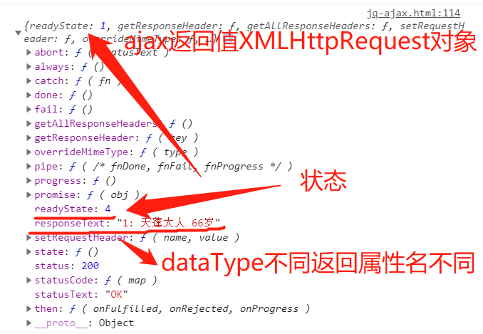
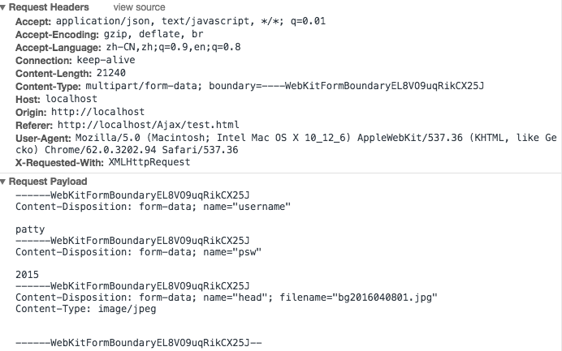

## 一、关于 jquery 的 ajax

因为开发项目经常接触 jquery 的 ajax，也知道基本语法，其中参数中 type、url、data 和 suscess 成功函数经常使用，本以为很熟悉了，但通过老师的授课，我才知道它竟然是一个庞大的体系，它等同于原生 JS 中 XMLHttpRequest 对象完成了和后端的交互。

> **ajax() 方法通过 HTTP 请求加载远程数据**
> 该方法是 jQuery 底层 AJAX 实现。简单易用的高层实现了\$.get, \$.post 等。\$.ajax() **返回其创建的 XMLHttpRequest 对象** ，下图是打印的返回对象。大多数情况下你无需直接操作该函数，除非你需要操作不常用的选项，以获得更多的灵活性。
> 最简单的情况下，\$.ajax() 可以不带任何参数直接使用。
> **注意：所有的选项都可以通过 \$.ajaxSetup() 函数来全局设置**。



下面先介绍下常见的使用，最后再附上我收集和学习的一些，重点是常用方法、参数和一些简单使用，至于更深入的学习随以后再补充。

## 二、jquery 中与 ajax 相关的操作

### 1、 相关操作简介

> 1. load(): 请求数据
> 2. \$.get(): 请求数据
> 3. \$.post(): 请求数据
> 4. \$.getJSON(): 请求 JSON 数据，dataType 为 json
> 5. \$.ajax(): 请求数据，dataType 一般为 html 或 json
> 6. \$.ajax()-jsonp: 跨域请求数据,dataType 为 jsonp

### 2、dataType

ajax 的方法是经常介绍的，常用的是 GET 或 POST，但最有意思却是 dataType 属性，它的取值决定了可获取什么类型数据，如上面已经介绍的 html、json 和 jsonp,下面对它的取值进行了归纳：

> **dateType 后接受的参数**
> 参数类型： **string**
> 预期服务器返回的数据类型。如果不指定，jQuery 将自动根据 HTTP 包 MIME 信息来智能判断。比如 XML MIME 类型就被识别为 XML。在 1.4 中，JSON 就会生成一个 JavaScript 对象，而 script 则会执行这个脚本。随后服务器端返回的数据会根据这个值解析后，传递给回调 函数。

> 1. "xml": 返回 XML 文档，可用 jQuery 处理。现在基本被 json 替代了。
> 2. **"html": 返回纯文本 HTML 信息** ；包含的 script 标签会在插入 dom 时执行。
> 3. "script": 返回纯文本 JavaScript 代码。不会自动缓存结果。除非设置了 "cache" 参数。注意：在远程请求时(不在同一个域下)，所有 POST 请求都将转为 GET 请求。（因为将使用 DOM 的 script 标签来加载）
> 4. **"json": 返回 JSON 数据** 。公共 API 最常见的返回方式，也是 ajax 局部更新页面的关键所在。
> 5. **"jsonp": JSONP 格式**。使用 JSONP 形式调用函数时，如 "myurl?callback=?" jQuery 将自动替换 ? 为正确的函数名，以执行回调函数。
> 6. "text": 返回纯文本字符串
> 7. "local":返回本地数据（即第一次初始化时只加载本地代码显示的样式，而不加载任何后台返回的数据）

## 三、jquery 中与 ajax 相关的操作演示

### 1、演示前需要补充的知识

后面演示需要使用 jquery 的 dom 操作，至于 jquery 基本知识和操作可见我的文章<https://www.php.cn/blog/detail/24825.html>，这里补充知识其实就是我在练习时遇到的错误，也许对使用 jquery 使用有更深入的帮助。

> **创建或插入元素时注意事项** jquery 和原生 JS 对于元素的处理是不同的，**原生 JS 是元素名称即可**，如 createElement('div')，而 **jquery 则是完整的 html 书写语法** ，对应就是\$('\<div>')，对于这点一定要注意，jquery 为了降低学习成本，支持原生 html 和 CSS 选择器的书写格式。

> **jquery 的 click 方法是 DOM0 级事件吗?** 记得老师上课说 click 相当于原生 JS 的事件属性，而 on 则是相当于事件监听器，所以在上篇文章中也是这样写的总结，结果在本次测试时却意外发现不是这么回事？多次定义 click 事件产生叠加效果，这和 DOM0 级事件特性不符合，所以它只能是 DOM2 级事件。

> **this 和回调函数** 为什么要提这个，前面文章也经常说 **function(){}回调函数中 this 表示本身，而箭头函数定义的回调函数中则没有 this** ，那么 **箭头函数中 this 则是代表外而一层对象** ，如下面测试案例中，按钮点击事件的回调函数中 ajax 的 success 中调用 this，若 ajax 的箭头函数中有 this 则代表按钮，即外一层是按钮。当然可以采用老师的解决方案，使用事件对象的 target，即 event.target，至于事件对象的 target 和 currentTarget 区别见<https://www.php.cn/blog/detail/24777.html>中事件对象的介绍部分。

> **jQuery 对象和 js 对象** 前篇文章中已经介绍过了$(js对象)转成jQuery对象，而jQuery对象get(index)或数组索引都可转成js对象。那么在 **jQuery的each中item** 或 **事件的回调函数中this则是js对象** ，想继续使用jQuery方法则需要\$()转成 jQuery 对象。

### 2、下面是演示代码

```html
<style>
  body {
    display: grid;
    gap: 15px;
  }
  button {
    padding: 0.5em;
    text-align: left;
  }
  button span {
    color: red;
  }
  button:hover {
    background-color: lightcyan;
    cursor: pointer;
  }
</style>
<button>1. load(): 请求数据</button>
<button>2. $.get(): 请求数据</button>
<button>3. $.post(): 请求数据</button>
<button>4. $.getJSON(): 请求JSON数据</button>
<button>5. $.ajax(): 请求数据</button>
<button>6. $.ajax()-jsonp: 跨域请求数据1</button>
<button>7. $.ajax()-jsonp: 跨域请求数据2</button>
<script>
  const btns = document.querySelectorAll('button');
  //  1. $.load和$.ajax等效实现
  //   增加判断，防止重复添加
  $(btns[0]).click(function () {
    if ($(this).next().get(0).tagName == 'BUTTON') $(this).after('<div class="nav">').next().load('nav.html');
  });
  // $.ajax等效实现
  $(btns[4]).click(function () {
    $.ajax({
      url: 'nav.html',
      success: res => {
        if ($(this).next().get(0).tagName == 'BUTTON') $(this).after('<div class="nav">').next().html(res);
      },
    });
  });
  //   2.$.get和$.post
  // $.get(url,callback),参数在url后面用?开始，使用key=value形式，多个使用&连接,其实也可以使用数据formData传递参数
  // $.post(url,data,callback)，使用formData传递参数，经测试也支持url?传递参数，我想二者唯一区别就是请求类型了。
  $(btns[1]).click(function (ev) {
    //   标准的$.get语法
    // $.get('http://localhost/users.php?id=1',(res)=>{
    //     if ($(this).next().get(0).tagName == 'BUTTON') $(this).after('<div>').next().html(res);
    // });
    // $.get也支持直接传递数据
    $.get('http://localhost/users.php', { id: 3 }, function (res) {
      if ($(ev.target).next().get(0).tagName == 'BUTTON') $(ev.target).after('<div>').next().html(res);
    });
  });
  //   $.post
  $(btns[2]).click(function () {
    // $.post('http://localhost/users.php', { id: 2 }, res => {
    //   if ($(this).next().get(0).tagName == 'BUTTON') $(this).after('<div>').next().html(res);
    // });
    $.post('http://localhost/users.php?id=2', res => {
      if ($(this).next().get(0).tagName == 'BUTTON') $(this).after('<div>').next().html(res);
    });
  });
  //  3. $.getJSON
  $(btns[3]).click(function () {
    $.getJSON('http://localhost/users.php?id=1', res => {
      // 从服务器返回josn会自动解析为JS对象,JSON.parse()
      console.log(res);
      //使用模板字面量或标签函数格式化成字符串(包括html格式)
      const resStr = `${res.id}=><span style="color:red">${res.name}</span><em>${res.age}</em>`;
      if ($(this).next().get(0).tagName == 'BUTTON') $(this).after('<div>').next().html(resStr);
    });
  });
  //   4.$.ajax() =  $.load() + $.get() + $.post() + $.getJSON() + $.getScript()
  //   $.ajax({
  //     //   请求类型,常见是GET和POST
  //     type: "GET",
  //     //   请求的url地址
  //     url: url,
  //     //   发送数据，formData
  //     data: data,
  //     // 希望服务器端响应返回的数据类型是什么，常见有html/json,上面$.load对应html,$.getJSON
  //     dataType: "json",
  //     // 请求成功的回调方法
  //     success: callback,
  //   });
  //   $.click两个都执行了，说明click不是事件属性，而是事件监听器
  $(btns[4]).click(function () {
    const xhr = $.ajax({
      type: 'GET',
      url: 'http://localhost/users.php',
      data: { id: 1 },
      dataType: 'html',
      success: res => {
        console.log(res);
        if ($(this).next().get(0).tagName == 'BUTTON') $(this).after('<div>').next().html(res);
      },
    });
    console.log(xhr);
  });
  //   5.$.ajax实现的跨域1和2
  // jsonp=?, ?是回调方法的占位符,请求发送时用jsonpCallback替换
  //第一种，指定jsonp函数
  $(btns[5]).click(function () {
    const xhr = $.ajax({
      type: 'GET',
      url: 'http://php.io/test.php?id=2&jsonp=?',
      dataType: 'jsonp',
      jsonpCallback: 'handle',
    });
    console.log(xhr);
  });
  function handle(res) {
    console.log(res);
    const resStr = `<span style="color:red">${res.name}</span>=><em>${res.email}</em>`;
    if ($(btns[5]).next().get(0).tagName != 'DIV') $(btns[5]).after('<div>').next().html(resStr);
  }
  //   第二种，直接使用success作为jsonp函数
  $(btns[6]).click(function (ev) {
    $.ajax({
      type: 'GET',
      url: 'http://php.io/test.php?id=2&jsonp=?',
      dataType: 'jsonp',
      success: res => {
        console.log(res);
        const resStr = `<span style="color:red">${res.name}</span>=><em>${res.email}</em>`;
        if ($(ev.target).next().get(0).tagName != 'DIV') $(ev.target).after('<div>').next().html(resStr);
      },
    });
  });
</script>
```

## 四、ajax 的深入探讨

平常使用 ajax，上面知识就基本够用了，下面是更多的探讨，涉及更的参数，可以作为参考，能理解更好，这样对 ajax 认识就更透彻，建议结合原生 JS 的 XMLHttpRequest 来学习。自从听了老师讲 jquery 和 vuejs 课程中总是使用原生 JS 来解构，发现掌握原生 JS 可以理解这些函数库或框架，反过来，也更加灵活的混合使用原生 JS 和其它函数库或框架解决问题。下面只是初步探讨，以后深入会再补充。

### 1、ajax的全参数

\$.ajax()方法用于执行AJAX(异步HTTP)请求。所有的jQuery AJAX方法都使用\$.ajax()方法。该方法通常用于其他方法不能完成的请求。

|名称|值类型|描述|
|---|:---:|----|
|type|String|请求方式 ("POST" 或 "GET")， 默认为 "GET"。注意：其它 HTTP 请求方法，如 PUT 和 DELETE 也可以使用，但仅部分浏览器支持。|
|url|String|规定发送请求的 URL。默认是当前页面。|
|contentType|String|发送数据到服务器时所使用的内容类型。默认是："application/x-www-form-urlencoded"。|
|async|Boolean|默认设置下，所有请求均为异步请求。如果需要发送同步请求，请将此选项设置为 false。注意，同步请求将锁住浏览器，用户其它操作必须等待请求完成才可以执行。|
|timeout|Number|设置请求超时时间（毫秒）。此设置将覆盖全局设置。|
|data|Object|送到服务器的数据。将自动转换为请求字符串格式。GET 请求中将附加在 URL 后。查看 processData 选项说明以禁止此自动转换。必须为 Key/Value 格式。如果为数组，jQuery 将自动为不同值对应同一个名称。如 {foo:["bar1", "bar2"]} 转换为 "&foo=bar1&foo=bar2"。|
|dataType|String|预期服务器返回的数据类型。如果不指定，jQuery 将自动根据 HTTP 包 MIME 信息来智能判断，比如XML MIME类型就被识别为XML。在1.4中，JSON就会生成一个JavaScript对象，而script则会执行这个脚本。随后服务器端返回的数据会根据这个值解析后，传递给回调函数。可用值:①"xml": 返回 XML 文档，可用 jQuery 处理。②"html": 返回纯文本 HTML 信息；包含的script标签会在插入dom时执行。③"script": 返回纯文本 JavaScript 代码。不会自动缓存结果。除非设置了"cache"参数。'''注意：'''在远程请求时(不在同一个域下)，所有POST请求都将转为GET请求。(因为将使用DOM的script标签来加载)④"json": 返回 JSON 数据 。⑤"jsonp": JSONP 格式。使用 JSONP 形式调用函数时，如 "myurl?callback=?" jQuery 将自动替换 ? 为正确的函数名，以执行回调函数。⑥"text": 返回纯文本字符串|
|jsonpCallback|Function|为jsonp请求指定一个回调函数名。这个值将用来取代jQuery自动生成的随机函数名。这主要用来让jQuery生成度独特的函数名，这样管理请求更容易，也能方便地提供回调函数和错误处理。你也可以在想让浏览器缓存GET请求的时候，指定这个回调函数名。|
|success(result,status,xhr)|Function|【Ajax 事件】当请求成功后的回调函数。result参数由服务器返回，并根据dataType参数进行处理后的数据。|
|error(xhr,status,error)|Function|【Ajax 事件】(默认: 自动判断 (xml 或 html)) 请求失败时调用此函数。有以下三个参数：XMLHttpRequest 对象、错误信息、（可选）捕获的异常对象。如果发生了错误，错误信息（第二个参数）除了得到null之外，还可能是"timeout", "error", "notmodified" 和 "parsererror"。|
|complete(xhr,status)|Function|【Ajax 事件】请求完成时运行的函数（在请求成功或失败之后均调用，即在 success 和 error 函数之后）。参数： XMLHttpRequest 对象和一个描述成功请求类型的字符串。 |
|beforeSend(xhr)|Function|【Ajax 事件】发送请求前可修改 XMLHttpRequest 对象的函数，如添加自定义 HTTP 头。XMLHttpRequest 对象是唯一的参数。如果返回false可以取消本次ajax请求。|
|dataFilter(data,type)|Function|用给Ajax返回的原始数据的进行预处理的函数。提供data和type两个参数：data是Ajax返回的原始数据，type是调用jQuery.ajax时提供的dataType参数。函数返回的值将由jQuery进一步处理|
|context|String|这个对象用于设置Ajax相关回调函数的上下文。也就是说，让回调函数内this指向这个对象（如果不设定这个参数，那么this就指向调用本次AJAX请求时传递的options参数）。比如指定一个DOM元素作为context参数，这样就设置了success回调函数的上下文为这个DOM元素。|
|cache|Boolean|(默认: true,dataType为script和jsonp时默认为false) jQuery 1.2 新功能，设置为 false 将不缓存此页面。|
|ifModified|Boolean|(默认: false) 仅在服务器数据改变时获取新数据。使用 HTTP 包 Last-Modified 头信息判断。在jQuery 1.4中，他也会检查服务器指定的'etag'来确定数据没有被修改过。|
|processData|Boolean|(默认: true) 默认情况下，通过data选项传递进来的数据，如果是一个对象(技术上讲只要不是字符串)，都会处理转化成一个查询字符串，以配合默认内容类型 "application/x-www-form-urlencoded"。如果要发送 DOM 树信息或其它不希望转换的信息，请设置为 false。|
|global|Boolean|选项用于阻止响应注册的回调函数，比如.ajaxSend，或者ajaxError，以及类似的方法。这在有些时候很有用，比如发送的请求非常频繁且简短的时候，就可以在ajaxSend里禁用这个。更多关于这些方法的详细信息，请参阅下面的内容。|
|jsonp|String|在一个jsonp请求中重写回调函数的名字。这个值用来替代在"callback=?"这种GET或POST请求中URL参数里的"callback"部分，比如{jsonp:'onJsonPLoad'}会导致将"onJsonPLoad=?"传给服务器。|
|username|String|规定在 HTTP 访问认证请求中使用的用户名。|
|password|String|规定在 HTTP 访问认证请求中使用的密码。|
|scriptCharset|String|只有当请求时dataType为"jsonp"或"script"，并且type是"GET"才会用于强制修改charset。通常只在本地和远程的内容编码不同时使用。|
|traditional|Boolean|如果你想要用传统的方式来序列化数据，那么就设置为true。请参考工具分类下面的jQuery.param 方法。|
|xhr|Function|需要返回一个XMLHttpRequest 对象。默认在IE下是ActiveXObject 而其他情况下是XMLHttpRequest 。用于重写或者提供一个增强的XMLHttpRequest 对象。这个参数在jQuery 1.3以前不可用。|

> **回调函数:** 如果要处理$.ajax()得到的数据，则需要使用回调函数。beforeSend、error、dataFilter、success、complete。
>- beforeSend 在发送请求之前调用，并且传入一个XMLHttpRequest作为参数。
>- success 当请求之后调用。传入返回后的数据，以及包含成功代码的字符串。
>- error 在请求出错时调用。传入XMLHttpRequest对象，描述错误类型的字符串以及一个异常对象（如果有的话）
>- complete 当请求完成之后调用这个函数，无论成功或失败。传入XMLHttpRequest对象，以及一个包含成功或错误代码的字符串。
>- dataFilter 在请求成功之后调用。传入返回的数据以及"dataType"参数的值。并且必须返回新的数据（可能是处理过的）传递给success回调函数。

> **数据类型:** $.ajax()函数依赖服务器提供的信息来处理返回的数据。如果服务器报告说返回的数据是XML，那么返回的结果就可以用普通的XML方法或者jQuery的选择器来遍历。如果见得到其他类型，比如HTML，则数据就以文本形式来对待。通过dataType选项还可以指定其他不同数据处理方式。除了单纯的XML，还可以指定 html、json、jsonp、script或者text。
>- **text和xml类型**返回的数据不会经过处理。数据仅仅简单的将XMLHttpRequest的responseText或responseHTML属性传递给success回调函数，**注意**，我们必须确保网页服务器报告的MIME类型与我们选择的dataType所匹配。比如说，XML的话，服务器端就必须声明 text/xml 或者 application/xml 来获得一致的结果。
>- **如果指定为html类型** ，任何内嵌的JavaScript都会在HTML作为一个字符串返回之前执行。类似的，指定script类型的话，也会先执行服务器端生成JavaScript，然后再把脚本作为一个文本数据返回。
>- **如果指定为json类型**，则会把获取到的数据作为一个JavaScript对象来解析，并且把构建好的对象作为结果返回。为了实现这个目的，他首先尝试使用JSON.parse()。如果浏览器不支持，则使用一个函数来构建。JSON数据是一种能很方便通过JavaScript解析的结构化数据。如果获取的数据文件存放在远程服务器上（域名不同，也就是跨域获取数据），则需要使用jsonp类型。使用这种类型的话，会创建一个查询字符串参数 callback=? ，这个参数会加在请求的URL后面。服务器端应当在JSON数据前加上回调函数名，以便完成一个有效的JSONP请求。如果要指定回调函数的参数名来取代默认的callback，可以通过设置$.ajax()的jsonp参数。注意，JSONP是JSON格式的扩展。他要求一些服务器端的代码来检测并处理查询字符串参数。更多信息可以参阅 最初的文章。
>- **如果指定了script或者jsonp类型**，那么当从服务器接收到数据时，实际上是用了&lt;script&gt;标签而不是XMLHttpRequest对象。这种情况下，$.ajax()不再返回一个XMLHttpRequest对象，并且也不会传递事件处理函数，比如beforeSend。

> **发送数据到服务器:** 默认情况下，Ajax请求使用GET方法。如果要使用POST方法，可以设定type参数值。这个选项也会影响data选项中的内容如何发送到服务器。
>data选项既可以包含一个查询字符串，比如 key1=value1&amp;key2=value2 ，也可以是一个映射，比如 {key1: 'value1', key2: 'value2'} 。如果使用了后者的形式，则数据再发送器会被转换成查询字符串。这个处理过程也可以通过设置processData选项为false来回避。如果我们希望发送一个XML对象给服务器时，这种处理可能并不合适。并且在这种情况下，我们也应当改变contentType选项的值，用其他合适的MIME类型来取代默认的 application/x-www-form-urlencoded 。

> **高级选项:**
>- **global选项用于阻止响应注册的回调函数** ，比如.ajaxSend，或者ajaxError，以及类似的方法。这在有些时候很有用，比如发送的请求非常频繁且简短的时候，就可以在ajaxSend里禁用这个。更多关于这些方法的详细信息，请参阅下面的内容。
>- 如果**服务器需要HTTP认证**，可以使用用户名和密码可以通过username和password选项来设置。
>- **Ajax请求是限时的** ，所以错误警告被捕获并处理后，可以用来提升用户体验。请求超时这个参数通常就保留其默认值，要不就通过jQuery.ajaxSetup来全局设定，很少为特定的请求重新设置timeout选项。
>- 默认情况下，请求总会被发出去，但浏览器有可能从他的缓存中调取数据。要禁止使用缓存的结果，可以设置cache参数为false。如果希望判断数据自从上次请求后没有更改过就报告出错的话，可以设置 **ifModified为true**。
>- **scriptCharset** 允许给&lt;script&gt;标签的请求设定一个特定的字符集，用于script或者jsonp类似的数据。当脚本和页面字符集不同时，这特别好用。
>- **Ajax的第一个字母是asynchronous的开头字母，这意味着所有的操作都是并行的，完成的顺序没有前后关系**。$.ajax()的async参数总是设置成true，这标志着在请求开始后，其他代码依然能够执行。强烈不建议把这个选项设置成false，这意味着所有的请求都不再是异步的了，这也会导致浏览器被锁死。
>- **\$.ajax函数返回它创建的XMLHttpRequest对象** 。通常jQuery只在内部处理并创建这个对象，但用户也可以通过xhr选项来传递一个自己创建的xhr对象。返回的对象通常已经被丢弃了，但依然提供一个底层接口来观察和操控请求。比如说，调用对象上的.abort()可以在请求完成前挂起请求。

### 2、content-type

一般服务端语言如 php、python 等，以及它们的 framework，都内置了自动解析常见数据格式的功能。服务端通常是根据请求头（headers）中的 Content-Type 字段来获知请求中的消息主体是用何种方式编码，再对主体进行解析。content-type常见有四种：

> **第一种:application/x-www-form-urlencoded:** 最常见的 POST 提交数据的方式了。浏览器的原生 form 表单，如果不设置 enctype 属性，那么最终就会以 application/x-www-form-urlencoded 方式提交数据。
> Content-Type 被指定为 application/x-www-form-urlencoded,提交的数据按照 key1=val1&key2=val2 的方式进行编码，key 和 val 会进行了 URL 转码。大部分服务端语言都对这种方式有很好的支持。例如 PHP 中，$_POST['XXX'] 可以获取到相应的值。
> 很多时候，我们用 Ajax 提交数据时，也是使用这种方式。例如 JQuery 和 QWrap 的 Ajax，Content-Type 默认值都是「application/x-www-form-urlencoded;charset=utf-8」。如果你用js写ajax要用这种方式，一定要注意加上setRequestHeader("Content-type","application/x-www-form-urlencoded")；否则无法正常解析。


> **第二种:application/json;charset=utf-8:** 实际上，现在越来越多的人把它作为请求头，用来告诉服务端消息主体是序列化后的 JSON 字符串。由于 JSON 规范的流行，除了低版本 IE 之外的各大浏览器都原生支持 JSON.stringify，服务端语言也都有处理 JSON 的函数，使用 JSON 不会遇上什么麻烦。JSON 格式支持比键值对复杂得多的结构化数据，这一点也很有用。


这种方案，可以方便的提交复杂的结构化数据，特别适合 RESTful 的接口。各大抓包工具如 Chrome 自带的开发者工具、Firebug、Fiddler，都会以树形结构展示 JSON 数据，非常友好。但也有些服务端语言还没有支持这种方式，例如 php 就无法通过 $_POST 对象从上面的请求中获得内容。这时候，需要自己动手处理下：在请求头中 Content-Type 为 application/json 时，从 php://input 里获得原始输入流，再 json_decode 成对象。一些 php 框架已经开始这么做了。

> **第三种:multipart/form-data:** 这也是一个常见的 POST 数据提交的方式。我们使用表单上传文件时，就要让 form 的 enctype 等于这个值



> **第四种:text/xml:** 相比于JSON，XML不能更好的适用于数据交换，它包含了太多的包装, 而且它跟大多数编程语言的数据模型不匹配，让大多数程序员感到诧异，XML是面向数据的，JSON是面向对象和结构的，后者会给程序员一种更加亲切的感觉。
我们现在一般这样来使用：
1、XML 存储数据，存储配置文件等需要结构化存储的地方使用；
2、数据传输、数据交互使用JSON；


### 3、ajax相关的方法

> **ajaxSetup(settings)** 设置AJAX请求的默认值,它的参数和ajax()一致。当ajax未设置参数时，它就会使用默认值。如下面：

```javascript
//设置AJAX的全局默认选项
$.ajaxSetup( {
    url: "/index.html" , // 默认URL
    aysnc: false , // 默认同步加载
    type: "POST" , // 默认使用POST方式
    headers: { // 默认添加请求头
        "Author": "CodePlayer" ,
        "Powered-By": "CodePlayer"
    } ,
    error: function(jqXHR, textStatus, errorMsg){ // 出错时默认的处理函数
        // jqXHR 是经过jQuery封装的XMLHttpRequest对象
        // textStatus 可能为： null、"timeout"、"error"、"abort"或"parsererror"
        // errorMsg 可能为： "Not Found"、"Internal Server Error"等 
        // 提示形如：发送AJAX请求到"/index.html"时出错[404]：Not Found
        alert( '发送AJAX请求到"' + this.url + '"时出错[' + jqXHR.status + ']：' + errorMsg );        
    }
} );
```

> **ajaxSuccess(callback)、ajaxError(callback)、ajaxComplete(callback)和ajaxSend(callback)** 对应ajax参数中success、error、complete和beforeSend回调函数。就是可以在ajax中直接书写，也可以在外面能完它们来书写

> **ajaxStart(callback)和ajaxStop(callback)** AJAX 请求开始/结束时执行函数。

```javascript
 $("#loading").ajaxStart(function(){ $(this).show(); });
 $("#loading").ajaxStop(function(){ $(this).hide(); });
```

## 五、学习后的感受

学习后才知道jquery的ajax还有许多我未了解的，当然使用它掌握前面部分就可以了，后面我也只是收集整理，实际应用还少，后面主要是在封装jquery的ajax用到，我当前项目中就是引用了他人封装的ajax，上面大部分也是它用到的，我不是很我了解，以后抽空一定学习下，到时如果有新的发现再补充。