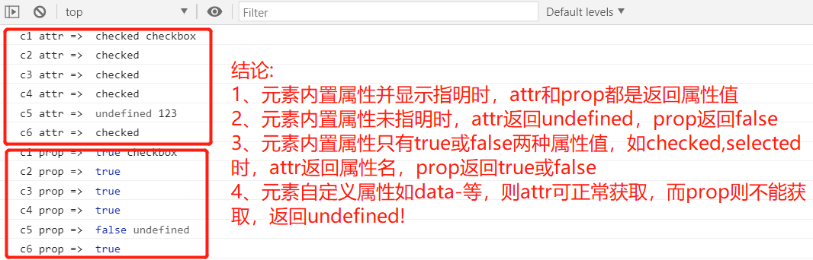

## 一、购物车功能描述及实现思路

### 1、购物车功能描述

> 1. 全选复选框勾选时，所有商品单项全选，全选不勾选时，所有商品单项也不勾选
> 2. 商品单项有一项不勾选时，全选复选框自动不勾选，当所有商品单项勾选时，全选复选框则自动勾选
> 3. 商品单项数量影响商品单项总价
> 4. 商品单项数量影响商品总数量
> 5. 商品单项数量影响商品总价格
> 6. 商品单项是否勾选影响商品总数量
> 7. 商品单项是否勾选影响商品总价格

### 2、实现思路

虽然后面采用了原生JS、jquery和vuejs实现，但基本思路都是一样，尤其是核心问题的解决问题的思路。

> **第1项** 其实就是将全选复选框的状态赋值给每一个单项选择即可，这样全选和单选就同步了，无论是勾选还是不选。

> **第2项** 我的思路和老师一样，不过实现方式不一样，老师是使用计数器，通过计数器是否等于总数来决定全选是否勾选。我的是直接 **统计勾选的个数，和总数比较** ，相等则自动勾选全选，不等则不勾选。

> **第3、4、5项** 为所有商品数量输入框添加事件，在事件函数中可对商品单项总价、商品总数量和商品总价格计算。 **难点在于获取是第几个商品数量输入框，这样可改变对应商品单项总价** 。老师所有都是采用数组遍历，我认为不合理，因为商品单项数量改变时其单项总价只要计算它就可以，所有都计算一遍，目前只有几个商品没关系，若是几百个就会浪费不必要的时间了，降低了效率。这时就需要知道是哪个商品数量改变了，这就需要事件监听器添加索引就可以，可惜直接添加是无效的。下面是正确添加方式，大家可以试着理解为什么这样就可以了??jquery也有类似实现，至于vuejs则是双向绑定就简单多了。

```javascript
// 监听事件传参不能直接传参数，而是通过function((ev){函数名(ev,自定义参数)})  ******
for (let [index, item] of checkItemBtns.entries()) {
  item.addEventListener( 'click', function (ev) { checkItem(ev, index); }, false );
}
```

> **第5、6项** 商品单项是否勾选将影响商品总数量和总价格，至于数量和商品单项总价则不受影响。我的解决思路就是设置开关，对每个商品设置开关，若勾选则为1时计算它，不勾选则为0不计算它。这里说明下原生JS和jquery中目前唯一问题是开关对单项商品总价有影响，当然可以加两行代码就解决了。至于vuejs则全部实现了所有功能。


## 二、原生JS实现购物车

这里原生JS实现购物车基本就是按上面思路来完成的，具体实现可看下面源码。这里唯一强调一点就是商品单项数量改变是只会改变它的单项总价、总数量和总价格这三个位置。实现就是用上面原理中说的给事件监听器的回调函数传递参数，也是事件监听器的进阶用法了，大家可以参考下。

至于我勾选单项影响单项总价、总数量和总价格三个位置，如果你认为不合理可以简单修改就可以。下面jq也是如此效果，vuejs则只影响总数量和总价格了。

```html
<style>
  * {
    margin: 0;
    padding: 0;
    box-sizing: border-box;
  }
  table {
    border-collapse: collapse;
    width: 90vw;
    min-width: 680px;
    text-align: center;
    margin: auto;
  }
  table caption {
    font-size: 1.5em;
    margin-bottom: 15px;
  }
  table th,
  table td {
    border: 1px solid;
    padding: 5px;
  }
  table thead tr {
    background-color: lightblue;
  }
  table tbody tr:nth-child(even) {
    background-color: lightcyan;
  }
  table input {
    text-align: center;
    line-height: 2em;
  }
  table input[type='checkbox'] {
    width: 1.5em;
    height: 1.5em;
  }
  .btns {
    width: 90%;
    margin: 1em auto;
    display: flex;
    justify-content: flex-end;
  }
  button {
    width: 8em;
    height: 2em;
    outline: none;
    border: none;
    background-color: seagreen;
    color: white;
    letter-spacing: 1em;
  }
</style>
<table>
  <caption>购物车</caption>
  <thead>
    <tr>
      <th>
        <input type="checkbox" name="checkAll" id="check-all" checked />
        <label for="check-all">全选</label>
      </th>
      <th>ID</th>
      <th>品名</th>
      <th>单位</th>
      <th>单价/元</th>
      <th>数量</th>
      <th>金额/元</th>
    </tr>
  </thead>
  <tbody>
    <tr>
      <td>
        <input type="checkbox" name="itemId" value="SN-1010" checked />
      </td>
      <td>SN-1010</td>
      <td>MacBook Pro电脑</td>
      <td>台</td>
      <td>18999</td>
      <td>
        <input type="number" name="counter" value="1" min="1" step="1" />
      </td>
      <td></td>
    </tr>
    <tr>
      <td>
        <input type="checkbox" name="itemId" value="SN-1020" checked />
      </td>
      <td>SN-1020</td>
      <td>iPhone手机</td>
      <td>部</td>
      <td>4999</td>
      <td>
        <input type="number" name="counter" value="2" min="1" step="1" />
      </td>
      <td></td>
    </tr>
    <tr>
      <td>
        <input type="checkbox" name="itemId" value="SN-1030" checked />
      </td>
      <td>SN-1030</td>
      <td>智能AI音箱</td>
      <td>只</td>
      <td>399</td>
      <td>
        <input type="number" name="counter" value="3" min="1" step="1" />
      </td>
      <td></td>
    </tr>
    <tr>
      <td>
        <input type="checkbox" name="itemId" value="SN-1040" checked />
      </td>
      <td>SN-1040</td>
      <td>SSD移动硬盘</td>
      <td>个</td>
      <td>888</td>
      <td>
        <input type="number" name="counter" value="4" min="1" step="1" />
      </td>
      <td></td>
    </tr>
    <tr>
      <td>
        <input type="checkbox" name="itemId" value="SN-1050" checked />
      </td>
      <td>SN-1050</td>
      <td>黄山毛峰</td>
      <td>斤</td>
      <td>999</td>
      <td>
        <input type="number" name="counter" value="5" min="1" step="1" />
      </td>
      <td></td>
    </tr>
  </tbody>
  <tfoot>
    <tr>
      <td colspan="5">总计:</td>
      <td id="total-num"></td>
      <td id="total-amount"></td>
    </tr>
  </tfoot>
</table>
<div class="btns">
  <button>结算</button>
</div>
<script>
  // 为了同步选择项，建立数组，其值为1为选中，0为未选中，（实现5，6，通过1或0判断单项是否有效来控制）
  let checkArr = [];

  // 一、全选和自选（实现1，2）
  // 获取全选按钮
  const checkAllBtn = document.querySelector('#check-all');
  // 获取单项选择按钮
  const checkItemBtns = document.querySelectorAll('input[name="itemId"]');
  // 全选按钮添加点击事件，将它的状态赋值给所有单项选择按钮
  checkAllBtn.addEventListener('click', checkAll, false);
  function checkAll(ev) {
    for (let [index, item] of checkItemBtns.entries()) {
      checkArr[index] = ev.target.checked ? 1 : 0;
      item.checked = ev.target.checked;
    }
    autoCount();
  }
  // 所有单项选择按钮添加点击事件，老师用change，这里用click事件感觉更为合理，当然效果目前是一样。
  // 监听事件传参不能直接传参数，而是通过function((ev){函数名(ev,自定义参数)})  ******
  for (let [index, item] of checkItemBtns.entries()) {
    // 初始化单项状态
    checkArr[index] = item.checked ? 1 : 0;
    item.addEventListener(
      'click',
      function (ev) {
        checkItem(ev, index);
      },
      false
    );
  }
  function checkItem(ev, index) {
    checkArr[index] = checkItemBtns[index].checked ? 1 : 0;
    // 单项选择按钮点击时，就获取单项选择按钮选中的个数
    const selectItemBtns = document.querySelectorAll('input[name="itemId"]:checked');
    // 若选中个数等于总个数则全选，否则取消全选。老师是用计数器的方法，感觉没这种方法简洁明了。
    checkAllBtn.checked = selectItemBtns.length == checkItemBtns.length ? true : false;
    autoCount();
  }

  // 二、自动计算（实现3，4，5）
  // 获取单价元素组
  const unitPriceArr = document.querySelectorAll('tbody>tr>td:nth-child(5)');
  // console.log(unitPriceArr[0].innerHTML);
  // 获取数量输入框元素组
  const inputCounterArr = document.querySelectorAll('input[name="counter"]');
  // console.log(inputCounterArr[1].value);
  // 获取单项总价元素组
  const unitPriceTotalArr = document.querySelectorAll('tbody>tr>td:nth-child(7)');
  // console.log(unitPriceTotalArr[unitPriceTotalArr.length-1].innerHTML);
  // 为数量输入框添加变化事件
  for (let inputCounter of inputCounterArr) {
    inputCounter.addEventListener('change', autoCount, false);
  }
  window.addEventListener('load', autoCount, false);
  function autoCount() {
    console.log(checkArr);
    // 获取输入数量数组，parseInt转换为整数压入数组
    let inputArr = [];
    let unitTotal = 0;
    for (let [index, inputCounter] of inputCounterArr.entries()) {
      inputArr.push(parseInt(inputCounter.value) * checkArr[index]);
    }
    // 计算数量总和并赋值给统计的总数，数组reduce是求和的利器。
    document.querySelector('#total-num').innerHTML = inputArr.reduce((a, b) => a + b, 0);
    // 改变单项总价并累加到总价上
    for (let [index, unitPriceTotal] of unitPriceTotalArr.entries()) {
      unitTotal += inputArr[index] * unitPriceArr[index].innerHTML * checkArr[index];
      unitPriceTotal.innerHTML = inputArr[index] * unitPriceArr[index].innerHTML;
    }
    // 给总价赋值
    document.querySelector('#total-amount').innerHTML = unitTotal;
  }
</script>
```

## 三、jquery实现购物车

jquery中页面和CSS都和原生一样，这里就不重复了。这里重点说下几个注意点：

> 1. **input的checked获取和设置问题** 我们知道input的checked是布尔值，但attr()获取是字符串，这里是使用prop代替解决问题，记得也有问这个问题，查了网上资料也是难懂，还是拿出我们的利器：自己测试吗！

```html
<label for="c1">c1:</label>
<input id="c1" name="checkbox" type="checkbox" checked="checked" />
<label for="c2">c2:</label>
<input id="c2" name="checkbox" type="checkbox" checked="true" />
<label for="c3">c3:</label>
<input id="c3" name="checkbox" type="checkbox" checked="" />
<label for="c4">c4:</label>
<input id="c4" name="checkbox" type="checkbox" checked />
<label for="c5">c5:</label>
<input id="c5" name="checkbox" type="checkbox" />
<label for="c6">c6:</label>
<input id="c6" name="checkbox" type="checkbox" checked="false" />
<script>
//   attr
console.log('c1 attr => ',$('#c1').attr('checked'));
console.log('c2 attr => ',$('#c2').attr('checked'));
console.log('c3 attr => ',$('#c3').attr('checked'));
console.log('c4 attr => ',$('#c4').attr('checked'));
console.log('c5 attr => ',$('#c5').attr('checked'));
console.log('c6 attr => ',$('#c6').attr('checked'));
// prop
console.log('c1 prop => ',$('#c1').prop('checked'));
console.log('c2 prop => ',$('#c2').prop('checked'));
console.log('c3 prop => ',$('#c3').prop('checked'));
console.log('c4 prop => ',$('#c4').prop('checked'));
console.log('c5 prop => ',$('#c5').prop('checked'));
console.log('c6 prop => ',$('#c6').prop('checked'));
</script>
```



这里要说明下，上面是测试代码是改进于脚本之家网站一篇文章，但是文章作者的结论我不赞同，我增加了内置属性和自定义属性测试，得出了attr和prop的区别:

>- 元素 **内置属性并且指明** 时，attr和prop都是返回属性值。
>- 元素 **内置属性未指明**时，attr返回undefined，prop返回false。
>- 元素 **内置属性的属性值只有true或false**时，如checked、selected和disabled等，attr返回属性名字符串，指明属性名时prop返回true，未指明时返回false。
>- 元素 **自定义属性如data-xxx**等，attr正常获取属性值，而prop则无效，返回undefined。

> 2. **jQuery自带迭代(自带循环)如何获取第几个成员？** 当然可以使用原生JS中for...of方法获取，这里说下jq本身就支持的简便方法 **index** ，它 **返回数组中某成员的索引** 。代码就是: `let index=$('selector').index(this);` 

该解决的问题都进行了单独说明，下面就是实现了，基本是由原生JS转换过来的，除了上面两点，其它也没有什么了。

```javascript
let checkArr = [];
$('input[name="itemId"]').each((index, item) => (checkArr[index] = $(item).prop('checked') ? 1 : 0));

// 一、全选和自选(实现1、2)
// 获取单值如checked
$('#check-all').click(function () {
  $('input[name="itemId"]').prop('checked', $(this).prop('checked'));
  $('input[name="itemId"]').each((index, item) => (checkArr[index] = $(item).prop('checked') ? 1 : 0));  
  autoCount();
});
$('input[name="itemId"]').click(function () {
  // jq中快速获取是第几个成员的方法
  let index = $('input[name="itemId"]').index(this);
  checkArr[index] = $(this).prop('checked') ? 1 : 0;
  $('#check-all').prop('checked', $('input[name="itemId"]:checked').length == $('input[name="itemId"]').length);
  autoCount();
});

// 二、自动计算（实现3，4，5）
window.addEventListener('load', autoCount, false);
// 获取单价元素组
let unitPriceArr = [];
$('tbody>tr>td:nth-child(5)').each((index, item) => (unitPriceArr[index] = item.innerHTML * 1));
$('input[name="counter"]').each((index, item) => { $(item).change(function (ev) { autoCount(ev, index); }); });
function autoCount(ev, index) {
  let goodNumArr = [];
  let totalAmount = 0;
  $('input[name="counter"]').each((index, item) => (goodNumArr[index] = $(item).val() * 1 * checkArr[index]));
  $('#total-num').html(goodNumArr.reduce((a, b) => a + b, 0));
  $('tbody>tr>td:nth-child(7)').each((index, item) => {
    totalAmount += unitPriceArr[index] * goodNumArr[index] * checkArr[index];
    $(item).html(unitPriceArr[index] * goodNumArr[index]);
  });
  $('#total-amount').html(totalAmount);
}
```

## 四、vuejs实现购物车

本来是完成老师作业就完事了，后来又听了老师vuejs的课，尤其是老师用原生JS模拟实现和解释vuejs本质后，让我思路一下就开阔了，原生JS是这些一切的根基，jquery函数库、vuejs、react都是在其基础上进行了封装，更便于开发者开发，同时也降低了开发者对原生JS理解。在这些库或框架中都可混用原生JS，也可用原生JS实现，掌握了原生JS学习这些框架或库都是随手拈来。通过这几天原生JS学习，算是原生JS真正入门了，学习jquery和vuejs比以前只知道使用深刻多了，不再出现使用什么解决问题了，具体查手册就可以了，随着累积相信可以应付绝大部分问题。

vuejs在数据处理方面最强大就是双向绑定了，而购物车则也是这方面需求，我就试着改造成vuejs实现，通过测试终于完成了，下面进行简单说明

> 1. **页面中数据双向绑定** **数据双向绑定一定要使用v-model** ，我开发过uniapp，使用最多的变量方式是:冒号，结果测试时只能随着vuejs中data数据而改变，它不能改变绑定该变量的值，后来还是使用v-model实现的，这里只是强调，双向绑定v-model指令不可少。

> 2. **计算属性如何传参数** 老师演示了计算属性并解释了本质，在本案例中计算单项商品总价格时，只想改变单项商品对应的总价格，如文章开头所说，需要知道索引，查了vuejs官方文档，知道了计算属性默认是get方法，还有set方法，但是不满足本题要求，后来突然想到不能传递参数是因为 **计算属性一般情况下返回值是表达式，所以不能接受参数** ，那么 **如果定义为返回值是函数呢？测试了下，成功** 。一个非常有用的技巧呢！！！乍一看和上面监听事件中的回调函数传递参数实现类似，都是将返回值转成函数，从而接受参数。

> 3. 本实现方法中全选和自选都是能完监听数据变化来完成，这样就存在一个问题，就是自选导致全选监听再一次执行全选监听，所有我们必须知道全选变化是手动还是自动，通过给全选添加自定义方法，设置开关就解决了。

```html
<table>
  <caption>购物车</caption>
  <thead>
    <tr>
      <th>
        <input type="checkbox" name="checkAll" id="check-all" v-model="checkAll" v-on:input="chekcAllStatus" />
        <label for="check-all">全选</label>
      </th>
      <th>ID</th>
      <th>品名</th>
      <th>单位</th>
      <th>单价/元</th>
      <th>数量</th>
      <th>金额/元</th>
    </tr>
  </thead>
  <tbody>
    <tr>
      <td>
        <input type="checkbox" name="itemId" value="SN-1010" v-model="checkArr[0]" />
      </td>
      <td>SN-1010</td>
      <td>MacBook Pro电脑</td>
      <td>台</td>
      <td>{{unitPriceArr[0]}}</td>
      <td>
        <input type="number" name="counter" v-model:value="inputArr[0]" min="1" step="1" />
      </td>
      <td>{{unitTotalPrice(0)}}</td>
    </tr>
    <tr>
      <td>
        <input type="checkbox" name="itemId" value="SN-1020" v-model="checkArr[1]" />
      </td>
      <td>SN-1020</td>
      <td>iPhone手机</td>
      <td>部</td>
      <td>{{unitPriceArr[1]}}</td>
      <td>
        <input type="number" name="counter" v-model:value="inputArr[1]" min="1" step="1" />
      </td>
      <td>{{unitTotalPrice(1)}}</td>
    </tr>
    <tr>
      <td>
        <input type="checkbox" name="itemId" value="SN-1030" v-model="checkArr[2]" />
      </td>
      <td>SN-1030</td>
      <td>智能AI音箱</td>
      <td>只</td>
      <td>{{unitPriceArr[2]}}</td>
      <td>
        <input type="number" name="counter" v-model:value="inputArr[2]" min="1" step="1" />
      </td>
      <td>{{unitTotalPrice(2)}}</td>
    </tr>
    <tr>
      <td>
        <input type="checkbox" name="itemId" value="SN-1040" v-model="checkArr[3]" />
      </td>
      <td>SN-1040</td>
      <td>SSD移动硬盘</td>
      <td>个</td>
      <td>{{unitPriceArr[3]}}</td>
      <td>
        <input type="number" name="counter" v-model:value="inputArr[3]" min="1" step="1" />
      </td>
      <td>{{unitTotalPrice(3)}}</td>
    </tr>
    <tr>
      <td>
        <input type="checkbox" name="itemId" value="SN-1050" v-model="checkArr[4]" />
      </td>
      <td>SN-1050</td>
      <td>黄山毛峰</td>
      <td>斤</td>
      <td>{{unitPriceArr[4]}}</td>
      <td>
        <input type="number" name="counter" v-model:value="inputArr[4]" min="1" step="1" />
      </td>
      <td>{{unitTotalPrice(4)}}</td>
    </tr>
  </tbody>
  <tfoot>
    <tr>
      <td colspan="5">总计:</td>
      <td id="total-num">{{totalNum}}</td>
      <td id="total-amount">{{totalPrice}}</td>
    </tr>
  </tfoot>
</table>
<script>
const vm = new Vue({
  el: 'table',
  data: {
    checkAll: true,
    checkArr: [true, true, true, true, true],
    // 开关，防止全选和单选冲突
    checkStatus: false,
    unitPriceArr: [18999, 4999, 399, 888, 999],
    inputArr: [3, 2, 3, 4, 5],
  },
  computed: {
    totalNum: function () {
      // return this.inputArr.reduce((a, b) => a * 1 + b * 1, 0);
      let total = 0;
      for (let [index, input] of this.inputArr.entries()) {
        total += input * 1 * (this.checkArr[index] ? 1 : 0);
      }
      return total;
    },
    unitTotalPrice: function () {
      return index => {
        return this.unitPriceArr[index] * 1 * this.inputArr[index];
      };
    },
    totalPrice: function () {
      let total = 0;
      for (let [index, input] of this.inputArr.entries()) {
        total += this.unitPriceArr[index] * 1 * input * (this.checkArr[index] ? 1 : 0);
      }
      return total;
    },
  },
  watch: {
    checkAll(newVal) {
      // 双向绑定数组无法直接赋值，需要转换为普通的，计算完后，使用vuejs改变即可
      if (this.checkStatus) {
        let checkArr = JSON.parse(JSON.stringify(this.checkArr));
        for (let index of checkArr.keys()) {
          checkArr[index] = newVal;
        }
        this.checkArr = checkArr;
        this.checkStatus = false;
      }
    },
    checkArr() {
      let checkArr = JSON.parse(JSON.stringify(this.checkArr));
      let checkOkArr = checkArr.filter(item => item == true);
      this.checkAll = checkArr.length == checkOkArr.length ? true : false;
    },
  },
  methods: {
    chekcAllStatus: function () {
      // 区分是用户选择全选，还是单项导致自动全选
      this.checkStatus = true;
    },
  },
});
    </script>
```

### Codepen演示 <https://codepen.io/woxiaoyao81/pen/zYBeEoO>

## 五、感受

原生JS、jquery函数库和vuejs框架基本学完了，前端也快基本告以段落了，朱老师深入浅出的授课让我对前端也完成了系统的梳理，相比报前最烦恼的就是前端，无论是CSS还是JS，都感觉乱，需要就百度来东拼本西凑，最后一团乱麻。现在对前端已经有了系统的认识，现在无论是语义化元素，还是CSS布局，或是JS的使用，都能快速找到解决思路，个别不清楚查下手册就可以了。我的理解都已经写在我的博文中了，可以说好多都比网上大部分文章介绍更系统更深入，相信你看了之后也会对前端有了系统的认识。