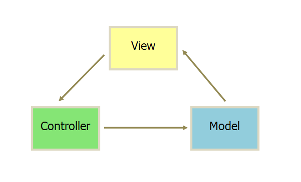

## 一、如何认识vuesjs框架和原生JS的关系

本课以前，我虽然也进行项目开发快半年了，但其实不理解原生JS、jquery函数库和vuejs等框架的区别，只知道学了一个又一个，只到老师在授课中用原生JS来解构分析它们，才知道它们是基于原生JS进行了封装，为开发者提供更好的使用体验。前端这些函数库和框架都支持原生JS的操作，如老师在模板语法中使用原生JS的方法就给我很大启发，一下子对前端的JS有了系统的认识，在解决问题时也不迷茫了，正如我的博文<https://www.php.cn/blog/detail/24847.html>对购物车就用原生JS、jquery和vuejs三种方法实现了。下步自己还是深入原生JS学习，也许以前对它不重视，现在知道它的强大才越来越有兴趣了。

## 二、MVC和MVVM

> **官方描述:**
> Vue是一套用于构建用户界面的渐进式框架,Vue 被设计为可以自底向上逐层应用,Vue 的核心库只关注视图层.

虽然官方的描述比较难懂，其实它的核心就是视图层，位于MVVM的ViewModel位置，它对View和Model提供了双向绑定，能将二者变化反应到彼此，从而实现了数据联动，给我的第一感觉最大的特点是它关注数据、进行了数据双向绑定。那么MVVM又是什么呢？




> **MVC和MVVM:** 
>- MVC全名是Model View Controller，如图，是模型(model)－视图(view)－控制器(controller)的缩写，一种软件设计典范，用一种业务逻辑、数据、界面显示分离的方法组织代码，在改进和个性化定制界面及用户交互的同时，不需要重新编写业务逻辑。
>   - M层处理数据，业务逻辑等 
>   - V层处理界面的显示结果 
>   - C层起到桥梁的作用，来控制V层和M层通信以此来达到分离视图显示和业务逻辑层
>- MVVM是Model-View-ViewModel的简写。它本质上就是MVC 的改进版。MVVM 就是将其中的View 的状态和行为抽象化，让我们将视图 UI 和业务逻辑分开。当然这些事 ViewModel 已经帮我们做了，它可以取出 Model 的数据同时帮忙处理 View 中由于需要展示内容而涉及的业务逻辑。它的由来是MVP和模式和微软的WPF结合的演变过来的新型架构框架。(题外话，不得不感慨微软在Web领域影响无处不在，尽管没什么独立优秀产品，如CSS中box-sizing的IE盒子，WPF对MVVM，哈哈我是微软Fans,对苹果不感冒)
>- **MVC和MVVM比较:**
>   - **同:** Model和View
>        + **Model ：数据对象** ，同时，提供本应用外部对应用程序数据的操作的接口，也可能在数据变化时发出变更通知。Model不依赖于View的实现，只要外部程序调用Model的接口就能够实现对数据的增删改查。
>        + **View：UI层** ，提供对最终用户的交互操作功能，包括UI展现代码及一些相关的界面逻辑代码。
>   - **异:** 差异在于如何粘合View和Model，实现用户的交互操作以及变更通知
>        + **MVC中Controller:** Controller接收View的操作事件，根据事件不同，或者调用Model的接口进行数据操作，或者进行View的跳转，从而也意味着一个Controller可以对应多个View。Controller对View的实现不太关心，只会被动地接收，Model的数据变更不通过Controller直接通知View，通常View采用观察者模式监听Model的变化。
>        + **MVVM中ViewModel:** 注意这里的“Model”指的是View的Model，跟MVVM中的一个Model不是一回事。所谓View的Model就是包含View的一些数据属性和操作的这么一个东东，这种模式的关键技术就是数据绑定（data binding），View的变化会直接影响ViewModel，ViewModel的变化或者内容也会直接体现在View上。这种模式实际上是框架替应用开发者做了一些工作，开发者只需要较少的代码就能实现比较复杂的交互。
>- **MVC->MVP->MVVM演进过程:** MVC -> MVP -> MVVM 这几个软件设计模式是一步步演化发展的，MVP 隔离了MVC中的 M 与 V 的直接联系后，靠 Presenter 来中转，所以使用 MVP 时 P 是直接调用 View 的接口来实现对视图的操作的，这个 View 接口的东西一般来说是 showData、showLoading等等。M 与 V已经隔离了，方便测试了，但代码还不够优雅简洁，所以 MVVM 就弥补了这些缺陷。MVVM 是从 MVP 的进一步发展与规范，在 MVVM 中就出现的 Data Binding 这个概念，意思就是 View 接口的 showData 这些实现方法可以不写了，通过 Binding 来实现。

## 三、vuejs的基础入门

上面解释那么多，下面终于进入正题了，下面是vuejs的入门知识。首先要按官方教程在页面中 **下载vuejs或引用vuejs** ，然后在script中用 **new调用构造函数创建vue对象(实例)** 的，这点 **要与jquery区别开来** (jquery已经创建了jQuery全局对象，没提供构造函数，不可new创建)。

### 1、挂载点即el属性

```javascript
var app = new Vue({
  el: '#app',
});
```

上面就是官方提供的挂载演示，挂载属性就是el，全称是element，它明确了 **vuejs作用域** ，就是vuejs会对该元素接管，对它后代元素中进行vuejs的解析，如数据双向绑定等。

这里我有个误区就是以为它只能是ID，采用'#ID'来挂载，老师在演示时直接使用document.querySelector()来挂载，再查官方文档才发现它对el已经有了明确的说明

> **el官方说明:**
>- 类型：string | Element
>- 限制：只在用 new 创建实例时生效。
>- 提供一个在页面上 **已存在的DOM元素** 作为Vue实例的挂载目标。可以是 **CSS选择器** ，也可以是一个 **HTMLElement实例** 。
>- 在实例挂载之后，元素可以用 **vm.$el** 访问
>- 如果在实例化时存在这个选项，实例将立即进入编译过程，否则，需要显式调用 vm.$mount()手动开启编译。
>- 提供的元素只能作为挂载点。不同于 Vue 1.x，**所有的挂载元素会被Vue生成的DOM替换** 。因此**不推荐挂载root 实例到 \<html> 或者 \<body>** 上。

```html
<div class="container">
    <p>Hello VueJS</p>
</div>
<script>
    // 1.挂载点el属性
    const vm = new Vue({
    el: '.container',
    });
    console.log('vm.$el => ', vm.$el);
    console.log('挂载点遍历 => ', vm.$el.firstChild);
    // 尝试原生JS增加元素
    const pl = document.createElement('p');
    pl.innerHTML = 'Hello woxiaoyao';
    vm.$el.insertBefore(pl, vm.$el.firstChild);
</script>
```


> **第一个要点:** 挂载方式推荐CSS选择器，这里就好比jquery的\$()的选择器。当然也可以使用document.querySelector或document.getElementXXX等方法获取的HTMLElement对象(实例)。这也许就是函数库或框架与原生JS联系的纽带了。

> **第二个要点:** el只能在new创建实例时使用，此时将立即进入编译过程，vue接管该元素。若没有则是"未挂载"状态，需要使用vm.$mount(selector|Element)手动挂载，它的参数和el值是一样的，字符串型，支持CSS选择器或HTMLElement对象，手动挂载后vue将接管挂载的元素。

> **第三个要点:** 对于挂载元素可以用vm.$el来访问，它是原生JS的HTMLElement对象，当然也可以直接用原生JS或\$()来访问，至于增删改元素操作也没问题，上例中就演示了原生JS的插入操作。这里不得不说下Virtual DOM,因为官方说明挂载元素会被Vue生成的DOM替代，所以我以为Vue的dom元素就不是HTML的dom元素，其实还是dom元素。

下面说下我对Virtual DOM和HTML DOM的理解。很重要哦，也许通过下面你会对所谓vuejs和react框架的优势有更本质的认识。在官方的《对比其他框架》中和react比较时，其中有一条

> React 和 Vue 都使用 Virtual DOM

有了虚拟DOM(Virtual DOM)，就有真实的DOM，真实DOM是页面渲染完成的DOM树，它直接展示给用户。那么虚拟DOM又是什么技术？它有什么用？它在页面那里？看下某篇网方中对虚拟DOM和真实DOM的区别描述:

> 1. 虚拟DOM不会进行排版与重绘操作
> 2. 虚拟DOM进行频繁修改，然后一次性比较并修改真实DOM中需要改的部分（注意！），最后并在真实DOM中进行排版与重绘，减少过多DOM节点排版与重绘损耗
> 3. 真实DOM频繁排版与重绘的效率是相当低的
> 4. 虚拟DOM有效降低大面积（真实DOM节点）的重绘与排版，因为最终与真实DOM比较差异，可以只渲染局部（同2）

看完之后，高大上的虚拟DOM就不再那么深奥了，还记得原生JS的文档片断DocumentFragment吗？虚拟DOM和它类似，所以 **虚拟DOM是存在于内存中，主要作用就是在内存中完成数据运算，然后一起性渲染到真实DOM，减少真实DOM的渲染消耗，提高用户体验** 。没深入理解过原生JS还真可能被这些框架绕糊涂，对于这些框架不要有什么神秘，它运用还是原生JS的知识，放心使用就可以，它逃不出原生JS的范畴，框架只是放大某些优点，方便用户高效开发而已。

## 2、数据data属性

数据data属性是vue的核心，它是操作数据的框架，无论后面讲的计算属性、侦听还是方法，都要操作数据。我就不按老师的思路来介绍了，我归纳成3个方面来介绍：**脚本中如何访问data** 、 **脚本中如何访问数组或对象** 和 **元素如何使用data** 。

> **脚本中如何访问data:** 访问data可分为Vue外或Vue内的两种访问情况，但语法基本相同，前者使用vue实例对象，如常见的vm;后者因为在Vue内，所以一般使用this。
>- 语法:vm.\$data.name或vm.name(this.\$data.name或this.name)
>
> vm.$data.name 是正常访问方式，那么vm.name为什么也能访问呢，正常的原生JS对象默认是不支持跨过访问的，Vue支持是因为它使用了 **"数据代理访问"** 技术，下面是用原生JS实现的数据访问代理：

```javascript
const user={
    $info:{
        name:'woxiaoyao',
        email:'14588823@qq.com',
    }
}
console.log('$info.nane => ',user.$info.name);
// 直接跨中间访问是失败的
console.log('nane => ',user.name);
Object.defineProperty(user,'name',{
    // 访问器属性
    get: () => user.$info.name,
    // 设置器
    set: (value) => (user.$info.name = value),
});
console.log('nane => ',user.name);
```

通过Object.defineProperty可为属性重新定义get和set方法，替换默认的行为，就完成了拓展增强，这也是juqery函数库或vuejs框架等对原生JS的封装所在，将经常用的封装成方便的属性或方法，便于用户调用。

> **脚本中如何访问数组或对象:** 为什么要说这个问题，上面已经讲过了数据访问代理，直接访问不就OK了吗？如果你是这样访问vuejs的数据的话，那么将会经常给你报错，尤其是数组和对象。下面是我的测试代码，看看在vuejs中字符型、数组和对象是什么类型。

```javascript
const vm = new Vue({
  el: '.container',
  data: {
      hello:'Hello VueJS.cn',
      hobby:['计算机','摄影','电影'],
      info:{name:'woxiaoyao',age:18},
  },      
  mounted:function(){
      console.log('hello => ',this.hello);
      console.log('hobby => ',this.hobby);
      console.log('info => ',this.info);
  }    
});
```


对于字符型访问没什么问题，但是数组和对象则不可以，如上图中它有个Observer字样，虽然最后__proto__还是数组和对象，但它不再是原来的数组或对象了。至于Observer后面再探讨，这里先解决怎么访问数组和对象。使用 **原生JS的两个方法:JSON.parse和JSON.stringify** 。如上面访问数组可以是: **let hobby=JSON.parse(JSON.stringify(this.hobby))** 就可以转为原生JS的普通数组了，也就是我们代码中样式了。

> **元素如何使用data:** MVVM最大的优点就是数据绑定，Vuejs也实现了，它可以数据变化实时反映到视图中，那么元素使用data? 
>- 第一种是 **模板语法** 它 **类似于原生JS的innerText** 。它的 **本质就是表达式，表达式中每项是普通JS数据，每项都可以使用原生JS的数据属性或方法** 。如老师演示时案例
`<p>{{hello.split('').reverse().join('').substr(0,2)+'=> hobby:'+hobby.toString()}}</p>`。
>- 第二种是 **v-html属性** 它 **类似于原生JS的innerHTML** ，支持解析带有元素标签的数据。如`vm.data.text="Hello <strong style='color:red'>php.cn</strong>"`。此时用模板语法则所有都当成普通文本来显示了，想解析元素标签则需要v-html指令属性。如
`<p v-html="text"></p>`就可以了。

### 3、计算属性computed

计算属性computed在 **编译时最终和与data中的属性变量合并** ,计算属性默认只有 getter，不过在需要时你也可以提供一个 setter。下面是官方的计算属性完整范例

```javascript
computed: {
  fullName: {
    // getter
    get: function () { return this.firstName + ' ' + this.lastName },
    // setter
    set: function (newValue) {
      var names = newValue.split(' ')
      this.firstName = names[0]
      this.lastName = names[names.length - 1]
    }
  }
}
```

这个范例也说明了在使用计算属性时，一定要用 **属性名来访问** ，它会默认调用getter方法。此时有个问题就是 **如何给计算属性的getter传递参数？** 就如我的购物车用vuejs案例中,单项商品总价是计算属性，它依赖单项商品的数量。直接使用给计算属性的get方法传递参数是报错的。我的 **解决方案是它的返回值就是函数** ，这样就可以 **支持传递参数了** 。如下面：
`get: function () { return function(index){return '第'+index+'个:'+this.firstName + ' ' + this.lastName}  },`

> 题外话:原生JS的事件监听器的回调函数默认只支持事件对象参数，若要传递其它参数则需要将返回值为函数才支持，实现原理同上。具体应用见《购物车三种实现(原生JS、jquery和vuejs)》<https://www.php.cn/blog/detail/24847.html>

> **那么计算属性和数据属性中直接使用方法有什么区别?** 下面演示了同样计算的计算属性和数据属性中方法。实际使用中注意事项：
>- 计算属性使用只要 **属性名** ，后面()不要，而数据属性中则是 **属性名()**
>- **计算属性和数据属性名不能相同** ，否则属性名返回的是数据属性中方法源码，而不是计算属性。数据属性比计算属性优先级高，也就是数据属性和计算属性相同的属性名时，计算属性无效。
>- 计算属性虽然是属性，但本质是getter和setter的结合，默认是get方法，返回数据，所有使用时不用()，但定义时不能少()。

```javascript
const vm = new Vue({
el: '.container',
data: {
    hello: 'Hello VueJS.cn',
//   reverHello(){
//     return this.hello.split('').reverse().join('');
//   }
},
computed:{
    reverHello() { return this.hello.split('').reverse().join(''); },
},
});
```

### 4、过滤器filters

计算属性最终合并到数据属性中，而过滤器则是根据需要定义了数据操作的方法，Vue.js 允许你自定义过滤器，可被用于一些常见的文本格式化。过滤器可以用在两个地方： **双花括号插值和 v-bind 表达式** (后者从 2.1.0+ 开始支持)。过滤器应该被添加在 **JavaScript 表达式的尾部，由“管道|”符号指示**：

```html
<div class="container">
<p>计算属性:{{reverHello | wordsToCase}}</p>
</div>
<script>
const vm = new Vue({
el: '.container',
data: {
    hello: 'Hello VueJS.cn',
},
computed:{
    reverHello() { return this.hello.split('').reverse().join(''); },
},
filters:{
    wordsToCase(str){ return str.toUpperCase(); }
}
});
</script>
```

> **过滤器可以串联：** 如`{{ message | filterA | filterB }}` 过滤器函数总是接收表达式的值 (之前的操作链的结果) 作为第一个参数，依次计算，最后过滤器返回结果。filterA 被定义为接收单个参数的过滤器函数，表达式 message 的值将作为参数传入到函数中。然后继续调用同样被定义为接收单个参数的过滤器函数 filterB，将 filterA 的结果传递到 filterB 中。

> **过滤器可以接受参数:** 如`{{ message | filterA(arg1, arg2) }}` 这里要来演示一下官方的解释，不然很难懂。下面已经说明了在 **Vue中定义是`filterA(str,arg1, arg2)`，之前的操作链的结果是第一个参数，从第二个参数开始对应传递的参数**。

```html
<div class="container">
<p>过滤器:{{hello | wordsToCase('start','end') }}</p>
</div>
<script>
const vm = new Vue({
el: '.container',
data: {
    hello: 'Hello VueJS.cn',
},
filters:{
    wordsToCase(str,arg1,arg2){ return arg1+' '+str.toUpperCase()+' '+arg2.toLowerCase(); }
}
});
</script>
```

### 5、侦听器watch

官方解释完全从应用角度，而老师却说出了本质，这样应用才不会迷茫，老师在解释侦听器时说它是事件监听器，它负责监视数据变化时需要执行的操作，类似于change事件，这样就不会再难分什么时候用计算属性，什么时候用侦听器了，按官方解释，你就会被绕晕了。

```html
<div class="container">
<input type="number" v-model:value="add1" name="" id="" /> + <input type="number" v-model:value="add2" name="" id="" /> =<span>{{res}}</span>
</div>
<script>
  const vm = new Vue({
el: '.container',
data: {
    add1:0,
    add2:0,
    res:0,
},
watch:{
    add1:function(newVal, oldVal){
        console.log(newVal);
        this.res=newVal*1+this.add2*1;
    },
    add2:function(newVal, oldVal){
        console.log(newVal);
        this.res=newVal*1+this.add1*1;
    }
}
});
</script>
```

上面是演示代码，在使用watch要注意两个方面:

> 1. **必须要用v-model指令绑定的变量才支持watch** 上面绑定若是普通的:value="add1"则无法被侦听，它是单向的，即脚本改变会影响视图中数据，但反过来则不行。要想双向影响则要使用v-model指令。

> 2. 侦听器的 **语法:函数名(新值newVal，旧值oldVal)** 。

## 四、vuejs入门实战案例:简单计算器

> **功能描述:**
> 1. 对两个数进行加、减、乘和除运算
> 2. 可先输入数字再选择运算符，也可先选择运算符再输入数，均可正常实时运算
> 3. 切换为除法时，若除数为0则弹窗提示错误，并不切换为除法
> 4. 输入数字计算时，若除法时除数为0，则结果处提示错误。

> **实现介绍:**
>- **第1项** 通过侦听器watch侦听两个运算数，若变化则根据运算符进行运算
>- **切换运算符** 通过原生JS事件委托代理，将事件触发者的自定义数据属性event.target.dataset.index记录到vue的data属性中，便于运算时判断是加、减、乘和除运算
>- **第2项** 前面是通过侦听器实现，后者是通过按钮点击事件实现
>- **第3项** 除法时除数为0，采用原生JS的alert弹窗提示错误
>- **第4项** 通过过滤器filters，当除法时除数为0则计算值为Infinity，此时可赋值为错误提示。

```html
<style>
  * {
    margin: 0;
    padding: 0;
    outline: none;
    border: none;
    box-sizing: border-box;
  }
  .container {
    width: 30em;
    height: 15em;
    padding: 0.5em;
    color: white;
    background-color: #007d20;
    margin: 2em auto;
  }

  .container h2 {
    text-align: center;
  }
  .container .box {
    padding: 1em;
    display: grid;
    grid-template-columns: 12em 1fr;
    grid-template-rows: repeat(4, 2em);
    gap: 1em 0.5em;
  }
  .container .btns {
    grid-column: span 2;

    display: flex;
    justify-content: space-around;
  }
  .container .btns button {
    width: 5em;
    border-radius: 0.5em;
  }
  .container .btns button.selected {
    color: white;
    background-color: red;
  }
  .container p {
    grid-column: span 2;
    color: yellow;
  }
  .container p span {
    color: white;
    font-size: 1.2em;
    margin-left: 2em;
  }
</style>
<div class="container">
  <h2>简单计算器</h2>
  <div class="box">
    <label for="add1">第一个数(10万以内的数):</label>
    <input type="number" name="add1" id="add1" v-model="add1" min="0" max="100000" placeholder="10万以内的数" />
    <label for="add2">第二个数(10万以内的数):</label>
    <input type="number" name="add2" id="add2" v-model="add2" min="0" max="100000" placeholder="10万以内的数"/>
    <div class="btns" @click="btnClick">
      <button data-index="0" :class="{'selected':index==0}">加</button>
      <button data-index="1" :class="{'selected':index==1}">减</button>
      <button data-index="2" :class="{'selected':index==2}">乘</button>
      <button data-index="3" :class="{'selected':index==3}">除</button>
    </div>
    <p>
      结果:
      <span>{{res | checkDiv(index,add2)}}</span>
    </p>
  </div>
</div>
<script>
  const vm = new Vue({
    el: '.container',
    data: {
      add1: 0,
      add2: 0,
      res: 0,
      index: 0,
    },
    watch: {
      add1(newVal, oldVal) {
        //   console.log('add => ',this);
        switch (this.index * 1) {
          case 1:
            this.res = newVal * 1 - this.add2 * 1;
            break;
          case 2:
            this.res = newVal * 1 * this.add2 * 1;
            break;
          case 3:
            // if (this.add2 == 0) return false;
            this.res = ((newVal * 1) / this.add2) * 1;
            break;
          default:
            this.res = newVal * 1 + this.add2 * 1;
        }
      },
      add2(newVal, oldVal) {
        switch (this.index * 1) {
          case 1:
            this.res = this.add1 * 1 - newVal * 1;
            break;
          case 2:
            this.res = this.add1 * 1 * newVal * 1;
            break;
          case 3:
            // if (this.add2 == 0) return false;
            this.res = ((this.add1 * 1) / newVal) * 1;
            break;
          default:
            this.res = this.add1 * 1 + newVal * 1;
        }
      },
    },
    filters: {
      checkDiv: function (str, index, add2) {
        // console.log(this);
        // console.log(index,add2);
        // if (this.index*1 == 0 && this.add2*1 == 0) str = '除法时，除数不能为0';
        return str == 'Infinity' ? '除法时，除数不能为0' : str;
      },
    },
    methods: {
      // 事件代理委托来处理所有按钮点击事件
      btnClick: function () {
        // console.log(event.target.dataset.index);
        // console.log(event.currentTarget);
        if (event.target.dataset.index == 3 && this.add2 == 0) {
          alert('除法时，除数不能为0');
          return false;
        }
        this.index = event.target.dataset.index;
        switch (this.index * 1) {
          case 1:
            this.res = this.add1 * 1 - this.add2 * 1;
            break;
          case 2:
            this.res = this.add1 * 1 * this.add2 * 1;
            break;
          case 3:
            if (this.add2 == 0) return false;
            this.res = ((this.add1 * 1) / this.add2) * 1;
            break;
          default:
            this.res = this.add1 * 1 + this.add2 * 1;
        }
      },
    },
  });
</script>
```


### Codepen演示 <https://codepen.io/woxiaoyao81/pen/GRqeZdM>

> **一点意外的发现:** 本来过滤器提示错误信息是通过index=3和add2=0来判断的，但是在 **过滤器中直接使用this是访问不到vue实例的！！！** 这点和计算属性、侦听器、自定义方法是不相同的。网上有 **两种解决方案** 。
>- **定义全局变量，如let that，然后在beforeCreate中将vue实例赋值给它,如that=this** 。在vue实例中可以使用that访问vue的data数据。这点和微信小程序非常类似。
>- 在视图中使用过滤器时将 **vue实例的data作为过滤器参数传入** 。经测试是可行的。至于过滤器的参数对应关系在本文第三部分有介绍，不清楚可以再看下。

## 五、学习后总结

在原生JS基础上再学习vuejs框架不仅理解更深、混合运用也是灵活多变，这样才是技术使用最佳状态，终于体会到老师在群里说的，**框架和函数库不用规定什么时候使用，应该是想什么时候使用就什么时候使用，为了发挥各自的优点而灵活的混合使用** 。两个字：舒服。