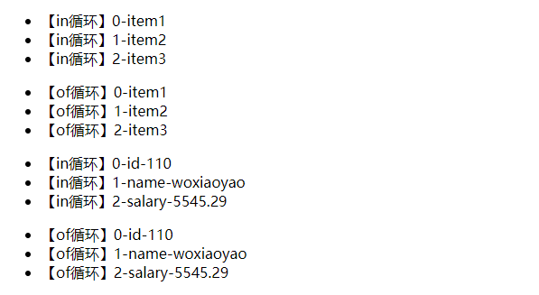
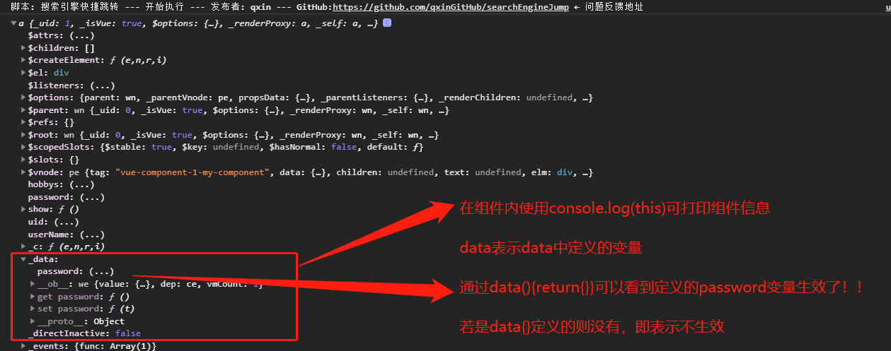
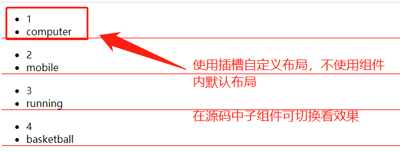
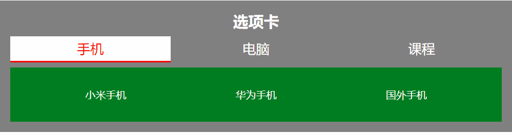

## 一、学习后的新认识

朱老师的 vuejs 最后一课信息量实在是太大了，许多地方只讲了如何使用，没有深入挖掘，而我又按老师以前的思路，总是结合原生 JS 和我在 uniapp 开发项目中使用 vuejs 中相 u 关的进行比较、测试，花费了近整整一天时间，不过欣慰的是收获也很多，在此记录下来，以便以后查找。

> - **v-bind：是给子组件传递参数** ,其实在写本文前我才想明白。我们知道给组件传递参数是 props 定义接受参数的属性，那么老师一开始讲的:style 应该也算是父组件给子组件传递参数，那么为什么它不需要在 props 中定义呢？还有老师在讲给子组件传递参数是没加 v-bind:或:，那为什么传递成功呢？还有 v-bind:或简写:要在什么时候使用呢？也许你没思考过，我也是在测试中遇到后才意识到的。
> - **v-for 循环渲染** 我以前大部分使用 v-for="item in itemArr"形式，结果还有 v-for="item of itemArr"形式，它们之间有什么区别？对于数组和对象循环遍历时有什么区别？这种循环和原生 JS 中 for...of 有什么联系和区别？
> - **全局组件，局部组件和路由组件** 三者形式相近，它们有什么区别和联系？组件中 data 有两种形式即 data:{}和 data(){return{}}，二者有什么区别，网上都是说多次使用会导致"数据污染"，真是这样吗？测试后是错误的，不得不说，人云亦云最可怕，当然我也没弄清，但我知道结果。
> - **组件传递参数** 朱老师讲了两种，第一种是 props 自定义属性，另一种是 data()，第一种老师演示父组件向子组件传递参数，是非常熟悉的形式，那第二种老师直接在 data()中给变量赋值了，那么父组件又如何对 data()进行访问呢，老师第二种方法真的可行吗？再者有父组件给子组件传递参数，那子组件能给父组件传递参数？组件和插槽之间又如何传递参数？
> - **vue 路由** vue 路由中注册路由时 component 对应的是局部组件还是全局组件？它的本质是什么？更深入的如嵌套，以后再探讨了。
>
> 不得不说，本课作为前端最后一课，也许是时间比较紧，所以老师没有展开讲，但是对于我们学习者，应该更深入探讨问题，我认为，作为编程，经历错误越多，编程就越顺手。

## 二、v-bind:探讨

先看下官方的介绍：

> 缩写：冒号:(英文状态下)。(在上一篇文章中测试时，我曾认为 v-model:也可简写成冒号呢)
> 值：表达式、数组和对象(是从官方案例中总结的，官方说的很玄乎)
> 修饰符:.prop、.camel 和.sync（这个不在本文探讨内，不过不难，可以试着理解去）
> 官方的介绍我认为最有用的就是下面案例了，其次是文字解释，至于上面英文很玄乎，能理解更好，不理解就掌握如何运行就可以了

### 1、v-bind:和 v-model:区别

官方解释`一个组件上的v-model默认会利用名为value的prop和名为input的事件`，也就是**v-model:相当于 v-bind:value 和 v-on:input** ，它一个指令做了两件事，v-bind:接受父组件的传递数据，而 v-on 将子组件中数据变化以反馈给父组件，这样就实现了双向绑定。而 v-bind 是单向接受数据。这也是在我用 vuejs 实现购物车中第一个疑问，这里刚好解释清楚了。

另外,vue的watch侦听器是侦听不到v-bind:绑定数据变化的，因为它只是接受数据，可以侦听到v-model:对数据改变。当然v-model:对数据变化常用的两种形式是:
> 1. **将v-model:绑定的数据，在页面中其它地方再次引用** 。这样数据变化将触发v-on:input事件改变数据，然后再影响引用的地方的结果
> 2. **通过watch侦听器侦听v-model:绑定数据的变化** 。 在数据变化后，再在watch侦听器中完成对数据的处理，然后再显示到指定位置。 

> **补充:** 这个是在写文章后面才想到的，vue中数据双向绑定其实有两种形式:
>- **插值{{}}自动实现的双向数据绑定** 它是**针对文本的实现数据双向绑定**，如果有computed计算属性或侦听器侦听则可以接受到数据的变化。
>- **v-model:属性的双向数据绑定** 这个官方教程没说明白，我以前一直以为v-bind:属性绑定数据也是双向的，其实不然，它是单向，它只接受数据。而v-model:是真正意义的双向绑定。可以将数据变化反馈给computed计算属性或侦听器。

### 2、v-bind:接受变量时一定要用吗？

文章开头已经说了，老师在演示 prop 传递参数时没有使用 v-bind:，但是参数传递也成功了。我在测试组件和插槽传递参数时也 **没使用 v-bind:传递父组件的数组，结果却是传递变量名这个字符串，而没有传递变量值** ，现在结果出来了。 **当传递常量或字符串值时，不要使用 v-bind** ，否则它当成变量在 data 等定义变量的属性中寻找，没有则报错。**若是传递 data 等定义变量时，一定要加上 v-bind** :，否则当成字符串或常量直接传值。

### 3、props 和 data 等属性中定义的变量有什么区别？

我们知道父组件给子组件传递参数，可以在子组件中使用 props 定义接受参数，然后父组件在子组件上使用 v-bind:props 定义的属性赋值即可。而页面中可直接使用挂载的 vue 实例的 data、computed 等定义变量。二者有什么区别吗？**为什么父组件不能直接给子组件的 data 中变量赋值呢？**

组件为了复用，采用了类似于 C++或 Java 中封装的概念，对其成员分成了私有属性和公共属性。**私有属性只能在内部或实例使用，如 vue 组件中 data 和 computed，而公共属性则允许其它实例访问，如 props** 。在 **vue 组件中对于 Html 元素的内置属性都定义成公共属性** ，可以直接使用 v-bind:为其传递参数。

## 二、条件渲染 v-if 和循环渲染 v-for

### 1、条件渲染 v-if

类似于原生 JS 的 if 语法，没有什么难度，可以参考学习，主要有三种：

> - **形式 1：v-if** 如`<div v-if="condition">...</div>`
> - **形式 2:v-if...v-else** 如`<div v-if="condition">...</div><div v-else>...</div>`
> - **形式 3:v-if...v-else-if...v-else-if...v-else** 如`<div v-if="condition">...</div><div v-else-if="condition1">...</div>...<div v-else>...</div>`

### 2、循环渲染 v-for

> **v-for...in 和 v-for...of** 在官方中首先是使用 in 的，然后说`可以用 of 替代 in 作为分隔符，因为它更接近 JavaScript 迭代器的语法`并且说`in在遍历对象时，会按 Object.keys() 的结果遍历，但是不能保证它的结果在不同的 JavaScript 引擎下都一致。`。从中我们可以这样理解， **v-for...in 类似于原生 JS 的 for...in，而 v-for...of 则类似于原生 JS 的 for...of** 。我在以前文章中总结时就 \*极力推荐 for...of，所以这里也推荐 v-for...of\*\* ，毕竟是它是借鉴 ES6 中新增加的 for...of，以后是大趋势。关于 for...of 探讨可以看我的博文<https://www.php.cn/blog/detail/24740.html>

> **对数组和对象访问格式:** 要注意 **参数顺序和代表的含义**。
>
> - 对数组的访问格式:
>   - **形式 1：v-for="value of itemArr"** 遍历数组的 **值**
>   - **形式 2：v-for="(value,index) of itemArr"** 遍历数组的 **值和索引(从 0 开始)**
> - 对对象的访问格式:
>   - **形式 1：v-for="value of itemObj"** 遍历对象的 **值**
>   - **形式 2：v-for="(value,key) of itemObj"** 遍历对象的 **值和键名**
>   - **形式 3：v-for="(value,key,index) of itemObj"** 遍历数组的 **值、键名和数值索引(类似于数组中索引，从 0 开始)**

```html
<div class="container">
  <ul>
    <li v-for="(item,index) in itemArr">【in循环】{{index}}-{{item}}</li>
  </ul>
  <ul>
    <li v-for="(item,index) of itemArr">【of循环】{{index}}-{{item}}</li>
  </ul>
  <ul>
    <li v-for="(item,key,index) in itemObj">【in循环】{{index}}-{{key}}-{{item}}</li>
  </ul>
  <ul>
    <li v-for="(item,key,index) of itemObj">【of循环】{{index}}-{{key}}-{{item}}</li>
  </ul>
</div>
<script>
  const vm = new Vue({
    el: '.container',
    data() {
      return {
        itemArr: ['item1', 'item2', 'item3'],
        itemObj: {
          id: 110,
          name: 'woxiaoyao',
          salary: 5545.29,
        },
      };
    },
  });
</script>
```



### 3、v-for...of 和原生 for...of 区别

相同点是支持数组和对象，不同点就是 **书写格式不同，尤其是参数顺序和形式不同** ，for...of 采用解构赋值方式，即如 for(let [index,value] of itemObj.entries()){}，而 vue 的 v-for...of 是在估计在内部实现了解构赋值， **给用户就是统一的格式，访问数组是 v-for="(value,index) of itemArr",访问对象是 v-for="(value,key,index) of itemObj"** ,至于解构赋值和对象的 entries()方法在 vuejs 核心中进行了封装。具体表现就是：

> - 多参数时，原生 for...of 是中括号[]，而 vuejs 的 v-for...of 是圆括号()
> - 多参数时，原生 for...of 是第一个参数是索引，第二个是值，而 v-for...of 则是第一个参数是值，第二个是键名，第三个是索引
>
> 从中可以看出 vuejs 最关心的是值,而且原生 for...of 访问对象和数组都是两个参数，没有第三个。

## 三、组件注册和 data 的定义

### 1、全局组件和局部组件

> **全局组件：在所有的 vue 实例均有效** ，使用**Vue.component(组件的名称, 用对象表示的组件的内容)** 。
>
> - 表示组件中对象 **template 属性可以直接写模板，也可通过选择器绑定 template 元素定义的模板**
> - 上面的 template 实质就是原生 JS 的文档片断(document-fragment)，这点在控制台开发者的 Elements 看到。
> - 如果 **绑定 template 元素定义的模板，一定要注意两点：一是不可在其它 vuejs 挂载实例中，二是在 template 元素下有且只有一个容器**。

```html
<template id="global">
  <div>
    <p>我是全局组件形式2</p>
  </div>
</template>
<script>
  Vue.component('global-component', {
    //   直接定义template
    template: '<p>我是全局组件</p>',
  });
  Vue.component('global-component2', {
    //   template绑定template元素
    template: '#global',
  });
</script>
```

> **局部组件: 仅在声明它的 vue 实例中有效**
>
> - 在实例中**components 属性下每一个对象为一个局部组件** ，每个对象 **键名名为局部组件名称**，**值为组件内容，同全局组件**
> - **全局组件定义的两种形式也可定义局部组件** ，即 template 直接写模板，也可绑定 template 元素定义的模板。template 模板要求同全局组件。
> - **局部组件定义的第三种形式是声明局部组件变量** ，如 const my_component={template:'...'},**然后再将它赋值给父组件的 components 中变量** ，这是后面讲的路由组件由来。

```html
<template id="local">
  <div>
    <p>我是局部组件形式2</p>
  </div>
</template>
<script>
  const my_component3 = { template: '#local' };
  const vm = new Vue({
    el: '.container',
    components: {
      // 直接定义template
      'my-component': { template: '<p>我是局部组件</p>' },
      //template绑定template元素
      'my-component2': { template: '#local' },
      //template绑定组件变量
      'my-component3': my_component3,
    },
  });
</script>
```

> **几点注意:**
>
> - **template 元素定义模板的要求** :一是不能在挂载的实例内，二是 template 元素下有且只有一个容器，真实元素都在这个容器中。
> - **组件名称问题** 全局组件是使用字符串，名称中可以使用连接符-，而局部组件中组件名首先是符合原生 JS 命名规范的，即只能是下划线或字母开头，不能是数字开头，命名中不能有空格、逗号、连接符-等特殊符合。如果想局部名称也可用特殊符合，则采用原生 JS 解决方案，就是类似 JSON 格式加单引号和双引号。上面源码就演示了，可以去掉引号测试下。

### 2、组件中 data 属性值正确形式

正常来说组件中 **data 属性值有两种形式：data:{}普通对象和 data(){return{}}返回函数** 网上说二者差别是前者在页面中多次调用时会造成"数据污染"，后者则只是拷贝调用时一份数据，不会造成污染。本想测试如何污染呢，其结果是在 **vue 组件中使用 data:{}定义数据根本无效，而 data(){return{}}则正常** 。而在 **vue 实例中无论是 data{}还是 data(){return{}}都是正常的** 。下面是测试代码，可自己切换 vue 组件和 vue 实例中 data 的两种形式，在控制台看打印结果，操作就是点击页面中文字就可以。

```html
<div class="container" @click="getSelfPwd">
  <my-component uid="101" user-name="woxiaoyao" @func="getPwd"></my-component>
</div>
<template id="local">
  <div @click="show">
    <p>ID:{{uid}}</p>
    <p>用户名:{{userName}}</p>
  </div>
</template>
<script>
  const my_component = {
    template: '#local',
    data() {
      return { password: '123456' };
    },
    // data: { password: '123456' },
    props: ['uid', 'userName', 'hobbys'],
    methods: {
      show() {
        console.log(this);
        console.log(this.password3);
        this.$emit('func', this.password);
      },
    },
  };
  const vm = new Vue({
    el: '.container',
    data: {
      password: '723456',
    },
    // data(){return{password: '723456'}},
    components: {
      //template绑定组件变量
      'my-component': my_component,
    },
    methods: {
      getPwd(res) {
        console.log(res);
      },
      getSelfPwd() {
        console.log(this);
        console.log(this.password);
      },
    },
  });
</script>
```



## 四、父子组件传递参数和组件与插槽传递参数

组件间传递参数可大概分为四种：**父给子组件传递参数、子给父组件传递参数、组件间传递参数和组件与插槽间传递参数** 。本文只探讨第 1、2 和 4 种，第三种一般使用 vuex 来同步参数，它相当于全局变量，可以在各组件中使用，当然也可以在第 1、2 和 4 中传递参数了，这个以后再探讨。

### 1、父给子组件传递参数

就是使用 **子组件中 props 定义的公共属性来完成接受父组件中数据** ，原理没有什么好讲的了，要记得它的书写格式：

> - **最简单形式:props:['arg1','arg2']** 参数名要加上单引号或双引号,用中括号包裹所有的参数
> - **完整形式:下面是参考官方教程总结的**
>   props:{
    arg1:{type:String,required:true},
    arg2:{type:Number,default:100},
    arg3:{type:[String,Number],required:false,default:100},
    arg4:{type:[String,Number],required:false,default:function(){return 200}},
    arg5:{type:[String,Number],required:false,validator:function(value){return ['success', 'warning', 'danger'].indexOf(value) !== -1}},
  },
>
> **每个参数就是 key-value，其值是一个对象，包括类型 type(可用数组表示多值型)、是否必须有 required，默认值 default(可数据，也可函数)，验证 validator(一般是函数,函数参数就是 arg5 接受到的数据)**。

### 2、子给父组件传递参数

是通过\$emit 将内部方法和外部方法绑定，由内部传递数据给外部方法中,访求步骤如下:

> - 第一步.在子组件的模板中定义事件，如@click='show'
> - 第二步:在子组件中事件方法中，最后使用`this.$emit('约定的方法别名'[,子组件内数据]),如this.$emit('func',this.password)`;可对外提供方法 func.
> - 第三步:在父组件调用子组件时，使用子组件的对外方法绑定父组件中方法，如@func="getPwd"
> - 第四步:在父组件中 methods 实现该方法，方法参数为子组件中第二步传递的参数。
>
> 点击网页中文字，在控制台中父组件就获取到子组件的密码了。

```html
<div class="container">
  <my-component uid="101" user-name="woxiaoyao" @func="getPwd"></my-component>
</div>
<template id="local">
  <div @click="show">
    <p>ID:{{uid}}</p>
    <p>用户名:{{userName}}</p>
  </div>
</template>
<script>
  const my_component = {
    template: '#local',
    data() {
      return { password: '123456' };
    },
    props: ['uid', 'userName', 'hobbys'],
    methods: {
      show() {
        this.$emit('func', this.password);
      },
    },
  };
  const vm = new Vue({
    el: '.container',
    components: {
      //template绑定组件变量
      'my-component': my_component,
    },
    methods: {
      getPwd(res) {
        console.log(res);
      },
    },
  });
</script>
```

### 3、页面中子组件和插槽间传递数据

为什么有这样需求呢？比如我用 uniapp 开发时，使用 uViewUI 组件，它的组件会定义默认排版布局，个别组件还允许用户自定义布局，它内部通过 vue 的\$slot 来判断用户在组件标签包裹的元素替换内部用 slot 定义的位置，这样即照顾到低端用户(你只要传递数据，使用默认排版布局)，也可以允许用户自定义排版布局，体验效果非常好。下面就说下实现。

> - 第一步:在子组件内使用`<slot :elem='item'></slot>`，将父组件中变量循环解析后绑定到对外的 elem 上。
> - 第二步:在父组件的子组件使用 template 元素的模板，并`<template v-slot="{elem}">`,接受组件内的变量
> - 第三步:在 template 元素模板中定义自己的排版布局。

```html
<div class="container">
  <my-component :hobbys="hobbys">
    <!-- 插槽 -->
    <template v-slot="{elem}">
      <li v-for="item in elem">{{item}}</li>
    </template>
  </my-component>
</div>
<template id="local">
  <div>
    <ul v-for="item in hobbys">
      <!-- 组件默认布局 -->
      <!-- <li>{{item}}</li> -->
      <!-- 用户可定义布局的插槽 -->
      <slot :elem="item"></slot>
    </ul>
  </div>
</template>
<script>
  const my_component = {
    template: '#local',
    props: ['hobbys'],
  };
  const vm = new Vue({
    el: '.container',
    data: {
      hobbys: [
        { id: 1, name: 'computer' },
        { id: 2, name: 'mobile' },
        { id: 3, name: 'running' },
        { id: 4, name: 'basketball' },
      ],
    },
    components: {
      //template绑定组件变量
      'my-component': my_component,
    },
  });
</script>
```



### 4、使用场景

其实我们开发项目，往往都依赖各种组件来提高开发效率。如我在uniapp开发中，使用最多的是官方的uniUI和uViewUI两种，当然它们都基本实现上面讲的三个参数的传递。如果我们自己想开发组件给别人使用，那就要自己实现上面的各种参数传递。如项目要频繁使用到发送短信校验码，校验短信校验码的正确与否，且ui上展示也基本一致，因此，考虑到将该功能抽离成一个组件，故而涉及父子之间通讯。而且为了给其它用户可以定义短信显示界面而提供了插槽。这里只是提供思路，就不具体实现了，想学习可以看下这些框架中如何实现的。

## 五、路由探讨和选项卡案例

官方介绍`Vue Router 是 Vue.js 官方的路由管理器。它和 Vue.js 的核心深度集成，让构建单页面应用变得易如反掌`,当然包含诸多功能。这里只是探讨下它的本质，它的应用以后会单独再说。**vue中路由实质就是基于a元素的锚点** router-link最终会编译成a元素，其to则对应href属性。它可分成以下几个步骤:

> 1. 引入vue和vue router的js文件
> 2. 在 **页面的vue挂载区域内使用router-link创建导航**
> 3. 在 **页面的vue挂载区域内使用router-view指定路由组件显示的位置** ，不要求与router-link相挨着
> 4. 在 ****页面的vue挂载区域外使用template元素定义对应路由组件的模板**
> 5. 在 **script中定义对应的局部组件变量**，如`const mobile={template:'#mobile'}`
> 6. 在script中使用 **new VueRouter** 注册路由，并 **在其routes中完成路由和组件的绑定** 。即`{ path: '/mobile', component: mobile }`。
> 7. 在将第6步路由变量赋值给vue实例中router属性。
>
> **注意:** **注册路由时，其属性名是routes** ，不是routers,因为大部都是使用router前缀，这个很容易写错，我第一次也是这样写无效才发现的。
> **默认导航:** 在老师案例中，发现编译后首次是不出现任何路由组件的，这明显不是选项卡默认的效果，它默认应该有一个选项卡。后来找到答案，就是再添加一条路由，它比较特殊，如`{ path: '/', redirect:'/mobile' }` ,redirect将默认导航重定向到指定路由，我指定第一个，你可以指定第二个等等。

```html
<style>
  * {
    margin: 0;
    padding: 0;
    border: none;
    outline: none;
    box-sizing: border-box;
  }
  a {
    text-decoration: none;
  }
  li {
    list-style: none;
  }

  .container {
    width: 50em;
    margin: 1em auto;
    padding: 1em;
    color: white;
    background-color: gray;
    text-align: center;

    display: grid;
    grid-template-columns: repeat(3, 1fr);
    gap: 0.5em;
  }
  .container h2 {
    grid-column: span 3;
  }
  .container a{
      color:white;
      font-size: 1.3em;
      padding: 5px;
      border-bottom: 3px solid transparent;
  }      
  .container a:hover{
      color:red;
      background-color: white;
      border-bottom: 3px solid red;
  }
  .container a.router-link-active{
      color:red;
      background-color: white;
      border-bottom: 3px solid red;
  }
    .container .item {
    grid-column: span 3;
    background-color:#007d20;
    padding: 2em;
  }
  .container .item ul {
    display: flex;
    justify-content: space-around;
  }
</style>
<div class="container">
  <h2>选项卡</h2>
  <!-- 1、创建基于a元素的锚点 -->
  <router-link to="/mobile">手机</router-link>
  <router-link to="/computer">电脑</router-link>
  <router-link to="/course">课程</router-link>
  <!-- 2、指定渲染的位置 -->
  <router-view></router-view>
</div>
<template id="mobile">
  <div class="item">
    <ul>
      <li>小米手机</li>
      <li>华为手机</li>
      <li>国外手机</li>
    </ul>
  </div>
</template>
<template id="computer">
  <div class="item">
    <ul>
      <li>台式机</li>
      <li>笔记本</li>
      <li>智能终端</li>
    </ul>
  </div>
</template>
<template id="course">
  <div class="item">
    <ul>
      <li>前端开发</li>
      <li>后端开发</li>
      <li>项目实战</li>
    </ul>
  </div>
</template>
<script>
  // 3、指定渲染内容（路由组件）
  const mobile = { template: '#mobile' };
  const computer = { template: '#computer' };
  const course = { template: '#course' };
  // 4、注册路由，将a元素和路由组件绑定,要注意是routes不是routers!
  const router = new VueRouter({
    routes: [
      // 默认跳转页面
      { path: '/', redirect:'/mobile' },
      // 和路由组件对应的路由
      { path: '/mobile', component: mobile },
      { path: '/computer', component: computer },
      { path: '/course', component: course },
    ],
  });
  // 5、完成挂载
  const vw = new Vue({        
    el: '.container',
    router,
  });
</script>
```



## 六、事件和其它补充的说明

### 1、事件v-on

vue的事件 **使用v-on指令，简写是@，类似于原生JS的事件属性，是DOM0级事件，事件方法定义到methods的属性中** 。要注意的是，事件函数中若使用this，不可用箭头函数。

```html
<div class="app">
  <button @click="liked">点赞+</button>
  已被点赞 <span :style="`color:red`">{{num}}</span> 次
</div>
<script>
  const vm = new Vue({
    el: ".app",
    data: {
      num: 34566,
    },
    methods: {
      liked() {
        return this.num++;
      },
    },
  });
</script>
```

### 2、data属性和computed计算属性

上课是老师讲了computed最终编译还是在data中，我在上篇文章中也讲了computed使用注意事项，那什么时候使用computed呢？为什么vue还要弄一个computed属性呢？我一直在思考，经过测试也明白一些，下面是测试代码：

```html
<div class="container">
  <input type="number" v-model="num" />
  <span>三倍结果:{{sumNum2()}}</span>
  <!-- <span>data中类似computed定义get和set:{{sumNum3}}</span> -->
  <input type="number" v-model:value="sumNum" />
</div>
<script>
  const vm = new Vue({
    el: '.container',
    data: {
      num: 0,
      // data中不可直接读取其它数据，只能通过函数方法
      sumNum2:function(){return this.num*3;},
      // data不可设置get和set对象
      // sumNum3:{
      //   get:function(){return this.num * 2;},
      //   set:function(val){console.log(val),this.num=val;}         
      // },
    },
    computed: {
      sumNum:{
        get:function(){return this.num * 2;},
        set:function(val){console.log(val),this.num=val;}            
      },
    },
  });
</script>
```

> **几个发现:**
>- **data中数据不可this或直接访问其它数据** ，想使用this访问数据，必须定义到函数中。而**computed计算属性则可通过this访问data中数据** 。
>- **data中使用函数方法** 实现同等效果的computed计算属性，但**不可以设置set方法** ，就是只能是**单向的** 。而 **computed计算属性可以设置set方法，然后使用v-models可以双向绑定数据** 。
>
> 综上所述:为了简单 **体现多个数据的变化，又能像正常的变量实现双向绑定** 所以设计了计算属性，而不是在data中使用函数，它不符合vue的 **数据双向绑定的核心理念** 。这也就解决了什么时候使用的问题了，就是需要 **依赖页面中数据变化而变化时** ，如**购物车中总价就是依赖数量、单价而变化,此时使用computed计算属性则最简单最合适**

### 3、computed计算属性和watch侦听器

二者在官方教程中是放在一起介绍，都是 **监控数据变化的** 。本文第一部分已经介绍了两种双向绑定的数据变化，不清楚可以看下。

> **computed计算属性** 官方教程比较方法时介绍计算属性是`是基于它们的响应式依赖进行缓存的`,其实就是它 **基于双向绑定的数据 ，若绑定数据发生变化则自动重新计算** 。而一些函数方法如Data.now()不是双向绑定数据，它不会导致计算属性的重新计算。

> **watch侦听器** 其实工作原理和computed计算属性一样，**都是基于双向绑定数据变化的** 。 若只是 **简单计算和处理，计算属性更合适** ，毕竟它的名称就突出了它的作用。而 **watch优势是在数据变化时执行开销比较大的或异步操作** 。如数据变化时，自动向后端验证等操作，并在我们得到最终结果前，设置中间状态。这些都是计算属性无法做到的。

### 4、filters过滤器

因为我开发过微信小程序，知道了为了提高前端处理数据效率，微信专门使用wxs的前端脚本，而vuejs过滤器则是类似效果，就是 **在前端对双向绑定的数据进行处理** ，如获取对象数组中某一列值、对字符串进行处理等。使用管道符号|可进行复杂的过滤。对于filters使用介绍可以看我写的《vuejs框架入门和原生JS解构分析》<https://www.php.cn/blog/detail/24861.html>

### 5、vue组件和vue实例

因为经常听人说，vue本身就是一个组件，但是在实际使用过程中，我体验到它们的区别。如果说 **vue组件类似于C++中的类，那么vue实例就是new vue组件创建的对象了** 。真正实例化就是代表它真实存在于页面中了，所以data属性定义数据可以使用普通对象{}，也可以是data(){return{}}。而vue组件只是抽象的概念，它反映的是普遍特征，不应该有固定无法改变的值，这样才更有利于实例成用户想要的对象。也许这就是我前面对于data两种定义的形式的回答。有其它观点的，欢迎在评论中指出。

## 七、学习后的总结

尽管遗憾上面还有许多坑没填完，如vue-router嵌套、vuex状态实现的全局数据和组件传递参数的实例，但是入门主要的知识点已经解释比较清楚了，通过两篇文章的总结，对自己近段时间一直使用uniapp开发中对vue的疑问也解开了不少。下面总结几点关键:

>- vue的核心理念双向数据绑定是如何体现的:v-model:和插值{{}}
>- 对vue的各属性要理解使用场景、实质和为什么要设计这些属性
>- 全局组件和局部组件的使用以及组件间的参数传递，包括组件和插槽间的数据传递
>- 理解路由实质及基本创建步骤。