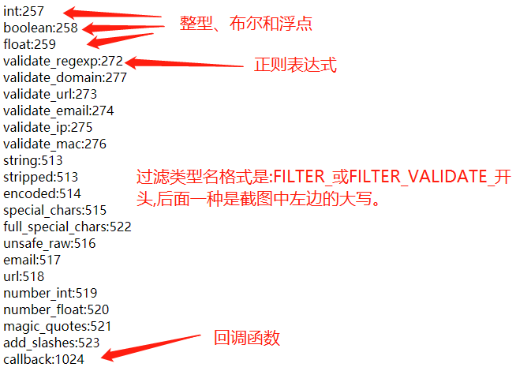

[toc]

## 一、学习的新认识

相比于前端，接触 PHP 要早点，所以对入门课也没太重视，知道老师会讲变量和常量。不过听了两天课，还是有不少新知识需要总结下:

>- **错误提示和抑制错误** 在PHP的配置文件中可设置`error_reporting`，来指定显示错误级别，默认值为`E_ALL & ~E_NOTICE`,就是不报NOTICE级别错误，如未加分号结尾就是NOTICE级别错误，作为初学者建议修改主E_ALL，即报告所有错误，提高自己书写规范能力。另一个临时抑制错误符号是@。如`$str="100pages";@sum=$str+10;`就会不提醒类型相关错误了。
>- **打印输出** 以前我基本是var_dump走天下，没想到它在真实维护环境中的不足，还好有老师提醒var_export()，我也发现在我框架中使用print_r()，发现二者有一点互补，当第二个参数为true，都是将结果以字符串形式保存到返回值。另外echo可支持多变量输出，这也是新的学习。
>- **变量相关知识学习** 重新学习了变量类型，终于把对象、资源搞明白了。之后变量检测、类型转换、全局变量和局部变量也算是对变量有了较全面认识了，不过发现老师在群里整理更详细，收获颇多。
>- **常量相关知识学习** 常量认识了预定义常量和魔术常量，知道了查看方法，并初步了解命名空间的由来，原来是为解决全局变量冲突而引入的，不同命名空间下同名的全局变量互不影响。
>- **过滤器** 要说本节课最大收获就是过滤器了,可以过滤变量、返回指定要求的值，若失败则返回false提醒用户。


## 二、认识 PHP

### 1、PHP解释、执行流程和文档组成
> **php 是什么?**
> PHP: (PHP: Hypertext Preprocessor), 超文本预处理器的缩写,服务端的语言。
> PHP 是开源的,免费的,可以嵌入 html 中的语言。
> 脚本语言,是指不需要编译,直接由解释器/虚拟机执行的编程语言

> **php 程序执行流程**
> php 程序是用 php 指令编写并由 php 解析器执行的代码
> php 程序必须使用`.php`做为扩展名
> php 程序可以使用标签方式嵌入到 html 文档中
> **执行流程如下:**
>
> 1. 客户端请求服务器端的 php 程序
> 2. 服务器端将 php 程序转发给 php 解释器执行
> 3. php 解释器执行完毕将生成的 html 或其它内容返回到服务器
> 4. 服务器将最终生成的 html 代码做为响应内容返回客户端


> php 程序文档

| 序号 | 组成         | 描述                               |
| :--:| -------------| ---------------------------------- |
|  1  |`<?php...?>`  | PHP代码开始和结束标记，开始标记不要有空格，?>可以省略|
|  2  | `;`          | 语句分隔符,不可少,否则报Notice级别错误|
|  2  | `{} `        | 代码块                           |
|  3  | 空白符        | 合理使用空白符可增强代码可读性     |
|  4  | 注释          | `// 单行注释`, `/* 多行注释 */`    |

> php 标记之外的内容会原样返回客户端,如 html 代码

```php
<?php
function sum(int $a,int b):int
{
    return "{$a}+{$b}=".($a+$b);
}
echo sum(10,20);
?>
```

### 2、打印输出

开发者在编程中，为了了解变量的变化或查错误，都需要打印输出功能。原生JS是console.log，而PHP则有如下几种:

| 指令          | 返回值|带不带括号|输出多个变量|打印的数据类型|
| -------------|------|---------|----------|-----------|
|`echo`        |没有|不带|可以，多个用逗号隔开|可输出“字符型，整形，浮点型，布尔型，资源”；输出“数组”则是输出Array，不可以输出“对象”（会报错）；不会输出“NULL”（不会报错）|
|`print`       |有，是1|可带，可不带|不可以|和echo表现一致|
|`print_r()`   |有,是true,当第二参数是true则返回结果字符串|必须带|不可以|可以输出“字符型，整形，浮点型，布尔型，数组，对象，资源”；不会输出“NULL”（不会报错）|
|`var_dump()`  |有,是null|必须带|不可以|可以输出“字符型，整形，浮点型，布尔型，数组，对象，资源，NULL”|
|`var_export()`|有,是null,当第二个参数为true返回结果字符串|必须带|不可以|可以输出“字符型，整形，浮点型，布尔型，数组，对象，NULL”,"资源"返回NULL|

> **使用建议**
>- **echo** 只想显示 **int、float、字符串** 或运算结果是前面三者时使用echo，而且支持多变量。
>- **var_dump()** 是 **本地开发最常用的排查手段** ，支持所有数据类型，打印信息包括类型、值、长度和所有行。
>- **print_r()和var_export()** 不像var_dump()会直接显示结果，可避免所有人都看见打印信息。这二者支持 **设置第二个参数为true，会将结果以字符串形式保存到返回值** ，我们可以将它写入日志，只允许指定人员查看。 **二者对4种标量类型和2种复合类型都支持，对于特殊类型，print_r()支持资源，而var_export()支持NULL** 。

## 三、变量

### 1、命名规范
 
> 1. 变量以 **$符号** 标记
> 2. 变量标识符 **只能是下划线、字母开头** ，不能以数字或特殊符号开头
> 3. 变量标识符中 **不能有空格、点、连接线等特殊的字符** 。
> 4. 变量由多个单词组成时,采用 **小驼峰命名法** ，即第一个单词全部小写，后面的单词首字母大写
> 5. 变量标识符是 **大小写敏感的** (函数名大小写不敏感)

### 2、变量类型

变量类型分成三大类: **标量类型4个、复合类型2个和特殊类型2个**

>- **标量类型:** 整型int、浮点型float、字符串string和布尔型boolean
>- **复合类型:** 数组array和对象object
>- **特殊类型:** null和资源resource

> **标量类型:** 比较简单，就不详细说了

```php
<?php
$i=12;
$float=10.12;
$str='Hello';
$gender=true;
```

> **数组:** 可以存放多个任意类型的数据,形式是key=>value，关键字是array。
>- **索引数组:** 下标是int
>- **关联数组:** 下标是string

```php
// 索引数组
$arr=[1,2,3,4,5,6];
// 关联数组
$arr2=['name'=>'woxiaoyao','age'=>28,'salary'=>5249.01];
```

> **对象:** 属性和方法的无序集合,关键字class。PHP内置了类原型stdClass,它是空类
>- 类定义使用关键字class，形式是`class 类名{}`
>- 类中方法访问属性则是 `$this->属性名`。
>- 类实例化对象要使用 **new方法** 。
>- 类对象访问公共属性和方法是通过 **单箭头->** 来访问

```php
// PHP内置类原型，是空类
$obj = new stdClass;
class Person{
    public $name='woxiaoyao';
    public $age;
    public function getName(){
        // 类中使用内部成员时，要使用$this
        return $this->name;
    }
}
$obj2=new Person;
```

> **null** 它和JS中一样，**即是类型，又是值** 。不表示空格,也不表示0,也不表示空字符串,仅仅表示一个变量值为空。
>- **将变量直接赋值null** 如`$num = null;`
>- **声明一个变量但未赋值** 如`var_dump($password);`直接打印未赋值的变量则为空
>- **被unset()函数销毁的变量** 如`$a = 55;unset($a);var_dump($a);`

> **资源类型resource:** 保存了到外部资源的一个引用。如使用文件系统函数创建资源,创建 **成功返回资源引用赋给一个变量 ,失败返回false** 。如`$fo=fopen('log.txt','w');`

### 3、变量赋值

变量赋值有两种形式:

> 1. **传值赋值:** 将源变量的 **值复制到新变量的数据存储空间**，修改两个变量的值 互不影响。
> 2. **引用赋值:** 使用 **&符号** ，将新变量和源变量指向 **同一个数据存储空间**，互相影响，任何一个变量改变将会改变另一个变量。一般不建议这样使用，这个类似C++中指针。

```php
$i=12
// 传值赋值
$in=$i;
$in=5;
// 下面输出12,5  两者因传值赋值，互不影响
// echo $i.'<br>',$in;   
// 引用赋值
$in2=&$i;
$in2=10;
// 下面输出10,10  两者因引用赋值，互相影响
echo $i.'<br>',$in2;
```

### 4、变量的检测

> 1. **isset() 用来检测变量是否被定义** ，若变量存在并且值不为null才返回true，否则是false。
> 2. **empty() 变量是否为空**  `""、0、"0″、NULL、FALSE、array()、$var、`未定义以及没有任何属性的对象都将被认为是空的，返回true，否则返回false。
> 3. **defined() 常量是否已经定义** 
> 4. **is_类型() 检查是否对应类型** 如`is_bool()、is_int()、is_float()、is_double()、is_real()、is_string()、is_array()、is_object()、is_null():`

### 5、变量类型转换

> **自动类型转换:** 自动转换 **只发生在标量类型之间**
>- null参与混合运算时,转换成0
>- 布尔值参与数值运算时，true为1，false为0
>- 布尔运算时，整数0、浮点0.0、空字符串、字符串0、空数组将为false。
>- 下面是标量类型之间的转换示意图。


> **强制类型转换:** 有三种方式:
> 1. 用后面的 **三个函数** 可以完成类型转换，intval()、floatval()、strval()
> 2. **变量前加上()里面写上类型** ，将它转换后赋值给其他变量
> 3. **settype(变量，类型)** 直接改变量本身

```php
// 类型强制转换
// 第一种：使用三个函数intval()、floatval()、strval()
$float = 1.23;
$result = intval($float);
//看看结果是不是变了？
var_dump($result);
//鸭脖子为整型的5
$yabozi = 5;
$re = floatval($yabozi);
var_dump($re);
//定义整型的变量
$yabozi = 23;
$bian = strval($yabozi);
//强制变成字符串试试
var_dump($bian);
// 第二种：变量前加上()里面写上类型，将它转换后赋值给其他变量
$transfer = 12.8;
//把浮点变为整型
$jieguo = (int)$transfer;
var_dump($jieguo);
//把浮点变为布尔
$jieguo = (bool) $transfer;
var_dump($jieguo);
//把布尔变整型
$bool = true;
$jieguo = (int)$bool;
var_dump($jieguo);
//把浮点变数组
$fo = 250;
$jieguo = (array)$fo;
var_dump($jieguo);
// 第三种:settype(变量，类型) 直接改变量本身
//定义浮点变为整型
$fo = 250.18;
//settype第二个参数是int，你实验的时候要记得第二个参数要为字符串类型
settype($fo,'int');
//输出看看结果
var_dump($fo);
```

### 6、全局变量和局部变量

> 变量作用域 :变量的生效范围 作用域是查找变量的工具
> 1. 局部变量:内部变量 在函数内部声明的变量 作用域仅作用于函数内部
> 2. 全局变量:外部变量,在函数外部声明的变量,作用域从定义处开始一直到程序文件的末尾,在函数内部无法直接使用全局变量，要 **通过global关键字或$GLOBAL全局变量数组** 来访问
>
> 这里要纠正下我的错误认识，认为PHP和JS都是解释型编程语言，所以全局变量也是如JS中一样是相对而言。结果却是PHP中全局变量就如C++中是真正的全局变量了。虽然PHP和JS二者在很多地方相近，但PHP是真正编程语言了。如访问对象是单箭头，而JS中是点或索引。

```php
$age=29;
function getAge(){
    // 通过global关键字引用全局变量
    // global $age;
    // return $age;
    // 通过$GLOBALS全局变量数组访问
    return $GLOBALS['age'];
}
echo getAge();
```

## 四、常量

### 1、常量特征
php常量是用于数据计算固定的值，只能是 **标量类型** 。

| 序号 | 特征                         |
| ---- | ---------------------------- |
| 1    | 常量前面没有美元符号`$`      |
| 2    | 常量创建时必须初始化         |
| 3    | 常量禁止更新和删除           |
| 4    | 常量不受作用域限制           |
| 5    | 推荐使用大写字母加下划线命名 |

### 2、常量相关的函数

| 序号 | 定义方式                  | 描述             |
| ---- | ------------------------- | ---------------- |
| 1    | `get_defined_constants()` | 查看系统所有常量 |
| 2    | `defined()`               | 检测常量是否存在 |
| 3    | `define()`                | 创建常量         |
| 4    | `const` 关键字            | 创建常量         |
| 5    | `constant()`              | 获取常量值       |

```php
// 获取系统定义的所有常量
print_r(get_defined_constants(true));
// 仅查看用户自定义的常量
print_r(get_defined_constants(true)['user']);
```

### 3、创建常量

| 序号 | 定义方式       | 区别                                                 |
| ---- | -------------- | ---------------------------------------------------- |
| 1    | `define()`     | 除了不能创建类常量, 可以在程序的任何地方定义         |
| 2    | `const` 关键字 | 必须全局定义,不能用在函数和流程控制中,允许创建类常量 |

- 常量值: `int`, `float`, `string`, `boolean`,`null`, `array`(php7+)
- `define($name, true)`: 允许忽略常量名大小写
- `const`在编译阶段处理, `define()`在运行阶段处理,所以`const`必须定义在 **全局才有效** 
- `class`类声明在编译时处理,且并不会创建作用域,当然也是全局中, 所以`const`可以用

上面是老师总结的，我再加上几点:

- define()来定义常量在PHP4加入的，而const则是PHP5.3.0之后加入，不过现在都基本是PHP7了，版本不是二者的差异了。
- **对值的表达式支持的差异:** 关键字const定义常量是在编译时定义的，因此const关键字定义的常量值的表达式中不支持算术运算符、位运算符、比较运算符等多种运算符，而这些运算符在define()函数定义常量时都是可以直接使用的。如`define('DEFINE_VAR2', 1 + 1)`

### 4、 获取常量

| 序号 | 函数/关键字  | 区别                   |
| ---- | ------------ | ---------------------- |
| 1    | `echo`       | 通常使用已知的常量名   |
| 2    | `constant()` | 常量名不确定或在变量中 |

二者区别就是在将常量赋值给某变量时，再打印该变量，echo针对将常量名当成值打印，而constant()会获取到时常量名所代表的常量值。

```php
// 常量名在变量中
$constName = 'EMAIL';
// 只能输出常量名,不能获取到常量值
echo $constName, '<br>';
// constant(): 可以将常量名从变量中解析来正确读到
echo constant($constName), '<br>';
```

### 5、 预定义常量 

预定义常量非常多,有许多与具体扩展相关,如 `PDO`, 这里仅列出系统级常用的:

| 序号 | 预定义常量             | 描述                                      |
| ---- | ---------------------- | ----------------------------------------- |
| 1    | `PHP_VERSION`          | PHP 版本                                  |
| 2    | `PHP_MAXPATHLEN`       | PHP 路径最大长度:1024                     |
| 3    | `PHP_OS_FAMILY`        | 操作系统:Windows/Darwin/Linux             |
| 4    | `PHP_SAPI`             | web 服务器与 php 之间接口: apache2handler |
| 5    | `PHP_EOL`              | 行尾结束符                                |
| 6    | `PHP_INT_MAX`          | 最大整数: `9223372036854775807`           |
| 7    | `PHP_INT_MIN`          | 最小整数: `-9223372036854775808`          |
| 8    | `PHP_INT_SIZE`         | 整数宽度: `8`                             |
| 9    | `PHP_FLOAT_MAX`        | 最大浮点数:`1.7976931348623E+308`         |
| 10   | `PHP_FLOAT_MIN`        | 整小浮点数: `2.2250738585072E-308`        |
| 11   | `DEFAULT_INCLUDE_PATH` | 默认 PHP 命令路径                         |
| 12   | `PHP_EXTENSION_DIR`    | 默认 PHP 扩展路径                         |
| 13   | `E_ERROR`              | 运行时错误: 致命中断                      |
| 14   | `E_PARSE`              | 语法解析错误: 致命中断                    |
| 15   | `E_NOTICE`             | 运行时提示: 不中断                        |
| 16   | `E_WARNING`            | 运行时警告: 不中断                        |
| 17   | `E_ALL`                | 所有级别错误(除`E_STRICT`)                |
| 18   | `E_STRICT`             | 更加严格的错误处理机制,高于`E_ALL`        |
| 19   | `TRUE`                 | 布尔真                                    |
| 20   | `FALSE`                | 布尔假                                    |
| 21   | `NULL`                 | 空                                        |
| 22   | `DIRECTORY_SEPARATOR`  | 目录分隔符                                |

```php
# 预定义常量
echo '版本号: ' . PHP_VERSION . '<br>';
echo '操作系统: ' . PHP_OS_FAMILY . '<br>';
echo '最大整数: ' . PHP_INT_MAX . '<br>';
echo '最大浮点数: ' . PHP_FLOAT_MAX . '<br>';
echo '目录分隔符: ' . DIRECTORY_SEPARATOR . '<hr>';
```

### 6、 魔术常量

- 魔术常量也属于"预定义常量", 比较特殊所有单独列出
- 所谓"魔术", 是指常量的值, 会随它们在代码中的位置改变而改变
- 魔术常量不区分大小写, 但是推荐全部大写
- 魔术常量是 **2个下划线开始，最后又以2个下划线结束** 。
- 魔术常量 **常见用途** :如__LINE__常用于日志中显示错误所在位置，__DIR__获取文档目录用来定义常量等。

| 序号 | 魔术常量        | 描述                   |
| ---- | --------------- | ---------------------- |
| 1    | `__LINE__`      | 文件中的当前行号       |
| 2    | `__FILE__`      | 文件的完整路径和文件名 |
| 3    | `__DIR__`       | 文件所在目录           |
| 4    | `__FUNCTION__`  | 当前的函数名称         |
| 5    | `__CLASS__`     | 当前类名称             |
| 6    | `__TRAIT__`     | 当前`Trait`名称        |
| 7    | `__METHOD__`    | 当前类方法名称         |
| 8    | `__NAMESPACE__` | 当前命名空间名称       |

```php
// 魔术常量
echo '当前行号: ' . __LINE__ . '<br>';
echo '当前文件: ' . __FILE__ . '<br>';
echo '当前目录: ' . __DIR__ . '<br>';
```

### 7. 常量命名空间

- 当使用的第三方组件(类库)中存在也当前脚本命名冲突的常量名时,可以用命名空间解决
- 命名空间允许将同名的标识符,定义在不同的空间中,类似同名文件可存放在不同目录下
- 命名空间使用关键字`namespace`声明, 必须放在脚本的首行,且 **前面不允许有任何输出**

```php
# 常量的命名空间
// 报重复声明错误
// const APP_PATH = __DIR__ . '/public/';
// const APP_PATH = __DIR__ . '/home/';
// 将同名常量定义在不同的空间中, 则不会报错
namespace ns1 {
    const APP_PATH = __DIR__ . '/public/';
}
namespace ns2 {
    const APP_PATH = __DIR__ . '/home/';
}
// 全局空间,不需要空间名，也称匿名空间。
namespace {
    // 访问命名空间中的常量, 必须带上空间名称
    echo \ns1\APP_PATH . '<br>';
    echo \ns2\APP_PATH . '<br>';
}
```

## 五、过滤器

### 1、什么是 PHP 过滤器？

PHP 过滤器用于 **验证和过滤来自非安全来源的数据** 。验证和过滤用户输入或自定义数据是任何Web应用程序的重要组成部分。设计PHP的过滤器扩展的目的是使数据过滤更轻松快捷。

查看PHP有哪些filter可用,可通过filter_list()和filter_id()两个内置函数。如：

```php
<?php 
$filters = filter_list(); 
foreach($filters as $filter_name) { 
    echo $filter_name .": ".filter_id($filter_name) ."<br>"; 
} 
```


对过滤类型的选择可以是过滤类型名，也可是过滤类型id。

> **过滤器类别:** 有两种Validating 和 Sanitizing
>- **Validating验证过滤器**
>   - 用于验证用户输入
>   - 严格的格式规则（比如 URL 或 E-Mail 验证）
>   - 如果成功则返回预期的类型，如果失败则返回 FALSE
>- **Sanitizing去除过滤器**
>   - 用于允许或禁止字符串中指定的字符
>   - 无数据格式规则
>   - 始终返回字符串

### 2、为什么使用过滤器？

几乎所有 web 应用程序都依赖外部的输入。这些数据通常来自用户或其他应用程序（比如 web 服务）。通过使用过滤器，您能够确保应有程序获得正确的输入类型。您应该始终对外部数据进行过滤！输入过滤是最重要的应用程序安全课题之一。
什么是外部数据？
•来自表单的输入数据
•Cookies
•服务器变量
•数据库查询结果


### 3、过滤变量filter_var()和filter_var_array()

- `filter_var(var,filter,options); `返回值: 返回过滤后的值,否则返回false
- `filter_var_array(array $data, filter);`获取多个变量并过滤它们,返回值: 返回过滤后的值,否则返回false。

```php
var_dump(filter_var('bob@example.com', FILTER_VALIDATE_EMAIL));
var_dump(filter_var('http://example.com', FILTER_VALIDATE_URL, FILTER_FLAG_PATH_REQUIRED));
$age = '15';
$min = 18;
$max = 35;
// 使用过滤参数
$options = array("options" => array("min_range" => $min, "max_range" => $max));
var_dump(filter_var($age, 257, $options));
$arr=[123.12,45.21,'woxiaoyao'];
var_dump(filter_var_array($arr,FILTER_VALIDATE_FLOAT));
```

### 4、过滤输入filter_input()和filter_input_array()

过滤通过http的get/post请求发送过来数据,过滤表单数据,

- `filter_input(输入类型get/post,变量名,filter)`
- `filter_input_array(输入类型get/post,args规定了过滤器参数数组,键是变量名,值就是过滤器)`
> 1）`$type接受的参数是固定的，是INPUT_GET, INPUT_POST, INPUT_COOKIE, INPUT_SERVER, 或者INPUT_ENV中的一个`。
> 2）`filter_input中，$variable_name是要使用过滤器的变量名，$filter就是我们上面filter_list过的可用filter之一，$filter可以是一个array。也就是，我们对$variable_name进行过滤时，可以用多个filter`。
> 3）`filter_input_arrary中，第二个参数是$args是一个array，是$variable-$filter-$options构成的一个组合。看起来就像是，我们对多个filter_input进行了一次性定义，然后一次性的执行。`

```php
// 单个值过滤
$options = ["options"=>["min_range"=>1]];
var_dump(filter_input(INPUT_GET,'id',FILTER_VALIDATE_INT,$options));
echo '<hr>';
// 多个值过滤
$args = [
    "username" => FILTER_SANITIZE_STRING,
    "age" =>FILTER_VALIDATE_INT,
    "blog_url" =>FILTER_VALIDATE_URL,
    "ip"=>FILTER_VALIDATE_IP
];
var_dump(filter_input_array(INPUT_GET,$args));
```
### 5、过滤回调FilterCallback

通过使用 FILTER_CALLBACK 过滤器，可以调用自定义的函数，把它作为一个过滤器来使用。这样，我们就拥有了数据过滤的完全控制权。您可以创建自己的自定义函数，也可以使用已有的PHP函数。规定您准备用到过滤器函数的方法，与规定选项的方法相同。

```php
// 自定义的函数把所有 "_" 转换为空格
function convertSpace($string)
{
return str_replace("_", " ", $string);
}
$string = "Peter_is_a_great_guy!";
echo filter_var($string, FILTER_CALLBACK, array("options"=>"convertSpace"));
```

## 六、学习后的总结

>- 熟悉echo、var_dump()、print_r()和var_export()的打印数据类型范围及应用场景
>- 熟悉变量命名、类型、检测、赋值、转换、局部变量和全局变量
>- 熟悉常量的命名规范、了解常见的预定义常量和魔术常量、命名空间由来和使用
>- 掌握过滤函数，提高数据的合法性，增强可预知性。这里要重点提下，老师在上课中反复提到的: **编程要增强可预测性，这样程序才健壮，出错率就会降低** 。