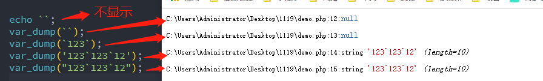

## 一、学习到的新认识

今天学习运算符和流程控制，相比于 C++和原生 JS，知识点基本相同。不过有几点还是第一次接触

> - **PHP 模板语法** 不得不说，我以前最讨厌就是在 html 混用 PHP 多分支控制了，那么多大括号{}让人头痛，现在有模板语法好了,写法更简洁。本来想深入理解它是否适用所有{}代码块，查百度竟然没有教程，只能自己测试了，目前知道适用 if、switch、for 和 foreach。
> - **单引号、双引号和反单引号** 这个是老师没讲的，起源于 JS 的模板字面量和 PHP 中模板字面量相近写法，不过 PHP 是双引号来拼接字符串和变量，而 JS 是反单引号拼接字符串和变量。在日常字符串中经常使用单引号和双引号，那 PHP 和 JS 对*单引号''、双引号""、反单引号``* 是如何支持和处理呢？它们有什么区别吗？

## 二、单引号、双引号和反单引号

讲三个引号的区别，是上一篇中遇到灭绝老师在一个演示案例中使用了"{$a}+${b}=".($a+$b),前面引号中有两个变量，正常 PHP 拼接变量和字符串要使用点连接符,而 JS 的 ES6 新增了模板字面量(或叫模板字符串)，使用反单引号来拼接字符串和变量。二者是何等相似。我们在日常字符中经常混用单引号、双引号，那么三个引号在 PHP 和 JS 是如何处理的呢?

### 1、字符串是使用单引号还是双引号？

正常情况下字符串使用单引号或双引号都可以，但处理方式不同：

- JavaScript 中是都当成 **普通字符串** 处理，有变量也当成普通字符串，不过在 **对象属性名是建议使用双引号** ，可以和 JSON 格式统一，毕竟 JSON 是目前最流行数据交换格式。当然单引号不报错。
- PHP 中 **单引号是普通字符串，不解析其中的变量** ，而 **双引号则是可以解析字符串的变量的，相当于 JS 中的模板字面量** 。

### 2、JS 模板字面量和 PHP 模板字面量

PHP 模板字面量是我自己定义的，不要太纠结说法，它们功能相近，下面是二者区别:

> - **使用引号不同:** `JS是使用反单引号(ESC键下方的)，而PHP使用双引号。`
> - **变量定义不同:** 就是声明引号内的哪些是变量, **JS 使用\$开头,大括号{}包裹**,而**PHP 中若字符串只有一个变量可省略{},若是有混合有多个变量或字符串则一定要有{}包裹** 。否则会将变量和字符串拼接成新的变量查询报未定义变量错误。
> - **表达式支持不同** JS 的模板字面 **支持表达式运算** ，而**PHP 只能是简单的变量和字符串拼接** 。

```javascript
<script>
  a=12; b=13; console.log(`a`); console.log('${a}'); console.log("${a}"); console.log(`${a}+${b}=${a + b}`);
</script>
```


```php
<?php
$a=3;
$b=4;
echo "$a",'<br>';
echo "{$a}+{$b}=".($a+$b),'<br>';
// PHP中双引号不支持表达式运算
// echo "{$a}+{$b}={$a+$b}";
```


### 3、PHP 支持单反引号吗？

```php
echo ``;
var_dump(``);
var_dump(`123`);
```



经测试 PHP 中，若字符串是以 **反单引号包裹则返回 NULL ，若是在单引号或双引号中有反单引号则是普通字符串** 。本来测试算结束了，自己又手欠测试了反单引号开头报错了，并且单引号不是成对时，后面代码也报错，**难道 PHP 中反单引号是什么特殊符号?在网上一查，还真是，它等同于 PHP 中 shell_exec()，就是可以直接通过 PHP 运行本机上的程序** ，对 PHP 是彻底颠覆了观念。至于 shell_exec()用法自己网上可百度，网上还有用 PHP 启动 Python 的。这里我贴上我的测试代码,运行结果是直接启动我 windows 系统中记事本程序。

```php
// var_dump(`1`'23`123`12');
// 反引号等同于下面的shell_exec('C:\Windows\write.exe');
$outExe = `C:\Windows\write.exe`;
// $outExe = shell_exec('C:\Windows\write.exe');
// var_dump($outExe);
```

> 尽量不要放弃每次报错的解决，也许就是新知识的起点。

## 三、运算符

### 1、算术运算符

| 序号 | 运算符 | 示例        | 描述                                   |
| ---- | ------ | ----------- | -------------------------------------- |
| 1    | `+`    | `$a+$b`     | $a与$b 的和                            |
| 2    | `-`    | `$a-$b`     | $a与$b 的差                            |
| 3    | `*`    | `$a*$b`     | $a与$b 的积                            |
| 4    | `/`    | `$a/$b`     | $a与$b 的商                            |
| 5    | `%`    | `$a%$b`     | $a与$b 的余(模)                        |
| 6    | `++`   | `$a++/++$a` | 先用再加/先加再用                      |
| 7    | `--`   | `$a--/--$a` | 先用再减/先减再用                      |
| 8    | `**`   | `2**4`      | 幂运算:2 的 4 次方，需要 `php5.6+`版本 |

下面演示取余运算符的两个应用: `判断当前年份是闰年和限制随机数范围`

```php
// 判断闰年
$year = date('Y');
if ($year % 4 === 0 && $year % 100 !== 0) :
    echo "{$year}是闰年",'<br>';
else:
    echo "{$year}不是闰年";
endif;
// 限制随机数范围
$res=mt_rand()%21;
echo $res;
```

### 2、比较运算符

比较运算符: 返回布尔值,常用于流程控制中(`if/while/for...`)

| 序号 | 运算符 | 示例        | 描述                     |
| ---- | ------ | ----------- | ------------------------ |
| 1    | `>`    | `$a > $b`   | 大于                     |
| 2    | `>=`   | `$a >= $b`  | 大于或等于               |
| 3    | `<`    | `$a < $b`   | 小于                     |
| 4    | `<=`   | `$a <= $b`  | 小于或等于               |
| 5    | `==`   | `$a == $b`  | 等于 (值相等即可)        |
| 6    | `===`  | `$a == $b`  | 全等于(二边值与类型全等) |
| 7    | `<>`   | `$a <> $b`  | 不相等                   |
| 8    | `!=`   | `$a != $b`  | 不相等                   |
| 9    | `!==`  | `$a !== $b` | 不全等                   |
| 10   | `<=>`  | `$a <=> $b` | 太空船`php7+`            |

这里说下 PHP7 新增加的 **太空船比较运算符** ,它是 <、=和>的结合体，就是它完成了三个运算符的工作，比较时比较类型，若前者大返回 1，相等返回 0，前者小则返回-1。

```php
$a='5';
$b=4;
$res=$a<=>$b;
echo $res;
```

### 3、逻辑运算符

多条件合并求值，返回值是布尔值，常用于流程控制中(`if/while/for...`)

| 名称 | 运算符    | 示例        | 描述                                         |
| ---- | --------- | ----------- | -------------------------------------------- |
| 与   | and 或&&  | `$a && $b`  | 如果 a 和 b 都为 true，则返回 true           |
| 或   | or 或\|\| | `\$a        |                                              | \$b` | 如果 a 和 b 至少有一个为 true，则返回 true |
| 异或 | xor       | `$a xor $b` | 如果 a 和 b 有且仅有一个为 true，则返回 true |
| 非   | !         | `!$a `      | 布尔值取反                                   |

这里讲下逻辑运算符另一种应用: **短路求值** 如 **&&表示前一个条件为 true 时，后面表达式会计算** ；另一种就是 **||用在函数中判断参数未传时，使用默认值** 。

```php
$username = 'admin';
if($username&&$username === "peter")
{
    echo "欢迎您".$username;
}else{
    echo 'sorry,您未登陆~';
}
```

### 4、 赋值运算符

| 序号 | 运算符 | 示例        | 描述                 |
| ---- | ------ | ----------- | -------------------- |
| 1    | `=`    | `$a = 10`   | 将表达式的值赋给变量 |
| 2    | `+=`   | `$a += 10`  | `$a = $a + 10;`      |
| 3    | `-=`   | `$a -= 10`  | `$a = $a - 10;`      |
| 4    | `*=`   | `$a *= 10`  | `$a = $a * 10;`      |
| 5    | `/=`   | `$a /= 10`  | `$a = $a / 10;`      |
| 6    | `%=`   | `$a %= 10`  | `$a = $a % 10;`      |
| 7    | `.=`   | `$a .= 'a'` | `$a = $a . 'a';`     |

> 提醒的是:1 个=是赋值运算符，而==和===是比较符，返回布尔值。

### 5、特殊运算符

- **点连接符:** 如`$str1 . $str2`返回连接之后的字符串。
- **三元运算符:** 指有三个表达式,2 个操作符，如`$a > $b ? 1:0;` 当 a 大于 b 时返回 1，否则返回 0，常用于简化双分支

### 6、运算符优先级

**混合运算时要遵循优先级从高到低进行运算** 。下面从高到低列出了运算符,同一行中的运算符具有相同优先级，此时它们的结合方向决定求值顺序。另外通过圆括号()的配对来明确标明运算顺序，而非靠运算符优先级和结合性来决定，通常能够增加代码的可读性。

| 结合方向 | 运算符                                                   | 附加信息                 |
| :------: | -------------------------------------------------------- | ------------------------ |
|    无    | clone new                                                | clone 和 new             |
|    左    | [                                                        | array()                  |
|    右    | ++ -- ~ (int) (float) (string) (array) (object) (bool) @ | 类型和递增／递减         |
|    无    | instanceof                                               | 类型                     |
|    右    | !                                                        | 逻辑运算符               |
|    左    | \* / %                                                   | 算术运算符               |
|    左    | + – .                                                    | 算术运算符和字符串运算符 |
|    左    | << >>                                                    | 位运算符                 |
|    无    | == != === !== <>                                         | 比较运算符               |
|    左    | &                                                        | 位运算符和引用           |
|    左    | ^                                                        | 位运算符                 |
|    左    | \|                                                       | 位运算符                 |
|    左    | &&                                                       | 逻辑运算符               |
|    左    | \|\|                                                     | 逻辑运算符               |
|    左    | ? :                                                      | 三元运算符               |
|    右    | = += -= \*= /= .= %= &= \|= ^= <<= >>= =>                | 赋值运算符               |
|    左    | and                                                      | 逻辑运算符               |
|    左    | xor                                                      | 逻辑运算符               |
|    左    | or                                                       | 逻辑运算符               |
|    左    | ,                                                        | 多处用到                 |

## 四、流程控制

### 1、条件流程控制

> **if 关键字的条件流程控制三种形式:**
>
> - 单一条件分支结构 if
> - 双向条件分支结构 if...else 。同 C++和 JS 一样，可用三元运算符简化。
> - 多向条件分支结构 if...elseif...elseif...else
>
> 这里要注意多向条件分支时 elseif 书写，它是连一起的，而 C++和 JS 是 else if 分开书写。

```php
<?php
$hour = date("H");
if($hour < 6)
{
    echo '凌晨好,主人~';
}elseif($hour<9){
    echo '早上好,主人~';
}elseif($hour<12){
echo '中午好,主人~';
}elseif($hour<17){
    echo '下午好,主人~';
}elseif($hour<19){
    echo '傍晚好,主人~';
}elseif($hour<22){
    echo '晚上好,主人~';
}else{
    echo '别熬夜了!你头发没了~';
}
```

> **switch...case:** 也是对 if 多向条件分支结构的简化(同 C++和 JS 中一样)
>
> - 通常用在单值的判断中,每个值为一个分支
> - 也可用在区间判断中，此时要注意 switch 条件是 true，变量真正判断放在 case 中。可参考我 JS 中总结的<https://www.php.cn/blog/detail/24740.html>

```php
<?php
$week = date("N");
switch($week){
    case 1:
    echo '你好打工人,今天是工作日周一~';
    break;
    case 2:
    echo '你好打工人,今天是工作日周二~';
    break;
    case 3:
    echo '你好打工人,今天是工作日周三~';
    break;
    case 4:
    echo '你好打工人,今天是工作日周四~';
    break;
    case 5:
    echo '你好打工人,今天是工作日周五~';
    break;
    default :
    echo '打工人解放了,今天是周末~';
}
```

### 2、循环流程控制

循环流程控制常见有三种:同样可参考 JS 中循环语法，具体可见<https://www.php.cn/blog/detail/24740.html>

- **while(){}入口判断型**
- **do{}while();出口判断型** 要记得在最后圆括号后面要加上分号，否则报错。
- **for(循环变量初始值;循环条件；循环变化){}计数型** 最常见的循环

> **补充:** 在上面我的 JS 文章中，将 forEach、for...in 和 for...of 也是纳入循环流程，有时感觉不适合，现在终于想明白了。这三者是 **遍历** , **循环可以实现遍历，但遍历不是循环** 。

```php
$cities = ['合肥','南京','杭州','苏州','上海'];
//入口判断型
while($city = current($cities))
{
    echo $city,'<br>';
    //后移指针
    next($cities);
}
//指针复位
reset($cities);
// 出口判断型
do{
    echo $city,'<br>';
    next($cities);
    //循环体内必须要有更新循环条件的语句,否则会进入死循环~
}while($city = current($cities));
//for循环
for($i=0;$i<count($cities);$i++)
 {
     //输出拦截,break 提前结束循环
     if($i>2) break;
     echo $cities[$i],'<br>';
 }
```

### 3、PHP模板语法

在上面if多向分支中有大量的大括号{}，这个若是在真实项目中将占用不少空间，最重要是阅读难度大，另外在Html中混合PHP条件控制时，大括号也增加阅读和编写难度。所以PHP对此类{}有了简化方案: **左大括号使用 `冒号:` 替换，右大括号使用 `end关键字加分号` 结束,二者之间的{}可直接简写成`冒号:`,右大括号可忽略。** 如下面源码，测试完全正常

```php
<?php
$hour = date("H");
if ($hour < 6):
    echo '凌晨好,主人~';
    echo '凌晨好,主人~';
elseif ($hour < 9):
    echo '早上好,主人~';
    echo '早上好,主人~';
elseif ($hour < 12):
    echo '中午好,主人~';
    echo '中午好,主人~';
elseif ($hour < 17):
    echo '下午好,主人~';
    echo '下午好,主人~';
elseif ($hour < 19):
    echo '傍晚好,主人~';
    echo '傍晚好,主人~';
elseif ($hour < 22):
    echo '晚上好,主人~';
    echo '晚上好,主人~';
else:
    echo '别熬夜了!你头发没了~';
    echo '别熬夜了!你头发没了~';
endif;
```

上面代码相对于大量{}的原始书写，无论是代码量，还是可阅读性都优秀不少，以后都将采用此类写法了，目前经常看到有if、switch、for和foreach都支持这种，后来据老师反馈，除了do...while外，基本都支持了。再看下老师用这种写法书写的前端混合代码:

```html
<?php if(!empty($_GET['name'])):?>
<font color="red">非空的</font>
<div><p>你好</p></div>
<?php endif; ?>
```

## 五、学习后的总结

本来老师还要求用条件分支和运算符模拟计算器功能，这个我就不演示了，如果单纯的演示比较简单，我就写代码了。但是有几点可以和大家分享下：

- 不要放过每次报错的解决机会，先自己测试解决，不行再百度，这样知识就会理解越深，掌握越牢，慢慢就转为技能了。
- PHP和JS对单引号、双引号和反单引号的不同处理方式，值得注意。
- PHP的模板语法对代码量减少和提高可阅读性都很有用，值得使用。