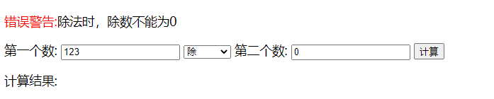
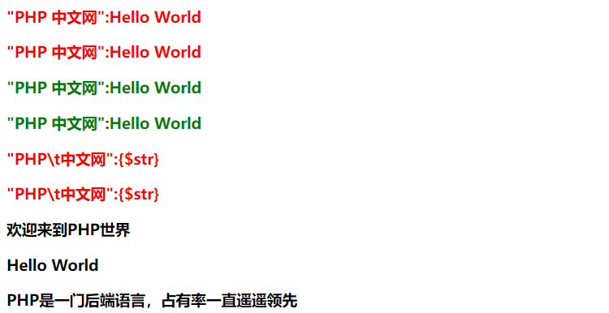

## 一、PHP实现的计算器

为什么要写PHP实现的计算器，就是纠正我错误的认识，在上一篇博文中，老师布置的PHP实现计算器的作业，我还以为必须要用ajax和后端交互呢，就感觉没怎么写的必要了，结果老师再讲课时让我很汗颜，我竟然报表单忘记了，在前端授课中，老师专门强调了，前端和后端交互的 **三种方式：url、表单和ajax** 。结果我只记得ajax了，不可否认，ajax是最普遍使用的，但对于只需要提交数据而言，表单完全就胜任了。

另外一个，从老师单PHP文件实现计算器的案例中学习到了PHP和前端简单交互功能，没有使用你任何JS代码，给我也是一种启发，所以这里记录下来，告警自己，编程需要灵活，太死板反而不利于编写出拍案叫绝的程序来。

> **PHP计算器功能:**
>- 能对未输入、输入超范围和输入不是整数都会错误提示
>- 能对除法时，除数为0的情况进行错误提示
>- 能过滤前端非法操作
>- 能进行加、减、乘、除和取余运算

> **实现解析:**
>- 过滤由filter_input_array()完成，不要相信用户任何输入数据，这是处理的原则。这个过滤功能很不错同，值得拥有。
>- 计算功能由switch...case分支控制实现。
>- 另外一个为了规范，开始使用PHP模板语法，将以前{}书写习惯向模板语法过渡。

```php
<style>
    :root {
        font-size: 1.1em;
    }

    form {
        margin: 1em auto;
    }

    input {
        width: 12em;
        height: 1.2em;
    }

    select {
        width: 5em;
    }
</style>
<?php
error_reporting(E_ALL & ~E_NOTICE);
$messageArr = [];
$result = "";
if (!empty($_POST)) :
    // 第一步:采用过滤函数过滤输入
    $argFilter = array(
        "num1" => array("filter" => FILTER_VALIDATE_INT),
        "num2" => array("filter" => FILTER_VALIDATE_INT),
        "opt" => array("filter" => FILTER_VALIDATE_INT, "options" => array("min_range" => 0, "max_range" => 4)),
        "calc" => FILTER_SANITIZE_ENCODED,
    );
    $inputs = filter_input_array(INPUT_POST, $argFilter);
    // var_dump($inputs);
    // 对检验结果反馈给用户
    if ($inputs['num1'] === false) array_push($messageArr, "第一个数不在许可范围内或不能为空");
    if ($inputs['num2'] === false) array_push($messageArr, "第二个数不在许可范围内或不能为空");
    if ($inputs['opt'] === 3 && $inputs['num2'] === 0) array_push($messageArr, "除法时，除数不能为0");
    if (!empty($messageArr)) :
        foreach ($messageArr as $message) :
            echo "<p><span style='color:red'>错误警告:</span>{$message}</p>";
        endforeach;
    else :
        // 一切检验通过后，正常运算
        switch ($inputs['opt']):
            case 1:
                $result = "{$inputs['num1']} - {$inputs['num2']} = " . ($inputs['num1'] - $inputs['num2']);
                break;
            case 2:
                $result = "{$inputs['num1']} * {$inputs['num2']} = " . ($inputs['num1'] * $inputs['num2']);
                break;
            case 3:
                $result = "{$inputs['num1']} / {$inputs['num2']} = " . ($inputs['num1'] / $inputs['num2']);
                break;
            case 4:
                $result = "{$inputs['num1']} % {$inputs['num2']} = " . ($inputs['num1'] % $inputs['num2']);
                break;
            default:
                $result = "{$inputs['num1']} + {$inputs['num2']} = " . ($inputs['num1'] + $inputs['num2']);
        endswitch;
    endif;
endif;
?>
<form action="" method="post">
    <label for="num1">第一个数:</label>
    <input type="num" size="4" name="num1" value="<?php echo $_POST['num1']; ?>" id="num1" placeholder="输入0到10000之间的数">
    <select name="opt" id="opt">
        <option value="0" <?php echo $_POST['opt'] == '0' ? 'selected' : '' ?>>加</option>
        <option value="1" <?php echo $_POST['opt'] == '1' ? 'selected' : '' ?>>减</option>
        <option value="2" <?php echo $_POST['opt'] == '2' ? 'selected' : '' ?>>乘</option>
        <option value="3" <?php echo $_POST['opt'] == '3' ? 'selected' : '' ?>>除</option>
        <option value="4" <?php echo $_POST['opt'] == '4' ? 'selected' : '' ?>>取余数</option>
    </select>
    <label for="num2">第二个数:</label>
    <input type="num" size="4" name="num2" value="<?php echo $_POST['num2']; ?>" id="num2" placeholder="输入0到10000之间的数">
    <button name="calc" value="calc">计算</button>
</form>
<p>计算结果:<span style="color:green;"><?php echo empty($result) ? '' : $result; ?></span></p>
```



## 二、大段字符串的简洁语法

前篇已经介绍过了 **PHP模板语法简化PHP书写,减少代码量，提高可阅读性**和 **双引号简化字符串和变量的拼接** ，那么在在PHP和Html混合编写时，有时需要书写大量的html元素，可能是多行，此时再用双引号就不是那么好阅读了，是否有类似于PHP模板语法的方式来简化大量PHP和Html混合编码书写呢？答案是有的，这个在培训班发的PHP资料中第一课中，我在它基础上进行了测试，归纳出使用方法。

> **使用规范:**
> 1. 使用 **<<< 做为引导符**, 使用**一对字符串做为标识符,结束标识符**。字符串内容随意,建议全部大写。
> 2. **开始标识符加双引号则类似双引号功能** ，但内部引用双号号不需要转义,可以解析变量和特殊字符。
> 3. **开始标识符加单引号则类似单引号功能** ，适合不需要转义特殊字符和变量解板的大段文本,如html代码
> 4. **单双引号只能在开始标识符加，如果不加则默认为双引号，结束标识符禁止加引号** 。不过建议加上，更符合规范。
> 5. **它结果是字符串，可赋值给变量** ，再结合双引号可完成复杂的字符串拼接。

```php
$str = 'Hello World';
// 开始标识符加双引号类似双引号，可解析变量和特殊字符
echo <<< "HERODOC"
<h3 style="color:red">"PHP\t中文网":{$str}</p>
<h3 style="color:red">"PHP\t中文网":{$str}</p>
HERODOC;

// 开始标识符加单引号则类似单引号功能，就是普通字符串
echo <<< 'NOWDOC'
<h3 style="color:red">"PHP\t中文网":{$str}</p>
<h3 style="color:red">"PHP\t中文网":{$str}</p>
NOWDOC;

// 开始标识符不加引号，默认是双引号，不过建议加上
echo <<< HELP
<h3 style="color:green">"PHP\t中文网":{$str}</p>
<h3 style="color:green">"PHP\t中文网":{$str}</p>
HELP;

// 结果其实是字符串，可赋值给变量。
$content = <<< "CONTENT"
<h3>欢迎来到PHP世界<h3>
<p>{$str}</p>
<p><span>PHP是一门后端语言，占有率一直遥遥领先</span></p>
CONTENT;
echo $content;
```



## 三、函数

函数是代码块复用的手段,变量是数据复用的手段。函数对特定功能进行封装，便于再次使用。

### 1、系统内置函数

PHP内置大量的内置函数，如前面文章中使用的date()、time()、mt_rand()、filter_list()等等

```php
// 临时设置报错级别
error_reporting(E_ALL & ~E_NOTICE);
// 随机数
echo mt_rand() % 101, '<br>';
echo mt_rand(10, 99), '<br>';
// 转小写，大写是strtoupper()
echo strtolower('COMPONENTS'), '<br>';
// date获取日期函数
echo date('Y:m:d h:m:s', time()), '<br>';
// 打印函数、生成数组函数
print_r(range(1, 10, 2));
echo '<br>';
```

### 2、函数返回值

- 1. 函数没有返回值时,返回null
- 2. 函数只能返回单一的值,返回值的数据类型可以是任意类型()
- 3. 函数碰到return语句,立即结束程序执行,return后面的代码不会被执行

```php
function demo1()
{
    return fopen('log.txt', 'w');
    return new stdClass;
    return range(1, 10, 2);
    return true;
    return 'woxiaoyao';
    return 12;
}
var_dump(demo1());
```

- 4. **间接返回多个值的解决方案:** `数组、json和序列化serialize`
   - 其实返回多个值一般都是通过数组实现的，无论是json还是serialize都是基于数组。
   - json是json_encode()将数组转换成json字符串返回，然后再json_decode($str,true)再还原为数组。注意第二个参数是true是表示返回数组。 
   - 序列化serialize其实也是通过serialize()将数组转换成序列化字符串返回，然后于丹通过反序列化unserialize()还原成数组。

```php
function demo2()
{
    $a = 12;
    $str = 'woxiaoyao';
    // 数组返回多个参数
    // return array($a,$str);
    // json返回多个参数,转换json是json_encode()，还原是json_decode(),若是还原数组，第二个参数为true
    // return json_encode(array($a,$str));
    // 序列化返回多个参数,序列化是serialize()，反序列化unserialize()。其中a表示数组，s表示字符串,i为整数，a和s后面是长度+内容。
    return serialize(array($a, $str));
}
var_dump(demo2());
```

### 3、形参与实参

- 形参就是函数定义时圆括号中参数，此时函数只是代表某功能的代码块。
  - 一般情况下它是临时变量，就是在调用时再分配空间，结束时就释放。若是引用传参，则调用时指向实参空间，直接操作实参空间的数据 。
  - 可以设置默认值，这样用户不输入参数时则使用默认参数，若用户传参，则使用用户参数覆盖默认参数。
  - 参数列表是从左向右求值的
  - 若传递参数未知，则可使用剩余参数来收集，将所有参数归纳为一个数组，使用三个点为标记，这个在JS和C++都存在这个概念
- 实参就是用户调用函数时传递的参数，此时函数就完成某项功能。
  - 实参传递有两种：一种是传值传参，只是将值给函数的形参。另一种引用传参，就是将形参指向实参的空间，直接操作实参空间的数据。
  - 对应形参的剩余参数，实参有展开参数，就是通过三个点为标识，将数组作为参数，一次性传递函数形参。

> 三个点标识的参数，在 **形参时为剩余运算符** ，接受未知个数的参数，并归纳为数组，由函数内部使用。而在 **实参时则是展开运算符** ,将数组作为参数一次性传给函数。JS中也有同样概念，展开赋值给剩余可看解构赋值。

```php
function calc(string $opt, ...$args)
{
    $opts = ['+', '-', '*', '/', '%'];
    // 判断运算符是否合法
    if (!in_array($opt, $opts)) {
        return '操作运算符只能是+、-、*、/和%';
    }
    // 将数组第一个值给结果
    $res = array_shift($args);
    // 按运算符循环处理
    foreach ($args as $arg) :
        $res = eval("return {$res} {$opt} {$arg};");
    endforeach;
    return $res;
}
$vals = range(1, 5);
// 实参展开运算符一次性赋值
echo calc('*', ...$vals), '<br>';
```

### 4、回调函数(匿名函数或闭包)

回调函数是将函数作为参数传递给父函数,又称匿名函数或闭包。朱老师的解释是`回调函数我们只负责定义，使用是别人的事`，而灭绝老师则是`用于异步编程中函数的参数,异步编程->对函数执行的时间和顺序不可预测,通过事件/回调的方式来唤醒主程序` 。到这里是不是还是很难理解呢？当我看到老师在array_map()的回调函数中定义自己的行为时，又想起以前事件中回调函数，突然想通了，想理解回调函数还是从编程中发现吧！目前我遇到的回调函数最常见的 **应用场景有两个：一是在回调函数中定义自己的处理方式或规则，另一个就是等待处理结束后触发的事件使用回调函数** 。其实二者又可归纳为一条就是： **未知的用户需求和未知的结束时间** 。用户的需求是多变的，我们提供的函数不可能满足每个用户的需求，而且不现实。如array_map提供遍历每个成员，用户定义如何处理，非常合理的思路；远程获取数据和事件的处理结果等都无法预知结束时间，此时可设定各种事件，如成功、失败、超时等，触发各自的处理，一般代码是顺序执行的，而回调函数则依靠事件驱动，可以解决此类异步的问题。

> **应用场景一: 对于调用者未知的需求，父函数只提供基本的功能或默认功能，回调函数允许用户自定义自己的处理方式** 。 上面已经用array_map举例子了，再看我上一篇文章中过滤器filter，也提供了回调函数，允许用户自定义自己的过滤规则，你再回头看看你所遇到的回调函数，是不是有很多这样的例子，JS中有map、filter等。其实这种理念在前端也随处可见,vuejs组件中插槽slot也是允许用户定义自己的布局的，也可使用默认布局。优秀的函数库和UI组件都会给使用者一定自定义空间，否则就太死板了。

```php
$arr = range(1, 10);
// 函数通过回调允许用户定义数据处理方式,它本身只提供遍历功能
$newArr=array_map(function ($item) {
    return $item * 2 + 1;
}, $arr);
print_r($newArr);
echo '<br>';
```

> **应用场景二: 对于未知结束时间的任务，如异步任务中通过事件来告诉父函数的任务进度，进而触发相应的回调函数处理** 代码正常执行的模式是同步，即执行完一个代码块后再执行下一个代码块，而有些任务如远程获取数据、和用户进行交互如弹窗和进行大量数据运算等，结束时间是无法预知的，此时若一直等待明显是不合适的，对于这些最好的处理方式就是事件， **事件函数就是回调函数，它从代码处开始运行，事件通知后结束运行，不影响程序的主流程**。这个在JS中经常见到，而swoole也有这样的例子。

> **关于回调与同步、异步的关系:** 我们正常认为回调就是异步，其实上面两种应用场景中已经说明了，第一种是同步中的回调函数，允许用户自定义。第二种是常见的是异步中的回调函数。回调和同步、异步没有直接联系，回调只是一种实现方式，既可以有同步回调，也可以有异步回调，还可以有事件处理回调和延迟函数回调，这些在我们工作中有很多的使用场景，它们最终都是用户来自定义处理方式，回调函数只是提供了环境。

### 5、匿名函数的use使用

我们知道PHP中匿名函数也是函数，也无法访问外部变量，函数解决访问外部变量在<https://www.php.cn/blog/detail/24902.html>中提到过`global`关键字或`$GLOBAL`全局变量数组，现在有了新的解决方案就是use,注意此时 **函数必须是匿名函数** 才可以，如`function sum() use ($a,$b){}`将报错的，只有`function () use ($a,$b){}`才正确，而且此时 **变量就是函数名** 如下案例调用`$res()`返回结果。

```php
$a = 12;
$b = 34;
$res=function () use($a,$b){
    return $a+$b;
};
var_dump($res());
```

如果同时想改变外部变量的值，必须引用传值才可以，默认是外部变量的副本，若是`function () use (&$a,&$b){}`就是引用外部变量了，即可访问又可修改。

use其实就是解决匿名函数(闭包)不能访问外部变量而提的方案，这个JS完全没问题，PHP为了解决访问外部变量也是想了很多办法啊

### 6、函数重载

首先声明下，目前PHP还没有函数重载的概念，它是来自于C++和Java。想到它是因为老师在说明函数形参和实参时，形参是从左至右处理的，如果直接传递中间的参数是无法成功，这个我就想到了自己的老本行C++，它的重载函数真是很好用。那么PHP可以实现函数重载吗？当然可以，目前有两种方案， 一种是作用func_get_args()和func_num_args()，另一种是call_user_func()或call_user_func_array()，这里只演示第一种实现的函数重载，后来会介绍下语法，具体实现可百度下

- **func_get_args()会获取传递给函数的所有参数，它的类型是数组** ，剩余参数非常类似它，不过它功能更强大
- **func_num_args()会获取传递给函数的参数个数，它的类型是整型** 。
- 需要注意:它们实现的重载函数，无论是 **被重载函数还是重载函数都要用return返回** ，如下面rewrite中return f1()，若是没有前面return则只返回到调用处，然后就不知道了，反正没结果。这个有待以后验证吧。

 ```php
 function f1($a)
{
    return "重载函数有一个参数:a={$a}";
}
function f2($a, $b)
{
    return  "重载函数有两个参数:a={$a}和b={$b}";
}
function rewrite()
{
    $args = func_get_args();
    $num = func_num_args();
    switch ($num):
        case 1:
            return f1($args[0]);
            break;
        case 2:
            return f2($args[0], $args[1]);
            break;
        default:
            return '未定义函数';
    endswitch;
}
echo rewrite(1),'<br>';
echo rewrite(1, 2),'<br>';
 ```

 - **call_user_func()和call_user_func_array()** 都可以调用其它函数，第一个参数是函数名，第二个参数开始时参数
    - 二者不同是,前者是参数一个一个传，而后者是作为数组一次性传，借上面讲的展开运算符
    - 另外调用类的中方法时，第一个参数又变成数组，数组中第一个数是类名，第二个方法名。

```php
function nowamagic($a,$b)   
{   
    echo $a;   
    echo $b;   
}   
call_user_func('nowamagic', "111","222"); 
class a {   
    function b($c)   
    {   
        echo $c;   
    }   
}   
call_user_func(array("a", "b"),"111");  
function a($b, $c)   
{   
    echo $b;   
    echo $c;   
}   
call_user_func_array('a', array("111", "222"));  
```

## 其它

- 命名空间namespace：我们知道命名空间是为解决全局成员冲突而设计的，那么哪些是全局成员呢？ **常量、函数、类(接口)都是全局成员** ，要用命名空间来解决命名冲突问题。使用格式是根空间开始，就是\，也是全局空间，然后是依次的空间名路径了，最后是方法名。如\ns1\demo()。

- 数组一些常用函数
   - array_map 遍历数组，通过回调函数接受用户自定义行为，返回新的数组，不影响原数组。但是不符合行为的以空值返回，它常用于处理数组，不要用于筛选数组成员。
   - array_map 过滤数组，返回条件为true的成员组成的数组，不影响原数组。新的数组成员是原数组中成员中某一个，它是筛选数组。
   - array_values() 以数组的值创建新的索引数组，索引从0重新开始。
   - array_keys() 返回数组的键名。
