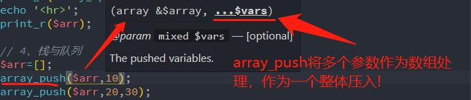
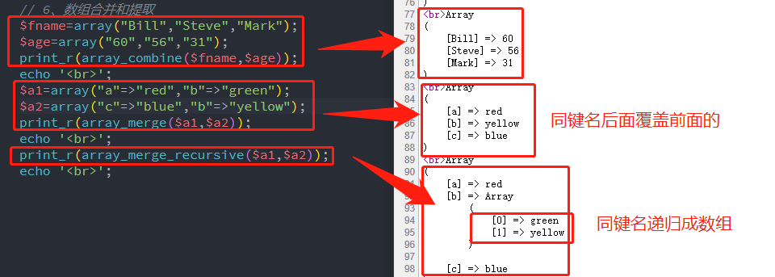

## 一、PHP字符串常用操作

通过老师的授课，发现JS的字符串与数组的操作与PHP的非常类似，可以相互借鉴学习，一方面是可以快速理解函数用法，另一个是相互印证相互提高了。

### 1、大括号{}

大括号常用的用法主要是函数块和双引号中变量引用，今天老师又讲了字符串中{}用法，类似于JS中将字符串当成数组来处理，顺其自然就随手测试了`[]`，发现二者均可以对字符串进行访问，修改和删除。那么二者之间有区别吗？而且代码中总是对大括号{}进行了黄色波浪线提示，老师说建议使用{}是合适的吗？在网中发现，{}是PHP7.4以前的语法了，以后推荐使用`[]`。所以可以放弃{}这种访问字符串的方法了，这样和JS访问字符串可以统一了。

### 2、字符串打印输出函数

先看最基本的 `printf(format,arg1,arg2...)` 将输出的字符串按特定的格式输出,学过C、C++的这个函数就是熟悉得不能再熟悉了，格式符号都是%开头，如%s是格式化为字符串，%d是格式化为整数，%c是格式化为ASCII值对应的字符。arg1对应第一个格式符号，arg2对应第二个，以此类推。下面是常见的格式化字符表：

|占位符|描述|
|:---:|---|
|%b|二进制数|
|%c	|ASCII 值对应的字符|
|%d	|包含正负号的十进制数（负数、0、正数）|
|%e	|使用小写的科学计数法（例如 1.2e+2）|
|%E	|使用大写的科学计数法（例如 1.2E+2）|
|%u	|不包含正负号的十进制数（大于等于 0）|
|%f|	浮点数（本地设置）|
|%F	|浮点数（非本地设置）|
|%g|	较短的 %e 和 %f|
|%G	|较短的 %E 和 %f|
|%o	|八进制数|
|%s	|字符串|
|%x	|十六进制数（小写字母）|
|%X	|十六进制数（大写字母）|

与printf类似的就是vprintf，二者唯一区别就是参数传递方式，前者是列表式传参，多个参数以逗号隔开，后者则以数组形式传递参数。

```php
printf('Hello %s','World');
echo '<hr>';
vprintf('Hello %s,my age is %d',['World',28]);
```

与它们类似的还有sprintf和vsprintf，二都都是将格式化结果保存到字符串中返回。

```php
$sql = sprintf('SELECT * FROM `%s` LIMIT %d','users',11);
echo $sql;
$sql = vsprintf('SELECT * FROM `%s` LIMIT %d',['users',11]);
file_put_contents('temp1.txt',$sql);
```

### 3、字符串和数组转换【重点】

字符串和数组相互转换是开发中经常用到的，它主要包括数组转字符串implode或join，反之是explode。implode和join的`implode(separator,array)`第一个参数是分隔符，默认是空，第二个参数就是数组了。而explode`explode(separator,string,limit)`第一个参数也是分隔符，第二个参数是字符串，第三个参数比较有意思，若大于分隔符分隔成的数组个数时无效，若是小于分隔符分隔成的数组个数时，则是将后面所有合并。

```php
// 数组转字符串
echo implode(',',['html','css','vuejs','uniapp']);
echo '<hr>';
echo join(',',['html','css','vuejs','uniapp']);
echo '<hr>';
// 字符串转数组，explode第三个参数是指定数组的成员个数,若个数大于字符串个数时，则无效，若小于时，则大于的合并成一个成员
print_r(explode(',','localhost,root,root,utf8,3306',4));
echo '<hr>';
print_r(explode(',','localhost,root,root,utf8,3306',5));
echo '<hr>';
```

JS中字符串转数组是split，在PHP中也有str_split,它的语法是`str_split(string,length)`,第一个参数是字符串，第二个参数是指定数组成员的长度，默认为1。中文在uft-8中是占3个字符。

```php
print_r(str_split('php中文网',3));
```

### 4、大小写转换和移除字符串两侧的空白字符

大写是strtoupper，小写是strlower,移除字符串两侧的空白字符或其他预定义字符是trim。它的语法是`trim(string,charlist)`，其中charlist若不指定则移除以下所有字符。

- "\0" - NULL
- "\t" - 制表符
- "\n" - 换行
- "\x0B" - 垂直制表符
- "\r" - 回车
- " " - 空格

> **要注意的是：** 转义字符只有在`双引号""或定界符<<<EOF中双引号`才有效，若是单引号则当成两个字符，不是转义字符，使用trim就无法移除，这点在移除处理时要注意，我在下面代码测试时就遇到这样问题。

```php
// trim是移除两侧空白字符，要注意若是转义字符时要用双引号，若是单引号则算成两个字符，不是转义字符，移除无效
$str1="\n\n\nHello World  !\n\n\n";
$str2='\n\n\nHello World  !\n\n\n';
echo strlen(trim($str1)).','.strlen(trim($str2));
```

ltrim和rtrim是从左侧或右侧移除空白字符或其他预定义字符，使用注意事项同trim。

### 5、查找、取子串、比较和替换

> **查找子串：一般分大小写，若想不分大小写，可加上i**。
> 1. strpos是查找子串第一次出现位置(分大小写)，`strpos(string,find,start)`,第一个是字符串，第二个是子串，第三个参数start表示起始位置，默认是从0开始。stripos也是查找第一次出现位置(不分大小写)
> 2. strrpos是查找子串最后一次出现位置(分大小写)，strripos也是查找最后一次出现位置(不分大小写)
> 3. strstr也是查找子串第一次出现位置(分大小写)，它的语法是`strstr(string,search,before_search)`。它和strpos不同地方有两个：一个是search为数字时，则返回匹配此数字对应的 ASCII 值的字符；另一个是before_search默认是false,如果设置为 "true"，它将返回 search 参数第一次出现之前的字符串部分。相当于查找和取子串两个功能了。它的不分大小写版本是stristr

```php
echo strpos('AbCDef123asdf','as');
echo strstr('AbCDef123asdf','as',true);
```

> **取子串:`substr(string,start,length)`**,start为0时表示从字符串第一个字符开始，为正数时从在字符串的指定位置开始，若为负数则是在从字符串结尾开始的指定位置开始，最后一个字符是-1，以此类推。length为正数是返回指定长度的字符串，若没有则默认返回到结尾处。

```php
echo substr('abcdef',0),'<br>';
echo substr('abcdef',2),'<br>';
echo substr('abcdef',2,2),'<br>';
echo substr('abcdef',-1),'<br>';
echo substr('abcdeft',-2,2),'<br>';
echo substr('abcdeft',-3,2),'<br>';
```

> **字符串比较: strcmp和strcasecmp**,前者是分大小写，后者不分大小写。`strcmp(string1,string2)`。相等时返回0，大于0时string1大于string2，小于0时string1小于string2。
>- 类似还有strncmp和strncasecmp是比较前n个字符。
>- strnatcmp和strnatcasecmp：使用自然排序比较字符大小。strcmp是常规计算机字符串排序算法，它在比较10和2时，结果是10小于2，因为10中第一个1小于2，而自然排序时，它们将自然数来排序，结果是10大于2。
>
> **比较规则：** 从左向右比较，相等则依次向后，若不等结束比较，返回结果。

> **替换:str_replace(find,replace,string,count)** find是查找的值，replace是替换的值，string是被搜索的字符串，count是对替换数进行计数的变量。**find和replace可以是字符串，也可以是数组，它是大小写敏感,它	返回带有替换值的字符串或数组**，不分大小写的版本是str_ireplace()。它的替换规则如下:
>- 如果搜索的字符串是数组，那么它将返回数组。
>- 如果搜索的字符串是数组，那么它将对数组中的每个元素进行查找和替换。
>- 如果同时需要对数组进行查找和替换，并且需要执行替换的元素少于查找到的元素的数量，那么多余元素将用空字符串进行替换
>- 如果查找的是数组，而替换的是字符串，那么替代字符串将对所有查找到的值起作用。


```php
echo str_replace('转账','**','微信转账,支付宝转账',$count),'<br>';
$search = ['交友','广告','直播','带货'];
echo str_replace($search,['***','===','&&&','+++'],'广告代理,直播教学,免费带货,异性交友'),'<br>';
```

### 6、求字符串长度strlen和mb_strlen

求字符串的字符长度是strlen，若是有中文时，则在utf-8中中文占3个字符。若是中英文混排时想计算长度可以使用mb_strlen,它接受第二个参数，就是编码，建议是utf-8或uft8。不建议使用gb2312编码，它显示得很异常。

```php
echo mb_strlen('中国人123','utf-8'),'<br>';
echo mb_strlen('中国人','gb2312'),'<br>';
echo strlen('中国人123'),'<br>';
```

> **需要注意:** 需要注意的是，mb_strlen并不是PHP核心函数，使用前需要确保在php.ini中加载了php_mbstring.dll，即确保“extension=php_mbstring.dll”这一行存在并且没有被注释掉，否则会出现未定义函数的问题。

## 二、PHP数组相关的操作

### 1、游标访问数组

- key() -返回数组中的当前元素的键名
- current() - 返回数组中的当前元素的值
- next() - 将内部指针指向数组中的下一个元素，并输出
- prev() - 将内部指针指向数组中的上一个元素，并输出
- reset() - 将内部指针指向数组中的第一个元素，并输出
- end() - 函数将数组内部指针指向最后一个元素

> 本来还想介绍each()，测试时提醒each在PHP7的以后版本推荐使用foreach代替了。
> 游标访问数组不限索引数组还是关联数组


```php
// 循环输出数组
$people = array("Bill", "Steve", "Mark", "David");
reset($people);
while(current($people)){
    echo 'key='.key($people).',value='.current($people).'<br>';
    next($people);
}
```

### 2、数组和变量转换

>**关联数组与变量转换：**
>- extract():将关联数组拆分成变量，接受参数是数组变量
>- compact():将一组变量组成关联数组，接受参数是键名字符串，就是将变量名作为键名，它的值为键值，组成关联数组
>- array():将一组变量组成关联数组，组成关联数组时，要使用=>同时指明键名和键值的变量。
> **注意事项:** 要区分compact和array组成关联数组时接受参数的区别，前者是将变量名作为键名，键值是键名的变量；而后者则是要同时指定键名和键值，灵活度更高，当然书写更长。

```php
$config = ['type'=>'mysql','host'=>'localhost','dbname'=>'phpedu','charset'=>'utf=8'];
extract($config);
echo $type, ",{$host}", ",{$dbname}", ",{$charset}",'<br>';
// compact的参数是变量名加引号，不是变量喔，而array组成关联数组则要指出键名
print_r(compact('type','host','dbname','charset'));
$arr=array('type'=>$type,'host'=>$host,'dbname'=>$dbname,'charset'=>$charset);
```

>**索引数组与变量转换：**
- list():将索引数组赋值给一些变量。若不想接受某个变量，以空占位，每个接受变量用逗号隔开。
- array():将一组变量或值组成索引数组，常见的创建数组也是这个函数。它也可以创建关联数组。
> **注意事项:** array()接受参数有三种形式: **一组变量时变量值组成索引数组；一组常量时常量组成索引数组；键名=>变量或常量时组成关联数组**。

```php
// 索引数组
// 要注意array和compact的参数区别
$arr=array($type,$host,$dbname,$charset);
print_r($arr);
echo '<hr>';
list($a,$b)=$arr;
echo $a, ",{$b}",'<br>';
```

### 3、array_splice实现增改删

array_splice和JS的数组函数splice使用方法是一样的，是比较强大的函数，可实现数组的增改删除。它的语法是:`array_splice(array,start,length,array2)`。

- array，必需。规定数组
- start,必需。数值，规定删除元素的开始位置。0为第一个元素，为正数，则从数组中该值指定的偏移量开始移除，为负数，则从数组末端倒数该值指定的偏移量开始移除。
- length,可选，数值，规定被移除的元素个数，也是被返回数组的长度。为正数，则移除该数量的元素，为负数则移除从 start 到数组末端倒数 length 为止中间所有的元素，为0表示不删除，不设置则移除从 start 参数设置的位置开始直到数组末端的所有元素。
- array2，可选，规定带有要插入原始数组中元素的数组。如果只有一个元素，则可以设置为字符串，不需要设置为数组。
- 返回值，由被提取元素组成的数组。
- 该函数直接操作array数组。

> **应用1：分割字符串:** 只要有前两个参数让可以了，如`array_splice($arr,3)`，它返回就是从索引3开始的成员，原$arr为索引0到2的成员。

> **应用2:增加：** 要设置length为0，表示从start增加array。如`array_splice($arr,3,0,['id','name'])`;

> **应用3:修改:** 要设置length=array2.length，这样删除的刚好被插入的替换了，相当修改效果。如`array_splice($arr,3,2,['id','name'])`;

> **应用4:删除:** 如`array_splice($arr,3,2)`;

```php
// $arr=array('type'=>$type,'host'=>$host,'dbname'=>$dbname,'charset'=>$charset);
print_r(array_splice($arr,2,1,'woxiaoyao'));
echo '<hr>';
print_r($arr);
```

> **对索引数组和关联数组测试：** array_splice对索引数组增删改都没问题，若是关联数组分隔和删除操作没有任何问题，增加和修改则将对应键名替换为索引键名，不建议对关联数组增改。

### 4、栈与队列

- 栈:是一种特殊的线性表,是添加与删除受限的一种数据结构 LIFO,只能在固定的一端进行数据的添加与删除。
   - 尾部压入和弹出:array_push和array_pop
   - 头部压入和弹出:array_unshift和array_shift。
   - 若是压入多个时，要注意压入顺序。array_push是从左向右依次压入，而array_unshift则是从右向左从头部压入。如果难理解，可以将压入所有数据看成成一个从左向右的数组(左为头部，右为尾部)，push压入时头部接上栈的尾部，它的尾部成为新栈的尾部，而unshift压入时尾部接上栈的头部，它的头部成为新栈的头部。



```php
$arr=[];
array_push($arr,10);
array_push($arr,20,30,40,50,60);
array_pop($arr);
array_unshift($arr,9);
array_unshift($arr,1,2,3,4,5,6,7);
array_shift($arr);
print_r($arr);
```

- 队列:FIFO  queue数据结构之一,特殊的线性表,受到操作的限制,它其实就是上面组合，这里就不演示了。
   - 尾部队列:array_push和array_shift
   - 头部队列:array_unshift和array_pop

### 5、搜索键值或键名

- `array_key_exists(key,array)` 检查某个数组中是否存在指定的键名，如果键名存在则返回 true，如果键名不存在则返回 false。
- `in_array(search,array,type)` 检测键值在不在指定的数组中,存在返回true,不存在返回false。type默认为false，为true时要求值和类型都一致
- `array_search(value,array,strict)` 检测键值在不在指定的数组中,存在的话返回元素值对应的键名,不存在返回false。strict默认为false，为true时要求值和类型都一致

```php
var_dump(array_key_exists(60,$arr));
var_dump(in_array(60,$arr));
var_dump(array_search(50,$arr));
```

- array_keys()返回数组,数组成员是原数组的键名
- array_values()返回数组中所有的值(不保留键名),键值从0到1 递增
- 搜索实现：就是从返回的键名数组或键值数组中查找符合条件，可以使用foreach遍历数组。

### 6、数组合并和提取

> **数组合并:**
>- `array_combine(keys,values)` 两个参数均是数组，第一个是键名，第二个是键值。键名数组和键值数组的元素个数必须相同！否则返回false。
>- `array_merge(array1,array2,array3...)` 把一个或多个数组合并为一个数组。
>   - 参数都是索引数组时，依次拼接，将所有键值作为新的数组成员，不会出现覆盖。
>   - 参数是关联数组时，同键名时，后面的键值会覆盖前面的值。
>   - 若只有一个参数时，且键名是整数，则该函数将返回带有整数键名的新数组，其键名以 0 开始进行重新索引。有点类似array_values效果。
>- `array_merge_recursive(array1,array2,array3...)` 和array_merge使用一致，唯一区别就是关联数组时，同键名不会覆盖，而是将多个相同键名的值递归组成一个数组。

```php
$fname=array("Bill","Steve","Mark");
$age=array("60","56","31");
print_r(array_combine($fname,$age));
echo '<br>';
$a1=array("a"=>"red","b"=>"green");
$a2=array("c"=>"blue","b"=>"yellow");
print_r(array_merge($a1,$a2));
echo '<br>';
print_r(array_merge_recursive($a1,$a2));
echo '<br>';
```



> **二维数组某列的提取:** 这个在数据查询中经常要用到，每条记录是个数组，多个记录组成二维数组，此时若想快速获取记录中某列的值组成数组，使用函数就是`array_column(array,column_key,index_key)`;
>- array 必需。规定要使用的多维数组（记录集），常见是二维数组
>- column_key 必需。需要返回值的列。可以是索引数组的列的索引，或者是关联数组的列的键名。也可以是 NULL，此时将返回整个数组（配合 index_key 参数来重置数组键的时候，非常有用）
>- index_key 可选。用作返回数组的索引/键的列。
>- 返回值 返回数组，此数组的值为输入数组中某个单一列的值。

```php
$a = array(
    array( 'id' => 5698, 'first_name' => 'Bill', 'last_name' => 'Gates', ),
    array( 'id' => 4767, 'first_name' => 'Steve', 'last_name' => 'Jobs', ),
    array( 'id' => 3809, 'first_name' => 'Mark', 'last_name' => 'Zuckerberg', )
  );  
  $last_names = array_column($a, 'last_name', 'id');
  print_r($last_names);
  echo '<br>';
```

### 7、数组的遍历(迭代)操作

这点和JS数组非常类似了，JS中有map、filter和reduce，PHP也有对应的array_map、array_filter和array_reduce。

- `array_reduce(array,myfunction,initial)` 用回调函数迭代地将数组简化为单一的值，其中myfunction完整语法是`function($prev,$cur,$index,$arr){}`，`$prev`是每步结果返回值，若是不存在initial，则第一次是它等于数组第一个成员，`$cur`从第二个开始遍历；而存在initial时，则第一次`$prev`为初始值，`$cur`从第一个开始遍历数组，这点要切记。它的应用包括求和、求最大值、计算重复、去重等，更详细要参考我写的关于JS的reduce总结<https://www.php.cn/blog/detail/24999.html>
- 类似遍历array_map和array_filter可参考JS的map或filter，也可参考手册学习了

```php
// 求和演示，同JS一样写匿名函数
$a=array(10,15,20);
echo array_reduce($a,function($prev,$next){return $prev+$next;},5);
// 箭头闭包只能是有一个表达式，使用关键字fn,而且PHP7.4以后再支持
// echo array_reduce($a,fn($prev,$next)=>$prev+$next,5);
```

- `array_walk(array,myfunction,userdata...)` 对数组中的每个元素应用用户自定义函数。在函数中，数组的键名和键值是参数，当用户自定义函数中的第一个参数指定为引用：&$value，就可以改变数组元素的值。
   - `array_walk()`函数对数组中的每个元素应用回调函数。如果成功则返回 TRUE，否则返回 FALSE
   - 典型情况下 myfunction 接受两个参数。array 参数的值作为第一个，键名作为第二个。如果提供了可选参数 userdata ，将被作为第三个参数传递给回调函数。
   - 如果 myfunction 函数需要的参数比给出的多，则每次 array_walk() 调用 myfunction 时都会产生一个 E_WARNING 级的错误。这些警告可以通过在 array_walk() 调用前加上 PHP 的错误操作符 @ 来抑制，或者用 error_reporting()。

```php
// 遍历
function myfunction1($value,$key,$p)
{
echo "$key $p $value<br>";
}
$a=array("a"=>"red","b"=>"green","c"=>"blue");
array_walk($a,"myfunction1","has the value");
// 通过&$value修改数组的值。
function myfunction2(&$value,$key)
{
$value="yellow";
}
$a=array("a"=>"red","b"=>"green","c"=>"blue");
array_walk($a,$myfunction2);
print_r($a);
```

> **注意事项:** 回调函数作为参数时，若 **直接使用匿名函数作为函数时，则形式是function($arg1,$arg2,...){}**;若是 **先定义回调函数** ，此时传参一定要注意，可以是 **函数名加引号** ，也可是 **`$`拼接函数名**,若直接是函数名则将报错，它在JS中可以是合法变量名，但在PHP中$才是变量前缀。

### 8、排序

- `sort(array,sortingtype)` 对 **索引数组进行升序排序** ,本函数为数组中的单元赋予新的键名。原有的键名将被删除。如果成功则返回 TRUE，否则返回 FALSE。可使用rsort()进行降序排序。sortingtype规定了如何比较数组的元素/项目，可能的值
   - 0 = SORT_REGULAR - 默认。把每一项按常规顺序排列（Standard ASCII，不改变类型）
   - 1 = SORT_NUMERIC - 把每一项作为数字来处理。
   - 2 = SORT_STRING - 把每一项作为字符串来处理。
   - 3 = SORT_LOCALE_STRING - 把每一项作为字符串来处理，基于当前区域设置（可通过 setlocale() 进行更改）。
   - 4 = SORT_NATURAL - 把每一项作为字符串来处理，使用类似 natsort() 的自然排序。
   - 5 = SORT_FLAG_CASE - 可以结合（按位或）SORT_STRING 或 SORT_NATURAL 对字符串进行排序，不区分大小写。
   - 其它相关的排序: **按键名(ksort和krsort)、对关联数组按照键值(asort和arsort)、用“自然排序”算法对数组排序(natsort和natcasesort)等** 。

```php
$arr = array('1', '10', '2', '32', '22');
sort($arr);
// 按字符串排序
sort($arr, SORT_STRING);
print_r($arr);
```

- `usort(array,myfunction)` 通过用户自定义的比较函数对数组进行排序。myfunction定义可调用比较函数的字符串。如果第一个参数小于等于或大于第二个参数，那么比较函数必须返回一个小于等于或大于0的整数。本函数为 array 中的元素赋予新的键名。这会删除原有的键名。类似有 **使用用户自定义的比较函数对数组中的键名进行排序（(uksort)和使用用户自定义的比较函数对数组中的键值进行排序(uasort)** 。
注意自定义函数作为参数传递时要么加引号，或加`$`前缀。

```php
function my_sort($a, $b)
{
  if ($a == $b) return 0;
  return ($a < $b) ? -1 : 1;
}
$a = array(4, 2, 8, 6);
usort($a, "my_sort");
print_r($a);
```

- `array_multisort(array1[,sortingorder,sortingtype][,array2,array3,....])` 对多个数组或多维数组进行排序。
   - sortingorder 可选。规定排列顺序。SORT_ASC - 默认，升序排列；SORT_DESC降序。
   - sortingtype 可选。规定排序类型。和sort函数中sortingtype取值和意义相同。
   - 返回值：如果成功则返回 TRUE，如果失败则返回 FALSE。
   - 字符串键名将被保留，但是数字键名将被重新索引，从 0 开始，并以 1 递增。
   - 可以在每个数组后设置排序顺序和排序类型参数。如果没有设置，每个数组参数会使用默认值。
   - 函数先对第一个数组进行排序，接着是其他数组，如果两个或多个值相同，它将对下一个数组进行排序。

```php
$a1=array("Dog","Dog","Cat");
$a2=array("Pluto","Fido","Missy");
array_multisort($a1,$a2);
print_r($a1);
print_r($a2);

array_multisort($a1,SORT_ASC,$a2,SORT_DESC);
print_r($a1);
print_r($a2);

$a1=array(1,30,15,7,25);
$a2=array(4,30,20,41,66);
$num=array_merge($a1,$a2);
array_multisort($num,SORT_DESC,SORT_NUMERIC);
print_r($num);
```

### 9、其它常见的操作函数

- `count(array,mode)` 返回数组中元素的数目,mode默认为0，不对多维数组中的所有元素进行计数，递归地计数数组中元素的数目（计算多维数组中的所有元素）
- `array_unique(array,sortingtype)` 移除数组中重复的值，sortingtype可参考sort。
- array_sum() 返回数组中所有成员的和
- array_product() 返回数组中所有成员相乘的结果

## 三、学习后的感受

PHP的字符串和数组操作和JS非常类似，但在变量处理上要比JS严格，更接近于C或C++。如 **自定义函数(或称为回调函数)**，可以是 **直接作参数传递** ，不可用箭头函数，目前PHP7.4支持箭头函数感觉很鸡肋(要关键字fn，还只能是一个表达式)，在PHP中暂且忘掉它吧。另一种传递函数参数方式就是 **函数名加引号或`$`拼接函数名**，这点要注意，否则将报错。
