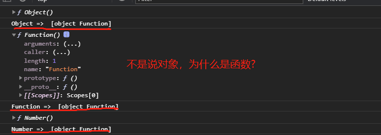
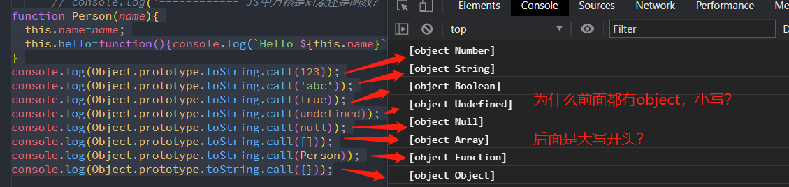
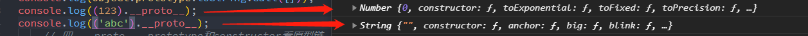
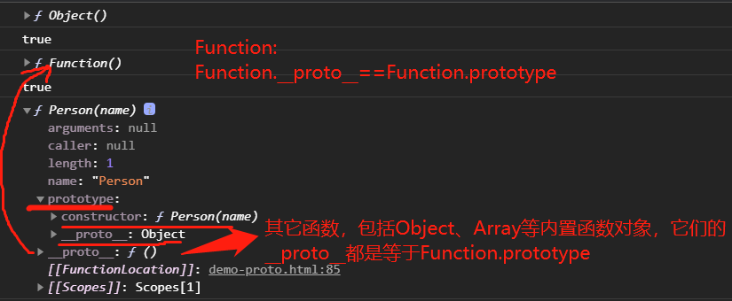
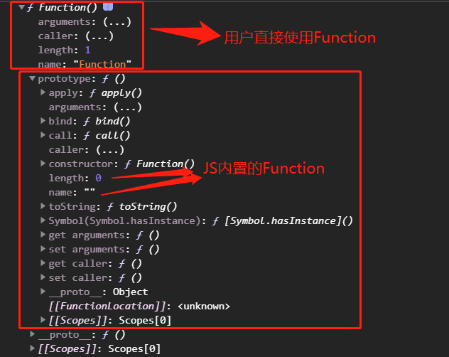
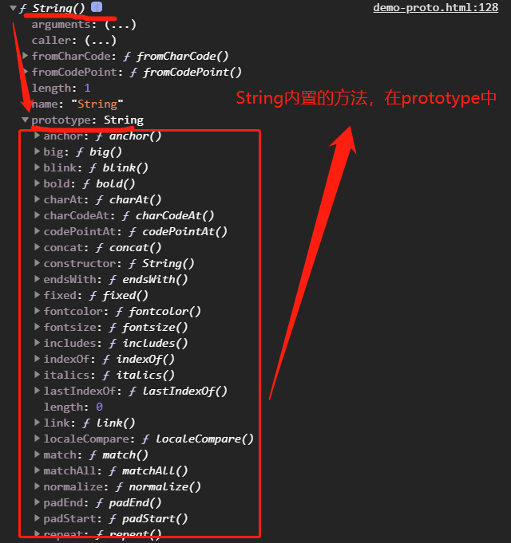
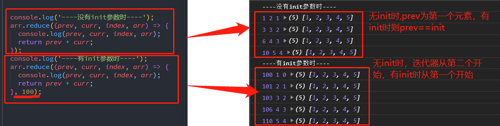

这个博文是我测试最痛苦的，它涉及太底层了，老师给我打开了prototype的大门，但如何深入理解则查阅了大量的网文，尤其是原型链和继承的探索，让我不断反复推翻自己的结论，现在博文也不算完美，不过是目前我最高的理解了，以后更深入再说吧。

## 一、JS的原型链

### 1、JS中万物皆是对象

JS中万物皆是对象，应该是JS中最经典的口头禅了，但是在我测试Object和Function等内置对象时，则出现深深的疑惑，先看测试结果

```javascript
console.dir(Object);
console.log('Object => ', Object.prototype.toString.call(Object));
console.dir(Function);
console.log('Function => ', Object.prototype.toString.call(Function));
console.dir(Number);
console.log('Number => ', Object.prototype.toString.call(Number));
```



> **网上普遍解释:** JS中对象概念应该分为两种:一是普通对象,另一个是函数对象。凡是通过new Function()创建的对象都是函数对象，其他的都是普通对象。function(){}实质也是调用new Function()来创建的。

至少是我理解JS的万物皆是对象是指数据类型的对象，其实不然，还是先看下面测试吧

```javascript
function Person(name){
  this.name=name;
  this.hello=function(){console.log(`Hello ${this.name}`);};
}
console.log(Object.prototype.toString.call(123));
console.log(Object.prototype.toString.call('abc'));
console.log(Object.prototype.toString.call(true));
console.log(Object.prototype.toString.call(undefined));
console.log(Object.prototype.toString.call(null));
console.log(Object.prototype.toString.call([]));
console.log(Object.prototype.toString.call(Person));
console.log(Object.prototype.toString.call({}));
```



相信从上图中应该能发现点什么，也是图中我以前没注意，而在测试时才注意到的细节，就是通过Object.prototype.toString.call显示数据类型时，总是由两部分组成：小写object和大写开头的数据类型。

> **所谓JS万物皆是对象，依据就是前面的object**，它指明数据特性，就是说数据都是对应的Number、String、Boolean...Function和Object等函数的实例。而数据类型中对象则是由Object()创建的实例。

> **普通对象和函数对象:** 函数对象就是指object Function，其它则是普通对象，前者拥有__proto__和prototype两个重要属性，后者只拥有__proto__属性，数值、字符串等都拥有__proto__属性喔，现在应该更理解JS万物皆是对象的说法了。



### 2、\_\_proto\_\_、prototype和constructor

上面已经说到普通对象有__proto__属性，而函数对象还具有prototype属性，constructor是构造函数，是二者属性下的重要属性，也是理解原型链的关键。

> **几点测试结果**
> 1. **对象的__proto__都是等于__proto__.constructor所指构造函数的prototype**。无论是普通对象还是函数对象经测试都是这样，若是Function则__proto__和prototype都是new Function的实例函数对象，其它函数或构造函数则是自身的实例对象，是普通对象。
> 2. **__proto__是对象的默认原型链**，由JS定义的，许多称之为[[prototype]]，后来chrome才引入__prototype这种书写方式，开始时候是不可更改的，后来有的网文说是从ES6以后可以更改了，我测试的结果，`无论是普通对象还是函数对象，是可以改变它的值，但原型链改变则限定当前对象，尤其是函数对象的实例则不受影响`。
> 3. **prototype是函数对象的原型链**， 它的改变是 **直接影响它的实例原型链**。
> 4. **__proto__和prototype对原型链影响区别** 也许上面2、3点让你迷糊了，说实在话，我在这个难题测试了好久，按说__proto__改变了函数对象的原型链，那么它的实例应该也随之改变原型链？其实不然，__proto__和prototype一般情况下可以看成两条平行的原型链，只有在Function时才合二为一，就是`Function.__proto__==Function.prototype`，而一般函数对象`Person.__proto__==Function.prototype，Person.prototype`则是比较特殊，它由两部分组成:constructor为Person，__proto__为标准对象。

```javascript
console.dir(Object);
console.dir(Object.__proto__==Function.prototype);
console.dir(Function);
console.dir(Function.__proto__==Function.prototype);
function Person(name){
  this.name=name;
  this.hello=function(){console.log(`Hello ${this.name}`);};
}
console.dir(Person);
```



> **__proto__和prototype的使用总结:**
>- **普通对象而言:** 无论是改变它的`__proto__或__proto__.constructor代表的构造函数的prototype`，都可以改变原型链。
>- **函数对象而言:** __proto__只改变当前函数对象的原型链，而prototype是改变它的实例对象的原型链。由于二者是不相等，所以是两条平行的原型链， **前者只影响自己，后者只影响实例对象** 。
>- **二者总结：** 无论是普通对象还是函数对象，`__proto__只影响自己原型链`。而`prototype`则是函数对象独有，它`影响以它为构造函数的实例对象原型链`。另外  **prototype可以扩展原函数对象的成员(属性或方法)为所有实例对象所共享** 。`一般不建议修改__proto__`。

### 3、Object和Function

这两个应该是JS的核心概念了，二者都是函数对象，不过都是特殊的函数对象。

> **Function无限循环吗？**
Function特殊在它的原型链指向自身，即`Function.__proto__等于Function.prototype`即它的构造函数为Function，按正常逻辑这岂不是无限循环了？，JS针对Function进行了特别处理，第一次Function其实仍然相当于用户定义的函数，而它的构造函数则是JS定义的Function了，它的`Function.__proto__或Function.prototype.__proto__等于Object.prototype`。
**就是说: 我们用户永远无法直接调用JS内置的Function函数对象，调用的Function只是它的new Function()出来的函数对象** 。



> **Object是所有对象之父?**
通过打印输出，无论是普通对象还是函数对象，最终都是Object.prototype，也是标准对象即new Object()/Object()/{}，所以可以说Object是所有对象之父。默认情况下，对象的原型链是:
1、obj.__proto__==obj.__proto__.constructor.prototype;
constructor是构造函数，若是函数对象，它的构造函数是Function
2、constructor.prototype.__proto__=Object.prototype
4、Object.prototype.__proto__==null。

### 4、构造函数的new

这里就直接引用老师的案例了。构造函数new后可分三部分：**创建空对象并将this指向它，为空对象添加成员，最后返回这个对象**。

```javascript
// 构造函数是用来创建对象/实例
function User(name, age) {
  // 1. 自动生成一个新对象,并用this指向它
  //   this = new User;
  // 2. 为这个新生成的对象,添加成员,例如属性或方法
  this.name = name;
  this.age = age;
  this.getInfo = function () {
    return `${this.name} : ${this.age}`;
  };

  // 3. 返回这个新对象
  // return this;
}
```

### 5、继承和原型链

主要有两种继承方式：类式继承或构造函数继承，另一种就原型链继承，相关介绍文章已经比较多了，这里重点介绍下原型链式继承

```javascript
function Base(){
  this.node='node';
  this.hello=function(){console.log('Hello World');};
}
Base.prototype.hello2=function(){console.log('Hello World Two');};
function Animal(type){
// 第三种：构造函数继承
  // Base.call(this);
  this.type=type;
  this.Say=function(){console.log('Animal Say');};
}
function Dog(name){
  // 第三种：构造函数继承
  // Animal.call(this,'crab');
  this.name=name;
}
// 第一种：原型继承
Animal.prototype=new Base();
Dog.prototype=new Animal('crab');  
// 第二种:原型链
// Dog.prototype=Animal.prototype;
// Animal.prototype=Base.prototype;    
const dog=new Dog('Bill');
console.dir(Dog);
console.dir(dog);
// console.dir(dog.Say());
console.dir(dog.hello());
```

> **三种方式比较:**
> 1. 原型链继承：将要继承的直接实例化，赋值给构造函数的prototype。它可以访问要继承的内部成员，也访问函数对象通过prototype定义的成员。是推荐的继承方式。
> 2. 原型继承：将要继承的prototype赋值给构造函数的prototype，直接改变实例对象的原型链 。它只可访问prototype扩展的成员，内部成员无法访问
> 3. 构造继承：通过在构造函数中调用要继承的函数对象call或apply方法，将this指向要继承的函数对象，只能访问内部成员，prototype扩展的成员无法访问。

## 二、prototype的应用

首先上面第一部分不要求全部理解，其实我上面也解释不是很清楚，只是将自己测试结果和主要的进行了说明，以后再慢慢探讨吧，下面还是实战应用，介绍下prototype两个方面的应用，至于在继承方面的应用可见第一部分介绍了。

### 1、为构造函数增加共享的的成员(属性和方法)

如第一部分介绍中所说，如想要给某构造函数添加新成员，则可以通过prototype，它添加的成员(属性或方法)将被它的所有实例对象共享。也许你会说直接在构造函数中定义不就可以了吗？经过测试 **它和构造函数定义的成员最大的区别就是可以在new之后** ，如

```javascript
// 构造函数,当成父类
// 构造函数,当成父类
function Parent() {
  this.name = 'admin';
}
// 我认为它是一个子类
function Child() {
  this.age = 99;
}
// 函数的原型属性可以被改写, 利用这个特征, 可以轻易实现继承
//   Child.prototype = null;
Child.prototype = new Parent();
console.dir(Child);
// 使用的时候,直接将子类当成工作类,
let instance = new Child();
// 原型上声明的成员,会被基于当前构造函数的所有实例所共享
Parent.prototype.getName = function () {
  return this.name;
};
// 现在还可以给这个子类继续添加成员
Child.prototype.getAge = function () {
  return this.age;
};
// 访问子类成员
console.log(instance.age);
console.log(instance.name);
console.log(instance.getName());
console.log(instance.getAge());
```

### 2、借用JS内置的函数对象的方法

在前面博文中已经演示了Array.prototype.join.call或String.prototype.substr.call等借用技巧，直到今天才来说明它的来源。在JS中内置的String、Array、Number等函数对象中已经定义许多方法，我们通过call或apply可以改变this，从而达到借用方法的效果。



### 3、call、apply和bind的应用

三个方法中的第一个参数都是用来改变this指向。call和apply区别是第二个参数，call是以列表形式传参，而apply是数组形式传参。**常用于函数借用或构造函数继承中** 。

```javascript
function f1(a, b, c) {
    return a + b + c;
}
obj = { a: 30 };
console.log(f2.call(obj, 10, 20));
console.log(f2.apply(obj, [10, 20]));
```

bind与它们还有一些不一样的地方，bind并不是立即调用该函数,而是返回了一个函数的声明，常用于回调函数中。**bind用在回调函数中改变this的值** ,因为回调是异步的,需要事件来触发。

```javascript
document.querySelector("button").addEventListener(
"click",
function () {
    console.log(this);
    document.body.appendChild(document.createElement("p")).innerHTML = "欢迎: " + this.name;
}.bind({ name: "朱老师" })
);
```

## 三、数组方法reduce再学习

一开始以为reduce应用就是求和，经过老师演示才知道它有那么多应用，主要是自己只满足老师上课所讲，没有深入了解它的语法。下面选看下它的语法

> **rudece的语法:** `arr.reduce(function (prev,curr,index,arr){}, init)`
>- prev: 存储每步处理的结果。第一次时若没有第二个参数init,则取数组第一个元素，curr从第二个开始；若有第二个元素则等于init，curr从数组第一个开始。
>- curr,index, arr,与其它的迭代方法参数功能相同。curr: 当前元素,index当前元素的索引,arr当前元素所在的数组本身。
>- init：归并的初始值，即是第一次时prev的值。

```javascript
let arr = [1, 2, 3, 4, 5];
console.log('----没有init参数时----');
arr.reduce((prev, curr, index, arr) => {
  console.log(prev, curr, index, arr);
  return prev + curr;
});
console.log('----有init参数时----');
arr.reduce((prev, curr, index, arr) => {
  console.log(prev, curr, index, arr);
  return prev + curr;
}, 100);
```

;

### 1、求和或最大值

```javascript
let arr = [1, 2, 3, 4, 5];
console.log('和=',arr.reduce((prev, curr) => {
  return prev + curr;
}));
console.log('最大值=',arr.reduce((prev, curr) => {
  return Math.max(prev, curr);
}));
```

### 2、统计某个元素的出现的频率/次数

```javascript
let arr = [2, 3, 3, 4, 5, 4, 5, 5, 6, 2, 3, 3, 5];
function arrayCount(arr, value) {
return arr.reduce((total, item) => (total += item == value ? 1 : 0), 0);
}
console.log('3 出现的次数: ', arrayCount(arr, 3));
console.log('5 出现的次数: ', arrayCount(arr, 5));
console.log('2 出现的次数: ', arrayCount(arr, 2));
```

### 3、数组去重

将去掉重复值的元素组成一个新数组返回,所以将返回的结果设置一个空数组

```javascript
let arr = [2, 3, 3, 4, 5, 4, 5, 5, 6, 2, 3, 3, 5];
let res = arr.reduce((prev, curr) => {
if (prev.includes(curr) === false) prev.push(curr);
return prev;
}, []);
console.log(res);
```

### 4、快速生成html代码并渲染到页面中

```javascript
const items = [
  { id: 1, name: '手机', price: 4500, num: 3 },
  { id: 2, name: '电脑', price: 6500, num: 5 },
  { id: 3, name: '汽车', price: 15500, num: 2 },
  { id: 4, name: '相机', price: 19500, num: 9 },
  { id: 4, name: '耳机', price: 26800, num: 9 },
];
// 商品数量之和, 注意一定要传第二个参数,给最终结果赋初会值: 0, 这很重要
let counts = items.reduce((total, item) => total + item.num, 0);
console.log(`总数量:`, counts);
// 商品总金额, 注意传第二个参数,否则会得到一个数字字符串
let amounts = items.reduce((total, item) => total + item.num * item.price, 0);
console.log(`总金额:`, amounts);
// 给每个商品套个html标签
res = items.map(
  item =>
    `<tr>
          <td>${item.id}</td>
          <td>${item.name}</td>
          <td>${item.price}</td>
          <td>${item.num}</td>
          <td>${item.price * item.num}</td>
        </tr>`
);
// 将每个商品归并到一个html字符串中
let content = res.reduce((prev, item) => prev.concat(item));
// 使用表格将代码渲染到页面上
const table = document.createElement('table');
// 标题
table.innerHTML += '<caption>商品信息表</caption>';
// 表头
table.innerHTML += `
    <thead>
      <tr>
        <th>编号</th>
        <th>商品</th>
        <th>单价</th>
        <th>数量</th>
        <th>金额/元</th>
      </tr>
    </thead>`;
// 将动态生成的内容添加到表格中
table.innerHTML += `<tbody>${content}</tbody>`;
table.innerHTML += `<tfoot><tr><td colspan="3">总计:</td><td>${counts}</td><td>${amounts}</td></tr>`;
// 做为body第一个子元素插入到页面中
document.body.insertBefore(table, document.body.firstElementChild);
```

## 最后

尽管本文未对JS的__proto__和prototype有较彻底的测试，便相比以前对JS的原型链有了更多认识，也基本了解的JS的万物皆是对象的本质，更加完善只能等以后有更多认识再补充了。另一个就是要注重语法，从中可以发现更多的应用，reduce如此，数组的map和filter也可要类似学习。