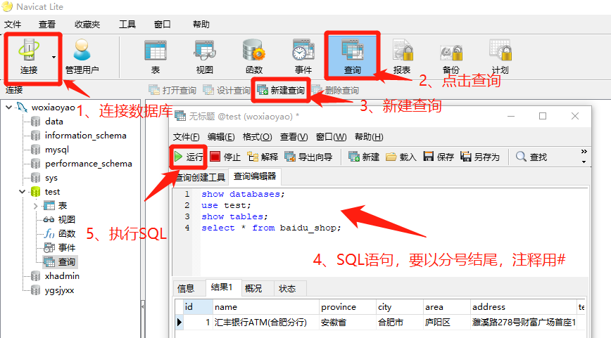

## 一、数据库

数据库在编程中占有极其重要的地方，它是存储数据的地方，无论是网络程序还是本地程序，一方面和用户交互，另一方面在后端和数据库交互。目前数据库主要分为两大阵营 **SQL和NoSQL** ，前者SQL (Structured Query Language)数据库，指关系型数据库。主要代表：SQL Server，Oracle，MySQL(开源)，PostgreSQL(开源)，SQLite(开源)。后者NoSQLNot Only SQL）泛指非关系型数据库。主要代表：键-值数据库Redis、Memcached,文档数据库MongoDB,宽列数据库HBase。

> **Oracle:** 非开源数据库，在高端市场和大型企业大都是采用该数据库。它的优点1、处理速度快，非常快。2、安全级别高。支持快闪以du及完美的恢复，即使硬件坏了 也可以恢复到故障发前的1s。3、几台数据库做负载数据库，可以做到30s以内故障转移。4、网格控制，以及数据仓库方面也非常强大。

> **MySQL/MariaDB:** 开源数据库，市场占有率仅次于Oracle，尤其是中小型数据库市场占据半壁江山，巅峰时世界上超过70%的网站后台都采用MySQL数据库。2008 年美国 Sun 公司花费 10 亿美元收购 MySQL，一年后 Oracle 公司又花费 60 亿美元收购了 Sun 公司，从此 Sun 公司的服务器、操作系统、MySQL 等产品线全部归属 Oracle 公司。MySQL 发展明显趋缓，是继续开源还是闭源，Oracle 公司一直没下定论。于是 MySQL 的原班人马陆续离开 Oracle 公司，另立炉灶，推出了 MariaDB 开源数据库。截至 2014 年年末的数据库综合排名，MySQL 继续位居第二名，但是其表现出来的颓势较明显，而 MariaDB 却具备强劲的生命力。
> **MariaDB继承了MySQL小巧精悍、简洁高效、稳定可靠的特征，并与MySQL保持兼容** 。时至今日，已有Google、Facebook等知名企业把应用从MySQL切换到了MariaDB上，各种Linux 发行版的操作系统默认数据库都开始采用MariaDB；而Apple公司反应更快，当Oracle公司收购 Sun公司时，就切换到了PostgreSQL数据库。
> **MariaDB是一个开源的免费的关系数据库** ，安装包可从官网下载。整个安装包大约 200MB，几乎能在所有的操作系统上安装和运行，与Oracle数据库、SQL Server、DB2等商业数据库动辄好几张光盘相比，算是短小精悍了。另外，也可以从这个网站下载数据库的源代码。对于非数据库型的 SaaS 云提供商来说，**云端采用MariaDB是最好的选择，而且可以轻松搭建数据库集群** 。

> **PostgreSQL:** PostgreSQL能被苹果公司大量使用并替换早期的MySQL数据库，说明其一定有不俗的表现。在2014年年末的数据库排行榜上，PostgreSQL位居第四位，号称世界上最先进的、最安全的开源数据库，也是面向对象的关系数据库。如今PostgreSQL数据库具备如下特点：
>- 面向对象，安全性极高，能运行在全部主流的操作系统上，完全 ACID 兼容。
>- 支持外键、连接、视图、触发器和存储过程（多语言）。
>- 支持最新的 SQL 2008 标准的数据类型，包括整型、数字型、字符型、布尔型、可变字符型、日期型、时间戳、自增长型以及各种二进制对象（如图片、声音和视频等）。
>- 提供了各种流行语言的编程接口，如 C/C++、Java、.NET、Perl、Python、Ruby、Tcl、ODBC 等。
>
> PostgreSQL 数据库同时具备很多众多令人振奋的优点，比如在线备份、数据域、表分区、表空间、嵌套事务、时刻点恢复、两段式提交、多版本并发控制、子查询等。在 PostgreSQL 中，数据库大小没有限制，表大小上限为 32TB，一条记录的大小上限为 1.6TB，字段大小上限是 1GB，一个表包含的记录数没有限制，一条记录的字段数上限为 1600 个，一个表上创建的索引数目没有限制。

> **Redis：** Redis 是遵循 BSD 开源协议的存储系统，数据存储在内存中，因此具备极高的性能，可用作数据库、缓存和消息中间件。Redis 支持多种类型的数据结构，如字符串、哈希、列表、集合、带范围查询的有序集合、位图、hyperloglogs 和带半径查询的地理空间索引。Redis 内置了复制、脚本语言编程、最近最少使用（LRU）淘汰、事务以及不同级别的磁盘持久化等功能，通过 Redis Sentinel 和集群自动分区机制实现高可用性。Redis 采用 C 语言编写，能运行在 Windows、MacOS X、Linux、Solaris 等操作系统上，不过 Linux 是其最佳的运行平台，无须第三方依赖，它提供了最广泛的编程语言接口。

> **MongoDB:** MongoDB 是排名第一的文档数据库，属于 NoSQL 大类，诞生于 2009 年，正好是云计算兴起的前夜。MongoDB 采用 C++ 语言开发，能运行在 Windows、MacOS X、Linux、Solaris 操作系统上，提供了绝大部分计算机语言的编程接口。保存在 MongoDB 中的一条记录称为一个文档，类似 JSON 语法。MongoDB 的主要优势包括：高性能、富查询语言（支持 CRUD、数据聚合、文本搜索和地理空间查询）、高可靠性、自动伸缩架构、支持多存储引擎。MongoDB 适合文档存储、检索和加工的应用场合，如大数据分析。

> **SQLite:** SQLite是一个进程内的库，实现了自给自足的、无服务器的、零配置的、事务性的 SQL 数据库引擎。它是一个零配置的数据库，这意味着与其他数据库一样，您不需要在系统中配置。就像其他数据库，SQLite 引擎不是一个独立的进程，可以按应用程序需求进行静态或动态连接。SQLite 直接访问其存储文件。它的优点:
> 1. 不需要一个单独的服务器进程或操作的系统（无服务器的）。
> 2. SQLite 不需要配置，这意味着不需要安装或管理。
> 3. 一个完整的 SQLite 数据库是存储在一个单一的跨平台的磁盘文件。
> 4. SQLite 是非常小的，是轻量级的，完全配置时小于 400KiB，省略可选功能配置时小于250KiB。
> 5. SQLite 是自给自足的，这意味着不需要任何外部的依赖。
> 6. SQLite 事务是完全兼容 ACID 的，允许从多个进程或线程安全访问。
> 7. SQLite 支持 SQL92（SQL2）标准的大多数查询语言的功能。
> 8. SQLite 使用 ANSI-C 编写的，并提供了简单和易于使用的 API。
> 9. SQLite 可在 UNIX（Linux, Mac OS-X, Android, iOS）和 Windows（Win32, WinCE, WinRT）中运行。


> **题外话:** 上面数据库我目前接触过Oracle、SQL Server、MySQL和SQLite。感觉Oracle大型企业或安全性比较高的应用比较多，SQL Server配合微软产品比较多，MySQL常见于网站程序中，而SQLite是本地程序作为数据库比较多，access以前还可以，但现在感觉它太low了。

## 二、SQL操作数据库

为什么在学习PDO之前一定要学习SQL，因为我发现在项目开发中最难的就是构造SQL语句，SQL就是结构化查询语言。下面演示的数据库是MySQL，演示软件是Navicat。

### 1、如何进入软件的SQL查询界面或MySQL的SQL控制台界面

**navicat软件进行SQL查询:**

- 连接数据库,连接成功后，要选择左侧连接名称，如下图中woxiaoyao。
- 选择具体数据库，如下图中test，点击查询按。若不选择具体数据库，新建查询为不可用的灰色状态， 无法进行下一步。
- 点击新建查询，会弹出查询界面窗口。
- 在查询编辑器中输入SQL语句，**切记要分号结尾，注释用#**。
- 点击运行(快捷键是Ctrl+R)。



**MySQL的SQL控制台界面：**

- 进入到MySQL安装目录下bin文件夹，在此进入windows控制台(可按住Shift+鼠标右键，选择"在此处打开Powershell窗口"，然后要记得输入cmd切换到命令提示符窗口)
- 输入mysql.exe -h localhost -u root -p回车，-h表示连接地址，-u表示用户，-p表示密码
- 输入密码，若正确就会进行MySQL控制台界面，以mysql>为标识


### 2、常用数据库操作命令

- 数据库相关
  - `show databases;` 显示所有数据库
  - `create database da_test_1 character set utf-8;` 新增数据库并设置编码
  - `drop database da_test_1;` 删除数据库
  - `alter database db_test character set 'gbk';` 修改数据仓库的字符编码集
  - `use db_test;` 选择数据库
- 数据表相关
  - `show tables;` 显示数据库下所有表
  - `desc emp;` 显示数据库结构
  - `create table emp( id int primary key auto_increment, name varchar(50) not null, );` 创建数据表
  - `alter table emp add telephone varchar(20);`  增加一列字段
  - `alter table emp drop phone;` 删除某一列
  - `drop table person;` 删除表

### 3、表中记录的CURD操作

> **新增：** `insert into table_name (id,name,workid) values (null,'xiaoshitou','P001');`
>- 值与列一一对应。并且有多少个列，需要写多个值。如果某一个列没有值。可以使用null。表示插入空。
>- 值的数据类型，与列被定义的数据类型要相匹配。并且值得长度。不能够超多定义的列的长度。
>- 字符串类型：插入字符类型的数据，必须英文的单引号括起来。在mysql中。
>- date 时间类型：也必须用英文的单引号括起来，如 ‘yyyyMMdd’ ,’yyyy-MM-dd’,’yyyy/MM/dd’ 。
>- 在插入数据的时候，如果某些列可以为null，或者是自动增长的列，或者有默认值的，在插入的时候可以省略。
>- 如果给表中的所有列插入数据，这时可以省略表名后面的列名，直接写values(**网文中所说观点，经测试是错误的，一定要注意**)

> **修改和删除:**
> `update emp set salary = 15000 where id = 1;` 修改指定条件的salary字段
> `delete from emp where id=1;` 删除满足条件的记录
> `truncate table emp;`和`delete from emp;` 都是删除表所有记录，前者是删除表，再重新新建表，后者是一条一条记录删除。如果记录上百万或千万级别时，明显前者更快。

> **查询:** 数据库中绝大部分时间都是在执行查询操作。它的基本语法是`select *|column1,column2...from table_name where condition;`，下面是对查询顺序总结：
> 1. from ：确定数据源
> 2. Where ： 指定条件对记录进行筛选
> 3. Group by : 对记录进行分组
> 4. 聚合函数：如sum，count，avg等...
> 5. Having ：对分组的数据，进行筛选
> 6. 计算所有的表达式
> 7. 使用order by对结果进行排序
> 8. Select对数据的显示,*表示所有列，也可指定列

`select * from student;` 查询表中所有的记录
`select name,age,score from student;` 查询表中指定列的数据:
`select * from student where score >80;` 查询分数大于80的所有学生信息
`select distinct age from student;` 获取学生表中所有的年龄，不能重复
`select * from student order by age desc;` 用学生的age进行降序排序
`select id as 'GongHao',name 'XingMing' from student;` 用as给列取别名
`select count(*) from student` 统计一共有多少学生
`select sum(score) from student;` 统计该班级所有学生的分数
`select avg(age) from student;` 求班级的平均年龄
`select max(score) as '最高分',min(score) '最低分' from student;` 求最大、最小值
`select name,sum(score) from student group by name;` 每个学生的总成绩


`select name from student group by name having avg(score) > 80;` 求平均分大于80的学生？

### 4、进阶的条件语句

> **分页中常用中limit语法:** `select * from tableName limit i,n`。
>- i : 为查询结果的索引值（默认从0开始）；
>- n : 为查询结果返回的数量（分页处理时，这个一般是固定值，如20，50或100等）

`select * from student limit 0,10;` 查询第-条到第十条的数据

> **模糊匹配like语法:** `SELECT * FROM Persons WHERE City LIKE 'Ne%';`
> %就是通配符，目前有以下通配符
>- % 替代一个或多个字符。如`LIKE 'Ne%'`,可匹配以"Ne",如New York
>- _ 仅替代一个字符。如`LIKE '_eorge'`，仅可匹配从首字符任意，其它必须是eorage的字符。
>- `[charlist]` 字符列中的任何单一字符。如`LIKE '[ALN]%'`，可匹配以 "A" 或 "L" 或 "N"的字符串
>- `[^charlist]或[!charlist]` 不在字符列中的任何单一字符。
>- 不想匹配可使用NOT LIKE,再加通配符。


> **find_in_set多值查询: 多项选择的数据在数据库中一般是以多值存储，并以英文逗号隔开** ，形式如`2,3,4,5,6`，这个在网站程序是经常遇到的，此时条件就要是find_in_set了，这种情况用like模糊匹配是不正确的。**还有一点就是它的存储类型是字符串，即使是数字是数字字符串，在条件语句中变量要加双引号** 。


此时查询语句是:`"select version_id,version_name form cd_version where find_in_set('{$grade_id}',grade_ids)"`。一定要记得变量要加引号，否则类型不对，查询将没有数据。

> **in多条件查询:** 相当于多个or条件的叠加。
> `select * from user where user_id in (1,2,3);`相当于`select * from user where user_id = 1 or user_id = 2 or user_id = 3;`
> not in与in相反，如下:
> `select * from user where user_id not in (1,2,3);`相当于`select * from user where user_id != 1 and user_id != 2 and user_id != 3;`

> **多表查询join:** 在程序中多表查询是经常有的事，使用关键字是join，分为内连inner join、左连left join、右连right join、外连outer join和交叉连cross join


最常见和用的最多就是内连了,下面就是我项目中用的一条：
`select a.*,b.grade_name,c.subject_name,d.version_name,e.name as username from cd_course_module as a inner join cd_course_grade as b inner join cd_course_subject as c inner join cd_course_version as d inner join cd_user as e on a.grade_id=b.grade_id and a.subject_id=c.subject_id and a.version_id=d.version_id and a.user_id=e.user_id';`

### 5、学习SQL的作用

- **可以加深理解数据库和手动操作数据库** ，SQL是所有数据库都支持的结构化查询语法，就相当于下面的PDO一样，它是操作数据库的根本，PDO也是基于SQL的操作数据库。
- **检查PDO等操作中SQL是否正确** ，这点在我做项目中深有体会，数据库访问错误要区分是数据库操作代码错误还是SQL错误，通过复制生成的sql语句在上面navicat的查询界面或mysql的命令控制台界面都可以检查sql语句是否错误，若没错误再检查PDO代码错误。

> **关于sql语句的分号强调**：为了保持和SQL语句一致性，无论是sql语句或PDO中sql语句都建议使用分号结尾，因为在SQL中分号代表一行的结束。、
> **关于sql语句的#号:** 老师在演示sql注入时使用`' or 1=1 #`，说#以后不会被执行，当时没想明白过来，后来在写文章时才明白，#是SQL中注释符号，SQL中遇到#就会以注释处理。

## 三、PDO操作数据库

PHP 数据对象 （PDO） 扩展为PHP访问数据库定义了一个轻量级的一致接口。实现 PDO 接口的每个数据库驱动可以公开具体数据库的特性作为标准扩展功能。 注意利用 PDO 扩展自身并不能实现任何数据库功能；必须使用一个 具体数据库的 PDO 驱动 来访问数据库服务。PDO 提供了一个 数据访问 抽象层，这意味着，不管使用哪种数据库，都可以用相同的函数（方法）来查询和获取数据。 PDO 不提供 数据库 抽象层；它不会重写 SQL，也不会模拟缺失的特性。如果需要的话，应该使用一个成熟的抽象层。

### 1、基本PDO访问数据库

> **第一步:数据库配置** 准备数据库配置信息，一般是以数组形式返回，如database.php的

```php
namespace JSPDO;

return [
    'type' => $type ?? 'mysql',
    'host' => $host ?? 'localhost',
    'dbname' => $dbname ?? 'test',
    'name' => $name ?? 'root',
    'pwd' => $pwd ?? 'root',
    'charset' => $charset ?? 'utf-8'
];
```

> **第二步:连接数据库** 通过PDO的构造函数，传递数据源dsn、用户名和密码完成数据库的连接，如connect.php
>- 要使用use引入类PDO，并且检查是否启用
>- 数据源dsn形式是:`mysql:host=localhost;dbname=test`
>- 此处的用户名和密码是数据库服务器的用户名和密码，如MySQL默认是root/root。
>- 此处建议使用`try...catch`捕获异常，异常类型为PDOException
>- 调整警告级别为`PDO::ERRMODE_WARNING`，可看到更多消息
>- 调整输出结果为关联数组`PDO::FETCH_ASSOC`，默认是索引数组和关联数组同时输出,也可单独设置属性setAttribute，而getAttribute是获取属性。

```php
namespace JSPDO;

use PDO;

$config=require 'database.php';
extract($config);

$dsn=sprintf("{$type}:host={$host};dbname={$dbname}");

// 调整警告级别为ERRMODE_WARNING，可看到更多消息
// 调整输出结果为关联数组，默认是索引数组和关联数组同时输出
// 也可单独设置属性setAttribute，而getAttribute是获取属性。
try{
    $pdo=new PDO($dsn,$name,$pwd,[PDO::ATTR_ERRMODE=> PDO::ERRMODE_WARNING,PDO::ATTR_DEFAULT_FETCH_MODE=>PDO::FETCH_ASSOC]);
    // $pdo->setAttribute(PDO::ATTR_DEFAULT_FETCH_MODE,PDO::FETCH_ASSOC);单独设置属性
} catch (\PDOException $e){
 die('Connection Error:'.$e->getMessage());
}
```

> **第三步:执行数据库CURD** ,引入connect.php，通过pdo对象来操作数据库，query是用于查询select，以PDOStatement对象形式返回结果集；而exec是执行update、insert和delete操作。如下面是sql.php，这里要提醒就是获取到PDOStatement资源对象后要进行检查,资源对象不成功是会返回false，返回信息通过errorInfo()获取,由于它是数组，而在使用die或exit时要传参是字符串或整数，所以要转为字符串，本例中使用`print_r($arr,true)`;

```php
namespace JSPDO;
// 引入pdo对象
require_once 'connect.php';
// 构造SQL语句
$sql='select * from baidu_cat where true limit 0,10;';
// 执行select操作，返回是PDOStatement对象，它保存结果集
$res=$pdo->query($sql);
// PDOStatement是资源对象，若不成功则为false
if(!$res){
   die('数据表打开不成功，原因:'.print_r($pdo->errorInfo(),true)); 
}
var_dump($res->fetch(),);
var_dump($res->fetchAll());

// 构造增、改、删除SQL
// 全部增加时，也不能省略列名
$sql="insert into baidu_cat (name) values('woxiaoyao');";
$row=$pdo->exec($sql);
echo "已经成功增加{$row}行",'<br>';
// 修改
$sql="update baidu_cat set name='xiaoyao' where id=2;";
$row=$pdo->exec($sql);
echo "已经成功修改{$row}行",'<br>';
// 删除
$sql="delete from baidu_cat where id=3;";
$row=$pdo->exec($sql);
echo "已经成功删除{$row}行",'<br>';
```

> **数组转字符串:** 一是通过print_r()或var_export()传递第二个参数true；二是数组转字符串函数implode或join；三是转json字符串json_encode；最后一种是序列化:serialize()。不过这里是显示错误信息，建议是第一种。

> **防止sql注入处理:** 上面若引入变量，如`"select * from baidu_cat where name='{$name}';"`,此时若name变量为`' or 1=1 #`时，条件将变成`where name='' or 1=1 #`。在SQL中#是注释，它后面条件都无效了，真正有效就是`name='' or 1=1`，这种或逻辑运算值永远都是true，将返回所有数据。这就需要我们对前端的数据要过滤，可以使用filter_input_array检查是否符合规则，这时是 **采用PDO提供的quote方法，为SQL查询里的字符串添加单引号并对特殊符号进行转义** ，如上面过滤将转换为`'\' or 1=1 #'`,在PHP中单引号是普通字符串，不支持转义字符，就不会和SQL中单引号匹配了。另外一个就是 **此时SQL语句中字符串变量一定不要再加单引号了** ，因为quote已经帮我们加上了，再加单引号反而没有破坏了防注入。

```php
// quote防注入：符串添加单引号并对特殊符号进行转义
$name="' or 1=1 #";
// $sql="select * from baidu_cat where name='{$name}';";
// quote防注入
$name=$pdo->quote($name);
// 此时SQL中字符串变量一定不要再加单引号，quote已经帮我们加上了，并转义特殊字符
$sql="select * from baidu_cat where name={$name};";
$res=$pdo->query($sql);
if(!$res){
   die('数据表打开不成功，原因:'.print_r($pdo->errorInfo(),true)); 
}
var_dump($res->fetchAll());
```

> **补充:** 其实PDO已经有了更好解决方案就是预处理语句，后面有介绍。

> **关于SQL语句中表名或字段是否应该加反单引号？** 老师是建议加的，理由是防止表名和字段名相同导致解析混乱。经过我测试和观看大部分框架的代码，发现绝对大部分都不加，因为 **合法的SQL语句中表名和字段名处于不同位置，不可能出现解析混乱** 。如`"select id,name from name where name='xiaoyao'"`,在解析时，from后面就是表名，select和where后面是字段名等，除非字段名是使用SQL关键字，估计会报错。**另外一个理由是反单引号在PHP中是有特殊用途的** ，可以看我的<https://www.php.cn/blog/detail/24907.html>。**最后一个理由是语句中出现大量的单引号、反单引号，闭合是个问题，更增加了注入的危险,因为注入就是利用引号闭合特性**。

### 2、PDO的预处理语句

PDO的预处理语句也是PHP官方极其推荐的数据库操作方式，官方对其优点归纳为两点：

- **占用资源更少，处理更快** 查询仅需解析（或预处理）一次，但可以用相同或不同的参数执行多次。通过使用预处理语句，可以避免重复分析/编译/优化周期。简言之，预处理语句占用更少的资源，因而运行得更快。
- **防止SQL注入** 其实就是调用PDO的quote的方法，对给预处理语句的参数自动加单引号，并对特殊字符进行转义。

#### (1) 预处理语句实现步骤

1. 将SQL语句中的 **变量用?或:变量名等点位符替换** ，并 **移除引号** ,注意是模糊匹配时是整体用`?`替代不是局部，如`％?％`是错误的，因为预处理语句不需要引号，所以应该是直接`?`即可。
2. 调用PDO的prepare预处理语句,准备要执行的语句，并返回语句对象PDOStatement。
3. 执行SQL语句,有两种方式:一是使用PDOStatement的bindParam,为?绑定变量,给变量赋值再执行execute;另一种是直接在execute中给?赋值执行,不过注意它的数组,即使一个?也是数组形式。下面代码中已经详细演示这二种方式,并对第二种归纳两种形式。

```php
// PDO预处理语句防注入
$sql="select * from baidu_cat where name=?;";
$res=$pdo->prepare($sql);
// 第一种方式:bindParam,第一个参数表示第几个?,从1开始,后面就是绑定变量
// $res->bindParam(1,$name);
// $name="' or 1=1 #";
// $res->execute();
// 第二种方式1:将要传的值先组成数组,一次性传给execute
// $name="' or 1=1 #";
// $arr=array($name);
// $res->execute($arr);
// 第二种方式2:直接在execute中用数组接受每个值
$res->execute(array("' or 1=1 #"));
if(!$res){
   die('数据表打开不成功，原因:'.print_r($res->errorInfo(),true)); 
}
var_dump($res->fetchAll());
```

#### (2) 多次执行只解析一次

其实很简单,多次执行,只要改变变量值就可以,不用再解析预处理语句了.官方案例就很明显说明了这点

```php
$stmt = $dbh->prepare("INSERT INTO REGISTRY (name, value) VALUES (?, ?)");
$stmt->bindParam(1, $name);
$stmt->bindParam(2, $value);

// 插入一行
$name = 'one';
$value = 1;
$stmt->execute();

// 用不同的值插入另一行
$name = 'two';
$value = 2;
$stmt->execute();
```

#### (3)bindParam和bindValue

二者最大区别是bindParam绑定的变量在execute赋值即可,而bindValue在绑定变量必须在它之前就已经赋值,感觉它很鸡肋,平常也很少应用,至于为什么会有这个方法,也许是我没理解到.顺序给出老师对二者的区别描述:

- bindPARAM()第二个参数是按引用传递,所以只能提供变量作为参数,只有在PDO::execute()被执行的时候才取其值
- bindvalue()为占位符参数绑定值,只要绑定成功,就不会再变化~实时映射

#### (4)fetchAll可以优化高并发时读取速度吗?

我在视频中没听到老师这样说,也许是个别同学听到了,我这里谈下自己的看法,fetchAll提前读取所有数据并不能优化高并发的读取速度,原因有两个:

- 数据库内容是动态变化的,提前读取可能会漏掉内容
- 数据库内容是大量的,可能是百万或千万,一次性读取会浪费时间和空间,也许我只用10条数据,你读取了一百万数据,这能叫优化吗?

目前我接触的高并发时读取速度优化方案是利用缓存,无论是缓存数据库redis还是框架的缓存Cache,将相同读取保存到缓存中,并设置时限,就是一定时间内重复的读取直接从缓存中就可以了,不仅存储数据量少,而且也符合大数据特殊,将某些读取频率比较高的请求可以提取给你准备好,这样可以极大提高读取速度.下面我演示下我的TP6框架中缓存提高读取的代码,仅供参考

```php
function getAllGrade()
{
	$field = 'grade_id,grade_name';
	$key = md5($field . 'Course' . 'Grade' . 'getAllGrade');
	if (cache($key)) {
		$res = cache($key);
	} else {
		$res['grade'] = GradeModel::where('status', 1)->field($field)->order('sortid', 'asc')->select()->toArray();
		cache($key, $res, 60);
	}
	return $this->ajaxReturn($this->successCode, '返回成功', htmlOutList($res));
}
```

### 3、事务处理

事务处理在正规程序中是必须应用的, **如你在储存用户数据时,可能要边存储边处理一些工作,这个过程可能需要时间,如果在处理过程中有意外发生,则会导致意外之前已经写入数据库,而后面结果没存储到数据库,这样就会导致数据库不可预测性**,程序运行最怕的就是不可预测性.事务处理就可以解决问题。

- beginTransaction()开启事务
- commit()提交事务。和上面构造一个整体,它们之间所有SQL语句要么都执行,要么都不执行
- 在异常中调用rollBack()。对事务之间的SQL语句,异常之前会恢复到最初状态,从而保证了数据可预测性。

```php
try { 
  $pdo->beginTransaction();
  $pdo->exec("insert into staff (id, first, last) values (23, 'Joe', 'Bloggs')");
  $pdo->exec("insert into salarychange (id, amount, changedate) 
      values (23, 50000, NOW())");
  $pdo->commit();
  
} catch (Exception $e) {
  $pdo->rollBack();
  echo "Failed: " . $e->getMessage();
}
```

## 四、其它知识

### 1、三元运算符和??与?:

在老师演示配置数据库参数时，大量使用 **??** 来判断用户是否自定义参数，否则使用默认值，这个功能其实使用三元运算符可以实现，那老师为什么使用这种，当然这种更简洁。在百度时发现还有一种 **？：**，它们和三元运算符有什么关联呢？

- `$a ?? 0` 等同于 `isset($a) ? $a : 0`。
- `$a ?: 0` 等同于 `$a ? $a : 0`。
- empty: 判断一个变量是否为空。值为null、false、00、0、0.0、'0′、""等，都会返回true
- isset: 判断一个变量是否设置。值为false、00、0、0.0、'0′、""等，返回true,变量为未定义或为null时，返回false。

### 2、include、require和use

include和require二者用途是一样的，都是将文件读入到当前PHP文件中，使它变成 PHP 程序网页的一部份。常用的函数，亦可以这个方法将它引入网页中。要说不同有两个:

- 引入位置不同：require一般是放在PHP程序的最前面，而include则可以在中间，需要它时才引入，感觉比require更灵活。
- 最根本区别是错误处理方式不同：require一个文件存在错误的话，那么程序就会中断执行了，并显示致命错误。而include一个文件存在错误的话，那么程序不会中端，而是继续执行，并显示一个警告错误。

与include和require相近的是include_once和require_once，是解决重复读入的问题。它们会先检查目标文件的内容是不是在之前就已经导入过了，如果是的话，便不会再次重复导入同样的内容。一般建议使用这种方式，防止重复读入导入冲突。

use是使用命名空间，如本文中use PDO就是导入PDO的命名空间，使用它内部定义的PDO类。

## 五、学习后的感受

- SQL语句建议加分号,是SQL规范中区别不同语句的要求,在编程中加分号是为了统一
- PHP中SQL语句不建议加反单引号,一方面是它有特殊的意义,另一方面增加了程序的复杂性和难度,也增加了注入的危险
- 数据库操作根本是SQL,以后使用Python、C++、C#还是Java,它都是通用统一的,区别就接口不同而已。
- PDO是PHP提供数据访问抽象层,也就是统一访问接口,结合数据库抽象层就可以访问各种数据库,而且语法统一。访问不同类型数据库可看官方教程,和访问MySQL没多大区别，这也是统一接口的好处。
- PDO的预处理语句不仅占用资源更少,速度更快,而且防止SQL注入,是推荐的方式
- PDO的事件是保存数据库一致性的重要手段,也是提高程序可预测性的一种手段。
