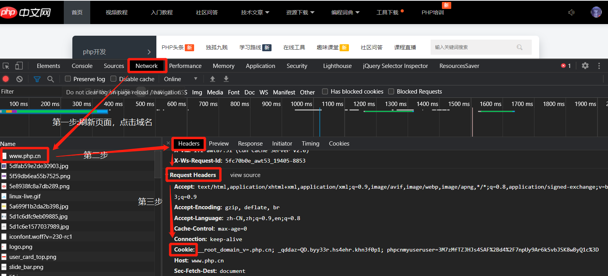
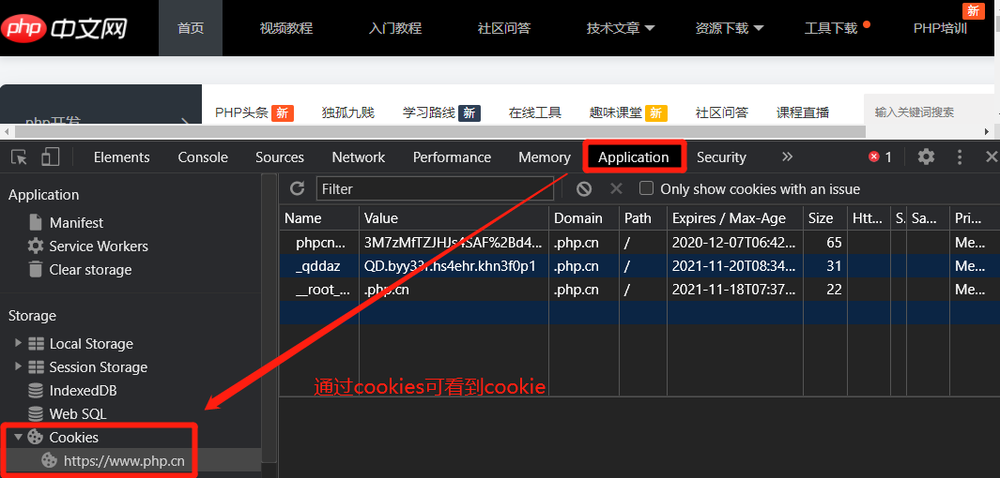
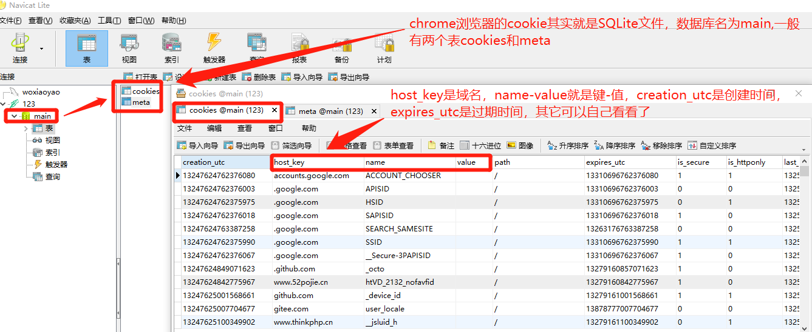
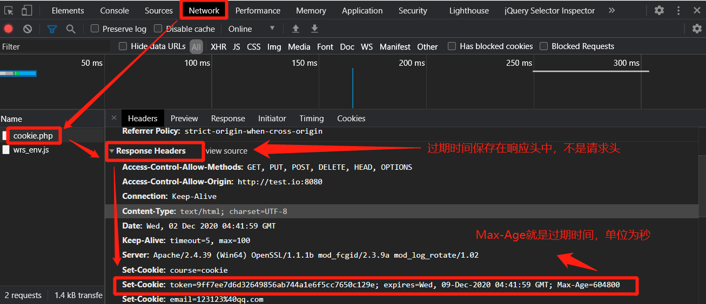
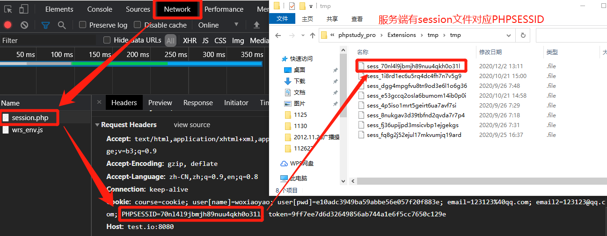
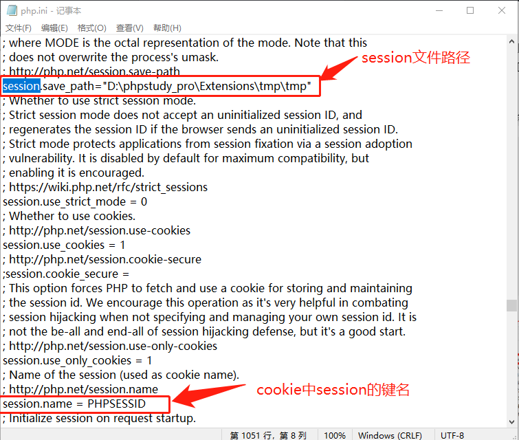

## 一、会话跟踪

会话（Session）跟踪是 Web 程序中常用的技术，用来跟踪用户的整个会话。常用的会话跟踪技术 Cookie 与 Session。Cookie 通过在客户端记录信息确定用户身份，Session 通过在服务器端记录信息确定用户身份。

理论是，一个用户的所有请求操作都应该属于同一个会话，而另一个用户的所有请求操作则应该属于另一个会话，二者不能混淆。而 Web 应用程序是使用 HTTP 协议传输数据的。HTTP 协议是无状态的协议。一旦数据交换完毕，客户端与服务器端的连接就会关闭，再次交换数据需要建立新的连接。这就意味着服务器无法从连接上跟踪会话。要跟踪该会话，必须引入一种机制。Cookie 和 Session 就是这样的一种机制。

## 二、Cookie 入门

Cookie 实际上是一小段的文本信息。客户端请求服务器，如果服务器需要记录该用户状态，就使用 response 向客户端浏览器颁发一个 Cookie。客户端浏览器会把 Cookie 保存起来。当浏览器再次请求该网站时，浏览器会把请求的网址连同该 Cookie 一同提交给服务器，服务器检查该 Cookie，以此来辨认用户状态。服务器还可以根据需要修改 Cookie 的内容。

```php
// 存储字符串数据
setcookie('course','cookie');
var_dump($_COOKIE['course']);
```

> **为什么刷新浏览器才能获取 cookie 值?**
>
> - 第一步：服务端解析`setcookie('course','cookie');`通过请求头告诉浏览器,我要设置一个 cookie 值 cookie。
> - 第二步: 服务端返回信息,返回的信息头中带有`set-cookie = cookie`,浏览器接受到这个信息头,把 cookie 储存在客户端计算机的某个文件中~ \*
> - 第三:刷新浏览器 cookie 中的信息会被带到请求头中发送,`var_dump($_COOKIE['course']);`就能显示 cookie 了。

前端查看某个网站的 Cookie 也很简单。在 chrome 浏览器中访问该网站相应的页面后，在开发者工具下输入 alert(document.cookie)，JavaScript 脚本会弹出一个对话框显示本网站的所有 Cookie 的内容。当然也可以通过开发者工具的 Network 面板或 Application 面板中都可以看到。




注意：Cookie 功能需要浏览器的支持。如果浏览器不支持 Cookie 或者把 Cookie 禁用了，Cookie 功能就会失效。不同的浏览器采用不同的方式保存 Cookie。

> **chrome 浏览器的 cookie 实质就是 SQLite 文件** 如果是安装版，它的位置在`C:\Users\xxx\AppData\Local\Google\Chrome\User Data\Default`下，我用的绿色便携版，它的位置在`\Data\Default`，自己可以试着找下。可以使用老师给我们的 navicat 软件打开。



|Cookie属性名|Cookie发展值|
|:---------:|-----------|
|String name|该Cookie的名称。Cookie一旦创建，名称便不可更改。|
|Object value|该Cookie的值。如果值为Unicode字符，需要为字符编码。如果值为二进制数据，则需要使用BASE64编码。|
|int maxAge|该Cookie失效的时间，单位为秒。如果为正数，则该Cookie在maxAge秒之后失效。如果为负数，该Cookie为临时Cookie，关闭浏览器即失效，浏览器也不会以任何形式保存该Cookie。如果为0，表示删除该Cookie。默认为-1。|
|boolean secure|该Cookie是否仅被使用安全协议传输。安全协议有HTTPS、SSL等，在网络上传输数据之前先将数据加密，默认为false。该属性并不能对Cookie内容加密，因而不能保证绝对的安全性。如果需要高安全性，需要在程序中对Cookie内容加密、解密。|
|String path|该Cookie的使用路径。如果设置为“/sessionWeb/”，则只有contextPath为”/sessionWeb”的程序可以访问该Cookie。如果设置为“/”则本域名下contextPath都可以访问该Cookie。注意第一个字符必须为“/”。|
|String domain|可以访问该Cookie的域名。如果设置为“.google.com”，则所有以“google.com”结尾的域名都可以访问该Cookie。注意第一个字符必须为“.”。|
|String comment|该Cookie的说明。浏览器显示Cookie信息的时候显示该说明。|
|int version|该Cookie使用的版本号。0表示遵循Netscape的Cookie规范，1表示遵循W3C的RFC 2019规范。|

## 三、PHP 的 cookie 相关操作

### 1、 创建 cookie

**语法:`setcookie($name,$value,$expire)` name 和 value 是键值对，expire 是过期时间**。

- 一般 cookie 都是存储 **字符串型数据** ，若是数值也建议存储为字符串形式。
- 若是 **数组数据** 则可转换为字符串、JSON 字符串或序列成字符中，当然也可以直接保存为数组形式的 cookie。如`setcookie('user[name]','woxiaoyao');setcookie('user[pwd]',md5('123456'));`。
- 如果是 **存储特殊的符号** ，如邮箱@符号，直接使用`setcookie`将进行转义，如果想保持原来形式，使用`setrawcookie()`即可，它的使用和`setcookie`一样，唯一区别就是不转义特殊符号。
- expire 是过期时间，一般形式是`time()+60*60*24*7`，`time()`是当前时间戳，是 11 位整数，后面`60*60*24*7`意思就是 60 秒为 1 分钟，60 分钟为 1 小时，24 小时为 1 天，7 天为一周，就是过期时限为一周。不建议使用 strtotime 方法设置时限。一旦设置了过期时间，cookie 保存在本地文件中，浏览器重新打开仍然存在。

### 2、 读取 cookie

读取就比较简单了，PHP 中是通过超全局变量`$_COOKIE`来访问，如上面的读取 cookie 中 course 键名的存储值就是`$_COOKIE['user']`

### 3、修改 cookie

其实就是对同一个变量重新赋值，它就会覆盖以前的，如`setcookie('course','php');`。

### 4、 清除或释放某一个 cookie 的键值

再次调用`setcookie('键名')`，只要传第一个参数键名，就可以清除或释放该键名-键值，如`setcookie('token');`。无论是临时的 cookie 还是设置过期时间的 cookie，这种方法都可以清除。目前没有什么函数直接删除所有，可间接实现

### 5、expire 过期时间

老师在授课时，设置了过期时间，但在开发者工具 Application 的 Cookies 中未发现过期时间指示，我又切换到 Network，在响应头中看到 Max-Age，它就是过期时间，单位为秒



## 四、PHP 的 Session 相关操作(基于 Cookie)

Session 是另一种记录客户端状态的机制，不同的是 Cookie 保存在客户端浏览器中，而 Session 保存在服务器上。客户端浏览器访问服务器的时候，服务器把客户端信息以某种形式记录在服务器上。这就是 Session。客户端浏览器再次访问时只需要从该 Session 中查询该客户的状态就可以了。如果说 Cookie 机制是通过检查客户身上的“通行证”来确定客户身份的话，那么 Session 机制就是通过检查服务器上的“客户明细表”来确认客户身份。Session 相当于程序在服务器上建立的一份客户档案，客户来访的时候只需要查询客户档案表就可以了。相比 Cookie 简单一些，相应的也增加了服务器的存储压力。

正常情况下，Session 都会在 cookie 中保存"通行证"，在请求服务器时会通过它在服务端的 sessioni 缓存文件中查找客户信息，从而实现用户自动登录或认证。通过`session_start()`开启

> **`session_start ([ array $options = array() ] ) : bool`**,options 是 PHP7 新增的参数，当`session_start()`执行失败， 无法开始一个会话的时候，会返回 FALSE， 并且不会初始化超级变量`$_SESSION`。至于 options 怎么设置，后面有介绍，当然主要是参考官方

> **简单的 session 设置流程:**
>
> 1. `session_start()`开启 session
> 2. 通过超全局变量`$_SESSION`数组设置、修改 session 中值。如`$_SESSION['name']='woxiaoyao';`。此时在前端的 cookie 就能找到它的
> 3. 释放或删除某 session 变量，是通过 unset 实现。如`unset($_SESSION['name']);`
> 4. 释放所有变量可以是 unset，也可通过`session_unset();`
> 5. 删除 session 文件是`session_destroy()`;
> 6. session文件中每项格式是`变量名|类型:长度:值`,多个用分号隔开。如`pwd|s:32:"e10adc3949ba59abbe56e057f20f883e"`
>    实际测试时 session_unset()和 session_destroy()都是释放变量和删除文件。

```php
session_start();
$_SESSION['name']='woxiaoyao';
$_SESSION['pwd']=md5('123456');
var_dump($_SESSION);
// 旧的注销某变量方法session_unregister，在现在已经放弃了
// session_unregister('name');
// 注释某个session变量方法是unset
unset($_SESSION['name']);
// 释放当前会话中所有session变量和文件
session_unset();
session_destroy();
```



> **至于 cookie 中 session 对应键名和保存位置均可以在服务端的 php.ini 中找到位置**。



> **session 过期时限:** 以在 PHP 中,设置 php.ini,找到 session.gc_maxlifetime = 1440 #(PHP5 默认 24 分钟)，这里你可以随便设置一下过期时间.但是有人说设置以后,好象不起作用!其实不是不起作用,而是因为系统默认:
> `session.gc_probability = 1` > `session.gc_divisor = 1000`
> 1/1000 就是 session 1000 次才有一次被回收。只要你的访问量大了,那就能达到回收的效果.或者你也可以设置一下 session.gc_divisor 的值,比如:session.gc_divisor = 1,这样就能明显的看到 SESSION 过期的效果了。不过这种将降低 PHP 的效率，不是推荐方式。

> **session 过期时限实现一： 通过给 session 变量附加时间** ，每次读取时和当前时间进行比较就可以，由于是设置时间和当前时间都是服务器时间，所以不存在用户能恶意修改的可能。

```php
if(!isset($_SESSION['last_access'])||(time()-$_SESSION['last_access'])>60)
$_SESSION['last_access'] = time();
```

> **session 过期时限实现二：通过 cookie 保存 session 的过期时间** 其实这种方法并不推荐，它是控制总个 session 文件，而不像第一种，可以精确控制某个变量。它的实现是通过修改 php.ini 中参数完成的
>
> - `session.use_cookies ` 把这个的值设置为 1，利用 cookie 来传递 sessionid
> - `session.cookie_lifetime` 这个代表 SessionID 在客户端 Cookie 储存的时间，默认是 0，代表浏览器一关闭 SessionID 就作废……就是因为这个所以 PHP 的 session 不能永久使用。
> - `session.gc_maxlifetime` 这个是 Session 数据在服务器端储存的时间，如果超过这个时间，那么 Session 数据就自动删除！ 那么我们也把它设置为过期时间。不过单独设置它是无效的。理由上面已经解释了。

> PHP官方演示的session_start携带参数案例
>- `session_start(['cookie_lifetime' => 86400,]);` 设置 cookie 的有效时间为 1 天
>- `session_start(['read_and_close'  => true,]);` 如果确定不修改会话中的数据，我们可以在会话文件读取完毕之后立即关闭它,来避免由于给会话文件加锁导致其他页面阻塞

## 五、客户端禁用 Cookie 时 Session 方案

这里我就不测试了，就转网上文章了：
1. 手动通过URL传值、隐藏表单传递session id。
2. 设置php.ini的session.use_trans_sid = 1或者打开enable-trans-sid选项，让PHP自动跨页传递session id。
3. 用文件、数据库等形式保存session_id,在跨页过程中手动调用。

### 第一种：在每个超链接上添加一个 PHPSESSID=$sid

```php
//防止返回初始页产生新的 session
if(isset($_GET["PHPSESSID"])){
session_id($\_GET["PHPSESSID"]);
}
//启动一个 session
session_start();
//获取当前 session 的 session_id()
$sid=session_id();
//在每个链接上添加参数PHPSESSID=$sid

其他页面的获取方式为：
if(isset($_GET["PHPSESSID"])){
//设置当前的session为初始的session，session_id()一致即可
session_id($\_GET["PHPSESSID"])
}
session_start();
```

### 第二种方式：修改php.inik中配置

在php.ini配置中设置session.use_trans_sid=1， 这种方式会在url上自动加上SID(href,location,action,注意：js 跳转不会添加上 SID)

## 六、Session与Cookie的比较

### 1、从存取方式上比较

Cookie中只能保存ASCII字符串，如果需要存取Unicode字符或者二进制数据，需要进行UTF-8、GBK或者BASE64等方式的编码。而Session中可以存取任何类型的数据,它类似序列化serialize数据为字符串

### 2、从隐私安全上比较

Cookie存储在客户端浏览器中，对客户端是可见的，客户端的一些程序可能会窥探、复制甚至修改Cookie中的内容。而Session存储在服务器上，对客户端是透明的，不存在敏感信息泄露的危险。如果选用Cookie，比较好的办法是，敏感的信息如账号密码等尽量不要写到Cookie中，最好是将Cookie信息加密，提交到服务器后再进行解密。

### 3、从有效期上比较

要达到长久地记录用户的登录信息的效果，使用Cookie会是比较好的选择。只需要设置Cookie的maxAge属性为一个很大很大的数据字或者Integer.MAX_VALUE就可以了。Cookie的maxAge属性支持这样的效果。使用Session理论上也能实现这种效果。但是由于Session依赖于Cookie，而Cookie PHPSESSID的maxAge默认为-1，关闭了浏览器该Session就会失效，因此Session不能实现信息永久有效的效果。使用URL地址重写也不能实现。而且如果设置Session的超时时间过长，服务器累计的Session就会越多，越容易导致内存溢出。

### 4、从对服务器的负担上比较

Session是保存在服务器端的，每个用户都会产生一个Session。如果并发访问的用户非常多，会产生非常多的Session，消耗大量的内存。而Cookie保存在客户端，不占用服务器资源。如果并发浏览的用户非常多，Cookie是很好的选择。

### 5、从跨域名上比较

Cookie支持跨域名访问，例如将domain属性设置为“.helloweenvsfei.com”，则以它为后缀的所有域名均可以访问该Cookie。而Session则不会支持跨域名访问，仅在它所在的域名内有效。

## 七、会话跟踪实战：Session存储令牌实现用户自动登录

> **实现思路:** 默认页面index.php，登录页面login.php和检测页面check.php
>- index.php，用户默认是进入页面，它的逻辑是:
>   - 1. 检测cookie中是否存在token，不存在则跳转登录页面login.php,否则继续
>   - 2. 检测token是否过期，token最后保存了登录时间，过期则跳转登录页面login.php,否则继续
>   - 3. 检测token是否非法，和session的token比较，若不相等则是非法，跳转登录页面login.php,否则继续
>   - 4. 在session读取用户名id和密码
>   - 5. 通过数据库查询id和密码，存在则显示后台，若不存在则跳转login.php或注册页面。
>- login.php 登录页面，最简单就是表单提交,还有就是退出登录时清除cookiet和session.
>- check.php，检查用户登录信息，它的逻辑是:
>   - 1. 检查是否有用户名和密码，没有则跳转登录页面login.php，有则继续
>   - 2. 查询数据库，看用户名和密码是否正确，不正确跳转login.php，正确继续
>   - 3. 若用户勾选了自动登录，默认是7天，将token令牌保存到cookie，同时保存到session，防止用户伪造。同时在session中保存id和密码
>   - 4. 若用户登录时未勾选则清除cookie的token和session。

```php
//index.php
<?php
session_start();
// 1、检测cookie中是否存在token
if (!isset($_COOKIE['token'])) {
  exit("
        <script>
            alert('请您先登录');
            location.href='login.php';
        </script>
    
    ");
}

// 2、检测token是否过期
$tokentime = intval(substr($_COOKIE['token'], -10));
if (time() - $tokentime > 60 * 60 * 24 * 7) {
  exit("
        <script>
            alert('登录已过期，请重新登录');
            location.href='login.php';
        </script>    
    ");
}

// 3、检测token是否非法
$servertoken = $_SESSION['token'];
if ($servertoken != $_COOKIE['token']) {
  exit("
        <script>
            alert('非法令牌，请重新登录');
            location.href='login.php';
        </script>    
    ");
}

// 4、在session读取用户名id和密码
$id = $_SESSION['id'];
$pwd = $_SESSION['pwd'];

// 5、从数据库中读取用户信息
$salt = 'woxiaoyao';
$pdo = new PDO('mysql:host=localhost;dbname=test', 'root', 'root');
$stmt = $pdo->prepare('SELECT uname,pwd,id FROM user where id = ? and pwd = ?;');
$stmt->execute(array($id, $pwd));
$res = $stmt->fetch(PDO::FETCH_ASSOC);
if ($stmt->rowCount() < 1) {
  exit("
  <script>
      alert('用户不存在，请重新登录或注册');
      location.href='login.php';
  </script>    
");
}
?>
<!DOCTYPE html>
<html lang="en">

<head>
  <meta charset="UTF-8" />
  <meta name="viewport" content="width=device-width, initial-scale=1.0" />
  <title>首页</title>
  <style>
    nav {
      height: 40px;
      background-color: deepskyblue;
      padding: 0 20px;
      display: flex;
      justify-content: space-between;
      align-items: center;
    }

    nav>a {
      color: white;
      text-decoration: none;
    }
  </style>
</head>

<body>
  <nav>
    <a href="index.php">简书后台管理</a>
    <a href="" id="logout">
      <span style="color: yellow;"> 欢迎您<?php echo $res['uname']; ?></span> |
      退出</a>
  </nav>

  <script>
    document
      .querySelector("#logout")
      .addEventListener("click", function(ev) {
        // 禁用链接跳转行为
        ev.preventDefault();
        // 询问用户是否退出，并执行对应操作
        if (confirm("是否退出?"))
          window.location.assign("login.php?action=logout");
      });
  </script>
</body>
</html>
```

```php
//login.php
<?php
if (isset($_GET['action']) && $_GET['action'] == 'logout') {
    setcookie('token');
    session_unset();
    session_destroy();
}

?>

<!DOCTYPE html>
<html lang="zh">

<head>
    <meta charset="UTF-8">
    <meta name="viewport" content="width=device-width, initial-scale=1.0">
    <title>用户登录</title>
    <style>
        .container {
            width: 30em;
            margin: 2em auto;
            border-radius: 1em;
            background-color: #007d20;
            color: white;
            padding: 0.2em 0.5em 1em;
            text-align: center;
        }

        form {
            display: grid;
            grid-template-columns: 5em 1fr;
            grid-template-rows: repeat(4, 2em);
            place-items: center initial;
            gap: 0.5em;
        }

        form>button {
            grid-column: 2/3;
        }

        form>input[type="checkbox"] {
            width: 2em;
            height: 2em;
        }
    </style>
</head>

<body>
    <div class="container">
        <h3>用户登录</h3>
        <form action="check.php" method="post">
            <label for="email">用户名:</label>
            <input type="text" name="username" id="email" placeholder="输入用户名" required autofocus>
            <label for="password">密码:</label>
            <input type="password" name="password" id="password" placeholder="密码不少于6位" required>
            <label for="autoLogin">自动登录</label>
            <input type="checkbox" name="autoLogin" id="autoLogin">
            <button>提交</button>
        </form>
    </div>
</body>

</html>
```

```php
//check.php
<?php
session_start();
extract($_POST);
// 1、检查是否有用户信息
if (empty($username) || empty($password)) {
    exit("
    <script>
        alert('非法登录');
        location.href='login.php';
    </script>
");
}
$password = md5($password);
$salt = 'woxiaoyao';
// 2、查询数据库，看用户名和密码是否正确
$pdo = new PDO('mysql:host=localhost;dbname=test', 'root', 'root');
$stmt = $pdo->prepare('SELECT uname,pwd,id FROM user where uname = ? and pwd = ?;');
$stmt->execute(array($username, $password));
$res = $stmt->fetch(PDO::FETCH_ASSOC);
if ($stmt->rowCount() == 1) {
    // 3、若勾选了自动登录则记录用户信息
    if ($autoLogin == 'on') {
        $token = md5($res['id'] . $res['pwd'] . $salt) . time();        
        setcookie('token', $token, time() + 60 * 60 * 24 * 7);
        $_SESSION['token'] = $token;
        $_SESSION['id'] = $res['id'];
        $_SESSION['pwd'] = $res['pwd'];
    } else {
        // 4、否则清除cookie和session
        setcookie('token');
        session_unset();
        session_destroy();
    }
    exit("
        <script>
            location.href='index.php';
        </script>
    ");
} else {
    exit("
        <script>
            alert('用户名和密码不正确');
            location.href='login.php';
        </script>
    ");
}
```

> **测试中最坑的地方:** 就是`session`的使用了，要使用`$_SESSION`超全局变量必须使用`session_start()`，否则读取失败，因为`session_start`初始化超全局变量`$_SESSION`.
