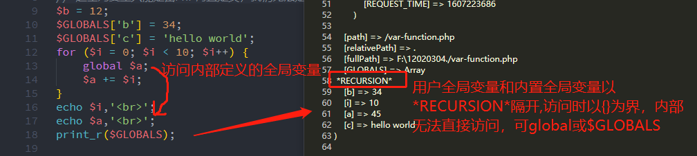
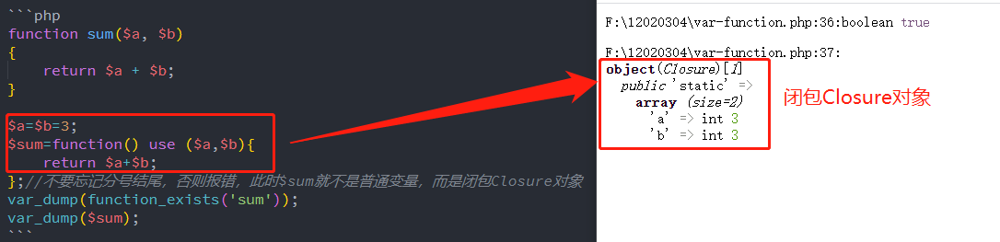
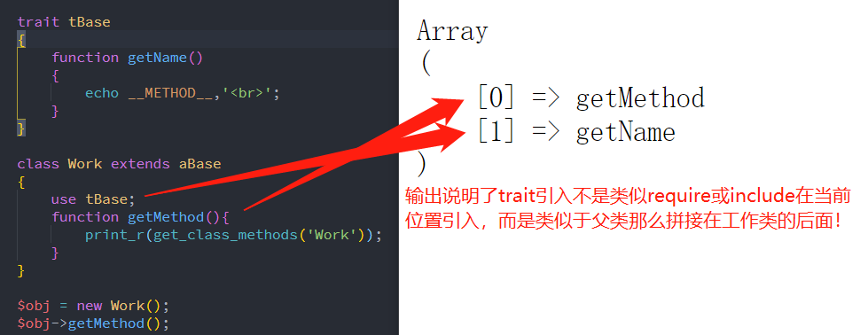

## 一、变量、函数与类

### 1、变量 variable

我们知道 JS 中只有内部变量和全局变量，`{}`中定义的变量是内部变量，外部定义的变量是全局变量，其实称为外部变量更合适。局部变量只能在{}中使用，而全局变量(外部变量)可以在当前页面任何地方使用，如果局部变量和全局变量同名则优先使用内部变量。C++其实也是类似的理解，但是在 PHP 中就不同了，它分为 **内部变量、全局变量和超全局变量** 。

> **PHP 变量测试结论总结:**
>
> 1. **局部变量:函数体`{}`、流程控制体`{}`中定义的变量都是局部变量** ，出了`{}`就被释放了。
> 2. **全局变量:函数体`{}`外，流程控制体`{}`外和 global 定义的都是全局变量** ，出了这个页面被释放了。这里要注意在`{}`中使用 global 定义的变量也是全局变量，如果外部已经定义了同名变量则指向已经定义的全局变量。
> 3. **超全局变量:PHP 内置定义的全局变量** ，目前它个数是固定的，用户无权定义超全局变量，只能将全局变量保存到超全局变量中。
> 4. **`$GLOBALS`超全局变量:包含了所有超全局变量或全局变量** ,因为内置的全局变量经常使用，也个自独立出超全局变量如`$_POST`和`$_SERVER`等，并且使用`*RECURSION*`(递归)区分用户定义的全局变量和 PHP 内置的全局变量，递归的另一个表达的意思是用户的全局变量会递归当面所有代码，包括 include 和 require 的页面(个人理解，目前网上找不到解释，好像大家都没注意这个)。灭绝老师解释是递归查询内存才获得全局变量。
> 5. **流程控制条件中定义变量是全局变量还是局部变量? 答案是全局变量** ,不过在实现过程中，访问前，PHP 处理引擎又自动调用了 global，所以在`{}`中使用不会出现无法访问全局变量的错误。

```php
$b = 12;
$GLOBALS['b'] = 34;
$GLOBALS['c'] = 'hello world';
for ($i = 0; $i < 10; $i++) {
    global $a;
    $a += $i;
}
echo $i,'<br>';
echo $a,'<br>';
print_r($GLOBALS);
```



### 2、函数 function

> - 函数名是全局的，在当前页面有效，包括 include 和 require 的页面,判断某页面是否定义某函数可通过 function_exists()来判断，可直接调用了，也可通过 call_user_func()调用。
> - 函数有三种形式:
>   - 普通函数即有关键字 function，函数名，形参和函数体；
>   - 匿名函数(闭包 Closure 或回调)只有关键字 function，形参和函数体；
>   - 最后一种是抽象函数，关键字是两个 abstract function，有函数名和形参，没有函数体，它只能在接口 Interface 或抽象类中
> - 函数的形参与实参:形参就是定义时`()`中参数，而实参不是调用时传递的数据，即可值传参，也可引用传参，更多见<https://www.php.cn/blog/detail/24928.html>
> - 函数使用外部变量
>   - 在函数体内使用 global 指明外部变量是全局变量
>   - 在函数体内通过$GLOBALS 使用外部变量
>   - 使用参数的方式使用外部变量，这个是普通函数推荐方式。
>   - 匿名函数（闭包或回调）还可使用 use 来引入外部变量，为什么有这种？因为系统内置的函数或别人定义的回调函数已经限制了参数时，再使用参数引入外部变量就会报参数不匹配错误，此时使用 use 相当于给函数传入了额外参数。

```php
function sum($a, $b)
{
    return $a + $b;
}

$a=$b=3;
$sum=function() use ($a,$b){
    return $a+$b;
};//不要忘记分号结尾，否则报错，此时$sum就不是普通变量，而是闭包Closure对象
var_dump(function_exists('sum'));
var_dump($sum);
```



> **严谨的函数定义方式是要指明参数类型和返回类型**，如`function(string $str,int num):array`，这样 PHP 在编译时会进行类型检查，排除不合法的类型参数。常见的类型有 string、float、int、boolean、array、Closure 和类名等。其中 Closure 就是函数名的类型，作为参数传递给其它方法时可用它。

### 3、类与变量、函数

在类中变量称为属性，函数称为方法，二者都是类的成员。**变量是实现数据的复用, 函数是实现代码的复用,类是将变量和函数作为其成员实现数据和代码的复用** 。

```php
class Person
{
    protected $name = 'woxiaoyao';
    protected $age='28';
    function __construct(string $name, int $age)
    {
        $this->name=$name;
        $this->age=$age;
    }
    function hello():string
    {
        return "{$this->name}的年龄是{$this->age}";
    }
}
// 类的实例化就是对象
$obj=new Person('xioayao',34);
echo $obj->hello();
```

## 二、类的入门

### 1、面向过程 OPP、面向对象 OOP 和面向切面 AOP

面向过程编程 OPP：Procedure Oriented Programming，是一种以事物为中心的编程思想。主要关注“怎么做”，即完成任务的具体细节。

面向对象编程 OOP：Object Oriented Programming，是一种以对象为基础的编程思想。主要关注“谁来做”，即完成任务的对象。

面向切面编程 AOP：Aspect Oriented Programming，基于 OOP 延伸出来的编程思想。主要实现的目的是针对业务处理过程中的切面进行提取，它所面对的是处理过程中的某个步骤或阶段，以获得逻辑过程中各部分之间低耦合性的隔离效果。

每种编程思想都有各自的优点，它们适用在不同的情况下：面向过程性能很高，面向对象比较易于管理和维护，面向切面使软件变得更灵活。

新的编程范式，并不一定完全各方面都优于旧的编程范式，它们只是在某一特定领域或特殊场景下有着独到的优势。

编程范式只有适合不适合项目特性，没有绝对的好坏。

> **备注:** 以上是直接引用某网文了，感觉解释不错。OPP 是最早的解决问题思路，也是最直接的，所以效率最高，而在代码复用上就比较难，因为它没归类，而类就是将变量和函数变成成员，归类后就可以很方便实现代码复用，而 AOP 也是开发项目中经常遇到问题的解决思路，如验证入口可统一到地方，所以验证代码可提供统一的提示码、提示消息。

### 2、PHP 类的关键字

> **类关键字:** class 是类关键字，这个熟悉不能再熟悉了，PHP 还定义了 abstract class 抽象类(PHP6),interface 接口，类(接口)间继承 extends，类实现接口是 implements。**extends 是单继承** ，而 **实现 implemetns 是多继承** ，如果 **又继承又实现要注意顺序是先继承后实现** 。更详细的介绍见后面

```php
class Parent{}
class Son extends Parent{}
interface iBase{}
interface iStudy extends iBase{}
interface iWork{}
class Son extends Parent implements iStudy,iWork{}
```

> **访问控制关键字：** 最常见就是`public、private`和`protected`，这是所有语言关于类的访问控制的共同关键字了，在 PHP5 增加了新的关键字`final`(不可继承，不可更改)。
>
> - **public 公共成员:** 就是 **类、子类和对象均可访问和设置** 。不过定义属性时该关键字不可省，方法可以省略，方法默认是 public。
> - **private 私有成员:** 就是 **类可以访问和设置，子类和对象不可以访问和设置** 。它的访问和设置一般都是通过 public 方法来实现。子类中访问和设置无效但不报错，对象访问直接报错。
> - **protected 保护成员:** 就是 **类和子类可以访问和设置，对象不可访问和设置** 。它的访问和设置一般同 private，子类中可以直接访问和设置，对象访问直接报错。
> - **final：** 它不同于前三者，前三者是针对类的成员(属性和方法），而 final 只针对类和方法，属性前使用 final 将报错。如果一个类被声明为`final`则不能被继承。如果父类中的方法被声明为`final`则子类无法覆盖该方法。

```php
class cPerson
{
    public $describe='class';
    private $name = 'woxiaoyao';
    protected $age='28';
    // final function hello():string
    function hello():string
    {
        return "{$this->describe}:{$this->name}的年龄是{$this->age}";
    }
}

class cMan extends cPerson
{
    public $describe='class2';
    // 修改父类的private是无效的，但不报错
    private $name = 'xiaoyao';
    protected $age=34;
}
// 类的实例化就是对象
// $obj=new Person('xioayao',34);
$obj=new cMan();
echo $obj->hello(),'<br>';
$obj->describe='class3';
// 对象访问保护成员和私有成员会报错。
// $obj->name='xiao';
// $obj->age='36';
echo $obj->hello(),'<br>';
```

### 3、其它关键字

> **static:** 成员(属性和方法)定义为 static 后，在外部无需要实例化即可访问，要节省资源。为了兼容 PHP4，如果没有指定访问控制，**属性和方法默认为公有** 。
> **const：** 类或接口中定义常量的关键字，不可在类或接口中用 define 定义常量。定义常量时就要初始化，并不可改变。
> **trait** PHP 代码复用另一种解决方式，引用是 use，别名是 as，替代是 insteadof。更多的理解见后面

### 4、访问方式（类内和类外）

> **类内访问方式:**
>
> - **非静态方法访问非 static 静态成员：** 类中使用`伪变量$this->属性名或方法名`,属性名前$要省略。private 和 protected 无法访问,否则报错。
> - **非静态方法访问 static 静态成员：** 类中使用`self和范围解析符::属性名或方法名`来直接访问属性
> - **静态方法访问非 static 静态成员：** 不可使用伪变量`$this`，要实例化对象，建议是`new self()`，如我的代码是`$that=new self()`，然后使用`$that->`访问非静态成员和方法。
> - **静态方法访问 static 静态成员：** 同非静态方法访问一样。

```php
class cMan extends cPerson
{
    //  非静态属性和静态属性
    protect $age=12;
    static $count=1;
     // 非静态方法:判断是关联数组或索引数组
     protected function isAssoc(array $arr)
     {
         if (is_array($arr)) {
             $key = array_keys($arr);
             return $key == array_keys($key) ? false : true;
         }
         return null;
     }
     // 静态方法:判断是关联数组或索引数组
     static function isAssoc2(array $arr)
     {
         if (is_array($arr)) {
             $key = array_keys($arr);
             return $key == array_keys($key) ? false : true;
         }
         return null;
     }
    //  普通方法访问非静态成员和静态成员
     public function test(array $arr){
         $this->age=25;
         var_dump($this->isAssoc($arr));
         self::$count=10;
         var_dump(self::isAssoc2($arr));
     }
      //  静态方法访问非静态成员和静态成员
     static function test2(array $arr){
         $that=new self();
         $that->age=25;
        var_dump($that->isAssoc($arr));
        self::$count=10;
        var_dump(self::isAssoc2($arr));
     }
}
```

> **类外访问方式：其实就是对象访问**
> **非static静态成员：** 先new实例对象，然后再使用对象`$object->`来访问public公共成员。
> **static静态成员：** 是`类名和范围解析符::`直接访问属性和方法。

```php
// 类的实例化就是对象
$obj=new cMan();
$arr=[1,2,3,4,5];
$obj->test($arr);
cMan::test2($arr);
```

### 5、继承中重写和扩展

类或接口都支持extends扩展，同名时即为重写，不同名时即为扩展。可以是属性，也可以是方法。

```php
// 父类
  class User{
    protected $salary = 8000;
    public function write()
    {
        return "工资:{$this->salary}";
    }

 }
//子类
class Rob extends User
{
    //1.扩展
    //属性扩展
    protected $name = "胡歌";
    protected $age= 45;
    //方法扩展
    // public function write()
    // {
    //     return parent::write(). ",age:{$this->age}";
    // }

    //2. 重写
    //属性重写
    protected $salary = 10000;
    //方法重写
    public function write()
    {
        return parent::write(). ",age:{$this->age}";
    }
}
echo (new Rob) -> write();
```

### 6、依赖注入

依赖注入以前对我来说是比较高大上的概念了，老师通过举例子一下子就明白了，其实就是参数传递，不过传递不是一般数据，而是函数，通过Closure闭包对象方式，将函数传递给类中方法使用。要想函数当参数传递给类中方法要注意以下几点：

- 将 **普通函数改为闭包Closure** 。就是将函数赋值给某变量，并要分号结尾，此时变量就是闭包对象了。
- 在类中方法将函数名的闭包对象以参数形式传递进来
- 在方法中使用时记得要加`()`引入函数需要的参数。

```php
// 普通函数改为闭包，此时外部变量可通过global、$GLOBALS，也支持use引入外部变量使用。具体分析见本文第一部分。
$isAssoc=function (array $arr)
{
    if (is_array($arr)) {
        $key = array_keys($arr);
        return $key === array_keys($key) ? false : true;
    }
    return null;
};//闭包函数最后的分号不可省，否则报错

class Check{
    // Closure就是闭包类型
    static function checkArray(Closure $isAssoc,array $arr){
        // 使用闭包时要记得()引用参数
        return $isAssoc($arr);
    }
}
$arr=[1,2,3,4,5,6];
var_dump(Check::checkArray($isAssoc,$arr));
```

## 三、类、抽象类和接口

首先要阐明的是：抽象类、接口和 trait 是在大型项目和多人协同开发时更能体现优势，若是小型项目或个人开发就没必要搞这么复杂了，当然若想能扩展除外。它们更像是一种约定或规范，提高多人开发或大型项目的开发效率，没有统一的规范就是各自一个标准，这样在整合时难免会带来各种不兼容、冲突等问题，它们完成了具体代码编写以外所有工作，包含命名规范、参数方式、返回类型等，工作类实现具体代码就可以了。

### 1、接口是定义，类是实现

这句对类和接口的总结是非常经典和精辟的，正如一个公司架构师拿到客户的需求后，就要确定功能模块，每个模块实现什么功能，所谓接口就是模块提供什么功能了，在刚开始设计阶段不会考虑具体代码的，这样设计成抽象方法明确功能即可，而每个功能模块就是相当于类，它实现了接口的具体代码，而且它解决了早期 PHP 普通类的单继承的缺陷(现在 PHP 已经提供了 trait 方法解决多复用)。

正常项目中只需要类和接口就可以完成开发了，看 TP6 的框架代码中使用 implements 有 22 个结果，此时结构一般都是 **工作类实现了接口** ，当然若是数据库操作类，则为节省连接资源，只需要一个单例连接模式时，可增加中间类(或称为父类)，在中间类中完成连接，操作如 CURD 由工作类实现。下面就是最后案例的实现逻辑，所有代码将在最后给出。

```php
interface iDb
{
    static function select(PDO $db, array $where);
    static function insert(PDO $db, array $data);
    static function update(PDO $db, array $data, array $where);
    static function delete(PDO $db, array $where);
}
class Db implements iDb
{
    // 使用单例模式连接:创建类的唯一实例,唯一对象
    protected static $db = null;
    static function connect($dsn, $username, $pwd)
    {
        if (is_null(self::$db))
            self::$db = new PDO($dsn, $username, $pwd);
        return self::$db;
    }

    // 查询
    static function select(PDO $db, array $where)
    {
    }

    // 插入
    static function insert(PDO $db, array $data)
    {
    }


    // 更新
    static function update(PDO $db, array $data, array $where)
    {        
    }

    // 删除
    static function delete(PDO $db, array $where)
    {
    }
}
```

> **接口最大优势** 解决了PHP单继承的问题，尤其是对于产品的规范随着需求不断增加，可以定义更多规范，不用修改以前的规范，能完`implements interface1,interface2....`就可以规范扩展了

### 2、抽象类

老师在演示数据库类封装时，专门使用了抽象类作为中间类，完成单例模式的连接，确保连接资源只有一个，减少SQL连接池的压力，优化访问稳定性。其实你也看到上面代码中，这个功能也可直接写在工作类中，那么为什么还要搞个中间类呢？可以是普通类吗？查阅TP框架中共有18处abstract抽象类，通过阅读代码可以分成二大类：

> **第一类:中间类** 由于接口是规范，只能定义方法(常量不在考虑在内)，为了突出工作类完全只是实现接口的规范，而将准备工作如单例模式连接、状态的设置等都放在中间类中，这样三者分工分明确：**接口指明实现什么功能，抽象类(中间类)准备实现功能的资源如连接pdo、访问文件资源等，工作类就是实现接口中抽象方法即可**。

这里曾经我有个疑问，此模式中的中间类可以是普通类吗？答案是不能，因为普通类实现接口时必须实现所有抽象方法，而我们中间类只是准备资源，只能由抽象类来担任，不然它就如我上面代码那样就是工作类了。另外这种三者模式也有利于代码复用，如连接功能是好多类都要有功能，这样中间类可以直接继承，如果如上面在工作类中，那么就要再写一遍，明显违背了类的最大作用代码复用的初衷。

```php
abstract class aDb
{
    // 使用单例模式连接:创建类的唯一实例,唯一对象
    protected static $db = null;
    static function connect($dsn, $username, $pwd)
    {
        if (is_null(self::$db))
            self::$db = new PDO($dsn, $username, $pwd);
        return self::$db;
    }

    // 判断是关联数组或索引数组
    protected function isAssoc(array $arr)
    {
        if (is_array($arr)) {
            $key = array_keys($arr);
            return $key === array_keys($key) ? false : true;
        }
        return null;
    }

    // AOP：统一检查
    protected function check(array $arr)
    {
        if (is_null($this->isAssoc($arr))) {
            throw new Exception("插入数据不是数组");
        } else {
            if ($this->isAssoc($arr)) {
                return true;
            } else {
                throw new Exception("插入数据不是关联数组");
            }
        }
    }    
}
```

> **下面提供的数据库操作类就是标准的三级模式：接口-中间类-工作类**

> **第二类:自己就是规范** 抽象类可以看成普通类和接口的交集，即具有普通类的功能(唯一区别就是不能实例化)，也能定义规范，如果某个模块规范比较统一，没有什么可扩展的，可直接定义为抽象类就完事了，而且可将 **接口-抽象类-工作类** 压缩为 **抽象类-工作类**，可降低类的阅读难度。TP中如系统服务基础类Service、驱动类Driver等，它们规范基本是统一了，没必须再整个接口，为下步再扩展规范。

上面二类中工作类都是建议只有实现抽象方法的代码，而如果有资源准备的需求并且规范已经统或可扩展不多时(如驱动访问、文件访问、基础服务等)就定义抽象类，如果规范不统一，有可以以后还要扩展规范，如新产品功能规范可以随着时代不断有新的需求，此时建议分成三级即：接口-抽象类-工作类。现在应该对三者有了更清楚认识了吗，不行就写代码体验下，我是通过写代码测试出来的。

## 四、trait

其实无论是interface接口、抽象类，还是将要介绍的trait最主要作用是扩展代码功能时，不需要或少量修改原代码，我们只要知道规范就可以了，如VSCode编辑器提供的插件，在统一规范下可以给该编辑器提供更多功能。上述三者基本也是参考这个思路。 自 PHP 5.4.0 起，PHP 实现了一种代码复用的方法，称为 trait。官方介绍是:

>- Trait 是为类似 PHP 的单继承语言而准备的一种代码复用机制。Trait 为了减少单继承语言的限制，使开发人员能够自由地在不同层次结构内独立的类中复用 method。Trait 和 Class 组合的语义定义了一种减少复杂性的方式，避免传统多继承和 Mixin 类相关典型问题。
>- Trait 和 Class 相似，但仅仅旨在用细粒度和一致的方式来组合功能。 无法通过 trait 自身来实例化。它为传统继承增加了水平特性的组合；也就是说，应用的几个 Class 之间不需要继承。

它的功能类似于抽象类，可定义常量、普通成员，静态成员和抽象方法，在工作类内部直接使用use引入，从而不用继承也能实现类似继承功能，可以说它是另一种代码复用解决方案。

```php
trait TDemo 
 {
     //常规成员
     protected $name = "peter zhu";
     public function getName()
     {
         return $this->name;
     }

     //静态成员
     static $gender = "男";
     public static function getGender()
     {
         return self::$gender;
     }

     //抽象成员

     public static $age;//未被赋值
     abstract static function getAge();
 }

 class User{
     //在类中使用use引入一个trait成员
     use TDemo;

     static function getAge()
     {
        return self::$age;
     }

 }
$user =  new  User;
User::$age = 32;
echo $user->getName().":" .$user->getGender().",:" .User::getAge();
```

### 1、trait是模板吗？

为什么有这种认识？因为老师在演示代码时所举的例子中trait都是实现方法，use引入后感觉类似将`{}`中实现方法加入到工作类中了，咋一看有点类似require或include，但在比较trait和类中方法优先级时，我才意识这种认识是错误的。它真正是类似于抽象类，不过它不是通过继承来扩展工作类功能，而是通过关键字use引入，而且支持多个引入。从某种意义上讲，为实现代码复用和扩展功能，你可以选择是trait方式，也可以选择抽象类+接口，也可以混合使用。

```php
trait tBase
{
    function getName()
    {
        echo __METHOD__,'<br>';
    }
}

class Work extends aBase
{
    use tBase;
    function getMethod(){
        print_r(get_class_methods('Work'));
    }
}

$obj = new Work();
$obj->getMethod();
```



### 2、工作类、trait和父类同名方法的优先级

同名方法调用顺序是：工作类>trait>父类，现在代码依次注释工作类和trait中同名方法，即依次输出`Work::getName`、`tBase::getName`和`aBase::getName`.

```php
abstract class aBase
{
    function getName()
    {
        echo __METHOD__,'<br>';
    }
}

trait tBase
{
    function getName()
    {
        echo __METHOD__,'<br>';
    }
}

class Work extends aBase
{
    use tBase;
    function getName()
    {
        echo __METHOD__,'<br>';
    }
}

$obj = new Work();
$obj->getName();
```

> 最后给出老师对trait的总结: **trait不能像类一样可以被实例化（其实就是类似于抽象类）,可以被use引入到他的宿主类,完成宿主类的横向扩展,类的继承完成类的纵向扩展。** 再反过来看下我的分析，应该可以理解trait了，其实就是另一种代码复用的手段，类似于抽象类，但不用继承而是使用use实现的复用。

### 3、trait作用和嵌套

trait既然是代码复用，就可实现代码在不同类中复用，也可为类增加功能，而且还支持嵌套

```php
trait tDemo1{
    public function display(){
        return __METHOD__;
    }
}
trait tDemo2{
    public function display2(){
        return __METHOD__;
    }
}
trait tDemo3{
    use tDemo2,tDemo1;
}

class Work {
    use tDemo3;
}
```

### 4、trait中命名冲突问题

引用多个trait，难免会出现同名问题，解决方案是as重新给同名命名别名，insteadof指定原名

```php
trait tDemo1{
    public function display(){
        return __METHOD__;
    }
}

trait tDemo2{
    public function display(){
        return __METHOD__;
    }
}

trait tDemo3{
    public function display(){
        return __METHOD__;
    }
}

class Work{
    use tDemo2,tDemo1{
        //给tDemo2::display()起个别名td2
        tDemo2::display as td2;
        tDemo3::display as td3;

        //调用 tDemo1::display()替换掉tDemo2::display()
        tDemo1::display insteadof tDemo2;
        tDemo1::display insteadof tDemo3;
    }
}
```

## 五、用OOP完成数据库操作类

其实数据库类完全可以只分成 **接口-工作类** 二级，这里我演示的是三级 **接口-抽象类-工作类** 。如需要合并，合并就可以

```php
namespace woxiaoyao;
use Exception;
use PDO;

// 接口：定义规范
interface iDb
{
    static function select(PDO $db, array $where);
    static function insert(PDO $db, array $data);
    static function update(PDO $db, array $data, array $where);
    static function delete(PDO $db, array $where);
}

// 中间类：抽象类，准备资源
abstract class aDb
{
    // 使用单例模式连接:创建类的唯一实例,唯一对象
    protected static $db = null;
    static function connect($dsn, $username, $pwd)
    {
        if (is_null(self::$db))
            self::$db = new PDO($dsn, $username, $pwd);
        return self::$db;
    }

    // 判断是关联数组或索引数组
    protected function isAssoc(array $arr)
    {
        if (is_array($arr)) {
            $key = array_keys($arr);
            return $key === array_keys($key) ? false : true;
        }
        return null;
    }

    // AOP：统一检查
    protected function check(array $arr)
    {
        if (is_null($this->isAssoc($arr))) {
            throw new Exception("插入数据不是数组");
        } else {
            if ($this->isAssoc($arr)) {
                return true;
            } else {
                throw new Exception("插入数据不是关联数组");
            }
        }
    }    
}

// 工作类(实现类)：实现接口规范
class Db extends aDb implements iDb
{
    // 查询
    static function select(PDO $db, array $where)
    {
        $that = new Db();
        if ($that->check($where) === true) {
            $sql = "select * from user where ";
            $str = "";
            $keys = array_keys($where);
            foreach ($keys as $key) {
                $str .= " " . $key . " = ? and";
            }
            $sql = $sql . substr($str, 0, -4);
            $stmt = $db->prepare($sql);
            $stmt->execute(array_values($where));
            return $stmt->fetchAll(PDO::FETCH_ASSOC);
        }
    }

    // 插入
    static function insert(PDO $db, array $data)
    {
        $that = new Db();
        if ($that->check($data) === true) {
            $sql = "insert into user (" . implode(',', array_keys($data)) . ") values (" . implode(',', array_fill(0, count($data), '?')) . ")";
            $stmt = $db->prepare($sql);
            $stmt->execute(array_values($data));
            return $stmt;
        }
    }


    // 更新
    static function update(PDO $db, array $data, array $where)
    {
        $that = new Db();
        if (($that->check($data) === true) && ($that->check($where) === true)) {
            $sql = "update user set ";
            $str = "";
            foreach (array_keys($data) as $column) {
                $str .= $column . " = ?,";
            }
            $sql .= substr($str, 0, -1);
            $str = "";
            foreach (array_keys($where) as $item) {
                $str .= " " . $item . " = ? and";
            }
            $sql .= " where " . substr($str, 0, -4);
            $stmt = $db->prepare($sql);
            $stmt->execute(array_merge(array_values($data), array_values($where)));
            return $stmt;
        }
    }

    // 删除
    static function delete(PDO $db, array $where)
    {
        $that = new Db();
        if ($that->check($where) === true) {
            $sql = "delete from user where ";
            $str = "";
            $keys = array_keys($where);
            foreach ($keys as $key) {
                $str .= " " . $key . " = ? and";
            }
            $sql .= substr($str, 0, -4);
            $stmt = $db->prepare($sql);
            $stmt->execute(array_values($where));
            return $stmt;
        }
    }
}

$dsn = "mysql:host=localhost;dbname=test";
$db = aDb::connect($dsn, 'root', 'root');
$db->setAttribute(PDO::ATTR_ERRMODE, PDO::ERRMODE_WARNING);
$db->setAttribute(PDO::ATTR_DEFAULT_FETCH_MODE, PDO::FETCH_ASSOC);
// var_dump($db);

// 查询
// $where = ['uname' => 'xiaoyao'];
// print_r(Db::select($db, $where));

// 插入
$arr = array('uname' => 'woxiaoyao', 'pwd' => md5('123456'));
$stmt = Db::insert($db, $arr);
if ($stmt->rowCount() > 0) {
    echo "成功插入数据" . $stmt->rowCount() . "条";
} else {
    echo "插入失败:".print_r($stmt->errorInfo(),true);
}

// 更新
// $data = array('uname' => 'xiaoyao', 'pwd' => md5('123456'));
// $where = ['uname' => 'woxiaoyao'];
// $stmt = Db::update($db, $data, $where);
// if ($stmt->rowCount() > 0) {
//     echo "成功更新数据" . $stmt->rowCount() . "条";
// } else {
//     echo "更新失败:".print_r($stmt->errorInfo(),true);
// }

// 删除
// $where = ['uname' => 'xiaoyao'];
// $stmt = Db::delete($db, $where);
// if ($stmt->rowCount() > 0) {
//     echo "成功删除数据" . $stmt->rowCount() . "条";
// } else {
//     echo "删除失败:".print_r($stmt->errorInfo(),true);
// }
```

## 六、学习OOP后的总结

- OOP将问题对象化，提高了代码复用的效率，在继承中可以重写或扩展父类的成员。
- 接口和抽象类与trait是两种解决PHP单继承的方案，前者是通过关键字extends和implements，后者是通过在类中use即可。
- 一般情况下解决问题都是分成三级：工作类-中间类(抽象类)-接口，如果规范已经比较统一了也可压缩成二级：工作类-抽象类。当然这种只是一种解决思路，你也可以写在一起，不过在大型项目和多人协同开发时，前面解决思路可有效提高工作效率。
