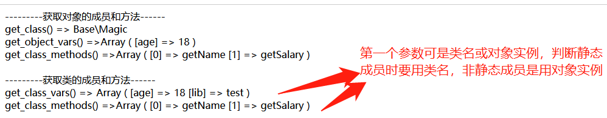
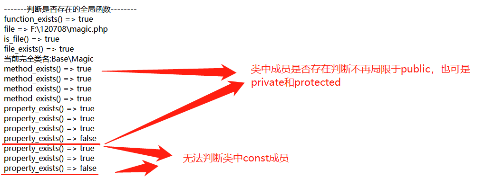
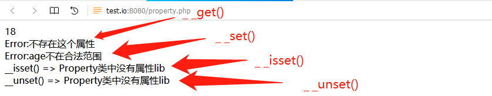
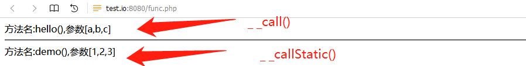
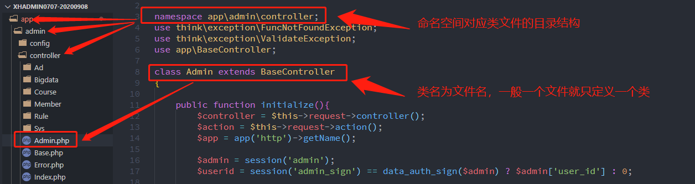

[toc]

## 一、PHP的魔术常量和魔术方法

### 1、魔术常量和魔术方法

在PHP中存在两种魔术成员，即 **魔术常量和魔术方法** 

- **命名规则:** 前者的名称以2个下划线开始，并以2个下划线结尾，如`__DIR__、__LINE__`等，后者的名称仅是2个下划线开始，如`__construct、__destruct、__get、__set、__call和__callStatic`。
- **定义位置:** 前者是PHP内置，无需也无法定义，后者需要我们在 **类中定义** ，它作为类的成员方法出现，并且必须是 **public** 访问控制属性。
- **应用场景:** 前者是获取当前环境的信息，如当前行、目录、类名等，后者更像 **拦截器，在正常情况下，访问未定义或未加载的类、未定义或无法访问的属性和方法时，PHP引擎都会抛出异常，而PHP魔术方法为这些行为在抛出异常之前提供了一次用户处理的机会** 。

### 2、PHP的常用魔术常量

先看下PHP官方文档中对魔术常量的介绍：

|名称|说明|
|:-:|----|
|`__LINE__`|文件中的当前行号|
|`__FILE__`|文件的完整路径和文件名。如果用在被包含文件中，则返回被包含的文件名|
|`__DIR__`|文件所在的目录。如果用在被包括文件中，则返回被包括的文件所在的目录。它等价于 `dirname(__FILE__)`。除非是根目录，否则目录中名不包括末尾的斜杠,PHP5.3增加的|
|`__FUNCTION__`|当前函数的名称。匿名函数则为 `{closure}`|
|`__CLASS__`|当前类的名称。类名包括其被声明的命名空间(例如Foo\Bar)。注意自 PHP 5.4 起 `__CLASS__` 对 trait 也起作用。当用在 trait 方法中时，`__CLASS__` 是调用 trait 方法的类的名字|
|`__TRAIT__`|Trait 的名字。Trait 名包括其被声明的命名空间(例如 Foo\Bar),PHP5.4增加的|
|`__METHOD__`|类的方法名|
|`__NAMESPACE__`|当前命名空间的名称,PHP5.3增加的|
|ClassName::class|完整的类名,若是有命名空间，则包括命名空间,PHP5.5增加的|

我们都知道PHP有八个魔术常量，而在PHP官方文档中介绍魔术常量时则加上了ClassName::class，开始我还在纠结怎么理解为什么它不遵循魔术命名规则呢，以为已经存在__CLASS__了，而且二者功能相近所以不按命名规则了，最终通过代码测试发现它根本就不是魔术常量，它是类的常量，它的值就是__CLASS__,相当于每个类从PHP5.5以后都内置定义了常量const class，它名称是小写而已(普通常量一般大写)。这里感觉官方将它放在魔术常量列表中并声明是PHP5.5增加的魔术常量不合适，容易误导用户，大家可以测试理解下。

```php
namespace Base\Magic;
class Magic
{
    // const class=__CLASS__;//PHP从 5.5后内置定义的类常量,不能再定义，否则报错
    const name = '当前完全类名:'.__CLASS__;
}
echo Magic::name;
```


> **补充:** 在得知class是类的常量时，本想试图定义自己的clas覆盖默认的，结果发现报错。大概意思是该常量已经定义，并用于获取类名了


`__CLASS__和ClassName::class`最大区别就是调用位置，前者必须在类中，而后者位置任意，可在类中，也可在类外，尤其是在获取类的完整名时经常用，它不仅返回类名，也包括命名空间。这个在下面介绍魔术方法中常用全局函数中传递类名参数要多次用到。具体可看后面代码。

### 3、PHP获取对象或类相关信息的全局函数

>- `get_class([object $object = null]):string :` 参数是 **对象实例** ，返回对象实例object所属类的名字。不是对象返回false;在类中调用可省略参数object,则返回当前所在类的名称;如果 object 是命名空间中某个类的实例，则会返回带上命名空间的类名。
>- `get_object_vars(object $obj):array :` 参数是 **对象实例** ，返回由 **obj指定的对象中定义为public的属性组成的关联数组** 。在PHP4.2.0之后，未赋值的变量作为键名将被赋予null值。 **要强调的是它只返回外部可以访问的属性，即public，而private和protected则不返回**。
>- `get_class_vars(string $class_name):array :` 参数是 **类名**，返回由 **类中定义为public的属性组成的关联数组** 。同上面获取对象的属性一样，只能获取类成员中public属性。 **要强调的是若有命名空间，即使在当前空间中调用该该函数获取类成员属性，也要加上命名空间，否则获取不到**
>- `get_class_methods(mixed $class_name):array :` 参数是 **类名或对象实例** ，返回 **类或实例对象的public方法名组成的索引数组** 。若是类名，要求同上。

```php
namespace Base;
class Magic
{
    // const class=__CLASS__;//PHP从 5.5后内置定义的类常量,不能再定义，否则报错
    const name = '当前完全类名:'.__CLASS__;
    public $age = 18;
    public static $lib='test'; 
    private $desc = 20;
    protected $salary = 3000;
    static function getName(){
        return self::name;
    }
    function getSalary()
    {
        return (new self())->salary;
    }
    private function getAge()
    {
        $this->age += 5;
    }
}
// 1、获取对象或类相关信息的全局函数
echo '---------获取对象的成员和方法------','<br>';
echo 'get_class() => '.get_class(new Magic),'<br>';
echo 'get_object_vars() =>'.print_r(get_object_vars(new Magic),true),'<br>';
echo 'get_class_methods() =>'.print_r(get_class_methods(new Magic),true),'<br><br>';
echo '---------获取类的成员和方法------','<br>';
// 使用Magic::class获取完整类名，包括命名空间
echo 'get_class_vars() => '.print_r(get_class_vars(Magic::class),true),'<br>';
echo 'get_class_methods() =>'.print_r(get_class_methods(Magic::class),true),'<br><br>';
```

> **补充1：参数是类名时注意事项** 参数时类名时，若有命名空间则直接写类名是获取不到结果的，此时要加上命名空间即完整类名。可get_class()获取，也可ClassName::class获取，也可自己手动拼接。
> **补充2：返回结果是所有成员？** 经测试只能获取public成员，private、protected和const成员均无法获取。




### 4、PHP判断是否存在的全局函数

>- `function_exists(string $function_name):bool : ` 在已经定义的函数列表(包括系统自带的函数和用户自定义的函数)中查找function_name，函数名必须为一个字符串。如果 function_name存在且的确是一个函数就返回true，反之则返回false。
>- `file_exists(string $filename):bool : ` 检查文件或目录是否存在。如果由filename指定的文件或目录存在则返回true，否则返回false。在Windows中要用`//computername/share/filename`或者`\\computername\share\filename`来检查网络中的共享文件。
>- `is_file(string $filename):bool : ` 判断给定文件名是否为一个正常的文件。如果文件存在且为正常的文件则返回 true，否则返回 false。关于它和file_exists区别见后面补充。
>- `property_exists(mixed $class,string $property):bool : ` 检查给出的 property 是否存在于指定的类中(以及是否能在当前范围内访问)。class是字符串形式的类名或要检查的类的一个对象实例，property属性名。如果该属性存在则返回 true，如果不存在则返回 false，出错返回 null。
>- `method_exists(mixed $calss,string $method_name):bool : ` 检查类的方法是否存在于指定的object中。参数class同上可以是类名或对象实例，method_name是方法名。如果 method_name 所指的方法在 object 所指的对象类中已定义，则返回true，否则返回false。

```php
// 3、判断是否存在的全局函数
echo '-------判断是否存在的全局函数--------','<br>';
// function_exists();
echo 'function_exists() => '.var_export(function_exists('call_user_func'),true),'<br>';
// file_exists()和is_file();
$file=__DIR__.DIRECTORY_SEPARATOR.'test.php';//不存在文件，后面二者都返回false
$file=__DIR__.DIRECTORY_SEPARATOR.'magic.php';//存在文件,后面二者都返回true
echo 'file => '.$file,'<br>';
echo 'is_file() => '.var_export(is_file($file),true),'<br>';
echo 'file_exists() => '.var_export(file_exists($file),true),'<br>';
// method_exists();
// 使用Magic::class获取完整类名，包括命名空间
echo Magic::getName(),'<br>';
echo 'method_exists() => '.var_export(method_exists(Magic::class,'getName'),true),'<br>';
echo 'method_exists() => '.var_export(method_exists(Magic::class,'getSalary'),true),'<br>';
echo 'method_exists() => '.var_export(method_exists(new Magic,'getSalary'),true),'<br>';
echo 'method_exists() => '.var_export(method_exists(new Magic,'getAge'),true),'<br>';
// property_exists();
// 使用Magic::class获取完整类名，包括命名空间
echo 'property_exists() => '.var_export(property_exists(new Magic,'age'),true),'<br>';
echo 'property_exists() => '.var_export(property_exists(Magic::class,'lib'),true),'<br>';
echo 'property_exists() => '.var_export(property_exists(Magic::class,'getName'),true),'<br>';
echo 'property_exists() => '.var_export(property_exists(Magic::class,'getSalary'),true),'<br>';
echo 'property_exists() => '.var_export(property_exists(new Magic,'getSalary'),true),'<br>';
echo 'property_exists() => '.var_export(property_exists(new Magic,'getAge'),true),'<br>';
```

> **补充1:function_exists和method_exists区别** 就是前者是检查全局函数包括内置函数，后者是检查类中方法(类中对函数的另种称谓)。
> **补充2:file_exists和is_file的参数和后者的运行原理** 。文件名可以是相对路径名，也可是绝对路径，若直接是文件名，则在当前目录下查找。若是多层时要注意分隔符，由于不同系统的分隔符并不相同，最妥的方法就是能完DIRECTORY_SEPARATO预定义常量获取 ，如`__DIR__.DIRECTORY_SEPARATOR.'magic.php';` 。还有一个就是二者作用，老师在演示时认为前者是判断文件是否存在，后者是判断文件名是否合法，其实在测试中我发现 **is_file包括文件是否存在的检查，即文件名合法若文件不存在则返回false，只有文件名合法并且存在才返回true**。
> **补充3：类的判断存在的全局函数和获取的全局函数区别？** 上面已经介绍过`get_class_vars()`和`get_class_methods()` 这两类最大区别就是get获取类时只能是public成员，而判断类时可以是public，也可以是private、protected，二者都无法对const成员的访问。



### 5、全局调用的全局函数call_user_func

调用全局函数有两个`call_user_func()`和`call_user_func_array()`，二者均可以调用全局函数或类中方法，不同就是参数传递方式，前者是参数列表，参数之间用逗号隔开，而后者则是以数组形式传递所有参数，数组中参数是以逗号隔开。

- 调用全局函数时，若没有命名空间，直接使用函数名作为第一个参数就可以，若有命名空间(require或include引入命名空间时，要使用全局命名空间或匿名空间`\`)则要带上命名空间，否则提示找不到该函数名。

- 调用类中方法时，第一个参数为数组，数组中第一个成员是类名(若有命名空间则用完整类名，至于获取方式见上)，数组第二个成员是方法名。

```php
echo '-------判断是否存在的全局函数--------','<br>';
function increment($var)
{
    return ++$var;
}
$a = 0;
// 调用全局函数，若有命名空间则要加命名空间
echo call_user_func('Base\increment', $a),'<br>';
echo call_user_func_array('Base\increment', array($a)),'<br>';
// 调用类中方法
echo call_user_func(array(Magic::class,'getName')),'<br>';
echo call_user_func_array(array(Magic::class,'getName'),[]),'<br>';
// 不能调用未定义或不可访问的方法
echo call_user_func(array(new Magic,'getAge')),'<br>';
echo call_user_func_array(array(new Magic,'getAge'),[]),'<br>';
```

> **补充1：关于参数问题** `call_user_func()`可以只有函数名，没有参数。而`call_user_func_array()`不仅要有函数名，也要有第二个参数，若是参数为空时，则要用`[]`空数组表示，不写则报错。
> **补充2：参数可以是引用参数传递吗？** 官方介绍是call_user_func是不可以，而call_user_func_array是可以的。
> **补充3：支持调用类中所有方法？** 经测试，只能调用 **其它类的public成员方法** ，至于private和protected则不可访问。若是调用其它类不可访问方法则会触发下面将要介绍的方法拦截器，至于方法拦截器可看后面。


## 二、PHP的魔术方法-重载(或叫拦截器)

在官方的"重载"介绍中，通过魔术方法(magic methods)来动态地创建类属性和方法。并且强调了PHP的重载和C++、Java中类重载实质是不一样的(`官网解释:PHP中的重载与其它绝大多数面向对象语言不同。传统的重载是用于提供多个同名的类方法，但各方法的参数类型和个数不同`)。其实我觉得称谓拦截器更合适，在PHP引擎抛出异常前，给用户一次处理错误的机会。下面将介绍类属性的拦截器、类方法的拦截器和类拦截器。特别强调一点就是 **所有的重载方法都必须被声明为 public。**

### 1、PHP类属性拦截器

PHP的魔术方法`__get()、__set()、__isset()和__unset()` 对应拦截 ** `外部` 读取、设置、判断isset()或empty()和unset未定义或不可访问的成员属性时** 也就是说访问public成员时或类中方法访问时不会触发这个拦截。

- `public __set(string $name,mixed $value):void` 在给不可访问属性赋值时会被调用。
- `public __get(string $name):mixed` 读取不可访问属性的值时会被调用。
- `public __isset(string $name):bool` 当对不可访问属性调用`isset()`或`empty()`时会被调用。
- `public __unset(string $name):void` 当对不可访问属性调用`unset()`时会被调用。

> 参数`$name`是指要操作的变量名称。`__set()`方法的`$value`参数指定了`$name`变量的值。**属性重载只能在对象中进行** 。在静态方法中，这些魔术方法将不会被调用。所以这些方法都不能被声明为static。从PHP 5.3.0 起, 将这些魔术方法定义为static会产生一个警告。

```php
class Property
{
    public $name = 'xiaoyao';
    private $age = 18;
    protected $salary = 3000;
    public static $desc = 'Hello';
    // 读取拦截器
    function __get($name)
    {
        if (property_exists($this, $name)) {
            $method = 'get' . ucfirst($name);
            if (method_exists($this, $method)) {
                return call_user_func(array($this, $method));
            } else {
                return 'Error:未找到读取方法';
            }
        } else {
            return 'Error:不存在这个属性';
        }
    }
    private function getAge()
    {
        return $this->age;
    }
    // 设置拦截器
    function __set($name, $value)
    {
        if (property_exists($this, $name)) {
            $method = 'set' . ucfirst($name);
            if (method_exists($this, $method)) {
                echo call_user_func(array($this, $method), $value),'<br>';
            } else {
                echo 'Error:未找到读取方法','<br>';
            }
        } else {
            echo 'Error:不存在这个属性','<br>';
        }
    }
    private function setAge($val)
    {
        if ($val > 5 && $val < 120) {
            $this->age = $val;
            return "age设置成功，现在值为:{$this->age}";
        } else {
            return "Error:age不在合法范围";
        }
    }
    // isset()或empty()判断拦截器
    function __isset($name){
        if (!property_exists($this, $name))
        echo "__isset() => ".__CLASS__."类中没有属性{$name}",'<br>';
    }
    // unset()拦截器
    function __unset($name){
        if (!property_exists($this, $name))
        echo "__unset() => ".__CLASS__."类中没有属性{$name}",'<br>';
    }
}
$obj = new Property();
echo $obj->age,'<br>';
echo $obj->lib,'<br>';
$obj->age=131;
$bl=isset($obj->lib);
unset($obj->lib);
```

> **和老师代码不同点:** 老师演示代码中是`isset()`判断某变量是否定义，我是使用`property_exists()`，至于方法调用老师为了简单是直接调用，我是通过`call_user_func()`，不过要注意它的返回值，是读取或判断操作时建议return，是设置或重置操作时建议打印输出如echo。



### 2、PHP类方法拦截器

PHP的魔术方法`__call()和__callStatic()` 对应拦截 ** `外部` 访问未定义或不可访问的类中非静态方法和静态方法时** 同上，访问访问public成员方法或类中方法相互调用时不会触发这个拦截

- `public __call(string $name,array $arguments):mixed` 在对象中调用一个不可访问方法时会被调用
- `public static __callStatic(string $name,array $arguments):mixed` 在静态上下文中调用一个不可访问方法时会被调用。

> `$name`参数是要调用的方法名称。`$arguments`参数是一个枚举数组，包含着要传递给方法`$name`的参数

```php
class User
{
    public function __call(string $name, array $args)
    {
        printf('方法名:%s(),参数[%s]', $name, implode(',', $args));
    }

    public static function __callStatic(string $name, array $args)
    {
        printf('方法名:%s(),参数[%s]', $name, implode(',', $args));
    }
}

$user = new User;
$user->hello('a', 'b', 'c');
echo '<hr>';
User::demo(1, 2, 3);
```



> **易错误点：** 声明`__callStatic()`时一定要记得加上static，这个关键字容易漏，如果漏了将报错。

### 3、PHP类拦截器

PHP的魔术方法`__construct()和__destruct()` 对应拦截类的实例化new或释放时，也被称为类的构造函数和析构函数，而`spl_autoload_register()`则拦截对未定义类的访问。PHP7.2以前是采用`__autoload()`尝试加载未定义的类,但从PHP7.2以后烈建议不要使用，建议使用`spl_autoload_register()`完成类的自动加载。相比于require或include加载文件的优势就是，当有大量类文件需要加载时，它会根据use和使用的类来决定引入类文件，这也是TP6加载类文件方式。这个自动加载类文件在下面命名空间部分有具体介绍。

`spl_autoload_register()`函数可以注册任意数量的自动加载器，当使用尚未被定义的类(class)和接口(interface)时自动去加载。通过注册自动加载器，脚本引擎在PHP出错失败前有了最后一个机会加载所需的类。官方对`spl_autoload_register()和__autoload()`使用建议:`尽管 __autoload() 函数也能自动加载类和接口，但更建议使用 spl_autoload_register() 函数。 spl_autoload_register() 提供了一种更加灵活的方式来实现类的自动加载（同一个应用中，可以支持任意数量的加载器，比如第三方库中的）。因此，不再建议使用 __autoload() 函数，在以后的版本中它可能被弃用。

语法：`spl_autoload_register([ callable $autoload_function [, bool $throw = true [, bool $prepend = false ]]] ) : bool`将函数注册到SPL __autoload函数队列中。如果该队列中的函数尚未激活，则激活它们。
- 参数:
   - autoload_function:欲注册的自动装载函数。如果没有提供任何参数，则自动注册 autoload 的默认实现函数spl_autoload()。
   - throw:此参数设置了 autoload_function 无法成功注册时， spl_autoload_register()是否抛出异常。
   -prepend:如果是 true，spl_autoload_register() 会添加函数到队列之首，而不是队列尾部。
- 返回值：成功时返回true，或者在失败时返回false。
- 更新日志:PHP5.3.0添加了prepend参数和命名空间的支持。

```php
spl_autoload_register(function ($name) {
    echo "Want to load $name.\n";
    throw new Exception("Unable to load $name.");
});

try {
    $obj = new NonLoadableClass();
} catch (Exception $e) {
    echo $e->getMessage(), "\n";
}
```

> **异常捕获:** `spl_autoload_register()`抛出的异常会被try...catch捕获到。
> **类拦截器和属性与方法拦截器区别:** 前者是全局函数，一般在页面头部或项目开始时使用，后者是魔术方法，是为类增加用户处理异常的机会。

### 4、事件委托

访问类中不存在的成员方法时,会被魔术函数`__call()或__callStatic()`所拦截,把该请求重定向到别的类中的成员方法来处理，这种处理方式我们称之为事件委托。对于要重定向的类目前常见有两种处理方式：一是在构造函数中传递类的对象实例给内部变量，这样在new实例化时动态创建，比较灵活；另一种就是在类中直接生成类的实例对象，如数据库链式操作就是采用这种方法，**前者是适用生成对象再访问时，后者多用于静态成员调用时**。

```php
//被重定向的类
 class Base
 {
    public function write(...$args){
        printf('方法名:%s(),参数[%s]',__METHOD__,implode(',',$args));
    }

    public static function fetch(...$args)
    {
        printf('方法名:%s(),参数[%s]',__METHOD__,implode(',',$args));
    }
 }


 //工作类

 class Work
 {     
     private $base;

     function __construct(Base $base)
     {
         $this->base = $base;
     }
    public function __call($name,$args)
    {
        if(method_exists($this->base,$name))
        return call_user_func([$this->base,'write'],...$args);  
    }

    public static  function __callStatic($name,$args)
    {
        if(method_exists('Base',$name))
        return call_user_func(['Base','fetch'],...$args);  
    }
 }

 //得到了base类的实例
 $base = new Base();
 $w = new Work($base);
 $w->write(1,2,3);//方法名:Base::write(),参数[1,2,3]
 $w::fetch(1,2,3);
```

## 三、PHP类属性和方法拦截器的实战-数据库链式操作

在TP5或6中，无论是数据库还是模型，都支持链式查询，极大提高了数据库操作效率。在上课前，对它们也只是知道使用，也没深入了解原理，经过老师的实战演示，发现PHP的魔术方法还真是好用。

```php
// 使用事件委托(方法拦截器实现数据库链式操作)\
// 效果就是Db::table('user') ->field('id,name,age')->where('status',1) ->order('create_time') ->limit(10) ->select();

class Query
{
    protected $db;
    protected $where = 'true and ';
    protected $field;
    protected $order;
    protected $limit;
    function __construct($dsn, $username, $pwd)
    {
        $this->connect($dsn, $username, $pwd);
    }

    private function connect($dsn, $username, $pwd)
    {
        $this->db = new PDO($dsn, $username, $pwd);
    }
    // 合并成查询SQL
    private function getSql()
    {
        return sprintf("SELECT %s FROM %s where %s %s %s", $this->field, $this->table, substr($this->where, 0, -4), $this->order, $this->limit);
    }
    //数据表
    public function table($table)
    {
        $this->table = $table;
        return $this;
    }
    // 字段名
    function field($val)
    {
        $this->field = $val;
        return $this;
    }
    // 条件，支持多次调用
    function where($name, $val)
    {
        $this->where .= "{$name}={$val} and ";
        return $this;
    }
    // 排序
    function order($name, $val = 'ASC')
    {
        $this->order = "order by{$name} {$val}";
        return $this;
    }
    // 限制
    function limit($val)
    {
        $this->limit = "limit {$val}";
        return $this;
    }
    // 选择所有符合条件记录
    function select()
    {
        return $this->db->query($this->getSql())->fetchAll(PDO::FETCH_ASSOC);
    }
    // 读取第一条记录
    function find()
    {
        return $this->db->query($this->getSql())->fetch(PDO::FETCH_ASSOC);
    }
}

class Db
{
    static function __callStatic($name, $args)
    {
        $dsn = "mysql:host=localhost;dbname=test";
        $username = 'root';
        $pwd = 'root';
        $query = new Query($dsn, $username, $pwd);
        return call_user_func(array($query, $name), ...$args);
    }
}
$res = DB::table('user')
    ->field('id,uname,pwd')
    // ->where('id', 1)
    ->limit(5)
    // ->find();//读取一条
    ->select();//读取所有
print_r($res);

```

## 四、PHP的命名空间和自动加载类文件

### 1、命名空间

我们知道PHP的全局成员有 **常量,函数,类(接口)** ,默认声明在全局空间中的,优点是全局调用,缺点是不能重复命名。最开始解决方案就是加前缀，不过随着项目不断增大，这样加前缀明显是提高了命名的长度，难于记忆和理解。php5.3以后引入C# Java中应用成熟的命名空间，将项目分为不同命名空间，从而解决了命名冲突问题。

namespace需要写在脚本顶部,必须是php的第一条指令(除了declare指令)。declare一般是描述严格模式的，如`declare (strict_types = 1);`。namespace有两种形式：一种是如类一样使用大括号{}包裹，在它外部不能有任何语句代码。另一种也就是目前常用形式，就是`namespace 名称；` 它从名称处开始，到下一次出现namespace或页面尾部结束。

```php
namespace ns1;
 class Test{};
 namespace ns2;
 class Test{};
```

**有了命名空间的类再进行访问时要注意加上命名空间，以反斜杠`\`分隔，同时第一个反斜杠表示根空间(全局空间或匿名空间)。若是访问自己命名空间中类时可以省略命名空间**

```php
namespace Base\School;
class Demo
{
    public function getSite(){
        return '学校网站<br>';
    }
}
namespace Base\Compony;
class Demo
{
    public function getSite(){
        return '公司网站<br>';
    }
}
echo (new Demo)->getSite();
echo (new \Base\School\Demo)->getSite();
```

### 2、命名空间的类和函数的访问形式

这里要纠正老师对于命名空间中类访问的结论：

- 若调用类或函数是在本命名空间时，可省略命名空间，默认是当前命名空间。若不存在则在全局空间中查找函数或类，若两者都不存在则报错。
- 若调用其它命名空间的类或方法，一定要加上命名空间，并且要从全局空间反斜杠`\`开始，如下面代码中演示

```php
namespace Base\School;
class Demo{
    function getName(){
        echo __CLASS__,'<br>';
    }
}
function getName(){
    echo __FUNCTION__,'<br>';
}

namespace Base\Compony;
class Demo{
    function getName(){
        echo __CLASS__,'<br>';
    }
}
function getName(){
    echo __FUNCTION__,'<br>';
}
function var_dump($arg){
    echo '用户自定义的var_dump:'.var_export($arg,true),'<br>';
}
// 访问本命名空间的函数或方法时可省略命名空间
getName();
(new Demo)->getName();
// 访问其它命名空间函数或方法时必须要带上命名空间，必须从根命名空间开始，即反斜杠\
\Base\School\getName();
(new \Base\School\Demo)->getName();
// 访问全局空间或匿名空间要记得加上根命名空间反斜杠\，否则若当前命名空间有相同函数或类时，优先调用本命名空间的。
var_dump([1,2,3,4]);//用户定义的var_dump
\var_dump([1,2,3,4]);//有全局空间反斜杠\表示调用PHP内置的var_dump
```

### 3、命名空间的子空间和公共空间

在大项项目中，命名空间一般和目录相对应，文件名对应类名，这样的多层空间就是子空间，如TP6框架



而公共空间就是全局空间或匿名空间，就是没有命名空间的类文件，它将被PHP引擎分到全局空间。

```php
//  公共空间:全局空间,匿名空间
 function func()
 {
     echo '我是公共空间中的函数func()<br>';
 }
 class Demo
 {

 }
```

### 4、命名空间的别名和导入

当require或include或spl_autoload_register()引入类文件后，后用关键字use引入命名空间相当于当类或函数复制一份到本命名空间下，再使用类名访问。若类或函数和本命名空间冲突时，要使用关键字as取别名，如下面的libUser,这样可解决命名冲突问题。

```php
// 引入其它空间类方法:先导入文件，后use引入命名空间相当于当类或函数复制一份到本命名空间下，再使用类名访问
echo '<br>';
include_once 'extend/lib/User.php';
use extend\lib\User;
// use extend\lib\User as LibUser;//若引入类和本命名空间冲突时要用as定义别名
echo User::$name;
(new Demo)->getName();
```

### 5、自动加载类文件

自动加载类文件就是使用未定义的类时，会被`spl_autoload_register()`全局函数拦截到，在PHP抛出异常前加载所需的类文件即可。下面就是实现自动加载的源码演示。

```php
spl_autoload_register(function ($classname) {
    $file = __DIR__ . DIRECTORY_SEPARATOR . $classname . '.php';
    echo '正在加类文件:'.$file,'<br>';
    if (is_file($file))
        include_once $file;
    else
        echo '类文件未找到', '<br>';
});

use extend\lib\Auth;

try {
    echo Auth::$name;
} catch (Exception $e) {
    echo $e->getMessage(), '<br>';
}
```

## 五、学习后的总结

- PHP的魔术常量反应了当前环境的信息，常用于调度、记录异常、自动加载
- PHP的魔术方法不是传统的类的重载，而是更像拦截器，对于未定义或不可访问的属性和方法、未定义的类，都可使用拦截器，在PHP抛出异常之前给用户一次自定义处理的机会。
- PHP的命名空间解决了全局成员的命名冲突问题，尤其是大型项目中，命名空间一般以目录命名，文件名即类名，一个文件中通常只有一个类，这样可以保持良好的层次结构，便于理解和自动加载。
