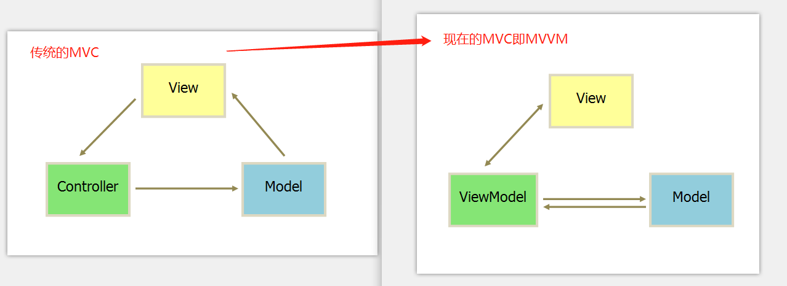
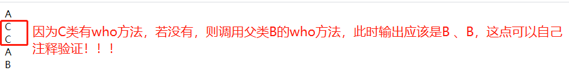
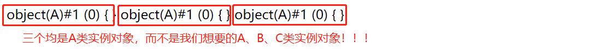

## 一、MVC设计模式工作原理及简单实现

- M: Model(模型层),最bottom一层,是核心数据层,程序需要操作的数据或信息.
- V:View (视图层),最top一层,直接面向最终用户,视图层提供操作页面给用户,被誉为程序的外壳.
- C:Controller(控制层),是middile层, 它负责根据用户从"视图层"输入的指令，选取"数据层"中的数据，然后对其进行相应的操作，产生最终结果。



其实日常开发中无论是仿站还是自己开发都基本按这个思路。如进行仿站一般都是从View开始，然后Model，最后想着Controller从Model数据库中读取数据展示到View中给客户浏览。而自己开发则是先考虑数据库Model的设计，怎么展示给客户View和如何Controller将数据库中数据传递给View。

下面就是简单的实现:

```php
//Model.php(模型)
class Model{
    function getData(){
        $dsn="mysql:host=localhost;dbname=test;charset=UTF8";
        try{
            $pdo=new PDO($dsn,'root','root');
            $sql="SELECT * from user";
            return $pdo->query($sql)->fetchAll(PDO::FETCH_ASSOC);
        }catch(PDOException $e){
            echo '数据库连接错误:'.$e->getMessage();
            exit();
        }
    }
}
```

```php
//View.php(视图)
class View{
    function fetch(array $data){
        $html="<table border=1 cellspacing='0'>";
        $html.="<thead><tr bgColor='lightgray'><th>ID号</th><th>帐号</th><th>密码</th></tr></thead><tbody>";
        foreach($data as $user):
           $html.="<tr><td>{$user['id']}</td>";
           $html.="<td>{$user['uname']}</td>";
           $html.="<td>{$user['pwd']}</td></tr>";
        endforeach; 
        $html.="</tbody></table>";
        return $html;       
    }
}
```

```php
//Controller.php(控制器)
require_once 'Model.php';
require_once 'View.php';
class Controller
{
    // 参数注入当前方法中，仅给当前方法使用
    function index(Model $model, View $view)
    {
        return $view->fetch($model->getData());
    }
}

// 测试输出代码
$model=new Model();
$view=new View();
echo (new Controller())->index($model,$view);
```

## 二、依赖注入(参数注入)

在MVC模式中控制器Controller类中依赖模型类Model实例对象和视图类View实例对象`function index(Model $model, View $view)`，此时我们可以在 **当前成员方法中使用参数注入**的方式，解决在当前类中使用其它类实例对象的问题，参数注入其实就是参数传递，它可以传递普通变量，也可是对象、闭包。

若是其它类的实例对象需要在当前类的众多成员方法中使用时( **共享或复用** )，若仍然采用将对象参数注入到成员方法中，将要多处写参数注入，此时建议方案就是能完 **构造函数的参数注入** 方式，将其它类的实例对象赋值给类的成员变量,这样当前类的所有成员方法都可访问，从而实现了其它类的共享或复用。

```php
// 类的共享或复用
class Controller
{
    private $model=null;
    private $view=null;
    // 参数注入构造函数中，赋值给类的成员变量，便于类的成员方法访问（共享或复用)
    function __construct(Model $model, View $view)
    {
        $this->model=$model;
        $this->view=$view;
    }
    function index()
    {
        return $this->view->fetch($this->model->getData());
    }
}

$model=new Model();
$view=new View();
echo (new Controller($model,$view))->index();
```

> **补充:** 以前看框架时，说优势之一就是使用依赖注入，后来经老师演示，原来就是参数传递，不得不说，好多文档说明故意提高了理解的门槛，看来理解基础再来学框架是最正确的学习路径。

## 三、服务容器(Container)

如果当前类依赖的对象较多，或者项目中有许多对象和类需要在项目中反复调用,可以将当前依赖的外部对象放到一个"服务容器"中进行统一管理。如TP6框架的Container类，服务容器最基本要有三个成员:对象容器(对象数组)、绑定对象方法和取对象方法。

```php
// 如果当前类依赖的对象较多,可以将当前依赖的外部对象放到一个"服务容器"中进行统一管理
// 服务容器: 一个自动产生类/对象的工厂
class Container
{
    // 1、对象容器(对象数组)
    protected $instance = [];
    /**
     *  2、绑定对象：对象容器中添加对象
     * $abstract :类标识, 接口, 是外部对象在当前容器数组中的键名/别名 alias    * 
     * $concrete : 要绑定的类, 闭包或者实例, 传入一个对象或者一个闭包,前者需要我们先实例化对象才能往对象容器中添加, 闭包优势:我们使用这个对象的时候,才实例化对象
     */
    function bind($abstract, Closure $concrete)
    {
        $this->instance[$abstract] = $concrete;
    }
    //3.从对象容器中取出对象, 调用
    function make($abstract, $args = [])
    {
        return call_user_func_array($this->instance[$abstract], $args);
    }
}
```

此时依赖注入就不是一个个类了，而是包含这些类的服务容器类Container，其实质仍然是引用类的实例对象，只不过这些实例对象通过bind方法保存到容器类中对象数组中，使用时使用make方法取出即可。

```php
// Controller2.php
require_once 'Model.php';
require_once 'View.php';
require_once '../Container.php';

// 类的共享或复用
class Controller
{
    private $model=null;
    private $view=null;
    // 参数注入构造函数中，赋值给类的成员变量，便于类的成员方法访问（共享或复用)
    function __construct(Container $container)
    {
        $this->model=$container->make('model');
        $this->view=$container->make('view');
    }
    function index()
    {
        return $this->view->fetch($this->model->getData());
    }
}
$container=new Container();
$container->bind('model',function(){
    return new Model();
});
$container->bind('view',function(){
    return new View();
});
echo (new Controller($container))->index();
```

## 四、self、parent和static探讨

本来要讲Facade(门面)技术的，但它静态实现依赖static的后期静态绑定，自PHP 5.3.0起，PHP增加了一个叫做后期静态绑定的功能，用于在继承范围内引用静态调用的类。在群里也咨询老师了，老师的解释是`后期静态绑定，是在继承上下文中，self只能和声明类进行绑定，并不能和调用类进行绑定。`，同时也查阅了PHP官方的解释，最终梳理成以下几个理解点：

### 1、self、parent和static到底代表谁？

首先三者都是相当于魔术变量，在实际编译时会指向具体的类，都不能在类外调用，只能在类中使用。至于老师说的声明类和调用类，如何区分声明类和调用类就不好界定。通过代码测试，我的发现它们区别就是 **查找类中成员范围起点不同** 。

- self:从当前类中开始查找成员，若有(重写时)则结束查找，没有(未重写时)则依次向父类查找成员，直到找到为止。如下面代码中`self::who();`就是先从B类中查找成员，刚好有就输出B
- parent:直接跳转当前类中成员，即使重写也忽略，从父类开始查找成员，后面查找同self，唯一不同就是起点。如下面代码中`parent::who();`虽然B类已经定义who方法，但它直接从父类A开始查找，找到who方法，输出为A。
- static:若是static访问成员，则是从明确指定类名开始查找方法。如下面代码中`parent::foo();self::foo();`按parent和self规则其实最终找到就是A类中foo方法，但它是static访问成员，所以它要用明确指明类来替换，而下面代码是`C::test()`导致这种查找，因为C类中没有tes方法，它从父类B中找到，此时明确调用类是C不是B，这点最容易误导。

下面是基于PHP官方区分self、parent和static的代码进行修改版，可以认清三者的查找成员时起点：

```php
class A {
    public static function foo() {
        static::who();
    }
    public static function who() {
        echo __CLASS__."<br>";
    }
}
class B extends A {
    public static function test() {
        // 指明具体类
        A::foo();
        // 调用static后期绑定静态成员
        parent::foo();
        self::foo();
        // parent和self区别
        parent::who();
        self::who();
    }
    public static function who() {
        echo __CLASS__."<br>";
    }
}
class C extends B {
    public static function who() {
        echo __CLASS__."<br>";
    }
}
C::test();
```



> **补充:** 正如图片中所说，static也同self和parent，只是指明 `查找成员起点不同` 而已。若上面代码中C类没有重写who方法，即注释掉C类中who方法，此时由于C类没有who方法，C类调用父类B中who方法，此时输出是:A B B A B。

### 2、转发调用与非转发调用

- **转发调用:指的是通过以下几种方式进行的静态调用** ：`self::，parent::，static:: `以及 `forward_static_call()`。
- **非转发调用:明确指定类名的静态调用** 。例如`Foo::foo();`

上面是某网文对两种调用的解释，其中第一个是官方的解释，但我认为它们只是表面认识。经测试 **两种调用都是针对是否重写继承父类的成员** 来说的。若是重写了父类的成员，则明确指定类名或self::访问都直接访问当前类中成员，终止了向上查找，是非转发调用。而没有重写父类的成员则无论是指定类名，还是上面几种都是转发调用，上面代码中`C::test()`虽然指定类名了，但它转发调用B类中test方法。

### 3、后期静态绑定

官方解释说：`存储了在上一个“非转发调用”（non-forwarding call）的类名`。其实我觉得关键词是两个"非转发调用"和"类名"，上面代码中`C::test()`输出`static::who();`是从C类开始查找who成员方法，结果找到了，所以此时"非转发调用的类名"是C，若是C类中没有重写who方法(即注释掉C类的who方法)，在B类中找到who成员方法，此时"非转发调用的类名"是B。所以 **"非转发调用的类名"是由指定类名开始的，由继承关系的类组成的队列**。下面是官方代码的解析过程，可以具体理解下三者作用。

```php
 * C::test(); //非转发调用 ，进入test()调用后，“上一次非转发调用”存储的类名为C
 *
 * //当前的“上一次非转发调用”存储的类名为C
 * public static function test() {
 *  A::foo(); //非转发调用， 进入foo()调用后，“上一次非转发调用”存储的类名为A，然后实际执行代码A::foo(), 转 0-0
 *  parent::foo(); //转发调用， 进入foo()调用后，“上一次非转发调用”存储的类名为C， 此处的parent解析为A ,转1-0
 *  self::foo(); //转发调用， 进入foo()调用后，“上一次非转发调用”存储的类名为C， 此处self解析为B, 转2-0
 * }
 *
 * 0-0
 * //当前的“上一次非转发调用”存储的类名为A
 * public static function foo() {
 *  static::who(); //转发调用， 因为当前的“上一次非转发调用”存储的类名为A， 故实际执行代码A::who(),即static代表A，进入who()调用后，“上一次非转发调用”存储的类名依然为A，因此打印 “A”
 * }
 *
 * 1-0
 * //当前的“上一次非转发调用”存储的类名为C
 * public static function foo() {
 *  static::who(); //转发调用， 因为当前的“上一次非转发调用”存储的类名为C， 故实际执行代码C::who(),即static代表C，进入who()调用后，“上一次非转发调用”存储的类名依然为C，因此打印 “C” 
 * }
 *
 * 2-0
 * //当前的“上一次非转发调用”存储的类名为C
 * public static function foo() {
 *  static::who(); //转发调用， 因为当前的“上一次非转发调用”存储的类名为C， 故实际执行代码C::who(),即static代表C，进入who()调用后，“上一次非转发调用”存储的类名依然为C，因此打印 “C”
 * }
```

### 4、后期静态绑定解决单例继承问题

```php
class A
{
 protected static $_instance = null;
 
 static public function getInstance()
 {
  if (self::$_instance === null) {
   self::$_instance = new self();
  }
  return self::$_instance;
 }
}
 
class B extends A
{ 
}
 
class C extends A{
}
 
$a = A::getInstance();
$b = B::getInstance();
$c = C::getInstance();
 
var_dump($a);
var_dump($b);
var_dump($c); 
```



上面单例继承问题可通过`static::`解决,即`getInstance()`方法中`self`都替换成`static`就可以。在TP6框架的服务容器Container类中也是通过`static::`解决单例继承问题的。

```php
//TP6的Container.php中实例方法
public static function getInstance()
{
    if (is_null(static::$instance)) {
        static::$instance = new static;
    }

    if (static::$instance instanceof Closure) {
        return (static::$instance)();
    }

    return static::$instance;
}
```

## 五、Facade(门面)

门面类Facade其实相当于中间层，先对想静态调用的类定义继承于门面类的子类，然后在该子类中定义相应的静态方法，实质是再调用对应类的非静态方法。为了相同类名，我参考了TP6框架的做法，将门面类统一命名空间为Facade。下面演示是基于服务容器类的门面类，单独类需要门面类似定义即可。

```php
// Facade.php
namespace Facade;
require_once 'Container.php';

// 门面类
class Facade
{
    protected static $container = null;
    static function instance(\Container $container)
    {
        static::$container = $container;
    }
}
// 需要静态调用的类继承门面类，为了统一，和原类名相同
class Model extends Facade
{
    static function getData()
    {
        return static::$container->make('model')->getData();
    }
}
class View extends Facade
{
    static function fetch($data)
    {
        return static::$container->make('view')->fetch($data);
    }
}
```

上面已经定义了基于服务容器类Container的门面类，将服务容器的对象数组成员赋值给Facade的静态成员，从而被所有继承Facade类的子类共享。

```php
// Controller3.php
require_once 'Facade.php';
require_once 'Model.php';
require_once 'View.php';
use Facade\Facade;
use Facade\Model;
use Facade\View;

// 类的共享或复用
class Controller
{
    function __construct(Container $container)
    {
        Facade::instance($container);
    }
    function index()
    {
        return View::fetch(Model::getData());
    }
}
$container=new Container();
$container->bind('model',function(){
    return new \Model();
});
$container->bind('view',function(){
    return new \View();
});
echo (new Controller($container))->index();
```

> **补充:** 在我的Github<https://github.com/woxiaoyao81/phpcn13>或Gitee<https://gitee.com/freegroup81/phpcn13>可以下载到参考TP6运行模式的《PHP从零开始写MVC》压缩包源码，我是在从TP官网论坛下载到的，可以作为本博文的进阶练习。
