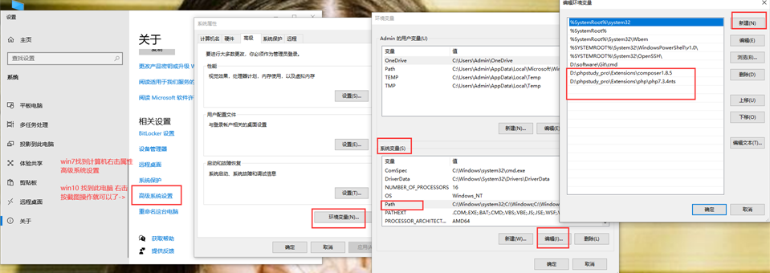
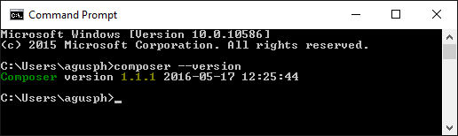
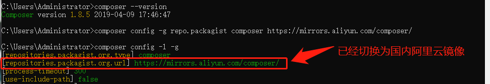
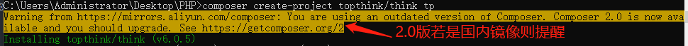
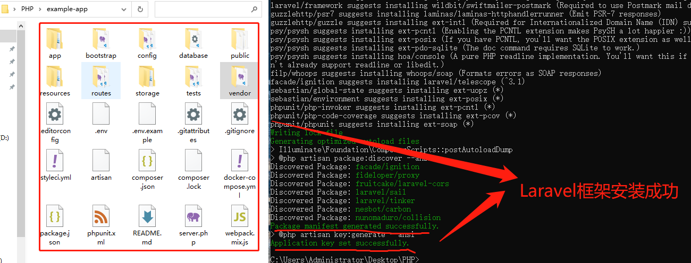
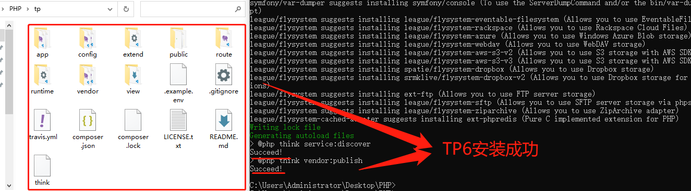

[toc]

## 一、PHP类的重写与扩展

### 1、关于self、parent和static总结

在上一篇博文<https://www.php.cn/blog/detail/25286.html>中专门探讨了`self::、parent::和static::`区别，现在可以归纳总结如下:三者都是伪类变量，就是说在编译阶段会被指定的具体类名替代，三者最大区别就是查找范围解析符::后面成员的起点不同，**self是从本类开始,parent是从父类开始，而static是从调用类开始** ，只要在类中声明成员就终止查找（子类是重写则会找到），否则将继续依次沿着继承关系向父类(父父类)查找 ，直到找到为止，**终止查找时声明成员的类就是最终替代的类** 。下面再看一下官方关于三者区别的测试代码，你可以试着不运行代码来推测出输出结果，若与输出结果一致就说明你已经掌握三者区别了。

```php
class A {
    public static function foo() {
        static::who();
    }
    public static function who() {
        echo __CLASS__."<br>";
    }
}
class B extends A {
    public static function test() {
        // 指明具体类
        A::foo();
        // 调用static后期绑定静态成员
        parent::foo();
        self::foo();
        // parent和self区别
        parent::who();
        self::who();
    }
    public static function who() {
        echo __CLASS__."<br>";
    }
}
class C extends B {
    // 注释和不注释who方法是两种结果，自己可进行测试
    public static function who() {
        echo __CLASS__."<br>";
    }
}
C::test();
```

> **理解1:子类没重写父类成员时，调用成员(静态调用或非静态调用)时是子类的还是父类的?** 答案是父类的，它在本类中未找到成员，就会没继承关系向父类查找成员，调用也是父类的成员，如`$this、self::、parent::和static::`会以父类为起点，继承查找。老师讲课时例子中`self()`是构造函数，是特例，因为每个类都声明了构造函数，所以建议不要使用构造函数来认识三者区别，这点PHP官方例子比较有代表性。

> **理解2:关于static从调用类开始是怎么理解的?** 就如上面代码中` static::who();`,通过`C::test()`是在A类中找到声明成员，为什么要从C类开始查找呢？这也许就是后期静态绑定的作用，它保存了上一次"非转发调用"的类名，也就是指明具体类，上面代码中就是C类。所以输出都是C，若注释掉C中who方法，由于C类中没找到who方法，所以还会向上查找，在B类中找到成员，所以输出是B。这点也就是我要说的老师结论要分情况，因为老师举例是构造方法，而每个类都声明了，所以结论对的，若是PHP官方例子就要注意了。

> **关于self和static使用建议:** 老师建议是`在父类中尽量少使用self关键字, 多使用static关键字,可以自动与当前方法的调用类进行绑定`，我来补充下，尤其是**子类调用父类构造函数方法时** ，一定要这样处理，否则容易出现对象实例不是想要的子类的实例而是父类的实例，如果父类是抽象类还会报错，其它非类的内置成员可视情况而定。

### 2、PHP类方法的重写(override)和扩展(extend)

通过老师的演示，让我对`parent::`有了新的认识，以前只局限于它们都是访问静态成员的伪变量而已，现在才知道它可以访问父类的常量、静态成员和非静态方法，不可访问非静态属性，它可以实现父类的成员方法(静态或非静态)的扩展，说实在话我用到过TP6框架也不少时间了，也经常用继承于TP6基础控制类来定义自己的控制类，从而提供检测功能，和老师演示功能相同，只是没注意，也许是思维局限限制了自己。

没有parent之前子类只能重写父类的方法，现在可以通过parent扩展父类的方法，常见应用在构造函数提供检测功能和扩展普通成员方法。

>- **parent扩展构造函数更多功能**

```php
// 基于框架基类提供扩展的控制类
class MyController extends BaseController{
    function __construct(){
        parent::__construct();
        //下面仅仅演示防登录欺骗功能
        if(empty($_SESSION['username']))
        redirect 'login/index';
    }
    ....
}
// 其它控制类继承它从而拥有检测功能
class Course extends MyController{
    .....
}
```

>- **parent扩展父类成员方法** 共同部分的功能可以放在父类，不同的处理需求可放在子类中，这样可以极大精简代码。

## 二、PHP的PATHINFO路由探讨

### 1、与PATHINFO路由相关的全局变量

只要采用MVC架构的项目，它的URL最终都会映射到某控制器类中方法(或函数)上，那么URL中相关路由信息都保存在哪？，其实路由相关的信息都保存在超全局变量`$_SERVER`中，下面是测试总结的，可参考。

> **假如现在URL是http://localhost/pathinfo.php/user/show/id/28/name/xiaoyao**
>- SERVER_NAME是域名，如localhost
>- SERVER_PORT是端口，如80
>- REQUEST_SCHEME是协议(http或https)，如http
>- REQUEST_METHOD请求方法，如GET
>- REQUEST_URI url路径中除掉协议和域名之外部分，如/pathinfo.php/user/show/id/28/name/xiaoyao
>- SCRIPT_NAME 执行脚本，如pathinfo.php
>- PATH_INFO   url中参数部分，如/user/show/id/28/name/xiaoyao
>- PHP_SELF 和REQUEST_URI相同，至于PHP_SELF经常用在页面跳转的url拼接时。

由于上面可以看出`$_SERVER['PATH_INFO']`的值是`/user/show/id/28/name/xiaoyao`,可分控制器+方法+参数(多个)

### 2、PATHINFO路由的静态实现

搜索引擎都不喜欢带有GET参数的URL动态地址，喜欢静态地址，如上面列举的url，那GET参数如何转换在静态地址中展示？后端如何接受呢？如`pathinfo.php/user/show?id=28&name=xiaoyao`转换为`pathinfo.php/user/show/id/28/name/xiaoyao`后，后端如何正确解析？

由本节第一个部分可得知`$_SERVER['PATH_INFO']`的值组成部分，就可以分别获取控制器、方法和参数，这样就可以调用具体的方法了。如下面代码就演示了全过程，并在老师基础上增加了首页面(没有任何参数时)和错误页面(找不到控制器或方法，前者是通过`spl_autoload_register`，后者是通过`__call`)。

```php
namespace mvc;

// 拦截不存在的控制器类
spl_autoload_register(function($classname){
    die("<h1>不存在该页面</h1>");
});

class UserController
{
    function index()
    {
        return "<h1>Welcome to My Blog</h1>";
    }
    function show($id, $name)
    {
        return "Hello {$name}，Your ID is {$id}";
    }
    // 拦截不存在的方法
    function __call($name, $args)
    {
        return sprintf("<h1>不存在该页面</h1><span>信息:%s,参数是:%s</span>",$name,print_r($args,true));
    }
}

$pathinfo = array_values(array_filter(explode("/", $_SERVER['PATH_INFO'])));
// 没有参数则默认
if (empty($pathinfo)) exit(call_user_func([(new UserController), 'index']));
//  获取控制器和方法
$controller = __NAMESPACE__ . '\\' . ucfirst(array_shift($pathinfo)) . 'Controller';
$action = array_shift($pathinfo);
// 获取参数
$args=[];
for ($i = 0; $i < count($pathinfo); $i += 2) {
    if (!empty($pathinfo[$i + 1])) $args[$pathinfo[$i]] = $pathinfo[$i + 1];
}
echo call_user_func_array([(new $controller()), $action], $args);
```

## 三、Composer学习

现在无论是TP6框架还是Laravel框架都推荐使用Composer方式安装，那么它究竟是什么？相比于传递安装有什么优势？现在项目一般都会依赖其它库，从而减少开发成本，尤其是一些优秀的项目已经提供了完善的功能，我们可以直接来借用，由此导致项目可以层层依赖多个库，若用传统安装方式则要全部下载才能安装，而Composer是PHP的一个依赖管理工具。我们可以在项目中声明所依赖的外部工具库，Composer 会帮你安装这些依赖的库文件，有了它，我们就可以很轻松的使用一个命令将其他人的优秀代码引用到我们的项目中，它是参考Nodejs的npm包管理而来。
Composer 可运行在 Windows 、 Linux 以及 OSX 平台上。
Composer 需要 PHP 5.3.2+ 以上版本，且需要开启 openssl。

### 1、Composer安装和配置

我主要工作环境是Windows，所以只介绍Windows下Composer的安装和配置，至于Linux或MacOS则可参考官方教程。Wondows 平台上，我们只需要下载`Composer-Setup.exe`后，一步步安装即可。需要注意的是你需要开启 openssl 配置，我们打开 php 目录下的 php.ini，将 `extension=php_openssl.dll`前面的分号去掉就可以了。

将Composer安装目录添加到系统环境变量中，这样就可以在任何地方使用Composer命令了。


完成上面安装和配置后，我们可以通过命令窗口(cmd) 输入composer --version命令来查看是否安装成功：


由于众所周知的原因，国外的网站连接速度很慢。因此安装的时间可能会比较长，我们建议使用国内镜像（阿里云）。

```shell
composer config -g repo.packagist composer https://mirrors.aliyun.com/composer/
```

切换镜像后，可使用命令查看配置

```shell
# -l是查看，-g是全局
composer config -l -g
```


### 2、Composer常用命令

#### （1) 自我更新self-update命令

将 Composer 自身升级到最新版本，只需要运行 self-update 命令。它将替换你的 composer.phar文件到最新版本。
```shell
composer self-update
```

如果你想要升级到一个特定的版本，可以这样简单的指定它：
```shell
composer self-update 1.0.0-alpha7
```

自我更新-参数:
--rollback (-r): 回滚到你已经安装的最后一个版本。如``
--clean-backups: 在更新过程中删除旧的备份，这使得更新过后的当前版本是唯一可用的备份。

> **补充:** 老师上课时说更新到Composer2.0版本后运行Composer init报错误，在我本机测试没出现。但是若是2.0版将镜像切换为国内在安装项目是会黄色提醒，可忽略，回车继续



#### (2) 配置config命令

config 命令允许你编辑Composer的一些基本设置，无论是本地的composer.json或者全局的config.json文件。

全局查看配置命令是`composer config -l -g`。

修改配置语法是:`config [options] [setting-key] [setting-value1] ... [setting-valueN]`，如上面切换为国内阿里云镜像命令是`composer config -g repo.packagist composer https://mirrors.aliyun.com/composer/`

#### (3) 创建或安装项目create-project命令

你可以使用 Composer 从现有的包中创建一个新的项目。这相当于执行了一个 git clone 或 svn checkout 命令后将这个包的依赖安装到它自己的 vendor 目录。

此命令有几个常见的用途：

- 你可以快速的部署你的应用。
- 你可以检出任何资源包，并开发它的补丁。
- 多人开发项目，可以用它来加快应用的初始化。

要创建基于 Composer 的新项目，你可以使用 "create-project" 命令。传递一个包名，它会为你创建项目的目录。你也可以在第三个参数中指定版本号，否则将获取最新的版本。

如果该目录目前不存在，则会在安装过程中自动创建。

```shell
composer create-project doctrine/orm path 2.2.*
```

下面是TP官方手册和Laravel官方的安装命令

```shell
# 安装TP最新稳定版，也可指定版本
composer create-project topthink/think tp
# 安装Laravel最新版本
composer create-project laravel/laravel example-app
```




#### (4) 更新项目update命令

update 命令用于更新项目里所有的包，或者指定的某些包：

```shell
# 更新所有依赖
$ composer update

# 更新指定的包
$ composer update monolog/monolog

# 更新指定的多个包
$ composer update monolog/monolog symfony/dependency-injection

# 还可以通过通配符匹配包
$ composer update monolog/monolog symfony/*
```

需要注意的时，包能升级的版本会受到版本约束的约束，包不会升级到超出约束的版本的范围。例如如果 composer.json 里包的版本约束为 ^1.10，而最新版本为 2.0。那么 update 命令是不能把包升级到 2.0 版本的，只能最高升级到 1.x 版本。关于版本约束请看后面的介绍。

#### (5) 安装install和require命令

** install命令从当前目录读取composer.json文件** ，处理了依赖关系，并把其安装到 vendor 目录下。

```shell
composer install
```

如果当前目录下存在 composer.lock 文件，它会从此文件读取依赖版本，而不是根据composer.json 文件去获取依赖。这确保了该库的每个使用者都能得到相同的依赖版本。如果没有 composer.lock 文件，composer 将在处理完依赖关系后创建它。

除了使用 install 命令外，我们也可以使用**require命令快速的安装一个依赖而不需要手动在composer.json里添加依赖信息**：

```shell
composer require monolog/monolog
```

Composer 会先找到合适的版本，然后更新composer.json文件，在 require 那添加 monolog/monolog 包的相关信息，再把相关的依赖下载下来进行安装，最后更新 composer.lock 文件并生成 php 的自动加载文件。

#### (6) 移除remove命令

remove 命令用于移除一个包及其依赖（在依赖没有被其他包使用的情况下），如果依赖被其他包使用，则无法移除：

```shell
composer remove monolog/monolog
```

#### (7) 搜索search命令

search 命令可以搜索包：

```shell
composer search monolog
```

该命令会输出包及其描述信息，如果只想输出包名可以使用 --only-name 参数：

```shell
composer search --only-name monolog
```

#### (7) 显示show命令

show 命令可以列出当前项目使用到包的信息：

```shell
# 列出所有已经安装的包
composer show

# 可以通过通配符进行筛选
composer show monolog/*

# 显示具体某个包的信息
composer show monolog/monolog
```

### 3、Composer的基本约束

**精确版本**

我们可以告诉 Composer 安装的具体版本，例如：1.0.2，指定 1.0.2 版本。

**范围**

通过使用比较操作符来指定包的范围。这些操作符包括：>，>=，<，<=，!=。你可以定义多个范围，使用空格或者逗号 , 表示逻辑上的与，使用双竖线 || 表示逻辑上的或。其中与的优先级会大于或。 实例：
```
>=1.0
>=1.0 <2.0
>=1.0 <1.1 || >=1.2
```
我们也可以通过使用连字符 - 来指定版本范围。连字符的左边表明了 >= 的版本，如果右边的版本不是完整的版本号，则会被使用通配符进行补全。例如1.0 - 2.0等同于>=1.0.0 <2.1（2.0相当于2.0.*），而1.0.0 - 2.1.0则等同于>=1.0.0 <=2.1.0。

**通配符**

可以使用通配符来设置版本。1.0.\*相当于>=1.0 <1.1。例子：1.0.\*

**波浪号 ~**

我们先通过后面这个例子去解释\~操作符的用法：~1.2相当于>=1.2 <2.0.0，而~1.2.3相当于>=1.2.3 <1.3.0。对于使用Semantic Versioning作为版本号标准的项目来说，这种版本约束方式很实用。例如\~1.2定义了最小的小版本号，然后你可以升级2.0以下的任何版本而不会出问题，因为按照Semantic Versioning的版本定义，小版本的升级不应该有兼容性的问题。简单来说，~定义了最小的版本，并且允许版本的最后一位版本号进行升级（没懂得话，请再看一边前面的例子）。
例子：~1.2

> 需要注意的是，如果\~作用在主版本号上，例如\~1，按照上面的说法，Composer可以安装版本1以后的主版本，但是事实上是\~1会被当作~1.0对待，只能增加小版本，不能增加主版本。

**折音号 ^**

^操作符的行为跟Semantic Versioning有比较大的关联，它允许升级版本到安全的版本。例如，^1.2.3相当于>=1.2.3 <2.0.0，因为在2.0版本前的版本应该都没有兼容性的问题。而对于1.0之前的版本，这种约束方式也考虑到了安全问题，例如^0.3会被当作>=0.3.0 <0.4.0对待。
例子：^1.2.3

### 4、Composer的版本稳定性

如果你没有显式的指定版本的稳定性，Composer会根据使用的操作符，默认在内部指定为-dev或者-stable。如果你想指定版本只要稳定版本，你可以在版本后面添加后缀-stable。例如：
|约束	|内部约束|
|------|-------|
|`1.2.3`|	`=1.2.3.0-stable`|
|`>1.2`|	`>1.2.0.0-stable`|
|`>=1.2`|	`>=1.2.0.0-dev`|
|`>=1.2-stable`|	`>=1.2.0.0-stable`|
|`<1.3`|	`<1.3.0.0-dev`|
|`<=1.3`|	`<=1.3.0.0-stable`|
|`1 - 2`|	`>=1.0.0.0-dev <3.0.0.0-dev`|
|`~1.3`|	`>=1.3.0.0-dev <2.0.0.0-dev`|
|`1.4.*`|	`>=1.4.0.0-dev <1.5.0.0-dev`|

minimum-stability 配置项定义了包在选择版本时对稳定性的选择的默认行为。默认是stable。它的值如下（按照稳定性排序）：dev，alpha，beta，RC和stable。除了修改这个配置去修改这个默认行为，我们还可以通过composer.json稳定性标识例如@stable和@dev）来安装一个相比于默认配置不同稳定性的版本。例如：

```
{
    "require": {
        "monolog/monolog": "1.0.*@beta",
        "acme/foo": "@dev"
    }
}
```

## 四、学习后的总结

- 要掌握self、parent和static的本质区别，建议在父类使用static替换self，在扩展类功能是使用parent。
- 要掌握PATHINFO路由的由来和后端如何解析静态地址
- 关于Composer首先要会安装、配置和下载框架，其它命令我也是转栽其它网文的，可以作为查阅参考。