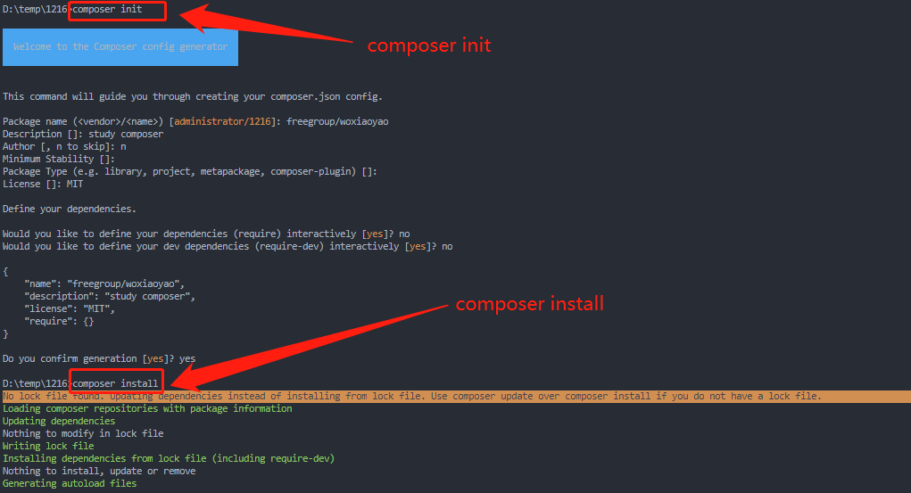
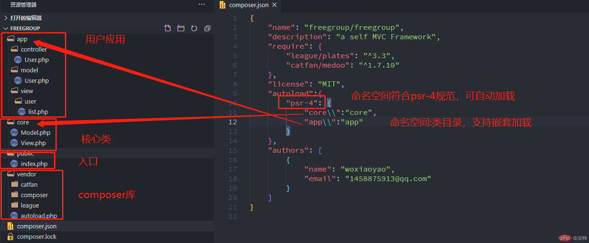

[toc]

## 一、PHP类加载的三种方式

### 1、传统手动加载方式

PHP类的传统加载方式就是使用require或include引入类文件，它实质就是将PHP代码合并到当前文件中，至于二者区别可以参考<https://www.php.cn/blog/detail/25012.html>中第四部分中介绍。它也是PHP最初支持的调用其它文件中函数或类的方式，应该没有版本限制。

```php
// 第一种类加载方式:require或include传递加载类文件
include_once '.\demo.php';
C::test();
```

### 2、spl_autoload_register自动加载方式

传统加载类的方式出现是因为当时PHP还是Person Home Page，是小型网站，没有太复杂的结构，引用文件还不多，require或include还能应付加载，而PHP发展之今已经是升级成为“超文本预处理器”，已经更名为 **PHP: Hypertext Preprocessor**。混合了C、Java、Perl以及PHP自创的语法，可以说是汲取主流语言的优秀，全球占有率一直是78%左右(发稿时间是79.1%，上升0.2%),而且PHP官方已经正式发布PHP8.0正式版。它开发项目已经可以支持大型项目，面对可能是几百或上千个类文件，再使用传统手动加载明显是low的，于是自动加载就出现了，开始是`__autoload`，但由于它只能定义一次，从PHP7.2开始建议使用spl_autoload_register自动加载类文件，则可以自动加载任意数量的类文件。至于它工作原理可见<https://www.php.cn/blog/detail/25159.html>中关于spl_autoload_register的介绍

```php
// 第二种类拦截加载:spl_autoload_register
// 要求类名和文件名要相同，比较适合psr-4规范
spl_autoload_register(function ($classname) {
    $path = __DIR__ . DIRECTORY_SEPARATOR . $classname . '.php';
    echo $path;
    if (is_file($path)) include_once $path;    
});
C::test();
```

> **补充:** 从上面代码不难看出，spl_autoload_register自动加载是拦截了类的加载错误，通过传统手动加载类文件的实现的，它是利用了PHP的引擎的内置拦截功能实现的自动加载的。

### 3、Composer自动加载器加载方式

PHP也走向了多人协作开发，正如Nodejs的npm可以引入优秀的包一样，Composer的推出解决了引用他人的包的难题，这里重点介绍它的autoload.php自动加载器，至于Composer的基础知识可参考<https://www.php.cn/blog/detail/25305.html>中Composer入门学习，而且后面也使用Composer引用他人的库或包自建自己的MVC框架。

> **Composer自动加载一般分为三步:**

#### 第一步:在当前项目中引入Composer

先执行composer init创建composer.json文件，然后执行composer install命令即可引入 Composer



#### 第二步: 在composer.json文件中声明类文件(有三种方式)

在composer.json新增autoload节点，要注意它是json文件，要 **遵循json规范:键名必须是双引号包裹(单引号或没引号报错)、值是字符串也要双引号包裹、不能有注释、最后一个节点或节点的值是数组或对象时最后一项不能有逗号，节点或节点的值使用逗号隔开**。在第二步修改composer.json后，一定要执行composer dump-autoload才能生效。

- 使用files加载任意类文件，缺点就是文件需要一个一个手动添加，类似于传统手动加载
```
//files加载任意类文件
"autoload": {
    "files": [
      "c.php"
    ]
  }
  ```

- 使用classmap批量加载类文件，它只要指定类所在目录即可。
```
//classmap加载类目录
"autoload": {
    "classmap": [
      ".\\"
    ]
  }
  ```

  - 使用psr-4批量加载类文件,下面演示是TP6的加载代码
 ```
"autoload": {
    "psr-4":{
          "app\\": "app"
    }
  },
  ```

#### 第三步:在当前文件中引入自动加载器

在当前文件中require或include引用composer的自动加载器autoload.php

```php
include_once './vendor/autoload.php';
C::test();
```

> 关于spl_autoload_register与composer加载器自动加载区别，composer的classmap和psr-4的区别在最后相关知识中会详细介绍，相信看完本文，你会对PHP类的自动加载会有一个新的认识。

> 如果你经常use命名空间则会遇到正反斜杠的问题，那么你知道它们是如何区分的吗？也同样在本文最后给出测试和总结。

## 二、Composer自制MVC框架

无论是Laravel或TP6框架都是在一些优秀的库或包的基础上建立的，我们同样也可以完成，下面就是一个自己的MVC框架的建立介绍。先介绍下我们MVC框架的一些基本情况

- Model:引用medoo库，继承它扩展我们的模型类
- View:引用plates库,继承它扩展我们的视图类
- Controller:我们自己编写的控制器类，通过Model操作数据库，并和View进行交互

参考TP6，我建立了如下目录结构:

- **app目录:应用目录**，它包括控制器目录controller、模型目录model和视图目录view，命名空间都是按目录结构，如controller\User.php，命名空间即为app\controller，类为User。
- **core目录:核心目录**, 它主要包括核心模型类Model.php和核心视图类View.php，它们分别继承Medoo和Engine。我们使用它们封闭好的方法操作数据库和渲染视图
- **public目录:访问目录** ,是对外可以访问的目录，主要是入口文件index.php和伪静态规则
- **vendor目录:Composer目录** ,Composer安装时默认目录，一般都不需要改动
- **composer.json和composer.lock:** composer安装相关文件

这是最终的框架目录截图:



### 1、核心层(core)

主要是模型类和视图类，可以操作数据库和渲染视图模板。命名空间都是符合psr-4规范的,即core。

目前自建框架的核心模型类功能还比较简单，只是实现了数据库的PDO连接和继承Medoo提供的数据库操作。

```php
//Model.php
namespace core;
use Medoo\Medoo;
class Model extends Medoo
{
    function __construct()
    {
        $config = [
            'database_type' => 'mysql',
            'database_name' => 'test',
            'server' => 'localhost',
            'username' => 'root',
            'password' => 'root'
        ];
        parent::__construct($config);
    }
}
```

核心视图类就更简单了，就是继承了Engine类，从而可以调用它模板渲染等操作视图的方法

```php
//View.php
namespace core;
use League\Plates\Engine;

class View extends Engine{
    function __construct($path=null,$fileExtension = 'php')
    {
        parent::__construct($path,$fileExtension);
    }
}
```

### 2、应用层(app)

应用层主要包括三大部分：控制器、模型和视图，模型主要是绑定一个表，而视图则是提供前端模板，控制器从模型绑定表中读取数据，渲染到视图模板中。命名空间同样符合psr-4规范，都是以app开头。

> **本例中控制器通过模型从表中读取数据，并进行分页，渲染到视图模板中**

```php
//  app\controller\User.php
namespace app\controller;
use PDO;
class User
{
    private $model;
    private $view;
    function __construct($model, $view)
    {
        $this->model = $model;
        $this->view = $view;
    }
    function index()
    {
        //分页获取数据
        $num = 10;
        $sql="select count(id) as total from user";
        $res=$this->model->pdo->query($sql)->fetchAll(PDO::FETCH_ASSOC);
        $total = intval($res[0]['total']);
        $pages = ceil($total / $num);
        $page = $_GET['p'] ?? 1;
        $offset = ($page - 1) * $num;
        $sql="select * from user where true limit {$offset},{$num}";
        $users = $this->model->pdo->query($sql)->fetchAll(PDO::FETCH_ASSOC);

        // 改进的导航栏
        $startPage = 1;
        // 显示页码数最好为奇数
        $showPage = 5;
        if (($page - ceil(($showPage - 1) / 2)) > $startPage)
            $startPage = $page - ceil(($showPage - 1) / 2);
        
        return $this->view->render('user/list',["users"=>$users,"pages"=>$pages,"startPage"=>$startPage,"showPage"=>$showPage]);
    }
}
```

> **模型就是绑定一个表** 老师使用parent调用父类构造函数，其实如果没有什么扩展可以只是空类，只是完成绑定表就可以

```php
// app\model\User.php
namespace app\model;
use core\Model;
class User extends Model
{    
}
```

> **视图模板一般要对应控制中方法**  这是TP6常见的规范，这里是基础MVC框架，view/user/list.php对应控制器中index方法

```php
<style>
    * { margin: 0; padding: 0; box-sizing: border-box; }
    a {
        text-decoration: none;
        display: inline-block;
        /* width: 2em; */
        height: 2em;
        line-height: 2em;
    }
    .container { width: 60vw; margin: 1em auto; }
    td { text-align: center; }
    .page { margin-top: 1em; text-align: center; }
    td a:first-child { margin-right: 5px; }
    td a:last-child { margin-left: 5px; }
    .page a { padding: 0 0.5em; margin: 0 5px; }
    .page a.cur { background-color: #007d20; color: white; }
</style>
<div class="container">
    <table border='1' cellspacing="0" width="100%">
        <caption>用户信息表</caption>
        <thead>
            <tr bgColor="lightgray">
                <th>ID</th>
                <th>name</th>
                <th>password</th>
                <th>操作</th>
            </tr>
        </thead>
        <tbody>
            <?php
            foreach ($users as $user) {
                $trdata = "<tr>";
                foreach ($user as $item) {
                    $trdata .= "<td>{$item}</td>";
                }
                $trdata .= "<td><a href='#'>编辑</a><a href='#'>删除</a></td>";
                $trdata .= "</tr>";
                echo $trdata;
            }
            ?>
        </tbody>
    </table>
    <div class="page">
        <?php
        echo "<a href='{$_SERVER["PHP_SELF"]}?p=1'>首页</a>";
        $prev = ($page - 1 > 1) ? ($page - 1) : 1;
        if ($startPage > 1)
            echo "<a href='{$_SERVER["PHP_SELF"]}?p={$prev}'>...</a>";
        // 加入pages验证，可避免记录数少时出现的错误
        for ($i = $startPage; $i < $startPage + $showPage, $i < $pages; $i++) :
            if ($i == $page)
                echo "<a class='cur' href='{$_SERVER["PHP_SELF"]}?p={$i}'>{$i}</a>";
            else
                echo "<a href='{$_SERVER["PHP_SELF"]}?p={$i}'>{$i}</a>";
        endfor;
        $next = ($page + 1) < $pages ? ($page + 1) : $pages;
        if ($startPage + $showPage <= $pages + 1)
            echo "<a href='{$_SERVER["PHP_SELF"]}?p={$next}'>...</a>";
        echo "<a href='{$_SERVER["PHP_SELF"]}?p={$pages}'>未页</a>";
        ?>
    </div>
</div>
```

### 3、入口(public)

public是对外可访问目录，Web服务器虚拟路径也要指向它，无论TP6或是Laravel都是这种形式。

```php
//  引入composer的自动加载器
require_once '../vendor/autoload.php';

 use core\Model;
 use core\View;
 use app\controller\User;

$obj=new User(new Model(),new View('..\app\view'));
echo ($obj->index());
```

其中自动加载是使用psr-4规范实现的嵌套加载

```
"autoload":{
        "psr-4": {
            "core\\":"core",
            "app\\":"app"
        }
    }
```

到此，一个基本的MVC框架就已经诞生了，至于更多的功能就是在它基础上进行添砖加瓦了。

## 三、相关知识的探讨

### 1、PHP的正反斜杠的探讨

在PHP学到类的加载和命名空间时，经常遇到正反斜杠的问题，有时我也会出错，于是查网文并测试进行了归纳总结。下面从三个概念入手理解。

####  (1) 目录分隔符
 Unix使用正斜杠`/(forward slash)`作为目录分隔符，而Mac和网络都是来源于Unix，所以Mac中目录或网络url中分隔符都是正斜杠，而Windows用反斜杠作用目录分隔符，不是为了显示和Unix的区别，而是来自于DOS， DOS 用正斜杠表示命令行参数。而在 UNIX 环境中，我们用减号（“-”）和双减号（“--”）表示命令行参数。

```shell
dir /s /b shell32.dll
```

如今的 Windows 内核在处理路径时确实可以 **同时支持正斜杠和反斜杠**。很多时候我们看到用斜杠时出错，是因为应用程序层面的原因。比如 cmd.exe 就不支持用斜杠表示路径，而PowerShell.exe 支持，也正因为这个原因，PowerShell 开始转而使用减号作为命令行参数的起始符。

**总结:** Windows系统中进行PHP编写时，无论是本地路径还是网络路径经测试现在都支持正斜杠了，编译时不报错。当然Windows中本地目录也可使用反斜杠分隔，但网络路径(如url)必须是正斜杠，要注意html中某些元素的src可引用本地资源或网络资源时，分隔符按上面的处理。

#### (2) 命名空间分隔符(反斜杠)

从PHP5.3引入命名空间的概念，解决了编写类库或应用程序时创建可重用的代码如类或函数时碰到的两类问题。它形式如目录结构，同Windows一样面临分隔符困扰的问题，PHP开发组从 **是否容易输入,是否容易输错,是否方便阅读,IDE兼容性,字符数量**这几个方面,选择了`back slash(反斜杠\)`作为命名空间分隔符。采用了Windows两样的解决方案。

**总结:** 若是use引用命名空间一定要用反斜杠，使用正斜杠将报错。

#### (3) 转义序列(反斜杠)

其实在PHP中反斜杠还有另一种作用，在PHP中经常使用反斜杠输出空白字符等特殊字符(如目录分隔符`/`)或对非打印字符进行可见编码的控制手段，如`\n`，这种用法就是转义序列，在使用要注意 **反斜线在单引号字符串和双引号中都有特殊含义:** 这是官方的结论，但在实现测试中却是双引号支持转义。如想输出反斜杠时，若是双引号要再使用转义符，如`"\\"`，当然若是单引号中不成功就需要同双引号一样。

```php
echo 'Hello World \n';
echo '<hr>';
echo "Hello World \n";
```


### 2、PHP的spl_autoload_register和composer自动加载器

开始还以为composer自动加载器是什么新技术，通过源码可以看到它还是调用spl_autoload_register实现自动加载类的。

```php
// autoload.php @generated by Composer
require_once __DIR__ . '/composer/autoload_real.php';
return ComposerAutoloaderInit114be2de39a3319a3fa0da8d9087bc9e::getLoader();

//composer/autoload_real.php
 public static function getLoader()
    {
        if (null !== self::$loader) {
            return self::$loader;
        }

        spl_autoload_register(array('ComposerAutoloaderInit114be2de39a3319a3fa0da8d9087bc9e', 'loadClassLoader'), true, true);
        self::$loader = $loader = new \Composer\Autoload\ClassLoader();
        spl_autoload_unregister(array('ComposerAutoloaderInit114be2de39a3319a3fa0da8d9087bc9e', 'loadClassLoader'));
.....
```

### 3、composer的classmap和psr-4自动加载区别

刚开始学习composer的自动加载器加载类时，老师列举了三种形式，可见上面，其中最让我分不清的就是classmap和psr-4。主要就是疑惑它们都支持嵌套加载吗？对于匿名空间的类和有命名空间的类加载如何选择？

由于我在作老师布置的PHP结课试卷时是自动加载匿名空间的类，而老师是加载命名空间的类，经测试得出如下结论:

- **都支持目录嵌套加载类:**  classmap支持匿名空间的目录嵌套加载，不支持命名空间；而psr-4是支持符合psr-4规范的命名空间的目录嵌套加载，不支持匿名空间。现在项目都是遵循psr-4规范的命名空间，所以如TP6都是采用psr-4实现目录嵌套加载类。

- **匿名空间和命名空间如何选择classmap或psr-4:** 匿名空间优先选择classmap，而命名空间优先选择psr-4，因为优先选择是考虑它可以目录嵌套加载类文件。当然测试时命名空间也可使用classmap加载也没错，但不支持目录嵌套加载类

 > **目录嵌套加载类：**  这个词是我提的，也许不规范，它表达的意思就是可以加载目录以及子目录中所有类文件，不用再一个个在composer指定所有目录，这也是自动加载器的初衷。

### 4、PHP的use使用总结

回顾到现在，PHP的use常用有三种场景，现在归纳如下:

> **(1) 用于命名空间的别名引用**

```php
// 命名空间
include 'namespace/file1.php';
use FILE1\objectA;
use FILE1\objectA as objectB;
echo FILE1\CONST_A, PHP_EOL; // 2
$oA = new objectA();
$oA->test(); // FILE1\ObjectA
$oB = new objectB();
$oB->test(); // FILE1\ObjectA
```

这个想必在日常的工程化开发中会非常常见。毕竟现在的框架都是使用了命名空间的，不管做什么都离不开各种类依赖的调用，在各种控制器文件的上方都会有大量的use xxx\xxx\xxx;语句。

> **(2) 用于trait特性能力的引入**

```php
// trait
trait A{
    function testTrait(){
        echo 'This is Trait A!', PHP_EOL;
    }
}
class B {
    use A;
}
$b = new B();
$b->testTrait();
```

trait特性还是非常方便的一种类功能扩展模式，其实我们可以看作是将这个use放在了类中就成为了trait的引用定义了。关于trait更详细的知识可参考<https://www.php.cn/blog/detail/25049.html>中对于trait、抽象类和接口在类扩展或继承中分析。

> **(3) 匿名函数传参**

我们知道PHP中匿名函数也是函数，也无法访问外部变量，函数解决访问外部变量在https://www.php.cn/blog/detail/24902.html中提到过global关键字或$GLOBAL全局变量数组，现在有了新的解决方案就是use,注意此时 函数必须是匿名函数才可以。至于更多PHP函数知识可参考<https://www.php.cn/blog/detail/24928.html>

```php
$a=$b=3;
$sum=function() use ($a,$b){
    return $a+$b;
};//不要忘记分号结尾，否则报错，此时$sum就不是普通变量，而是闭包Closure对象
var_dump(function_exists('sum'));
var_dump($sum);
```

### 5、composer手动引入包

composer引入包常见三种:

- 第一种:一个是在`composer init`时就加入需要引入的包,在命令中可以添加多个引入包，命令最后会自动加载并写入composer.lock。
- 第二种:修改composer.json文件，在require字段中增加要引入的包，然后`composer install`就会引入composer.json中包并写入composer.lock。
- 第三种:手动加载包，命令是`composer require`，使用时可以指定版本。它仅是引入包，并不会自动更新到composer.json和composer.lock，需要手动添加到composer.json，并使用`composer update nothing`命令更新到composer.lock。这点要和上面介绍自动加载器(`composer dump-autoload`命令)。

```
//composer.json
"require": {
        "gregwar/captcha":"*"
    }

//关闭composer.json
```

## 四、学习后的总结

- 理解PHP的类三种加载方式工作原理或本质，尤其要熟悉Composer的classmap和psr-4两种加载
- 熟悉Composer自建MVC基础框架，理解相互之间的关系，为下步扩展框架打好基础
- 要注意PHP的正反斜杠 的使用，命名空间必须要用反斜杠，而本地目录路径和网络路径使用正斜杠都正常，而windows中本地目录路径也支持原来的反斜杠。