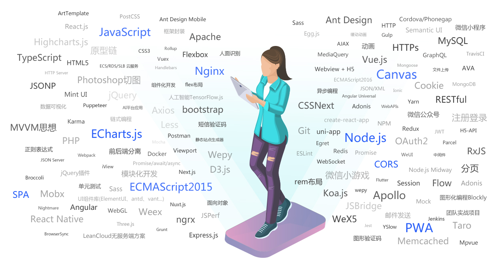

[toc]

## 一、前言

目前所做的项目是人生中第一个完整的全栈项目，从最开始的基于PHP的网站、微信小程序到现在基于uniapp开发的APP+ThinkPHP的RestfulAPI，经历了前端的Html5、CSS3、Javascript、ES6、jQuery、vuejs、Nodejs，后端的PHP、ThinkPHP、Laravel，以及APP的AndroidStudio、Java、NativeJS，如果再算我以前的专业是C、C++和C#，应该算是涉及全栈开发的各个方面了，本文不会具体介绍每个要学习什么知识点，只是总结自己对全栈开发的理解，尤其是要看透前端各家不断推陈出新的众多所谓的技术，否则就会迷茫在这些各种所谓“专业”名称新技术上(至少我就是如此)，幸好参加了PHP中文网的培训，给了我方向，通过自己的学习和总结，总算是在整体上把握全栈开发的要点，至于具体知识学习就要靠自己了，希望本文能给你全栈开发带来深刻的理解，这样各家技术就可依据情况拿来使用，实在不行就自己基于基础来实现，没那么深奥。

## 二、前端



看到上面前端学习知识是不是慌得很，我开始也这样，其实前端根本就是三大马车：Html+CSS+Javascript，，Html是内容，CSS是样式，Javascript是与用户互动，处理数据，在现在它们仍然是根本，所谓库或框架都是基于它们，作为过来人真心建议大家好好学习它们，然后再来学习库或框架，你会觉得另一番天地。关于前端，我在博客中已经做了自认为非常好的诠释了，下面部分内容已经在博客<https://www.php.cn/blog/freegroup.html>中发表，其它内容也赶路中....

### 1、Html5

Html5是目前最新Html标准了，增加了对视频、音频、Canvas等的支持，尤其是突出它的内容地位，增加了很多语义化的元素，这里我仅仅介绍一下自认为新的三点：

> **语义化结构元素**

Html5 新增了 8 个语义化元素，主要是结构元素，包括 header、nav、aside、article、section 和 footer 等。现在绝大部分浏览器都已经支持，若是不支持，可在设置下它们的 display 属性为 block。IE8 及更早 IE 版本无法在这些元素中渲染 CSS 效果，以至于你不能使用 header、section、footer、aside、nav、article 等，或者其他的 HTML5 elements。

> **a链接元素和iframe元素实现的后台管理**

```html
<header>
  <h1>内联框架实现管理后台</h1>
  <div>
    <a href="#">admin</a>
    <a href="#">退出</a>
  </div>
</header>
<aside>
  <a href="form1.html" class="button" target="content">简单表单演示</a>
  <a href="form2.html" class="button" target="content">文件处理</a>
  <a href="form3.html" class="button" target="content">表单中按钮</a>
</aside>
<main>
  <iframe src="" name="content" srcdoc="<em style='color:#666;'>点击左侧按钮开始</em>"></iframe>
</main>
```

>**表单form元素的增强**

一是增强了input元素的类型，基本可实现各种需求，另一个是表单属性formaction、formmethod、formenctype,使得表单控件更灵活。

### 2、CSS3与SCSS和LESS

CSS即是层叠样式表，是为了复用样式而设计的，目前主流是CSS3，不过CSS4 Beta已经出来了，我所理解的它的作用主要是样式和布局，尤其是Flex布局和Grid布局，极大提高了页面元素排版的便利，个人尤其推荐Grid布局，它是集大成者，对于CSS3的总结是我博客中一个重点，更注重实战和理解，至于基本知识可以看MDN或一些博客。

CSS3另一个增加功能就是动画了Animation、Transtion和Transform，这个博客没多少涉及，正在补习中。

CSS3只是提供了少量变量功能，如--表示变量，calc或var函数计算或获取变量，为了增强CSS功能，借鉴编程语言的优点，于是出现了Sass和Less。Sass 诞生于 2007 年，使用Ruby 编写，是一种对css的一种扩展提升，增加了规则、变量、混入、选择器、继承等等特性。可以理解为用js的方式去书写，然后编译成css。LESS（2009年开源的一个项目，受Sass的影响较大，但又使用CSS的语法，让大部分开发者和设计师更容易上手。LESS保留了css的任何功能，同时提供了多种方式能平滑的将写好的代码转化成标准的CSS代码，可以在任何使用随时切换到css的语法进行书写。至于Scss其实就是Sass，不过是为了同CSS一样书写规则，降低学习成本而优化的，在精通CSS3后可以考虑延伸学习。

### 3、布局、自适应与Bootstrap

前面已经提到了CSS最主要工作就是页面元素的布局，它是基于二维的，发现到移动时代，需要网页要适应PC、Pad和Phone等不同尺寸设备，于是出现了@media媒体查询属性和弹性布局Flex和Grid，可以实现不同尺寸设备的布局的自适应，为了简化个人工作量，鼎鼎大名的Bootstrap登场了，它通过类的方式将页面布局Layout分为12栏，通过给元素添加类名可灵活控制布局，是后来其它框架的引路者，目前主流版本是Bootstrap3.3.7或4.5，最新版Bootstrap5 Beta已经在测试中

### 4、Javascript与ES6

网页三大马车最后一个也是最重要最复杂的一个就是Javascript,1996年11月，JavaScript的创造者Netscape公司，决定将JavaScript提交给国际标准化组织ECMA，希望这种语言能够成为国际标准。次年，ECMA发布262号标准文件（ECMA-262）的第一版，规定了浏览器脚本语言的标准，并将这种语言称为ECMAScript，这个版本就是1.0版。ECMAScript和JavaScript的关系是，前者是后者的规格，后者是前者的一种实现(另外的ECMAScript方言还有Jscript和ActionScript)。

ECMAScript 6.0（以下简称ES6）是JavaScript语言的下一代标准，已经在2015年6月正式发布了。它的目标，是使得JavaScript语言可以用来编写复杂的大型应用程序，成为企业级开发语言，目前包括ES2015、ES2016、ES2017、...ES2020等。

网页中JS由ES(ECMAScript)、DOM(浏览器文档对象)、BOM(浏览器对象模型)组成，而移动端和nodjs是没有dom和bom，只支持ES，它是纯粹的解析型编程语言。

### 5、jQuery、Vuejs、Reactjs和Angularjs

由于原生JS频繁使用，许多功能需要很多条语句才能实现，而jQuery则把常用的功能封装成API，极大简化原生JS的使用，并提供了增强功能，如ajax、dom操作等。移动时代，不流行dom和bom集成了，jQuery出了精简版，剔除了dom、bom和ajax的功能，但“大前端”时代来临，要求前端参与数据的处理和显示，彻底催生了新的js库出现，Angularjs（Google）首先引入了后端mvc设计思想，并在Reactjs（Facebook）和vuejs(尤雨溪)发扬广大，提出了前端的MVVM的设计思想，实时展示数据的变化-数据绑定和双向绑定，并加入路由等后面服务器的概念，也是目前前端最流行的三个js库，尤其是后两者，是学习的重点。

### 6、TypeScript

如果说jQuery、Vuejs、Reactjs和Angularjs是对原生JS的封装和增强，那么TypeScript就是对原生JS根本的增强，是JS的超集，任何合法的JavaScript都是合法的Typescript，更准确地说，任何合法的ES6都是合法的Typescript，不得不说Microsoft在Web开发地位也是举足轻重的，前面有提出IE盒子，现在又对它擅长的领域编程下手了。正如C++的涉及初衷是“更好的C”，typescript也可被看做“更好的JavaScript”。ypeScript充分利用了JavaScript原有的对象模型并在此基础上做了扩充:

- 规模化编程，像Java那种，静态类型，面向对象，前端只有TypeScript能做到
- 添加了较为严格的类型检查机制
- 添加了模块支持和API导出的能力

　　比起JavaScript，TypeScript提供了更多在语言层面上的支持，使得程序员能够以更加标准化的语法来表达语义上的约束，从而降低了程序出错的机率。TypeScript也使得代码组织和复用变得更加有序，使得开发大型Web应用有了一套标准方法。Typescript是现今对JavaScript的改进中，唯一完全兼容JavaScript并作为它的超集存在的解决方案。

　　当下前端发展速度极快，以指数级的曲线增长。以前可能1年都不一定有一项新技术，现在可能每个月都有。大前端，Node全栈，架构演进等等都在快速变化。可以说，前端越复杂，有越多的不确定性，TypeScript的份额就越大。

### 7、UI之Bootstrap+jQuery

所谓UI就是用户界面，主要是包括界面布局和交互，最基本最根本还是Bootstrap+Js(或jQuery)，它没有污染html原始dom，只是封装了Html5、CSS3和Javascript常用需求，方便用户调用，也是后面UI的出处，是基本原生提出的UI方案，也是自适应最好、最灵活、定制性最强的，如果你能力够强，也可以根据它们推出自己的UI框架。

### 8、UI之Element、Ant Design和LayUI

Element是饿了么团队基于Vuejs推出的UI框架，而Ant Design是阿里蚂蚁团队基于Reactjs推出的UI框架，目前二者都提供了对Angular、React和Vue三个的支持版本，提供了丰富的组件，可以开箱即用，借鉴了Bootstrap将页面分为24栏，自适应不同设备。目前Github上Element是49成star，而Ant Design是66万star，都在不断更新，是目前国内主流的两大框架。这里提下百度前端团队的作品 amis，以前我关注过，但后来感觉它不那么用心，在Github上也只有不到6千的star，可以了解下，不建议学习。

另一个LayUI是百度某程序员推出的轻盈但组件强大的UI库，它与EasyUI相比前者是邻家女孩，尚处芳龄，简而纯，后者是彪悍妇女，昨日黄花，强而丑。目前更新到2.x版本还有很多的功能没有完善，也还存在一些不稳定的情况，但是layui界面简约美观，而且容易上手而且有很多组件在layui的社区里都可以找到，layui的弹出层layer也是layui与别的框架区别。

上面三个框架虽然极大简化了界面的实现，但由于是接管了页面，想原生再操作页面则需要更多的步骤，所以想自己任意操作页面就不要使用框架，而是使用Bootstrap和jQuery，而操作页面不多，主要是数据展示和交互则可利用框架提高开发效率。还有不得不提的是Layui，它使用是还是jQuery，远没有Vue和React强大，尤其是数据绑定方面，还需要自己调用render方法渲染。

### 9、跨平台

跨平台开发是软件开发的必然趋势，市面上著名软件都基本提供了移动端(Android和IOS)和PC端(Windows、MacOS和Linux)多版本。目前我接触到解决方案有三种：基于C++的跨平台(如Qt)，基于前端的跨平台(如Electron、uniapp)和基于各家技术的跨平台(如Flutter)。

#### 基于C++的跨平台

基于C++是因为大多数操作系统都是基本C++实现的，它也是运行效率最高的高级语言，Java不能与之相比，Java和C#一样都是基于C++实现中间解析引擎来工作的，但开发要求比较高，周期比较长，不适合现在快速开发的理念，但不可否认它的运行效率最高，对实时性要求比较强，或硬件配置比较低的可以考虑。

#### 基于前端的跨平台

基于Html+CSS+Javascript是目前比较流行的跨平台解决方案，无论移动端或PC端都支持网页，它天生就是跨平台的，只要给它提供原生访问能力，它就是一个软件了。这里不得不提中国的小程序，它最先是由DCloud提出的，但为人所知却是微信小程序开始的，它基于微信可以运行在Android和IOS之上，现在也支持PC端微信运行在Windows、MacOS和Linux，它其实就是前端，使用技术还是Html+CSS+Javascript，跨平台中原生访问是由微信内置引擎实现的。Google的V8引擎是JS引擎，提供了原生访问能力，本来是与Webkit配置提高网页的效率，现在更流行运用于跨PC端平台了，典型就是Electron，由它的制作的VSCode和Atom更是鼎鼎有名。移动端是否也有类似的技术呢？还记得DCloud吗，它的小程序理念被微信推广，进而出现了百度小程序、QQ小程序等，各家名称不一，技术大同小异，同时受到了Nodejs实现服务端的启发，它的NativeJS实现了APP原生能力,进而提出了uniapp的概念，实现一次编写，编译为Android、IOS和小程序(各家)的功能。

#### 基于各家技术的跨平台

我比较关注的是Google工程师带来的Flutter，它家的V8引擎给Electron机会，实现了PC端跨平台，而移动端跨平台目前解决方案有很多，如我接触的uniapp，而它们共同特色都是是基于解析型语言JS，而Flutter则编译型语言Dart，相比于JS，执行效率要高，按官方说法是可创建高性能、跨平台的移动应用。Flutter 针对当下以及未来的移动设备进行优化，专注于 Android and iOS 低延迟的输入和高帧率，包括一个高度优化， mobile-first 2D 渲染引擎、一个functional-reactive 框架和一组 Material Design 部件，目前Web正在测试中，计划中的PC版也将来临，很明显看到Google的野心，不过目前我没深入接触，一个是不符合中国特色，它不支持小程序，这点在中国是硬伤，另一个是它在前端学习基础上再要学习一门语言，不如目前前端跨平台解决方案省事省力。

## 三、后端

后端最早接触的是ASP，到后来的Asp.net，现在在使用PHP，从此喜欢上它了，最大原因，市场占有份额大，开发效率极高，功能够强大。

### 1、PHP

PHP目前已经发布第8版，语法规范越来越向高级语言靠拢，功能也越来越强大，包括即时编译，严谨语法，同时又保持它的优势，所见即所得，难怪世界网页78%都是出自它手。同前端一样PHP就是PHP全栈工程师的后端基本，无论是函数、魔术方法、类(抽象类)、接口、命名空间和PDO等基本知识，还是依赖注入、服务容器、门面Facade和Composer等高级应用，掌握和理解它们可自己开发框架，也能更快理解和学习框架。

### 2、ThinkPHP和Laravel

目前接触PHP的两个最常见的框架，一个是在国内市场ThinkPHP，另一个是国外市场Laravel，而且个人感觉ThinkPHP学习Laravel更多，如中间件、门面、路由，二者实现都非常相似，学习任一个再学习另一个没什么压力，其实最根本是掌握PHP基础，它才是框架不断更新的原因所在。

### 3、框架与原生

这里和前端不一样，前端框架为了提高效率，往往接管了页面，而后端则不然，它只会封装PHP，并提供更强的功能，所以建议使用框架。这里要提一下我接触过的一个开源Xiuno PHP，目前它已经关闭了，关注它主要是我购买的PHP的后端论坛社区是由它实现BBS，而且看雪学院也是基于它的，现在就不知道了，据说中国内开源环境不好关闭了，还好我当前下载了源码，有时间可以研究下，它介绍是只是增强了PHP的函数功能，其它都是原生的，执行效率要比框架要高。不过对于一般开发者还是建议使用框架，比较后端要处理的问题太多，全部实现太浪费时间了。

## 四、后言

### 1、原生与库和框架哪个更重要？

在全栈开发中，体会最深的就是开发最根本最基础还是原生的Html5+CSS3+Javascript+PHP，所谓的库或框架都是基于提高开发效率、方便代码复用而出现的，这四者应该是PHP全栈开发的根本和重点，一定要理解透，掌握牢，否则你只能迷茫在众多的库或框架中，学习和使用都非常被动，有问题不能更快的解决，更不可能开发出库或框架了(没这野心)，掌握根本再学习和使用这些库或框架则轻松很多，我就是典型的例子，从前迷茫这些库或框架中，现在掌握这四者之后，再认识这些库或框架就清晰多了，想用那个就用那个，也可以混合使用，实在不行就用原生，这也是我在培训班里经常兴奋说的“顿悟”了，也许这是我这次培训最大的收获了。现在项目全栈开发中，对于前端或后端都有清晰的思路，不会再纠结于使用什么技术了，无论是jQuery或vuejs都可以混合JS使用，PHP目前是采用ThinkPHP框架，以后也可更改为Laravel框架，甚至可用原生PHP实现，唯一欠缺就是项目的历练了。

### 2、跨平台是学习基于前端还是各家技术

文章前面已经进行了介绍，就目前而言推荐是基于前端的跨平台，没什么学习成本，而且正如nodejs实现服务器一样，谁知道各家技术还能发展怎么样，但前端技术永远不会过时，而且大前端时代的到来，前端技术会越来越强，如TypeScript等，至于各家技术等它能达到跨平台再学习也不晚。

本来是想写作业的，但项目做到现在，总是想总结下对全栈的认识，为以后学习提供方向吧，欢迎批评指正。