[toc]

## 一、序言

HP 8.0 重大版本更新于2020年11 月 26 日正式开放下载，新版本引入了可选的 JIT 编译器，将现有的 JSON 支持集成到核心（不再是可选），并增加了对属性、联合类型，静态返回类型和其他附加语言的支持，越来越走向强类型语言了，为了适应新环境，Laravel和ThinkPHP也及时更新了版本，支持PHP8，不过相对PHP7，在安装和配置方面有了些变化，如要开启SSL、mbString等扩展才能正常使用等问题，为了便于自己学习，写下博文，方便以后查找。我的环境是Windows 10 2004版，PHPStudy是8.1.1.2。

## 一、PHP8的安装与配置

### 1、PHP8安装与常规配置

我目前常用集成开发环境是PHPStudy，但也许是为了稳定性，没及时增加PHP8，于是我就手动增加PHP8了。PHP8下载是官方地址<https://windows.php.net/download>，目前已经更新到了8.0.1版了。

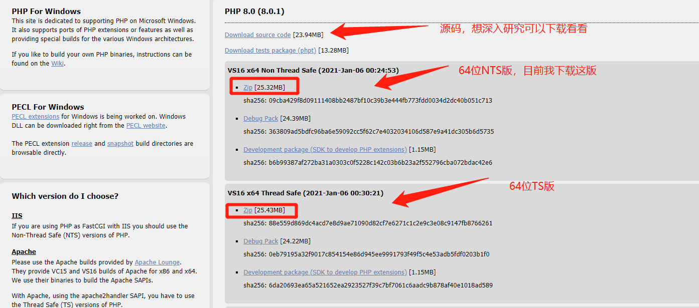

将下载的压缩包解压到PHPStudy的软件的目录Extensions\php下，然后解压命名，我命名为php8.0.1nts。压缩文件解压后会发现并没有 php.ini 文件，取而代之的是以下两个文件：
php.ini-production和php.ini-development，将 php.ini-development 重命名为 php.ini 并打开。

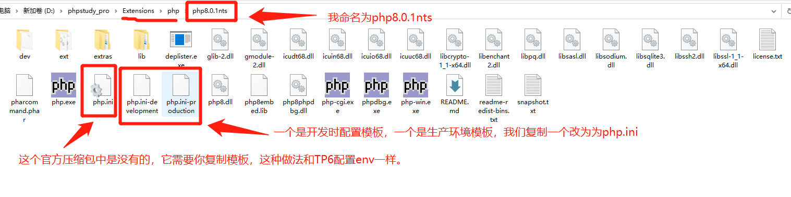

在php.ini中配置PHP8 扩展所在目录，搜索 **extension_dir** 关键字，然后将路径改指向为php8.0.1nts/ext目录的绝对路径，路径分隔符，正斜杠或反斜杠都支持，不过还是建议是正斜杠。

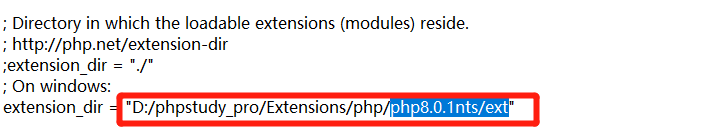

在系统中配置系统环境变量，就是将php8.0.1nts目录加入系统环境变量Path中

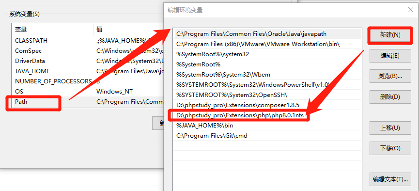

现在可以在命令提示符中输入php -v查看版本了

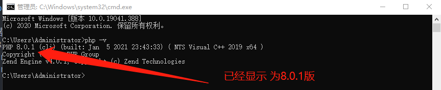

### 2、PHP扩展的配置(ThinkPHP6和Laravel8通过)

一般教程到上面就结束了，可以是我接着composer下载ThinkPHP6和Laravel8却报各种错误。下面是其中的一个错误截图

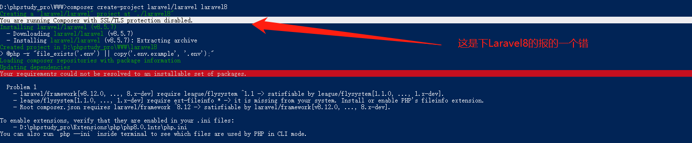

目前百度查了下，找到了PHP中文网上藏色散人转发LearnKu网翻译Laravel8官方网的教程，链接地址是<https://www.php.cn/phpkj/laravel/466988.html>，我满心欢喜跟着一番猛如虎的操作，可却是一堆红色报错，我想转发人也没亲身实践，也没真正搞明白如何让PHP8支持Laravel8和ThinkPHP6。不过我从报错信息中看到最多的关键词就是extension，即是扩展，框架需要扩展，而PHP默认是屏蔽的，需要我们手动修改php.ini，开启扩展。在命令提示符查看扩展命名是php -m，你可以通过它看php是否开启错误中扩展。

ThinkPHP6需要开启 **openssl和mbstring** 2个扩展，而Laravel则要开启 **openssl、mbstring和fileinfo** 3个扩展。开启方法就是除掉php.ini中扩展前面分号就可以，同时记得要重启Apache才生效。

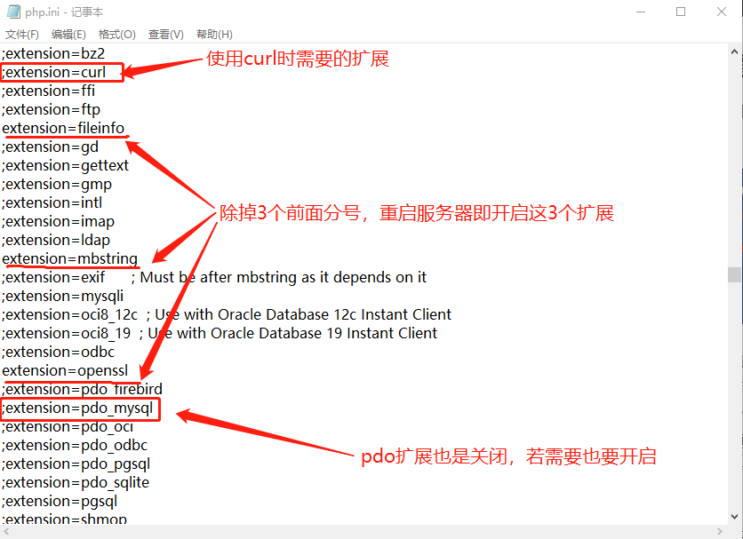

还要提醒大家一下，若上面扩展未开启，是无法通过composer下载ThinkPHP6或Laravel8的，一开始我还以为是源的事，切换为阿里云镜像也没用，所以想让ThinkPHP6或Laravel8运行在PHP8之上，上面3个扩展是必须要开启的。最后可通过命令行php -v或phpinfo()查看是否开启。

现在大家可以happy的在PHP8上学习ThinkPHP6或Laravel8了，至于修改composer.json中php版本为8.0,你可以看我发的PHP中文网转发的教程，然后composer update就可以了，经测试再也不报错了。

## 三、Laravel 8的入门

### 1、Laravel的安装和资源

本来是按教程安装Laravel7的，但是看官方都已经更新到了8.5.7了，而且说实在话，通过老师介绍Lavarel比较任性的就是模型目录的处理，我是从ThinkPHP6过来的，还是喜欢目录分明的框架，在Laravel8中作者也说了，为适应大部分人要求，也随这个潮流了，将模型归为Models目录中了。

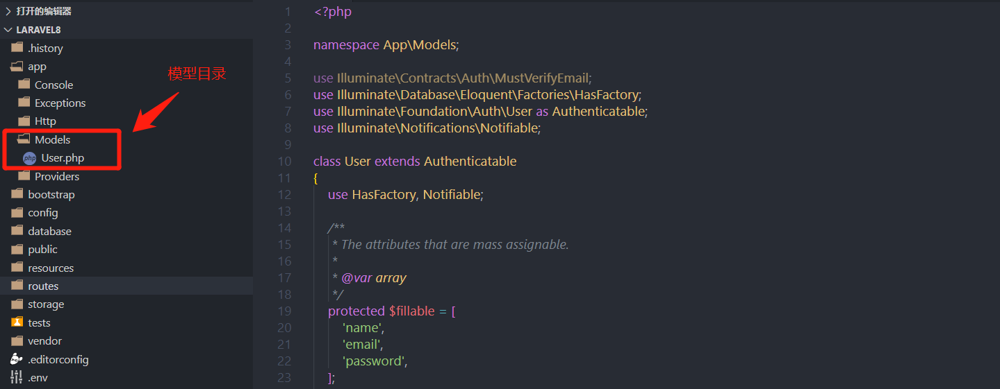

Laravel 8安装使用composer即可:`composer create-project laravel/laravel laravel8`

Laravel 8的翻译文档也是老师视频中那个网站的<https://learnku.com/docs/laravel/8.x>

### 2、简单路由和重定向

Laravel8和Laravel7一样，必须配置路由才可正常访问，这点要和ThinkPHP6区分开，中国特色的软件都会考虑到中国人的懒，默认提供了一些配置，让你开箱即用，而国外程序员都是比较严谨的，追求功能。网页访问是配置routes/web.php，API是routes/api.php，我们先体验一番，在web.php中我添加了下面欢迎的访问。

```php
Route::get('/hello',function(){
    echo 'Laravel 8 Hello World!';
});
```

在上面访问的url中我们必须加上index.php才可正常访问，否则给你报`no input file specified`错误，于是我到ThinkPHP6手册中查找url重定向，复制过来放到public目录的.htaccess文件中，结果还是报错，不得不吐槽下，ThinkPHP官方手册中Apache的重定向中index.php后面少了一个?号，目前正常的是

```
<IfModule mod_rewrite.c>
  Options +FollowSymlinks -Multiviews
  RewriteEngine On

  RewriteCond %{REQUEST_FILENAME} !-d
  RewriteCond %{REQUEST_FILENAME} !-f
  RewriteRule ^(.*)$ index.php?/$1 [QSA,PT,L]
</IfModule>
```

### 3、Laravel8的路由写法

为什么单独说下Laravel的路由写法呢，开始之前，老师已经提醒了Laravel7和Laravel8的写法不同，Laravel7是`Route::get('index','Article@list');`,而Laravel8是`Route::get('list', [Article::class, 'list']);`，当我满怀信心时，Laravel却是给我报了一个大大的错。

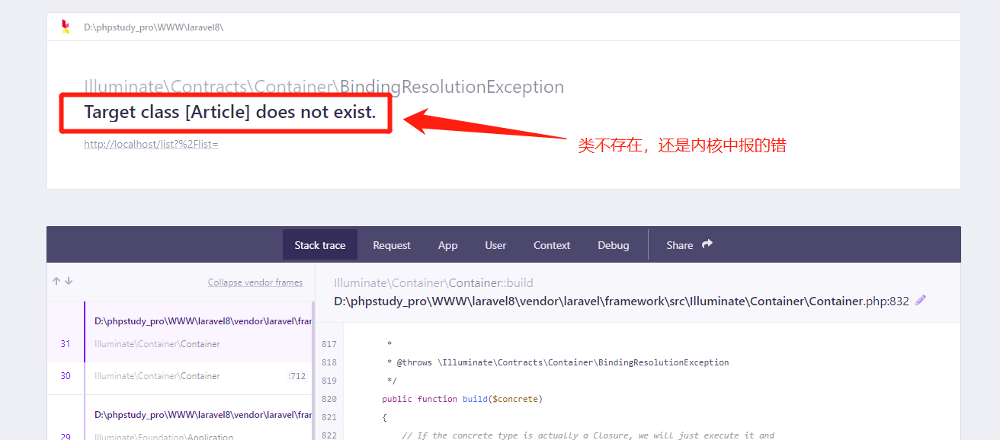


我又查看了的确定义了类文件，也按psr-4规范，为什么给我报这个错呢，百度了下，原来Laravel8的路由routes/web.php还要手动引入类，才可调用路由，因为路由中`Article::class`是PHP标准获取类的全路径(包括命名空间)，而Laravel8的web.php默认只有`use Illuminate\Support\Facades\Route;`,于是定义一个控制类就要引入一次再写路由，或都是使用`Route::get('list', [App\Http\Controllers\Article::class, 'list']);`,这不是倒退了吗？

又查了，网上有文章说在app\Providers目前下RouteServiceProvider.php有一个开关，打开就不用这样一个一个引入类了，可惜还是不行，它的作用我后面再说，我们还是先解决不用引用类就可直接定义路由的问题，我再看routes/web.php源码，发现它竟然没定义命名空间，它是全局空间，学习过PHP都知道，这种情况下要引用其它命名空间下的类就要手动引入了，难道它没使用 composer的autoload自动加载，查源码也加载了，到现在也没找出原因，不过我找到解决方法了，就是加上命名空间`namespace App\Http\Controllers;`

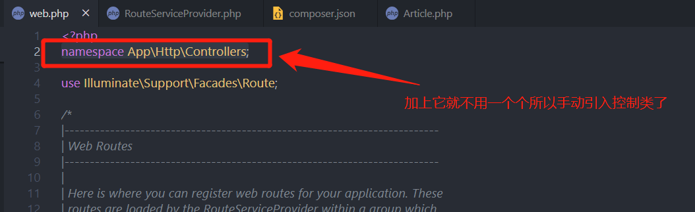

再回头说说RouteServiceProvider.php开关，就是`protected $namespace = 'App\\Http\\Controllers';`，默认是注释掉的，它真正的作用是将路由写法恢复到Laravel7的写法规则，而且不用在routes/web.php加命名空间解决一个个手动引入控制类的问题了，要记住，它不能解决Laravel8路由写法的问题，它是将路由写法恢复到Laravel7的路由规范，就是说去掉这个注释，路由写法按Laravel7没什么问题，如果你想使用Laravel8的写法可以参考我上面解决的方案。

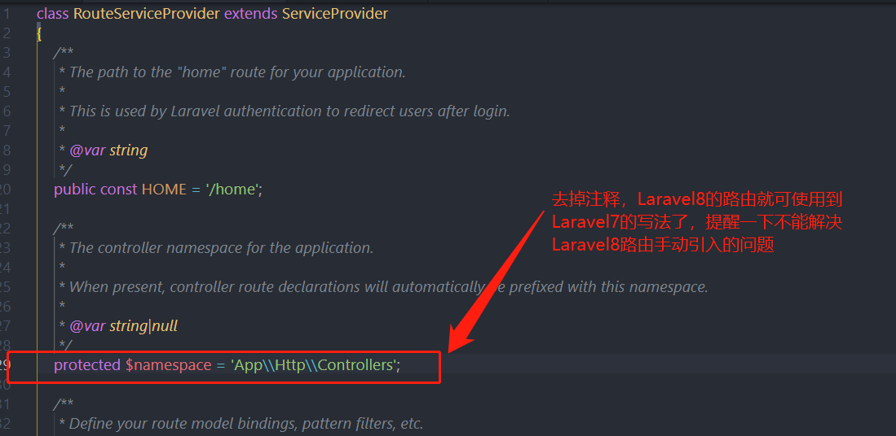

不得不说Laravel8有些默认真是无法理解，建议打开上面RouteServiceProvider.php的开关，此进路由写法同时支持Laravel7和Laravel8两种规范，Laravel7路由不需要引入类，而Laravel8还是要引入类，统一引入可参考我上面的做法，目前测试没问题。

最后说下，在解决问题过程中网上查了好多文章，都解释这个开关，但没提出解决Laravel8路由手动引入类的问题，我这篇算是比较全面了。