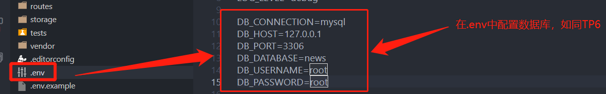
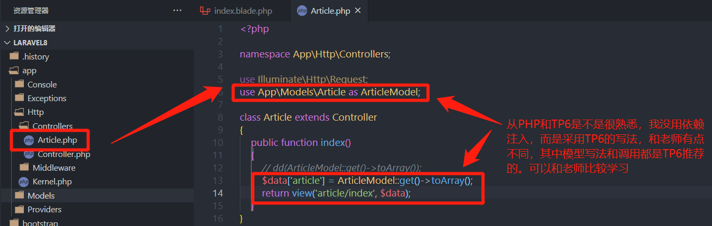
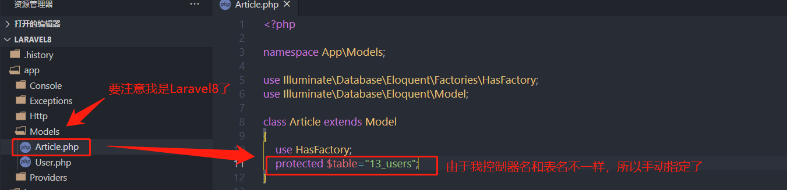
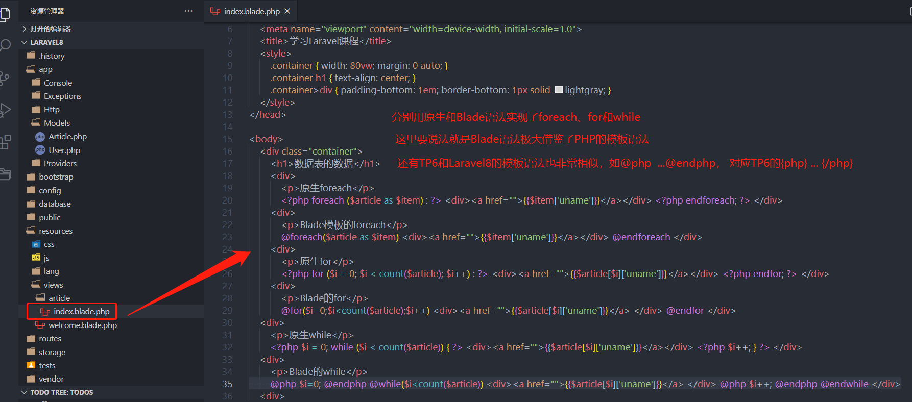
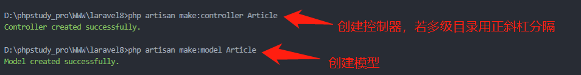

[toc]

## 一、ThinkPHP6与Laravel8

上一篇我已经介绍过了PHP8的安装配置以及为 composer下TP6和Laravel8要进行扩展配置，不了解可以看下<https://www.php.cn/blog/detail/25944.html>，我现在已经在PHP8运行TP6和Laravel8了，享受前沿的技术就是手握利器感觉和世界接轨了，没有过时的顾虑。培训班学习了ThinkPHP和Laravel两个框架的，经常有人问哪个框架更优秀？

我是从PHP走过来的，通过我学习和使用这两个框架，个人认为强大灵活和开箱即用是相互矛盾的，虽然我是先学ThinkPHP，后才接触Laravel，但不可否认ThinkPHP随处可见学习Laravel的影子，从命令行形式、中间件、....再到MVC的组织理念都非常相似，不过说实在话ThinkPHP更考虑开箱即用，无论是目录结构还是调用思想都非常接近一般人的思维，所以学习起来更简单，用起来也更快，而Laravel是外国人作品，更觉得是从程序员角度出发，强调强大灵活，在composer拉安装包时就会发现安装的vendor都是TP好几倍，体积更是10倍多，相比TP更接近原生PHP，没有严谨的编程习惯可能经常焦头烂额。不过TP对Laravel也进行改进和优化，下面谈下我初步认识。

### 1、单应用与多应用

TP6默认的和Laravel8更像单应用，就是一个项目只有一个Controller、View和Model目录，所以的控制器、视图和模型都放在它下面，如果项目比较大，面临成百上千的文件，任何人都焦头烂额，后来解决方案是在这3个目录下可以建文件来区分，这样就实现多应用目的了。而TP6却提出了多应用的概念，实际和上面问题效果是一样的，不过个人感觉更好理解，不同需求作为一个应用存在，如前端、后端、API服务等等，在这些应用目录下再分别建Controller、View、Model、config等，相当于多个服务器运行，这种处理更有利于文件的组成归类和查找。虽然说TP从Laravel而来，但反过来也会影响Laravel，现在Laravel8中作者是自嘲为了适应大部分人的建议，也建立了Model目录了。

### 2、目录结构

TP6目录分为全局和各应用级别的,加载时各应用会覆盖全局的,若没有则用全局的,降低了配置难度,也增加了配置灵活性。TP6的全局设置非常类似于Laravel8的配置,单应用思维决定了它的目录结构只能这样了,而且我从TP6转过来开始学Laravel8时,实在无法理解,它的视图竟然另一个目录下,完全和MC分开了,说好的MVC,为什么这么处理,大牛就是任性啊,不过它强大就在可以自定义,通过修改配置它也可以和MC在同一个目录下。

### 3、路由和命令行

刚开始转来学习Laravel8时，实在被 **正斜杠和@** 搞糊涂了，TP6路由中的控制器与方法分隔符用正斜杠，命令行中应用与控制器用@分隔，而Laravel8中控制器与方法分隔符用@(备注下,路由中@是Laravel7写法,Laravel8默认写法是另一种形式,不过官方提供了一个开关,Laravel8可支持7或8两种路由写法,个人更建议7的写法,8的写法需要再配置一些,具体可看我的<https://www.php.cn/blog/detail/25944.html>)，命令行中多级目录控制器用正斜杠分隔。再惊喜告诉你，TP6无论是单应用或多应用时多级目录的控制器也是用正斜杠分隔的，不过多应用时用正斜杠它会默认添加到单应用Controller目录下,即使你删除了,它也会再帮你建立的。

尽管我上面列举了我的感受，但由于学习时间比较短,可能还有没说到的地方，不过我要表达的意思，学PHP的框架最基础是PHP，正如老师在课上经常说的，它来自于PHP，一定遵循PHP规范，就学习任何PHP框架的捷径。回头再说ThinkPHP和Laravel，先学习哪一个都有助于你理解另一个，同样我看的招聘要求熟悉Yii框架或CI优先，我专门去看了下，它们两个框架学起来也不难。精通PHP是重点，熟悉一两个框架就可以，不要局限于框架了，否则你永远提高不了。

## 二、Larvael的MVC和命令行artisan

### 1、MVC协同工作的实现

从TP6过来人都知道正常思路应该是先创建控制器类、模型类和视图文件，模型类绑定数据库中某个表，控制器类处理用户请求，并通过模型类操作数据库，然后将结果返回给视图渲染出来，很高兴告诉你，TP6到Laravel8的实现基本都一样，函数名也是如此，仅限于TP6，TP5还是可以放弃了。下面就是我在Laravel8中一个简单的完整演示，提醒大家一下，若是要访问数据库，还要修改php.ini，启用pdo_mysql的扩展，否则会报错提醒没驱动的。






控制器和模型代码非常简单就不贴出来了，这里重点贴下Blade语法的视图，尤其是while的实现。具体在后面再一起介绍。

```php
<div class="container">
    <h1>数据表的数据</h1>
    <div>
        <p>原生foreach</p>
        <?php foreach ($article as $item) : ?> <div><a href="">{{$item['uname']}}</a></div> <?php endforeach; ?> </div>
    <div>
        <p>Blade模板的foreach</p>
        @foreach($article as $item) <div><a href="">{{$item['uname']}}</a></div> @endforeach </div>
    <div>
        <p>原生for</p>
        <?php for ($i = 0; $i < count($article); $i++) : ?> <div><a href="">{{$article[$i]['uname']}}</a></div> <?php endfor; ?> </div>
    <div>
        <p>Blade的for</p>
        @for($i=0;$i<count($article);$i++) <div><a href="">{{$article[$i]['uname']}}</a> </div> @endfor </div>
<div>
    <p>原生while</p>
    <?php $i = 0; while ($i < count($article)) { ?> <div><a href="">{{$article[$i]['uname']}}</a></div> <?php $i++; } ?> </div>
<div>
    <p>Blade的while</p>
    @php $i=0; @endphp @while($i<count($article)) <div><a href="">{{$article[$i]['uname']}}</a> </div> @php $i++; @endphp @endwhile </div>
<div>
```

### 2、命令行artisan快速创建

我们知道TP6中think命令可以快速创建，作为TP6的师傅Laravel8也有命令方式吗？当然有，它可是程序员的PHP框架，怎么会没有命令行撑面子呢，它就是artisan，翻译是工匠，这也说明了Laravel的定位，而且think有的命令基本都能在artisan找到，除了build等多应用相关的，因为Laravel是单应用，如make:controller、make:model都可以找到。下面是我上面案例中用到的创建控制器类和模板类的命令。



再说点artisan其它用用法，只是引子，以后用到再随时说。老师在介绍artisan时只是介绍了它几个命令，而没介绍从哪来，我们继续发挥TP6的作用，就如`php think`可以查看所有命令一样，你可以`php artisan`查看版本和命令，使用`php artisan help`来查看某个命令的帮助。

还记得老师说composer拉Laravel时都会提示APP_KEY吗？它是保存在.env配置文件中，若是没值或不小心删掉了怎么办呢？难道再下一次，其它只要下面一 个命令就搞定

```shell
php artisan key:generate
```

再提一个有趣功能，就是`php artisan down`和`php artisan up`，前者是开启维护模式，一旦开启再访问，就会报 503 Service Unavailable，后者是关闭维护模式，网站正常访问。

好了，基本都已经说了，自己可查看命令本身帮助学习了，其它若遇到有趣的我再说。

## 三、Blade模板引擎

上面关于视图中Blade模板语法因为比较复杂，就集中在一起介绍下。先看下官方的介绍

> Blade 是 Laravel 提供的一个简单而又强大的模板引擎。和其他流行的 PHP 模板引擎不同，Blade 并不限制你在视图中使用原生 PHP 代码。所有 Blade 视图文件都将被编译成原生的 PHP 代码并缓存起来，除非它被修改，否则不会重新编译，这就意味着 Blade 基本上不会给你的应用增加任何负担。Blade 视图文件使用.blade.php 作为文件扩展名，被存放在 resources/views 目录。

其中有两点比较有新意：一是通过文件名来决定是否采用Blade模板引擎，不用则是普通的php文件，真是灵活啊，但同时我们知道TP6可以换模板引擎，如Smarty，那么Laravel也可以吗，百度了还真可以，不过没测试，感觉可以测试下<https://github.com/ytake/Laravel.Smarty>。另一个就是缓存文件，在TP6时我一般用它来排错的，现在却发现它在Lavarel还有这种作用，如果原文件不改变，直接改变缓存就影响视图，老师的一番操作亮瞎我的眼了，有机会测试TP6，估计也可以，毕竟是一脉的。

下面就不费话了，直接介绍目前学习的语法

### 1、显示数据

在TP6中自带模板默认是{}大括号来显示数据，而Laravel的Blade模板是双大括号{{}}，也是目前vuejs和小程序最常用的"Mustache"模板语法，在模板解析时，会自动转化为php语句，并使用htmlspecialchars函数自动转义以防范 XSS 攻击，也就是缓存文件中e函数，在TP6是直接使用htmlspecialchars函数。如下面显示数据

```php
Hello, {{ $name }}.
The current UNIX timestamp is {{ time() }}.
```

这里要说下，它和TP6模板语法一样，也支持函数，即表达式都可以（其实vuejs和小程序也一样）。

> **显示非转义字符:** 默认情况下， Blade {{ }} 语句将被 PHP 的 htmlspecialchars 函数自动转义以防范 XSS 攻击。如果您不想您的数据被转义，那么您可使用如下的语法，这里要TP6区分开了，TP6是用`| raw`来原样输出

```php
Hello, {!! $name !!}.
```

> **显示Javascript变量和函数:** 我们知道前端离不开js，无论原生javascript，还是现在流行的vuejs和reactjs都要使用变量，而它们不需要转义，此时要加@来指明。

```php
<div>
Hello, @{name}.
</div>
<script>
let app = @json($array);
</script>
```

上面就是与数据相关最重要三点了，要理解掌握，并可和TP6对比学习。

### 2、条件和循环流程控制

通过对Blade的条件和循环控制的标签学习，发现它和PHP的模板语法非常相似，不知道PHP模板语法的可以看下我的<https://www.php.cn/blog/detail/24907.html>,如@if...@endif，@foreach....@endforeach,@for....@endfor等等，我就不一一举例了，可以看官方文档，这里说我在再次使用PHP模板语法所犯的错误，也许是受Blade的影响，竟然忘记  **PHP模板语法第一个后面要冒号，最后一个有分号** 还是知道的，我上面示例代码原生PHP用的就是PHP模板语法，这里就不再贴代码了，可以看下上面就理解了原生PHP和Blade的写法了。

这里要提下while，准备照葫芦画瓢呢，突然发现原生中还有一个变量，而while中无法实现，看来老师是故意留这个坑来让我们学习，还好我想到TP6，它也有条件循环，也有PHP原生语句`{php}{/php}`，那么Blade是否有`@php...@endphp`,别说，还真有，后来就简单了，就是正常写PHP了。这里就是说下感触，TP6是借鉴Laravel而来，如果Laravel有不了解的，可以试着TP6角度来解决，这样两个框架你都会融会贯通了，是不是传说中事半功倍呢。

## 四、感受

学习javascript是从原生开始，再学习jQuery，最后学Vuejs，在相互验证中学习感受收获很多，现在学习PHP框架一样，也要从原生PHP开始，再从TP6到Laravel8，感觉好多问题你都可以解决，并相互验证提高，这是我学习的经验，希望能给你有所帮助。

最后再推荐一个vscode中支持Blade的扩展Laravel Blade Snippets，不仅支持各种标签，也支持格式化呢，这个模板不要使用prettier插件格化式，不过要使用格式化还进行配置，插件教程中已经说明了，直接复制效果却不行，最后还是错误提示帮助我的，就是prettier接管了所有文件的格式化，要注释才可以，我的共有两个地方，你们可以相应修改。

```
//vscode的settion.json文件
//注释掉地方一：
// "editor.defaultFormatter": "esbenp.prettier-vscode",
//修改地方二:增加php，即不格式化vue和php文件
"prettier.disableLanguages": ["vue","php"], 
//后面就是按插件教程中 
  /* Blade插件 */
  "[blade]": {
    "editor.autoClosingBrackets": "always"
  },
  "emmet.triggerExpansionOnTab": true, // enable tab to expanse emmet tags
  "blade.format.enable": true // if you would like to enable blade format
```

最后再吐槽下sublime，老师在编写过程中报错，而vscode却很小，至少老师视频中报的错误，vscode就没有，你还在用sublime吗，还是放弃吧，它更新已经很慢了，没有什么生态圈了。