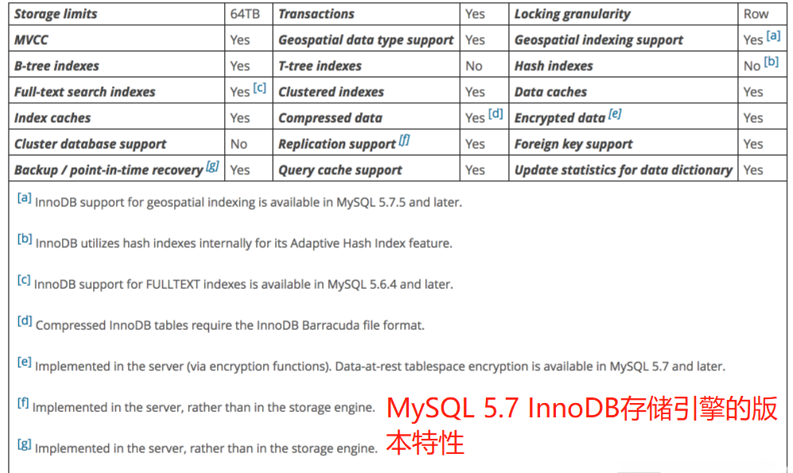
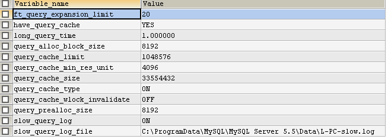
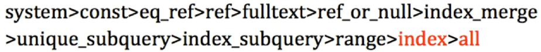
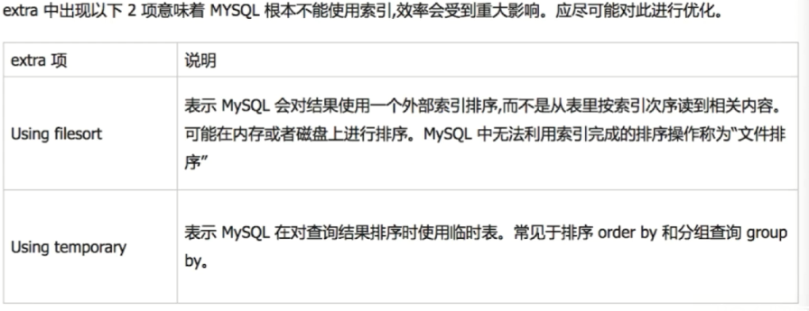
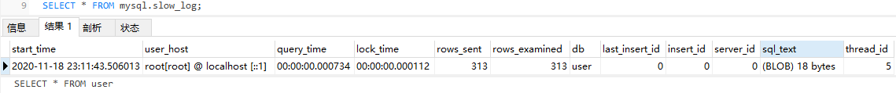
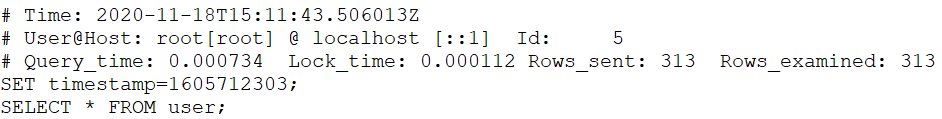

[toc]

## 一、前言

PHP的PDO对数据库，尤其是MySQL提供了全面的CURD、预处理和事务的支持，框架无论是Laravel或ThinkPHP都是基于它封装成类，便于用户操作数据库。关于PHP的数据库操作我以前归纳为两个重点：SQL语句和PDO操作，不清楚可以看下我的博文《SQL操作数据库和PDO操作数据库》<https://www.php.cn/blog/detail/25012.html>，不过这两天西门老师在上Laravel操作数据库课时，我听到最多词语是“扫表”、“慢查询”、“数据库优化”，其实在前面课程时，和灭绝老师交流时也同样考过我同样的问题，就是发现数据库慢查询时如果定位和解决，当时我只是引用百度上某文中解析了，没怎么太在意，目前实际开发项目数据库也比较小，也没遇到什么慢查询，而这两天课，西门老师讲范围查询(大于或小于)，聚合count等时提到扫表慢查询以及数据库优化建议，我专门查询学习了相关内容，才知道数据库优化的重要性，数据库体量比较小还好说，一旦体量上到了百万再不优化，那数据库操作再遇到高并发时将是非常糟糕的，而且不同于SQL语句和PDO操作是有固定语法的，数据库优化涉及范围广，也没有固定的标准，只有根据情况来选择存储引擎、索引、SQL语句等，不过还是有些基础的建议，我们可以参考。

## 二、Laravel8的数据库DB类实现CURD操作

关于Laravel8的DB类操作数据库都是参考官方文档，建议大家多看，毕竟它是最权威的，其次就是源码，我通过阅读Laravel8的DB类的源码，更加深刻理解DB实现的原理，也更清楚如何调用它们。官方要求数据库及最低版本：MySQL 5.6、PostgreSQL 9.4、SQLite 3.8.8、SQL Server 2017，这里只介绍MySQL，其它可看官方文档，没有什么难度，访问都已经统一封装了，差异已经由Laravel和PDO解决了，还有我测试环境是Apache2.4.43+MySQL8.0.12+PHP8.1.0+Laravel8.5.7.

### 1、原生SQL语句

Laravel8的DB门面类为CURD操作提供了相应的方法：`select，update，insert，delete 和 statement`等，它定义源码文件是`vendor\laravel\framework\src\Illuminate\Database\Connection.php`,它支持SQL语句和PDO的预处理，建议使用PDO的预处理，可防止SQL 注入和提高速度，这点同PDO的优势。

下面就是演示了查询select、插入insert、更新update和删除delete四个基本操作，其中select演示了SQL语句和预处理两种，后三者全部是预处理，预处理语句中占位符可以是 **问号？或命名绑定如:id** ，第二个参数就是绑定的值，**必须是数组** ，即使一个值也要是数组形式，详细可看下面代码或PHP官方文档中PDO预处理的介绍。

```php
// 引入Laravel8内置的DB门面类
use Illuminate\Support\Facades\DB;
   // 查询Read
    private function select()
    {
        // SELECT * FROM cd_course_point where pid=11;
        // 原生SQL
        // return DB::select('select * from cd_course_point where pid=11');
        // 原生SQL支持预处理
        return DB::select('select * from cd_course_point where pid=?', [11]);        
    }
    // 插入Create
    private function insert()
    {
        // INSERT INTO cd_course_point (point_name,pid,subject_id,sortid,status) VALUES ('测试',6,3,513,1);
        // 原生SQL支持预处理
        return DB::insert('INSERT INTO cd_course_point (point_name,pid,subject_id,sortid,status) VALUES (?,?,?,?,?)', ['测试', 6, 3, 513, 1]);
    }
    // 更新update
    private function update()
    {
        // 更新与删除一定要加条件，否则将导航无法挽回的损失
        // 更新时若改变值是相同，则不会更新，返回影响记录条数也为0
        //UPDATE cd_course_point SET point_name='测试更新' WHERE point_id=516;
        // 原生SQL支持预处理
        return DB::update('UPDATE cd_course_point SET point_name=? WHERE point_id=?', ['测试更新', 516]);
    }
    // 更新delete
    private function delete()
    {
        // 更新与删除一定要加条件，否则将导航无法挽回的损失
        //DELETE FROM cd_course_point WHERE point_id=516;
        // 原生SQL支持预处理
         return DB::delete('DELETE FROM cd_course_point WHERE point_id=?', [516]);
    }
```

Laravel8的DB也提供了statement执行普通语句和unprepared执行非预处理语句，它们都存在SQL注入的危险，使用时要控制使用者范围。代码如下 ：

```php
//删除整个表
DB::statement('drop table users');
DB::unprepared('update users set votes = 100 where name = "Dries"');
```

### 2、查询构造器之基本CURD

Laravel 的数据库查询构造器为创建和运行数据库查询提供了一个方便的接口。它可以用于支持大部分数据库操作，并且在所有支持的数据库系统上统一运行。Laravel 的查询构造器使用 PDO 参数绑定的形式，保护您的应用程序免受 SQL 注入攻击。因此不必清理因参数绑定而传入的字符串。 它定义在`vendor\laravel\framework\src\Illuminate\Database\Query\Builder.php`。

查询构造器是从DB门面类的 table('表名')方法来开始查询。table 方法为给定的表返回一个查询构造器实例，允许你在查询上链式调用更多的约束，最后调用first()返回第一条记录、get()返回所有记录(Collection)、value('列名')返回第一条记录某列的值和plunk('列名‘)返回所有记录某列的值(Collection)，至于Collectioin可通过toArray()获取数组。(在TP中table是直接指定表名，而name则是加上前缀的表名，Laravel8中DB的table方法等同于TP中name方法，Laravel8的前缀配置在config/database.php中prefix，自己可以进行测试)

查询时一般建议需要什么那列数据就返回那列数据，不要使用`*`返回所有列，返回某条记录的指定列时可在first或get方法中指定，形式是数组，每列是字符串，可指定别名，如`get(['point_id as id','point_name as name'])`，也可使用select方法指定列，如`DB::table('cd_course_point')->where('pid',11)->select('point_id as id','point_name as name')->get()->toArray()`，不过从源码来角度分析，更推荐前者，主义更简单直接。

```php
// 引入Laravel8内置的DB门面类
use Illuminate\Support\Facades\DB;
 // 查询构造器
 // 查询Read
    private function select()
    {
        // SELECT * FROM cd_course_point where pid=11;              
        // return DB::table('cd_course_point')->where('pid',11)->first();//第一条记录
        // return DB::table('cd_course_point')->where('pid',11)->get()->toArray(); //所有记录     
        // return DB::table('cd_course_point')->where('pid',11)->value('point_name');//第一条记录某列的值
        // return DB::table('cd_course_point')->where('pid', 11)->pluck('point_name')->toArray(); //所有记录某列的值
        //查询构造器指定列时可通过get或select获取
        return DB::table('cd_course_point')->where('pid',11)->get(['point_id as id','point_name as name'])->toArray();
        // return DB::table('cd_course_point')->where('pid',11)->select('point_id as id','point_name as name')->get()->toArray();
    }
    // 插入Create
    private function insert()
    {
        // INSERT INTO cd_course_point (point_name,pid,subject_id,sortid,status) VALUES ('测试',6,3,513,1);
        $data['point_name'] = '测试而已';
        $data['pid'] = 6;
        $data['subject_id'] = 3;
        $data['sortid'] = '518';
        $data['status'] = 1;
        //    return DB::table('cd_course_point')->insert($data);//若插入多条记录
        return DB::table('cd_course_point')->insertGetId($data); //可返回插入的主键id，若是多条记录则报错
    }
    // 更新update
    private function update()
    {
        // 更新与删除一定要加条件，否则将导航无法挽回的损失
        // 更新时若改变值是相同，则不会更新，返回影响记录条数也为0
        //UPDATE cd_course_point SET point_name='测试更新' WHERE point_id=516;
        return DB::table('cd_course_point')->where('point_id', 518)->update(['point_name' => '测试构造器更新']);
    }
    // 更新delete
    private function delete()
    {
        // 更新与删除一定要加条件，否则将导航无法挽回的损失
        //DELETE FROM cd_course_point WHERE point_id=516;
        return DB::table('cd_course_point')->where('point_id', 516)->delete();
        // 若是delete清除表所有数据，MyISAM是清除表再新建表，而InnoDB则是一条条记录删除
        // return DB::table('cd_course_point')->truncate();//清空整个表并重置所有的自增 ID 为 0
    }
```

> **重要提醒:**
> 1.insertGetId返回插入的数据库主键ID，只限于插入一条记录，若是多条记录则报错，而insert支持一条记录或多条记录插入。
> 2.update或delete操作必须要有条件，否则在其实项目中可能导致无法挽回的损失，一定要牢记
> 3.若是清空整个表建议是使用truncate，尤其是InnoDB存储引擎时，若是使用delete将是扫表删除，而MyISAM若是delete则是先删除表再新建表，比较块。

### 3、查询构造器之聚合

在查询中我们经常需要统计、求最大、最小、平均和和，Laravel8的DB也为我们提供了相应的方法，比如`count，max，min，avg，还有 sum`。你可以在构造查询后调用任何方法，使用比较简单，如下面代码

 ```php
   private function count(){
        // select count(*) from cd_course_point where pid=11
        return DB::table('cd_course_point')->where('pid',11)->count();
    }    
 ```

 还有官方文档中提供的:

  ```php
  $price = DB::table('orders')->max('price');
  $price = DB::table('orders') ->where('finalized', 1) ->avg('price');
  ```

  > **建议:** 在数据库查询时，能用聚合就用聚合，它可减少数据库与服务端交换的数据量，数据库访问优化策略之一。对于需要聚合查询的表，存储引擎则建议是MyISAM，至于为什么在后面优化建议中有介绍。

  在判断记录是否存在时我们常用count方法来统计，其实Laravel8的DB已经提供了更高效的方法exists或doesntExist。

  ```php
  return DB::table('orders')->where('finalized', 1)->exists();
return DB::table('orders')->where('finalized', 1)->doesntExist();
  ```

### 5、查询构造器之扩展where

所谓扩展where就是将常用的where操作，如or、between、in、NUll、子查询或列查询都提供了封装方法，如orWhere、whereIn、whereBetween等等，更详细可参考官方文档。

```php
   // 小于+大于与between
        return DB::table('cd_course_point')->where('point_id','>',100)->where('point_id','<',150)->count();
        return DB::table('cd_course_point')->whereBetween('point_id',[100,150])->count();
       //or与in
       return DB::table('cd_course_point')->orWhere('point_id',23)->orWhere('point_id',45)->get()->toArray();
       return DB::table('cd_course_point')->whereIn('point_id',[23,45,56])->get()->toArray();
```

### 4、查询构造器之where认识

老师在演示where方法时只演示了等值、大于或小于等判断，而在我学习数据库时我想演示like模糊匹配、find_in_set精确匹配等操作，并未找到对应扩展的where，难度它不支持这些操作，必须要用原生SQL语句，当然原生SQL语句是可以实现的。在官方文档中我看到`where('name', 'like', 'T%')`，那么它到底哪些操作符呢？官方文档并未给出答案，带着疑问，我查询了`vendor\laravel\framework\src\Illuminate\Database\Query\Builder.php`中源码，它的内容是：

```php
  public $operators = [
        '=', '<', '>', '<=', '>=', '<>', '!=', '<=>',
        'like', 'like binary', 'not like', 'ilike',
        '&', '|', '^', '<<', '>>',
        'rlike', 'not rlike', 'regexp', 'not regexp',
        '~', '~*', '!~', '!~*', 'similar to',
        'not similar to', 'not ilike', '~~*', '!~~*',
    ];
```

从中我们发现了like模糊查询，还有regexp正则，现在算是比较理解where的操作符了，现在是不是发现阅读源码是不是学习的一种好方法。

### 6、查询构造器之where原生方法

我在项目中经常使用find_in_set，在扩展where中没见到，本以为在上面where中可能见到，发现也没有，最后在网上查询了，才知道它根本没实现find_in_set方法的封装，只能能过原生语句或原生方法来实现，原生语句前面已经讲过了，这时重要提下原生方法，即方法名中带有raw关键词的方法，它等同于前面的SQL语句，不过突出 **条件部分** 。如find_in_set的实现语句是

```php
return DB::table('cd_course_point')->where('point_name','like','%字母%')->get()->toArray();        
return DB::table('cd_course_point')->whereRaw('find_in_set(?,point_name)',['字母'])->get()->toArray();
```

### 7、查询构造器之join联表

Laravel的DB提供了常规的join(内边)，leftJoin(左连)，rightJoin(右连)和crossJoin(交叉连接)四个基本的联表，操作也不难理解，具体可参考TP中语法

 ```php
$users = DB::table('users')
    ->join('contacts', 'users.id', '=', 'contacts.user_id')
    ->join('orders', 'users.id', '=', 'orders.user_id')
    ->select('users.*', 'contacts.phone', 'orders.price')
    ->get();
$users = DB::table('users') ->leftJoin('posts', 'users.id', '=', 'posts.user_id') ->get();
$users = DB::table('users') ->rightJoin('posts', 'users.id', '=', 'posts.user_id') ->get();
$sizes = DB::table('sizes') ->crossJoin('colors') ->get();
```

高级 Join 语句,你可以指定更高级的 join 语句。比如传递一个闭包作为 join 方法的第二个参数。此闭包接收一个 JoinClause 对象，从而指定 join 语句中指定的约束

```php
DB::table('users')
        ->join('contacts', function ($join) {
            $join->on('users.id', '=', 'contacts.user_id')
                 ->where('contacts.user_id', '>', 5);
        })->get();
```

上面是比较详细介绍了Laravel的数据库操作知识，在老师基础上加上我对官方文档和源码的理解，分为七个部分内容，不是很全面，如where中条件使用闭包函数，可实现更复杂的条件，可参考官方文档或TP6中闭包函数使用，但涉及操作中几个方面，基本就是我们日常需要的了。

## 三、数据库的访问优化建议

说实在话，只是老师授课时强调了，在百度上查询学习了下，对于数据库算是基本的优化建议了。

### 1、SQL语句的选择

> **能用聚合时就用聚合，需要什么字段就获取什么字段**

减少数据库与服务端之间的交换数据量，减少服务端某请求占用数据库连接的时间，从而提高请求的响应速度，提高数据库连接的效率。

> **减少范围大于、小于、or、in或like等慢查询(全表扫描)，多使用等值、between和find_in_set查询代替**

慢查询是数据库访问优化最大的敌人，扫表是最典型的慢查询表现，一般现在云服务端扫描到慢查询都会及时提醒，当然也可自行开启MySQL内置的慢日志功能，开启方法在后面有介绍。

> **减少使用join进行跨数据库或服务器的查询，本数据库join查表不要超过3个**

上面是阿里程序员建议表中一条，因为join联表查询是比较复杂的，优化不仅要降低慢查询次数，也要尽量降低复杂度，提高查询效率。

### 2、存储引擎的选择

MySQL存储引擎主流有两个:MyISAM和InnoDB，MySQL 5.1之前的版本中，默认的搜索引擎是MyISAM，从MySQL 5.5之后的版本中，默认的搜索引擎变更为InnoDB。

MyISAM存储引擎的特点是：表级锁、不支持事务和全文索引，适合一些CMS内容管理系统作为后台数据库使用，但是使用大并发、重负荷生产系统上，表锁结构的特性就显得力不从心；


InnoDB存储引擎的特点是：行级锁、事务安全（ACID兼容）、支持外键、不支持FULLTEXT类型的索引(5.6.4以后版本开始支持FULLTEXT类型的索引)。InnoDB存储引擎提供了具有提交、回滚和崩溃恢复能力的事务安全存储引擎。InnoDB是为处理巨大量时拥有最大性能而设计的。它的CPU效率可能是任何其他基于磁盘的关系数据库引擎所不能匹敌的。



> **注意:** InnoDB表的行锁也不是绝对的，假如在执行一个SQL语句时MySQL不能确定要扫描的范围，InnoDB表同样会锁全表，例如update table set num=1 where name like “a%”。

MyISAM与InnoDB构成上的区别:
MyISAM在磁盘上存储成三个文件:
>第一个文件的名字以表的名字开始，扩展名指出文件类型，.frm文件存储表定义。
>第二个文件是数据文件，其扩展名为.MYD (MYData)。
>第三个文件是索引文件，其扩展名是.MYI (MYIndex)。

基于磁盘的资源是InnoDB表空间数据文件和它的日志文件，InnoDB 表的 大小只受限于操作系统文件的大小，一般为 2GB。

> **如何选择:**
1. InnoDB支持事务，MyISAM不支持，对于InnoDB每一条SQL语言都默认封装成事务，自动提交，这样会影响速度，所以最好把多条SQL语言放在begin和commit之间，组成一个事务；
2. InnoDB支持外键，而MyISAM不支持。对一个包含外键的InnoDB表转为MYISAM会失败；
3. InnoDB是聚集索引，数据文件是和索引绑在一起的，必须要有主键，通过主键索引效率很高。但是辅助索引需要两次查询，先查询到主键，然后再通过主键查询到数据。因此，主键不应该过大，因为主键太大，其他索引也都会很大。而MyISAM是非聚集索引，数据文件是分离的，索引保存的是数据文件的指针。主键索引和辅助索引是独立的。
4. InnoDB不保存表的具体行数，执行select count(*) from table时需要全表扫描。而MyISAM用一个变量保存了整个表的行数，执行上述语句时只需要读出该变量即可，速度很快；
5. Innodb不支持全文索引，而MyISAM支持全文索引，查询效率上MyISAM要高；
6. 是否要支持事务，如果要请选择innodb，如果不需要可以考虑MyISAM；
7. 如果表中绝大多数都只是读查询，可以考虑MyISAM，如果既有读写也挺频繁，请使用InnoDB。
8. 系统奔溃后，MyISAM恢复起来更困难，能否接受；
9. MySQL5.5版本开始Innodb已经成为Mysql的默认引擎(之前是MyISAM)，说明其优势是有目共睹的，如果你不知道用什么，那就用InnoDB，至少不会差。

### 3、索引的选择

一般的应用系统，读写比例在10:1左右，而且插入操作和一般的更新操作很少出现性能问题，在生产环境中，我们遇到最多的，也是最容易出问题的，还是一些复杂的查询操作。索引在MySQL中也叫做“键”，是存储引擎用于快速找到记录的一种数据结构。索引对于良好的性能非常关键，尤其是当表中的数据量越来越大时，索引对于性能的影响愈发重要。索引优化应该是对查询性能优化最有效的手段了。索引能够轻易将查询性能提高好几个数量级。索引相当于字典的音序表，如果要查某个字，如果不使用音序表，则需要从几百页中逐页去查。

> **索引建议:**
> 1.普通索引index :加速查找
> 2.唯一索引
    主键索引：primary key ：加速查找+约束（不为空且唯一）
    唯一索引：unique：加速查找+约束 （唯一）
> 3.联合索引
    -primary key(id,name):联合主键索引
    -unique(id,name):联合唯一索引
    -index(id,name):联合普通索引
> 4.全文索引fulltext :用于搜索很长一篇文章的时候，效果最好。
> 5.空间索引spatial :了解就好，几乎不用

举个例子来说，比如你在为某商场做一个会员卡的系统， 这个系统有一个会员表，有下列字段：
会员编号 INT、会员姓名 VARCHAR(10)、会员身份证号码 VARCHAR(18)、会员电话 VARCHAR(10)、会员住址 VARCHAR(50)和会员备注信息 TEXT

> **索引案例:**
>- 会员编号，作为主键，使用 PRIMARY
>- 会员姓名 如果要建索引的话，那么就是普通的 INDEX
>- 会员身份证号码 如果要建索引的话，那么可以选择 UNIQUE(唯一的，不允许重复),除此之外还有全文索引，即FULLTEXT
>- 会员备注信息 ， 如果需要建索引的话，可以选择全文搜索。用于搜索很长一篇文章的时候，效果最好。用在比较短的文本，如果就一两行字的，普通的 INDEX 也可以。
>- 但其实对于全文搜索，我们并不会使用MySQL自带的该索引，而是会选择第三方软件如Sphinx，专门来做全文搜索。Laravel也有专门全文搜索类 **Scout 全文搜索**

以上主要参考<https://www.cnblogs.com/bypp/p/7755307.html>。

> **Sphinx高性能SQL全文检索引擎:**Sphinx是一款基于SQL的高性能全文检索引擎，Sphinx的性能在众多全文检索引擎中也是数一数二的，利用Sphinx，我们可以完成比数据库本身更专业的搜索功能，而且可以有很多针对性的性能优化。
>- 快速创建索引：3分钟左右即可创建近100万条记录的索引，并且采用了增量索引的方式，重建索引非常迅速。
>- 闪电般的检索速度：尽管是1千万条的大数据量，查询数据的速度也在毫秒级以上，2-4G的文本量中平均查询速度不到0.1秒。
>- 为很多脚本语言设计了检索API，如PHP,Python,Perl,Ruby等，因此你可以在大部分编程应用中很方便地调用Sphinx的相关接口。
>- 为MySQL设计了一个存储引擎插件，因此如果你在MySQL上使用Sphinx，那简直就方便到家了。
>- 支持分布式搜索，可以横向扩展系统性能。

关于Sphinx学习不是本文的内容了，可以专门到它官方网站进行学习。

### 4、慢查询定位

 在默认的情况下,MySQL认为10秒才是一个慢查询,用存储函数构建一个数据表(1000万)

> **如何定位慢查询:**

>- **a.根据慢日志定位慢查询sql:** SHOW VARIABLES LIKE '%query%' 查询慢日志相关信息

slow_query_log 默认是off关闭的，使用时，需要改为on 打开　　　　　　
slow_query_log_file 记录的是慢日志的记录文件
long_query_time 默认是10S，每次执行的sql达到这个时长，就会被记录
SHOW STATUS LIKE '%slow_queries%'  查看慢查询状态

Slow_queries 记录的是慢查询数量  当有一条sql执行一次比较慢时，这个vlue就是1 （记录的是本次会话的慢sql条数）

>- **b.使用explain等工具分析sql:** `在要执行的sql前加上explain  例如：EXPLAIN SELECT menu_name FROM t_sys_menu ORDER BY menu_id DESC;`

接着看explain的关键字段type，如果发现type的值是最后两个中的其中一个时，证明语句需要优化了。

再看字段extra


　c.修改sql或者尽量让sql走索引，mysql查询优化器会根据具体情况自己判断走哪个索引，不一定是走主键（explain中的key可以看到走的哪个key）具体情况根据具体情况来定，当你要强制执行走某一个key时：在查询的最后加上 force index(primary); 强制走主键的。

> **开启慢查询**

有两种方式可以开启慢查询:修改配置文件和设置全局变量

方式一:需要修改配置文件 my.ini，在[mysqld]段落中加入如下参数：

```
[mysqld]
log_output='FILE,TABLE'
slow_query_log='ON'
long_query_time=0.001
```

然后需要重启 MySQL 才可以生效，命令为 service mysqld restart

方式二:无需重启即可生效，但是重启会导致设置失效，设置的命令如下所示：

```
SET GLOBAL slow_query_log = 'ON';
SET GLOBAL log_output = 'FILE,TABLE';
SET GLOBAL long_query_time = 0.001;
```

这样就可以将慢查询日志同时记录在文件以及 mysql.slow_log 表中。通过第二种方式开启慢查询日志，然后使用全表查询语句`SELECT * FROM user`,然后再查询慢查询日志：`SELECT * FROM mysql.slow_log`，可以发现其中有这样一条记录：



其中，start_time 为执行时间，user_host 为用户的主机名，query_time 为查询所花费的时间，lock_time 为该查询使用锁的时间，rows_sent 为这条查询返回了多少数据给客户端，rows_examined 表示这条语句扫描了多少行，db 为数据库，sql_text 为这条 SQL，thread_id 为执行这条查询的线程 id。这样我们就可以通过 slow_log 表的数据进行分析，然后对 SQL 进行调优了。

以上是通过 Table 来进行分析的，下面来通过文件的慢查询是怎么样的。

如果不知道文件保存在哪里，可以使用 SHOW VARIABLES LIKE '%slow_query_log_file%' 来查看文件保存位置，打开慢查询日志文件，可以看出每五行表示一个慢 SQL，这样查看比较费事，可以使用一些工具来查看。



### 5、Mysql慢查询优化建议

1、日期大小的比较，传到xml中的日期格式要符合'yyyy-MM-dd'，这样才能走索引，如：'yyyy'改为'yyyy-MM-dd'，'yyyy-MM'改为'yyyy-MM-dd'【这样MYSQL会转换为日期类型】

2、条件语句中无论是等于、还是大于小于，WHERE左侧的条件查询字段不要使用函数或表达式或数学运算

3、WHERE条件语句尝试着调整字段的顺序提升查询速度，如把索引字段放在最前面、把查询命中率高的字段置前等

4、保证优化SQL前后其查询结果是一致的

5、在查询的时候通过将EXPLAIN命令写在查询语句前，测试语句是否有走索引【具体用法百度】

6、禁止使用SELECT * FROM操作，应只返回需要的字段，不需要的字段不要返回

7、可以尝试分解复杂的查询，在应用层面进行表关联，以此代替SQL层面的表关联

8、WHERE子句和ORDER BY子句涉及到的列建索引

9、避免在WHERE子句中对字段进行NULL判断【可以对表字段改造一下，字符串型字段默认值设置为空字符串，数字型字段默认值设置为0，日期型字段默认值设置为1990-01-01等】

10、避免在WHERE子句中使用!=或<>操作符

11、避免在WHERE子句中使用OR操作符

12、BETWEEN AND代替IN

13、LIKE '%abc%'不会走索引，而LIKE 'abc%'会走索引

14、避免对字段进行表达式操作

15、避免对字段进行函数操作

16、GROUP BY操作默认会对GROUP BY后面的字段进行排序，如果你的程序不需要排序，可在GROUP BY语句后面加上ORDER BY NULL去除排序

17、如果是数值型字段，则尽量设计为数值型字段，不要为了方便、为了偷懒而给后面维护的同事埋坑

18、表中所有字段设计为NOT NULL

19、返回条数固定时，用LIMIT语句限制返回记录的条数，如只需要一条记录，或肯定只有一条记录符合条件，那建议加上LIMIT 1

20、对于枚举类型的字段【即有固定罗列值的字段】，建议使用ENUM而不是VARCHAR，如性别、星期、类型、类别等

21、对于存IP地址的字段设计为成UNSIGNED INT型

22、避免在SQL中使用NOW()、CURDATE()、RAND()函数【因为这种方式会导致MYSQL无法使用SQL缓存】，可以转化为通过传入参数的方式

23、对于统计类的查询【如查询连续几个月的数据总量，或查询同比、环比等】，可以通过定时查询并统计到统计表的方式提高查询速度

